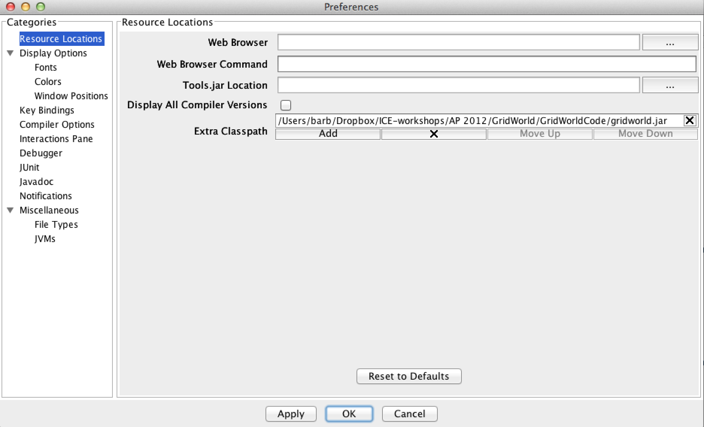

Setting up DrJava for GridWorld
-------------------------------

..	index::
	single: GridWorld
	single: lab
    
The AP CS A exam isn't requiring **GridWorld** (the old required lab) after the 2014 exam, but teachers are still allowed to use it.  However, I recommend checking out Greenfoot instead at http://www.greenfoot.org/door.  Greenfoot is a free IDE that makes it easy to create 2D animations and games in Java.  

If you want to use GridWorld you can still get the GridWorld materials at http://www.horstmann.com/gridworld/.  To allow DrJava to run any GridWord code you need to tell it where to find the ``gridworld.jar`` file.   To do this you add the ``gridworld.jar`` file to the **classpath**, which is a list of the places to look for classes.  GridWorld isn't part of the Java language, but is a set of additional classes developed for the Advanced Placement Computer Science A exam so we need to tell the compiler where to find these classes.

To add to the classpath in DrJava click on ``Edit`` in the top menu and then ``Preferences`` and finally on ``Resource Locations``.  Then click on the ``Add`` button below the ``Extra Classpath`` area.  Use the file browser to find the ``gridworld.jar`` file and select that file.  Then click on ``OK``.  

    Figure 3: Adding gridworld.jar to the classpath in DrJava