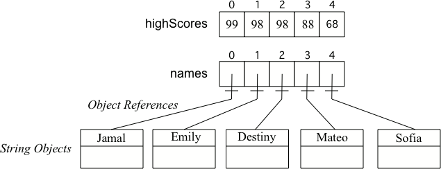

Arrays in Java
=================
.. highlight:: java
   :linenothreshold: 4
   
.. qnum::
   :prefix: trl-
   :start: 1

An **array** is named storage for multiple items of the same type.  You can store a value into an array using an **index** (location in the array).  You can get a value from an array using an index.  An array is like a row of lockers, except that you can't cram lots of stuff into it.  You can only store one value at an array index.  An array index is like a locker number.  It helps you find a particular place to store your stuff.  

.. figure:: Figures/rowLockers.jpg
    :width: 400px
    :align: center
    :figclass: align-center

    Figure 1: A row of lockers
   
Arrays are useful whenever you have several elements of data of the same type that you want to keep track of, but you don't need to name each one.  If you want to keep track of the top 5 highest scores in a game and the names of the people with those scores you could use two arrays.  

To declare an array specify the type of elements that will be stored in the array, then (``[ ]``) to show that it is an array of that type, then at least one space, and then a name for the array.  Note that the declarations below just name the variable and say what type of array it will reference.  **The declarations do not create the array**.  Arrays are objects in Java, so any variable that declares an array holds a reference to an object.  If the array hasn't been created yet and you try to print the value of the variable it will print **null** (meaning it doesn't reference any object yet).  Try the the following in DrJava's interaction pane.
 
:: 

  int[ ] highScores;
  String[ ] names;

.. fillintheblank:: nullInit
   :correct: null$
   :feedback1: ('.*','Did you actually try this in DrJava?')
   :blankid: arrayNullblank

   What is printed in DrJava when you type System.out.println(names); and hit enter after you do the above declarations? :textfield:`arrayNullblank::mini`

To create an array use the **new** keyword, followed by a space, then the type, and then in square brackets the size of the array (number of elements to store).  

:: 

  highScores = new int[5]; 
  names = new String[5];

To put a value in an array you give the name of the array and the index number in brackets ([0]).  The first item in an array is at index 0.  

:: 

  highScores[0] =  99;
  highScores[1] =  98;
  highScores[2] =  98;
  highScores[3] =  88;
  highScores[4] =  68;
  names[0] = "Jamal";
  names[1] = "Emily";
  names[2] = "Destiny"; 
  names[3] = "Mateo";
  names[4] = "Sofia"; 

You can also initialize (set) the values in the array when you create it.  In this case you don't need to specify the size of the array, it will be determined from the values you give.  

:: 

  int[ ] highScores = {99,98,98,88,68};
  String[ ] names = {"Jamal", "Emily", "Destiny", "Mateo", "Sofia"};
  
When you create an array of a **primitive type** (like ``int``) with initial values specified, space is allocated for the specified number of items of that type and the values in the array are set to the specified values.  When you create an array of an **object type** (like ``String``) with initial values, space is set aside for that number of object references.  The objects are created and the object references set so that the objects can be found. 

    Figure 2: A primitive array and an object array

Arrays know their length (how many elements they can store).  It is a public read-only field so you can use ``dot-notation`` to access the field (``arrayName.length``).  **Note that length is a field and not a method, so you don't add parentheses after length**.  However, if you use parentheses after length during the exam you won't lose any points.

:: 

  highScores.length

**Check your understanding**

.. mchoicemf:: qab_1
   :answer_a: 0
   :answer_b: 1
   :correct: a
   :feedback_a: The index is really telling the computer how far the item is from the front of the array.  So the first element in an array is at index 0. 
   :feedback_b: While this matches with how we number some things, the first item in an array is at index 0.

   What index is the first element in an array at?
   
.. mchoicemf:: qab_2
   :answer_a: highScores.length
   :answer_b: highScores.length - 1
   :correct: b
   :feedback_a: Look at the example above when we were setting the values for the highScore array.  
   :feedback_b: Since the first element in an array is at index 0 the last element is the length minus 1.

   Which index is the last element in an array called highScores at?
   
For practice with simple array manipulation and conditionals see http://codingbat.com/java/Array-1.  
   
Looping with the For-Each Loop
==============================
   
You will often loop through all of the elements of an array (to get the average or to get each one to display).  You will typically do this using a **for-each** loop.  A **for-each** loop is a loop that can only be used on a collection of items.  It will loop through the collection and each time through the loop it will use the next item from the collection.  It starts with the first item in the array (the one at index 0) and continues through in order to the last item in the array.

::
  
  public static double getAvg(int[ ] values) 
  {
     double total = 0;
     for (int val : values) 
     {
        total = total + val;
     }
     return total / values.length;
  }

The **for-each** loop is shown on line 4 above.  It says to loop through the array called **values** and each time through the loop set the variable **val** to the next item in the array.  We have to specify the type of **val** first since this declares a variable.  The type must match the type of objects in the array.

The code above wasn't object-oriented.  You may have noticed that it was declared to be **static**.  This means that it is a **class method** not an **object method**.  It is a **class method** since it doesn't operate on any object fields - all data that it needs has been passed in to the method.  Class methods can be called using ``ClassName.methodName()``.  They can also be called on an object of the class.  Object methods can only be called on an object of the class.  
    
A more object-oriented way of doing this would be if the array was a field called **values** in the same class as the getAverage method.  Then you don't need to pass the array **values** to the method and the method is an object (instance) method since it operates on the fields of the object.

:: 

   private int[ ] values; 

   public double getAverage()
   {
      double total = 0;
      for (int val : values)
      {
         total = total + val;
      }
      return total / values.length;
    }
    
Since ``values`` is an object field and the method ``getAverage`` is in the same class it can directly access the field ``values``.  The code could have also been written as ``this.values`` to indicate the current object's field called ``values``.  Every object method is passed the object the method was called on and it can be referenced using the Java keyword ``this``.  
    
**Mixed up programs**

.. parsonsprob:: pab_1

   The following method has the correct code to subtract amt from all the values in the array <b>a</b> (a field of the current object), but the code is mixed up.  Drag the blocks from the left into the correct order on the right. You will be told if any of the blocks are in the wrong order or not indented correctly.
   -----
   public void subAll(int amt)
   {
   =====
      for (int i = 0; 
           i < a.length; 
           i++)
      {
   =====
         a[i] = a[i] - amt;
   =====
      } // end for loop
   =====
   } // end method

.. parsonsprob:: pab_2

   The following method has the correct code to return the largest value in an integer array called <b>vals</b> (a field of the current object), but the code is mixed up.  Drag the blocks from the left into the correct order on the right. You will be told if any of the blocks are in the wrong order or not indented correctly.

   -----
   public int getLargest()
   {
   =====
     int largest = vals[0];
   =====
     for (int item : vals)
     {
   =====
       if (item > largest)
       {
   =====
         largest = item;
   =====
       }  // end if 
   =====
     } // end for
     return largest;
   =====
   } // end method
   
Some examples of finding the largest value in an array start by setting the largest variable to 0.  But, what happens if the array only contains negative numbers?  What value could you set largest to and still have it work correctly even if the field **values** contained only negative numbers?

.. mchoicemf:: qab_3
   :answer_a: Whenever the first element in a is equal to val.
   :answer_b: Whenever a contains any element which equals val.
   :answer_c: Whenever the last element in a is equal to val.
   :answer_d: Whenever only 1 element in a is equal to val.
   :correct: c
   :feedback_a: This would be true if the loop started at the end of the array and moved toward the beginning.  But, it will loop from the first element to the last.  
   :feedback_b: This would be true if temp was only set to the result of checking if the current element in the array is equal to val when it is false.  But, it is reset each time through the loop.
   :feedback_c: The variable temp is assigned to the result of checking if the current element in the array is equal to val.  The last time through the loop it will check if the last element is equal to val.
   :feedback_d: There is no count of the number of times the array element is equal to value.  

   Given that a in an array of integers, which of the following best describes the conditions under which the following code segment will return true?
   
   :: 

     boolean temp = false;
     for ( int i = 0; i < a.length; i++) 
     { 
       temp = ( a[i] == val ); 
     }
     return temp;
     
.. mchoicemf:: qab_4
   :answer_a: All values in positions m+1 through myStuff.length-1 are greater than or equal to n.
   :answer_b: All values in position 0 through m are less than n.
   :answer_c: All values in position m+1 through myStuff.length-1 are less than n.
   :answer_d: The smallest value is at position m.
   :correct: a
   :feedback_a: Mystery steps backwards through the array until the first value less than the passed num (n) is found and then it returns the index where this value is found.
   :feedback_b: This would be true if mystery looped forward through the array and returned when it found a value greater than the passed num (n).
   :feedback_c: This would be true if it returned when it found a value at the current index that was greater than num (n).
   :feedback_d: It returns the first time the condition is met so nothing is known about the values which are unchecked. 

   Given the following field and method, which of the following best describes the contents of myStuff after (int m = mystery(n);) has been executed?
   
   :: 

     // private field in the class
     private int[ ] myStuff;

     //precondition: myStuff contains
     //  integers in no particular order
     public int mystery(int num)
     {
        for (int k = myStuff.length - 1; k >= 0; k--)
        {
            if (myStuff[k] < num)
            {
               return k;
            }
        }

        return -1;
      }
      
.. mchoicemf:: qab_5
   :answer_a: The values don't matter this will always cause an infinite loop.
   :answer_b: Whenever a includes a value that is less than or equal to zero.
   :answer_c: Whenever a has values larger then temp.
   :answer_d: When all values in a are larger than temp.
   :answer_e: Whenever a includes a value equal to temp.
   :correct: b
   :feedback_a: An infinite loop will not always occur in this code segment.
   :feedback_b: When a contains a value that is less than or equal to zero then multiplying that value by 2 will never make the result larger than the temp value (which was set to some value > 0), so an infinite loop will occur.
   :feedback_c: Values larger then temp will not cause an infinite loop.
   :feedback_d: Values larger then temp will not cause an infinite loop.
   :feedback_e: Values equal to temp will not cause the infinite loop.

   Given the following code segment, which of the following will cause an infinite loop?  Assume that temp is an int variable initialized to be greater than zero and that a is an array of ints.
   
   :: 

      for ( int k = 0; k < a.length; k++ )
      {
         while ( a[ k ] < temp )
         {
            a[ k ] *= 2;
         }
      }
      
Looping From Back to Front
================================
You don't have to loop through an array from the front to the back.  You can loop by starting at the back of the array and move toward the front during each time through the loop.  This can be handy when you are looping through a sorted array and want to find the index of the first number that is less than some given number as shown in the method **getIndexFirstSmaller** below.  Notice that the method returns -1 if there is no number in the array that is smaller than the given number.  Why does this work?  

:: 

   // private field 
   private int[ ] values = {-3, -2, 4, 16, 23, 55};

   public int getIndexFirstSmaller(int compare)
   {
     
      for (int i = values.length - 1; i >=0; i--)
      {
         if (values[i] < compare) return i;
      }
      return -1; // to show none found
   }
   
.. mchoicemf:: qab_6
   :answer_a: -1
   :answer_b: -15
   :answer_c: 1
   :answer_d: You will get an out of bounds error.  
   :correct: c
   :feedback_a: The method will only return -1 if no value in the array is less than the passed value.  
   :feedback_b: The method returns the index of the first item in the array that is less than the value, not the value.
   :feedback_c: Since the method loops from the back towards the front -15 is the first value less than -13 and it is at index 1. 
   :feedback_d: No, the method correctly starts the index at values.length - 1 and continues as long as i is greater than or equal to 0.  

   Given the following code segment what will be returned when you execute: getIndexFirstSmaller(-13);
   
   :: 
   
      private int[ ] values = {-20, -15, 2, 8, 16, 33};
      
      public int getIndexFirstSmaller(int compare)
      { 
         for (int i = values.length - 1; i >=0; i--)
         {
            if (values[i] < compare) return i;
         }
         return -1; // to show none found
      }

.. mchoicemf:: qab_7
   :answer_a: -1
   :answer_b: 1
   :answer_c: 2
   :answer_d: You will get an out of bounds error.  
   :correct: d
   :feedback_a: The method will only return -1 if no value in the array is less than the passed value.  
   :feedback_b: Check the starting index.   Is it correct?
   :feedback_c: Check the starting index.  Is it correct?
   :feedback_d: You can not start the index at the length of the array.  You must start at the length of the array minus one.  This is a common mistake.

   Given the following code segment what will be returned when you execute: getIndexFirstSmaller(7);
   
   :: 
   
      private int[ ] values = {-20, -15, 2, 8, 16, 33};
      
      public int getIndexFirstSmaller(int compare)
      {
         for (int i = values.length; i >=0; i--)
         {
            if (values[i] < compare) return i;
         }
         return -1; // to show none found
      }
    
   
      
Looping through Part of an Array
================================
You don't have to loop through all of the elements of an array.  You can loop through just some of the elements of an array using a for loop.  The following code doubles the first five elements in an array.  Notice that it uses a complex conditional (&&) on line 7 to make sure that the loop doesn't go beyond the bounds of the array.

:: 

   // private field 
   private int[ ] values = {3,8,-3, 2};

   public void doubleFirstFive()
   {
     
      for (int i = 0; i < values.length && i < 5; i++)
      {
         values[i] = values[i] * 2;
      }
   }
   
You can even start in the middle and loop through the rest of the array.  Does this work for arrays that have an even number of elements?  Does it work for arrays that have an odd number of elements?
:: 

   // private field 
   private int[ ] values = {3,8,-3, 2};

   public void doubleLastHalf()
   {
     
      for (int i = values.length / 2; i < values.length; i++)
      {
         values[i] = values[i] * 2;
      }
   }
   
.. mchoicemf:: qab_8
   :answer_a: {-40, -30, 4, 16, 32, 66}
   :answer_b: {-40, -30, 4, 8, 16, 32}
   :answer_c: {-20, -15, 2, 16, 32, 66}
   :answer_d: {-20, -15, 2, 8, 16, 33} 
   :correct: c
   :feedback_a: This would true if it looped through the whole array.  Does it?
   :feedback_b: This would be true if it looped from the beginning to the middle.  Does it?
   :feedback_c: It loops from the middle to the end doubling each value. Since there are 6 elements it will start at index 3.  
   :feedback_d: This would be true if array elements didn't change, but they do.  

   Given the following values of a and the method doubleLast what will the values of a be after you execute: doubleLast()?
   
   :: 
   
      private int[ ] a = {-20, -15, 2, 8, 16, 33};

      public void doubleLast()
      {
    
         for (int i = a.length / 2; i < a.length; i++)
         {
            a[i] = a[i] * 2;
         }
      }
      
.. mchoicemf:: qab_9
   :answer_a: {-40, -30, 4, 16, 32, 66}
   :answer_b: {-40, -30, 4, 8, 16, 33}
   :answer_c: {-20, -15, 2, 16, 32, 66}
   :answer_d: {-40, -15, 4, 8, 16, 33}
   :answer_e: {-40, -15, 4, 8, 32, 33}
   :correct: d
   :feedback_a: This would true if it looped through the whole array and doubled each.  Does it?
   :feedback_b: This would be true if it looped from the beginning to the middle and doubled each.  Does it?
   :feedback_c: This would be true if it looped from the middle to the end and doubled each.  Does it?  
   :feedback_d: This loops from the beginning to the middle and doubles every other element (i+=2 is the same as i = i + 2). 
   :feedback_e: This would be true if it looped through the whole array and doubled every other element.  Does it?

   Given the following values of a and the method mystery what will the values of a be after you execute: mystery()?
   
   :: 
   
      private int[ ] a = {-20, -15, 2, 8, 16, 33};

      public void mystery()
      {
    
         for (int i = 0; i < a.length/2; i+=2)
         {
            a[i] = a[i] * 2;
         }
      }
   
**Mixed up programs**

.. parsonsprob:: pab_3

   The following program has the correct code to reverse the elements in an array, a,  but the code is mixed up.  Drag the blocks from the left into the correct order on the right. You will be told if any of the blocks are in the wrong order or are indented incorrectly.

   -----
   public void reverse()
   {
   =====
     int temp = 0;
     int half = a.length / 2;
     int max = a.length - 1;
     for (int i = 0; 
          i < half; 
          i++)
     {
   =====
        temp = a[i];
   =====
        a[i] = a[max - i];
   =====
        a[max - i] = temp;
   =====
     } // end for
   =====
   } // end method
   
.. parsonsprob:: pab_4

   The following program has the correct code to return the average of the first 3 items in the array a, but the code is mixed up.  Drag the blocks from the left into the correct order on the right. You will be told if any of the blocks are in the wrong order or are indented incorrectly.

   -----
   public double avg3()
   {
   =====
     double total = 0;
     for (int i = 0; 
          i < 3 && 
          i < a.length;  
          i++)
     {
   =====
       total = total + a[i];
   =====
     } // end for
     return total / 3;
   =====
   } // end method

Processing Array Elements
=========================

When processing all array elements be careful to start at the first index which is ``0`` and end at the last index which is ``arrayName.length - 1``.  Be careful not to go past the bounds of the array which means don't use a negative number as an index or a number that is equal to or greater than the length of the array.  

Also, be careful not to jump out of loop too early when you are looking for a value in an array.  The method below uses **return** statements to stop the execution of the method and return a value to the method that called this method.  If a return statement returns a value the type of that value must match the return type in the method header. Methods with a return type of **void** can't return any values, but can have one or more return statements. 

:: 

   public static int findString(String[] wordArr, String target)
   {
      for (int index = 0; index < wordArr.length; index++)
      {
         if (word.equals(target)
         {
            return index;
         }
         else return -1;     
      }
   }
   
What is wrong with the code above?  The first time through the loop it will start with the element at index 0 and check if the item at the array index equals the passed target string.  If they have the same characters in the same order it will return 0, otherwise it will return -1.  But, it has only processed one element of the array.  How would you fix the code to work correctly (process all array elements before returning)?  Try http://codingbat.com/prob/p194525 to see if you can do this correctly.
   
More Practice
===============
   
For more practice with arrays (no loops) go to http://codingbat.com/java/Array-1.  For more practice with loops and arrays go to http://codingbat.com/java/Array-2.
   
Common Mistakes
===============
  -  forgetting to create the array - only declaring it (``int[ ] nums;``)
  -  using 1 as the first index not 0
  -  using ``array.length`` as the last index not ``array.length - 1``.
  -  using ``array.length()`` instead of ``array.length`` (not penalized on the free response)
  -  using ``array.get(0)`` instead of ``array[0]`` (not penalized on the free response)
  -  going out of bounds when looping through an array  (using ``index <= array.length``).  You will get an ArrayIndexOutOfBoundsException.  
  -  jumping out an loop by using one or more return statements before every value has been processed.  
