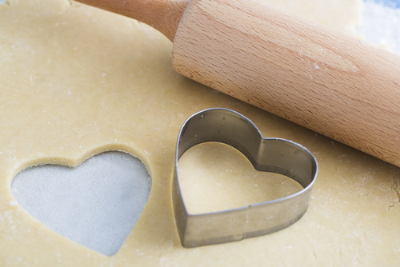

.. qnum::
   :prefix: jr-1-4-
   :start: 1

What is a Class and an Object?
==============================

In Java a class doesn't mean the same thing as the classes you take in school. In Java it is used to define a type (classify something).  There are many classes that are part of the Java langague, but you only have to know a few of these for the AP CS A exam.  The real power of Java is the ability to create your own classes (define your own types).  

Classes create objects and the objects do the actual work in an object-oriented program.  You can think of a class as like a cookie cutter.  It is used to create the cookies (objects) and can be used to create as many cookies (objects) as you want.  A class can also be thought of as a factory that produces objects.  

    Figure 4: Using a cookie cutter to make cookies
    
You can think of a class as the type or classification.  The following picture has lots of cats (objects of the type cat).  

.. figure:: Figures/cats2.png
    :width: 300px
    :align: center
    :figclass: align-center

    Figure 5: Pictures of cats (cat objects)

If you go to a restaurant you will be seated by the greeter, the waiter will take your order, and the chef will cook your food.  What do we mean by a greeter, waiter, and chef?  Those are classifications or types of workers in a restaurant.  Java has this same concept.  When we create a new class we are defining a new type (a new classification) to the computer.  Each type can have abilities (called **methods** in Java) and properties (called **fields** in Java). After you define a type you can use it to create **objects** of that type.  All objects created from a class will have the properties and abilities defined in that class.  

