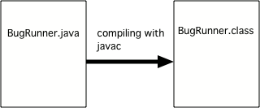

.. qnum::
   :prefix: jr-1-2-
   :start: 1

What is Java?
===============

Java is a **programming language**, which means that we can use Java to tell a computer what to do.  Computers don't actually speak Java so we have to 
compile Java source files (they end in .java) into class files (they end in .class).  You can use the Java command ``javac`` to do the compiling.  All code (statements) in Java must be part of a **class** and the class name must match the file name. 

    Figure 1: Compiling a source file for the class BugRunner into a class file.  

