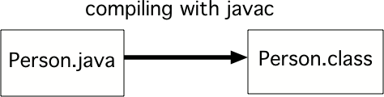

.. qnum::
   :prefix: 1-2-
   :start: 1

What is Java?
===============

..	index::
	single: Java
	single: javac
	single: compile
	single: programming language
	pair: programming; language
	pair: Java; source file
	pair: Java; class file
	
Java is a **programming language**, which means that we can use Java to tell a computer what to do.  Computers don't actually speak Java so we have to 
**compile** (translate) Java source files (they end in .java) into class files (they end in .class).  In this book the code is actually being sent to server to compile and run (as long as you have an internet connection) and the output will be shown in the browser so you won't actually create a source file or class file.  

If you have the Java development environment loaded on your computer you can use the Java command ``javac`` to compile your Java source code at a command line.  You can use ``java ClassName`` to execute the ``main`` method in your Java class.

    Figure 1: Compiling Java source (Person.java) into a class file (Person.class) 
    
You can copy the Java source code shown in this book into a file and save it if you want to run it locally on your computer.  Be sure to name the file the same name as the class name with ".java" as the extension.  All code (statements) in Java must be part of a **class** and the class name must match the file name. 
    
You can also use an integrated development environment on your local computer.  We recommend Dr Java (see the appendix for more information), but there are many good ones such as JGrasp, BlueJ, Greenfoot, and Eclipse.  

