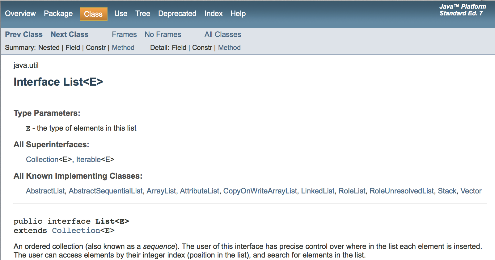
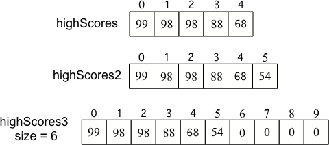

Lists
=====
.. highlight:: java
   :linenothreshold: 4
   
.. qnum::
   :prefix: trl-
   :start: 1

When you go shopping you might create a **list**. As you shop you might check things off your list (remove them from the list).  You might search your list to see if something is already on it. You might add to a list.  A **list** holds items in an order.   

.. figure:: Figures/lists.jpg
    :width: 400px
    :align: center
    :figclass: align-center

    Figure 1: A couple of lists
    
Lists in Java
=============
    
Java uses the notion of a **list** too.  It defines the **interface** ``List`` which is in the java.util **package**.  I will describe what an interface is later.  See http://docs.oracle.com/javase/7/docs/api/java/util/List.html for the Java documentation for the ``List`` interface (a portion of this is shown below).  All classes in the Java language are organized into **packages**.  A package contains related classes.  The ``String`` and ``Object`` classes are in the java.lang package.  The full name for any class is the package name followed by a ``.`` and the class name. So the full name for the ``String`` class is ``java.lang.String``.  The full name for the ``List`` interface is ``java.util.List``. 

    Figure 2: The List interface in Java

The Import Statement
====================
If you want to use the short name of ``List`` instead of the full name of ``java.util.List`` in your code, you will need an **import** statement. An import statement just tells Java which class you mean when you use a short name.  It tells Java where to find the definition of that class.  You don't need an import statement for any class in the package java.lang, like ``String`` or ``Object``. You can import just the classes you need from a package as shown below.  Import statements have to be the first code in a Java source file.  

:: 

  import java.util.List; // import just the List interface
  
Or you can import everything at that level in a package.  

:: 

  import java.util.*; // import everything at this level
  
Don't worry about adding import statements on the AP CS A exam.  Any that you need will be provided for you.
  
.. mchoicemf:: qlib_1
   :answer_a: You can only have one import statement in a source file.
   :answer_b: You must specify the class to import.
   :answer_c: Import statements must be before other code in a Java source file.  
   :answer_d: You must import java.lang.String to use the short name of String.
   :correct: c
   :feedback_a: You can have an many import statements as you need.
   :feedback_b: You can use * to import all classes at the specified level.
   :feedback_c: Import statements have to be the first Java statements in a source file.  
   :feedback_d: You do not have to import any classes that are in the java.lang package.
   
   Which of the following is true about import statements?
   
Interfaces in Java
==================
You have probably seen a device with a **USB interface**.  It is used by a wide variety of devices like memory sticks, external drives, cameras, etc.  The USB interface allows you to connect a device to a computer.  The computer can work with the device through the USB interface.  You can unplug one USB device and plug in another instead.   

    Figure 3: An external drive with a USB interface

A Java **interface** is a special type of class.  The only type of methods it can contain are **public abstract methods**.  An **abstract** method is one that only has a method header and no body (no code). You define interfaces to define what a class needs to be able to do to **implement** an interface. So, to **implement** the ``List`` interface a class needs to allow you to add to the list, remove an items from the list, get an item at an index and more.  The idea is to separate what you want an object of a class to be able to *do*, from *who (which Class)* actually does it. That way you can create a variety of classes that implement the same interface and use whatever one works for your situation.  You can plug in different implementing classes just as you can plug in different USB devices.

The following are the ``List`` methods that you need to know for the AP CS A exam.  These are included on the quick reference that you will receive during the exam.  You can get it at https://secure-media.collegeboard.org/digitalServices/pdf/ap/explore-ap/AP_Computer-Science-A-Quick-Reference.pdf. 

    -  ``int size()`` returns the number of elements in the list
    
    -  ``boolean add(E obj)`` appends obj to the end of the list and returns true
    
    -  ``void add(int index, E obj)``  moves any current objects at index or beyond to the right (to a higher index) and inserts obj at the index

    -   ``E get(int index)`` returns the item in the list at the index
    
    -   ``E set(int index, E obj)`` replaces the item at index with obj
    
    -   ``E remove(int index)`` removes the item at the index and shifts remaining items to the left (to a lower index)

Why don't you just use an array instead of a list?  Well to do that you would have to know how many items you want in your list.  Say you create an array of 5 elements.  What happens when you want to add a 6th one?  You will have to create another bigger array and copy over the items from the old array and then add the new value at the end. What length should the new array be?  If you just create an array for 6 elements you won't waste any space, but you will have to create a new array again if you want to add another item.  If you create a larger array than you need (usually about twice as big), you will also have to keep track of how many items are actually in the list, since the length of the array isn't the same thing as the number of items in the list. 

    Figure 4: Original array, after creating a new array that can contain one more item, and an array that is twice as big as the original with a size to indicate how many values are valid in the array.
    
The ArrayList Class
===================

Luckily Java has a class that handles this type of thing.  It is called **ArrayList**.  It **implements** the ``List`` interface using an array.  This means that it contains or inherits the code for the methods defined in the ``List`` interface.  I will describe what inheritance means in more detail later.  Java actually has several classes that **implement** the ``List`` interface (provide method bodies for the abstract methods defined in the interface).  See the Java documentation above for all the classes that implement the ``List`` interface (ArrayList, LinkedList, Stack, Vector, etc).    

To be able to plug in different implementing classes you should declare the variable type to be ``List`` and the only place you should use the class ``ArrayList`` is when you actually create the list as shown below.  This minimizes the number of places you have to change your code if you change your mind and use a different implementing class in the future.  
 
:: 

  import java.util.*;  // import all classes in this package.
  List<String> nameList = new ArrayList<String>();
  nameList.add("Diego");
  nameList.add("Grace");
  nameList.add("Deja"); 

This code creates an object variable called nameList that will refer to a  List of String objects and sets its reference to an object of the ArrayList class that can hold String objects.  The ``<String>`` tells Java the type of objects that you will have in your List. If you try to put objects of other types in the list you will get a run-time error. 

**Check your understanding**

.. mchoicemf:: qlib_2
   :answer_a: [1, 2, 3, 4, 5]
   :answer_b: [1, 2, 4, 5, 6]
   :answer_c: [1, 2, 5, 4, 6]
   :answer_d: [1, 5, 2, 4, 6]
   :correct: c
   :feedback_a: The set will replace the item at index 2 so this can not be right.
   :feedback_b: The add with an index of 2 and a value of 5 adds the 5 at index 2 not 3. Remember that the first index is 0.
   :feedback_c: The set will change the item at index 2 to 4.  The add of 5 at index 2 will move everything else to the right and insert 5.  The last add will be at the end of the list.
   :feedback_d: The add with an index of 2 and a value of 5 adds the 5 at index 2 not 1. Remember that the first index is 0.

   What will print when the following code executes?
   
   :: 
   
      List<Integer> list1 = new ArrayList<Integer>();
      list1.add(new Integer(1));
      list1.add(new Integer(2));
      list1.add(new Integer(3));
      list1.set(2, new Integer(4));
      list1.add(2, new Integer(5));
      list1.add(new Integer(6));
      System.out.println(list1);
   
.. mchoicemf:: qlib_3
   :answer_a: [2, 3]
   :answer_b: [1, 2, 3]
   :answer_c: [1, 2]
   :answer_d: [1, 3]
   :correct: d
   :feedback_a: The remove will remove the item at the given index.  
   :feedback_b: The item at index 1 will be removed and all the other values shifted left.
   :feedback_c: The 3 is at index 2.  The item at index 1 will be removed. 
   :feedback_d: The item at index 1 is removed and the 3 is moved left.  

   What will print when the following code executes?
   
   :: 
   
      List<Integer> list1 = new ArrayList<Integer>();
      list1.add(new Integer(1));
      list1.add(new Integer(2));
      list1.add(new Integer(3));
      list1.remove(1);
      System.out.println(list1);
      
.. mchoicemf:: qlib_4
   :answer_a: [1, 2, 3, 4, 5]
   :answer_b: [1, 2, 4, 5, 6]
   :answer_c: [1, 2, 5, 4, 6]
   :answer_d: [1, 5, 2, 4, 6]
   :correct: d
   :feedback_a: The set will replace the 3 at index 2 so this isn't correct.
   :feedback_b: The add with an index of 1 and a value of 5 adds the 5 at index 1 not 3. Remember that the first index is 0.
   :feedback_c: The set will change the item at index 2 to 4.  The add of 5 at index 1 will move everything else to the right and insert 5.  The last add will be at the end of the list.
   :feedback_d: Add without a index adds at the end, set will replace the item at that index, add with an index will move all current values at that index or beyond to the right.
  
   What will print when the following code executes?
   
   :: 
   
      List<Integer> numList = new ArrayList<Integer>();
      numList.add(new Integer(1));
      numList.add(new Integer(2));
      numList.add(new Integer(3));
      numList.set(2,new Integer(4));
      numList.add(1, new Integer(5));
      numList.add(new Integer(6));
      System.out.println(numList);
      
Looping Through a List
======================

You can use a for-each loop to loop through all items of a list, just like you do with an array.  

:: 

  private List<String> nameList; 
  
  public boolean findName(String name)
  {
     for (String currName: nameList)
     {
        if (currName.equals(name)) return true;
     }
     return false;
  }
        
The code above loops through the nameList looking for the passed name.  If it is found it returns true, otherwise it will return false.  Note the use of the equals method to compare strings.  This is the correct way to check if two strings have the same characters in the same order.  

Be careful when you remove items from a list as you loop through it.  Remember that removing an item from a list will shift the remaining items to the left.  

:: 

  private List<String> nameList; 
  
  public boolean removeName(String name)
  {
     boolean found = false;
     int index = 0;
     while (index < nameList.size())
     {
        if (name.equals(nameList.get(index))
        { 
           remove(index);
           found = true;
        }
        else index++;
     }
     return found;
  }
  
Notice that the method above only increments the current index if an item was removed from the list.  If you increment the index in all cases you will miss checking some of the elements since the items shift left.  

.. mchoicemf:: qlib_5
   :answer_a: [0, 4, 2, 5, 3]
   :answer_b: [3, 5, 2, 4, 0, 0, 0, 0]
   :answer_c: [0, 0, 0, 0, 4, 2, 5, 3]
   :answer_d: [4, 2, 5, 3]
   :correct: a
   :feedback_a: Incrementing the index each time through the loop will miss when there are two zeros in a row.
   :feedback_b: This would be true if the code moved the zeros to the end, but that is not what it does.
   :feedback_c: This would be true if the code moved the zeros to the font, but that is not what it does.
   :feedback_d: This would be correct if k was only incremented when an item was not removed from the list.

   Assume that nums has been created as an ArrayList object and it initially contains the following Integer values. [0, 0, 4, 2, 5, 0, 3, 0] What will nums contain as a result of executing numQuest?
   
   :: 
   
      List<Integer> list1 = new ArrayList<Integer>();
      private List<Integer> nums;

      // precondition: nums.size() > 0;
      // nums contains Integer objects
      public void numQuest()
      {
         int k = 0;
         Integer zero = new Integer(0);
         while (k < nums.size())
         {
            if (nums.get(k).equals(zero))
               nums.remove(k);
            k++;
         }
      }
      
.. mchoicemf:: qlib_6
   :answer_a: A list will always use less memory than an array.
   :answer_b: A list can store objects, but arrays can only store primitive types.
   :answer_c: A list has faster access to the last element than an array.
   :answer_d: A list resizes itself as necessary as items are added, but an array does not.
   :correct: d
   :feedback_a: No, an ArrayList grows as needed so it will typically be bigger than the data you put it in. If you try to add more data and the array is full, it usually doubles in size.
   :feedback_b: No, you can have an array of objects.
   :feedback_c: No, an ArrayList is implemented using an array so it has the same access time to any index as an array does.
   :feedback_d: An ArrayList is really a dynamic array (one that can grow or shrink as needed).

   Which of the following is a reason to use a list (assume an object of the class ArrayList) instead of an array?
   
**Mixed up programs**

.. parsonsprob:: list_1

   The following has the correct code for the method getScore plus at least one extra unneeded code statement.  This method will calculate and return the score for a word game.  The code should loop through all of the elements in wordList and if the length of the current word is 3 it should add one to the score, if the length of the word is 4 it should add 2 to the score, and if the length is greater than 4 it should add 3 to the score.  The method should return the score.  Drag the needed blocks from the left into the correct order on the right. Check your solution by clicking on the <i>Check Me</i> button.  You will be told if any of the blocks are in the wrong order or if you need to remove one or more blocks.
   -----
   public static int getScore(List<String> wordList)
   {
   =====
     int score = 0;
   =====
     for (String word : wordList) 
     {
   =====
       if (word.length() == 3) 
   =====
       {
         score++;
       } // end if == 3
   =====
       else if (word.length() == 4)
       {
         score = score + 2;
       } // end if == 4
   =====
       else if (word.length() > 4)
       {
         score = score + 3;
       } // end if > 4
   =====  
     } // end for
   =====
     return score;
   =====
   } // end method
   =====
   if (word.length == 3) #distractor
   
.. parsonsprob:: list_2

   The following has the correct code for a method called insertInOrder plus at least one extra unneeded code statement. This method should add the passed name in alphabetic order to a private list field called nameList.  Drag the needed blocks from the left into the correct order on the right. Check your solution by clicking on the <i>Check Me</i> button.  You will be told if any of the blocks are in the wrong order or if you need to remove one or more blocks.
   -----
   public void insertInOrder(String name)
   {
   =====
     int index = 0;
   =====
     while (index < nameList.size() && 
            nameList.get(index).compareTo(name) < 0)
     {
   =====
       index++;
   =====
     } // end while
   =====
     nameList.add(index,name);
   =====
   } // end method
   =====
   nameList.add(name); #distractor

More Practice
============= 
For practice with free response questions with Interfaces and Lists see question 1 from 2012 at http://home.cc.gatech.edu/ice-gt/320, question 3 from 2011 at http://home.cc.gatech.edu/ice-gt/306,  question 1 from 2008 at http://coweb.cc.gatech.edu/ice-gt/1279, and question 3 from 2007 at http://coweb.cc.gatech.edu/ice-gt/1280.

Common Mistakes
===============
  -  forgetting that set replaces the item at the index
  -  forgetting that remove at an index moves all items that were to the right of that index left one index
  -  forgetting that add at an index moves everything that was at the index and greater to the right one index
  -  incrementing an index when looping through a list even though you removed an item from the list
  -  using ``nameList[0]`` instead of ``nameList.get(0)``.  
  -  using ``nameList.length`` instead of ``nameList.size()`` to get the number of elements in a list
    
