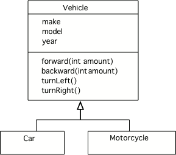
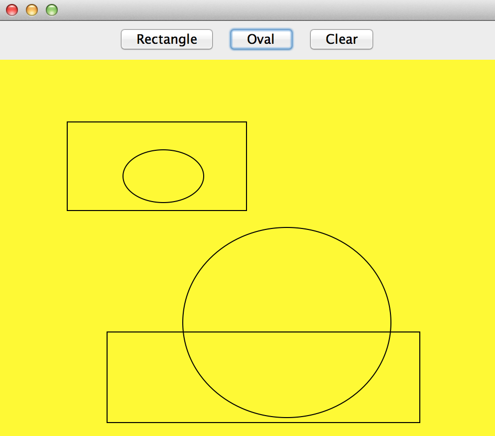
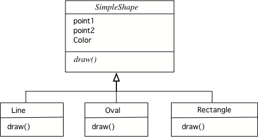

Object-Oriented Programming Concepts
=====================================
.. highlight:: java
   :linenothreshold: 4
   
.. qnum::
   :prefix: trl-
   :start: 1
   
Object-oriented programming has three main features: **objects**, **inheritance**, and **polymorphism**.  **Objects** have data (fields) and behavior (methods) and do the work in an object-oriented program.  Objects are created by classes.  A class is the definition of the data (fields) and behavior (methods) for all objects of a type.   **Inheritance** allows for cleaner code since a class can inherit fields and behavior from another class instead of copying code to many classes.  **Polymorphism** allows for specific behavior based on the run-time type.  It also removes the need for conditional execution based on the type.  This section will explain the ideas of inheritance and polymorphism in more depth.

Inheritance
============

One of the really useful features of Object-Oriented programming is **inheritance**.  You may have heard of someone coming into an inheritance, which often means they were left something from a relative that died.  Or, you might hear someone say that they have inherited musical ability from a parent.  In Java all classes can **inherit** object fields and methods from another class.  The class being inherited from is called the **parent class** or **superclass**.  The class that is inheriting is called the **child class** or **subclass**.  

When one class inherits from another we can say that it is the *same kind of thing* as the **parent class** (the class it inherits from).  For example a car is a kind of vehicle.  This is sometimes called the *is-a* relationship, but I prefer *is-a kind of*.  A motorcycle is another kind of vehicle.  All vehicles have a make, model, and year that they were created.  All vehicles can go forward, backward, turn left and turn right.  

    Figure 1: A UML Class Diagram Showing Inheritance
    
A UML (Unified Modeling Language) class diagram shows classes and the relationships between the classes as seen in Figure 1.  An open triangle points to the parent class.  The parent class for ``Car`` and ``Motorcycle`` is ``Vehicle``. The ``Vehicle`` class has two child classes or subclasses: ``Car`` and ``Motorcycle``.  
    
How is a parent class specified?  Use the Java keyword **extends** after the class name and then followed by the parent class name to specify the parent class as shown below. 

:: 

  public class Car extends Vehicle 
  
  
Note that while a person has two parents, a Java class can only inherit from one parent class.  If you leave off the **extends** keyword when you declare a class then the class will inherit from the ``Object`` class.  The ``Person`` class declared below will inherit from the ``Object`` class.
:: 

  public class Person
  
Association
============

Another type of relationship between classes is the *has-a* relationship or *association* relationship.  Use this when the object of one class contains a reference to one or more of another class.  For example a course can have many course sections (periods) associated with it as shown below.  The ``1`` near the ``Course`` means that ``1`` course object is associated with the number shown near the other class.  In this case it is ``*`` which means 0 to many.  So one course is associated with 0 to many course sections.

    Figure 2: A UML Class Diagram showing Association
  
If you aren't sure if a class should inherit from another class ask yourself if you can substitute the child class type for the parent class type.  For example, if you have a ``Book`` class and it has a subclass of ``ComicBook`` does that make sense?  Is a comic book a kind of book?  Yes, a comic book is a kind of book so inheritance makes sense.  If it doesn't make sense use *association* or the *has-a* relationship instead.

**Check your understanding**

.. mchoicemf:: qoo_1
   :answer_a: Create one class PublishedMaterial with the requested fields plus type
   :answer_b: Create classes Book and Movie and each class has the requested fields
   :answer_c: Create the class PublishedMaterial and have Book and Movie inherit from it all the listed fields
   :answer_d: Create one class BookStore with the requested fields plus type
   :answer_e: Create classes for PublishedMaterial, Books, Movies, Title, Price, ID, Authors, DatePublished
   :correct: c
   :feedback_a: This will complicate the process of retrieving objects based on their type. Also if we need to add information that is specific to Book or Movie, it would be best if these were subclasses of PublishedMaterial.
   :feedback_b: This involves writing more code than is necessary (usually people copy and paste the shared code) and makes it harder to fix errors. It would be better to put common fields and methods in the superclass PublishedMaterial and have Book and Movie be subclasses.
   :feedback_c: We will need to get objects based on their type so we should create classes for Book and Movie. They have common fields so we should put these in a common superclass PublishedMaterial.
   :feedback_d: The class name, BookStore, seems to imply the thing that keeps track of the store. This would be an appropriate class name for an object that handles the items in the Bookstore. However, for the published material, it would be better to use a superclass PublishedMaterial and subclasses for Books and Movies.
   :feedback_e: This is more classes than is necessary. Items such as Title, Price, ID, Authors and DatePublished are simple variables that do not need a class of their own but should be fields in a PublishedMaterial superclass, with Movies and Books as subclasses.

    A bookstore is working on an on-line ordering system. For each type of published material (books and movies) they need to track the id, title, author(s), date published, and price. Which of the following would be the best design?

.. mchoicemf:: qoo_2
   :answer_a: The MovieShowing class should be a subclass of the Movie class.  
   :answer_b: The Movie class should be a subclass of the MovieShowing class.
   :answer_c: A MovieShowing has a movie associated with it, so it should have a Movie field. 
   :correct: c
   :feedback_a: Is a movie showing a type of movie?  Or, does a movie showing have a movie associated with it? 
   :feedback_b: Is a movie a type of movie showing?  Or, does a movie showing have a movie associated with it?  
   :feedback_c: A movie showing is not a type of movie and a movie is not a type of movie showing.  A movie showing has a movie associated with it.
    
    A movie theater has multiple showings of a movie each day.  What should the relationship be between the Movie class and the MovieShowing class?   
    
.. mchoicemf:: qoo_3
   :answer_a: superclass
   :answer_b: parent
   :answer_c: extends
   :answer_d: class
   :correct: c
   :feedback_a: The parent class is the superclass, but this is not the Java keyword for declaring the parent class. 
   :feedback_b: The class you are inheriting from is called the parent or superclass, but this is not the Java keyword.
   :feedback_c: The extends keyword is used to specify the parent class.  
   :feedback_d: The class keyword is used to declare a class, but not the parent class.
    
    What Java keyword is used to specify the parent class?   

.. mchoicemf:: qoo_4
   :answer_a: V
   :answer_b: IV
   :answer_c: I and II
   :answer_d: I and III
   :answer_e: I only
   :correct: b
   :feedback_a: In fact, all of the reasons listed are valid. Subclasses can reuse methods written for superclasses without code replication, subclasses can be stored in the same array, and passed as arguments to methods meant for the superclass. All of which make writing code more streamlined. 
   :feedback_b: All of these are valid reasons to use an inheritance heirarchy. 
   :feedback_c: III is also valid. In some cases you might want to store subclasses together in a single array, and inheritance allows for this.
   :feedback_d: II is also valid. In some cases a single method is applicable for a number of subclasses, and inheritance allows you to pass objects of the subclasses to the same method instead of writing individual methods for each subclass.
   :feedback_e: I and III are also valid, in some cases a single method is applicable for a number of subclasses, and inheritance allows you to pass all the subclasses to the same method instead of writing individual methods for each subclass and you might want to store subclasses together in a single array, and inheritance allows for this.
    
    Question: Which of the following reasons for using an inheritance heirarchy are valid?
    I.   Methods from a superclass can be used in a subclass without rewriting or copying code.
    II.  Objects from subclasses can be passed as arguments to a method designed for the superclass
    III. Objects from subclasses can be stored in the same array
    IV.  All of the above
    V.   None of the above

Overriding an Inherited Method
==============================
  
If a parent class isn't specified using the **extends** keyword the class will inherit from the ``Object`` class.  What does a class inherit from the ``Object`` class?  One of the important things that gets inherited is the ``equals(Object obj)`` method.  This method is used to test if the current object and the passed object called ``obj`` are equal.  The ``equals`` method that is inherited from the ``Object`` class only returns true if the two objects (actually two object references) are really the same object (refer to the same object).  The ``String`` class **overrides** the inherited equals method to return true when the two objects have the same characters in the same order.   **Overriding** an inherited method means providing a method in a child class with the same method signature (method name and parameter type list) and return type as a method in the parent class.  The method in the child class will be called instead of the method in the parent class.  This is different from **overloading** a method which is creating several methods of the same name as long as the parameter types, order, or number are different. 
  
**Check your understanding**

.. mchoicemf:: qoo_5
   :answer_a: public void getFood()
   :answer_b: public String getFood(int quantity)
   :answer_c: public String getFood()
   :correct: c
   :feedback_a: The return type must match.
   :feedback_b: The parameter lists must match (must have the same types in the same order).  
   :feedback_c: The return type and parameter lists must match.   
    
    Which of the following declarations would correctly override the getFood method in a subclass? 
    
    :: 
   
      public class Person 
      {
      public class Student {
         public String getFood() {
            return "Pizza";
         }
        public String getInfo()  { 
           return this.getFood(); 
        }
      }
      
.. mchoicemf:: qoo_6
   :answer_a: public void getFood()
   :answer_b: public String getFood(int quantity)
   :answer_c: public String getFood()
   :correct: b
   :feedback_a: You can not just change the return type to overload a method.  
   :feedback_b: For overloading you must change the parameter list (number, type, or order of parameters).  
   :feedback_c: How is this different from the method already in the Student class?
    
    Which of the following declarations would correctly overload the getFood method?
    
    :: 
   
      public class Person 
      {
      public class Student {
         public String getFood() {
            return "Pizza";
         }
        public String getInfo()  { 
           return this.getFood(); 
        }
      }      

Access to Inherited Private Fields
==================================

Inheritance means that an object of the child class automatically includes the object fields and methods defined in the parent class.  But, if the inherited fields are private, which they should be, the child class can not directly access the inherited fields using dot notation.  The child class can use public **accessors** (also called **getters**) which are methods that get field values and public **modifiers** (also called **mutators** and **setters**) which set field values.  

For example if a parent has a private field, ``name``, then the parent typically provides a public ``getName`` method and a public ``setName`` method as shown below.  In the ``setName`` method below the code checks if the passed string contains just alphabetic characters and spaces before it sets it.  The ``Employee`` class inherits the ``name`` field but must use the public method ``getName`` and ``setName`` to access it.

:: 

  public class Person 
  {
  	private String name; 
  	public String getName()
  	{	
  	   return name;
  	}
  	public boolean setName(String theNewName) 
  	{
  	    // only allow a name with alphabetic characters and spaces
  		if (Pattern.matches("([a-zA-Z]+ +)*[a-zA-Z]+",theNewName)
  		{
  		   name = theNewName;
  		   return true;
  		}
  		return false;
  	}
  }
  
  public class Employee extends Person
  {
  	private int id; 
  	public int getId() 
  	{
  		return id;
  	}
  }
  
**Check your understanding**
  
.. mchoicemf:: qoo_7
   :answer_a: currItem.setX(3);
   :answer_b: currItem.setY(2);
   :answer_c: currItem.x = 3;
   :answer_d: currItem.y = 2;
   :correct: c
   :feedback_a: The object currItem is actually an EnhancedItem object and it will inherit the setX method from Item.
   :feedback_b: The object currItem is actually an EnhancedItem object and this class does have a setY method.  
   :feedback_c: Even though an EnhancedItem object will have a x field the subclass does not have direct access to a private field.  Use the public setX method instead.
   :feedback_d: All code in the same class has direct access to all object fields.  
    
   Given the following class definitions and a declaration (Item currItem = new EnhancedItem()) in the EnhancedItem class main method which of the following would not compile if they were also in the main method?
   
   :: 
   
      public class Item
      {
         private int x;

         public void setX(int theX)
         {
            x = theX;
         }
         // ... other methods not shown
      }

      public class EnhancedItem extends Item
      {
         private int y;

         public void setY(int theY)
         {
            y = theY;
         }

         // ... other methods not shown
       }
       
Inheritance and Constructors
============================

How do you initialize inherited fields if you don't have direct access to them in the subclass?  In Java you can put a call to the parent constructor as the first line in a subclass constructor to initialize inherited fields. 

:: 

  public class Person 
  {
  	private String name; 
  	
  	public Person (String aName)
  	{
  	   this.setName(aName);
  	}
  	
  	public String getName()
  	{	
  	   return name;
  	}
  	public boolean setName(String theNewName) 
  	{
  	    // only allow a name with alphabetic characters and spaces
  		if (Pattern.matches("([a-zA-Z]+ +)*[a-zA-Z]+",theNewName)
  		{
  		   name = theNewName;
  		   return true;
  		}
  		return false;
  	}
  }
  
  public class Employee extends Person
  {
  	private int id; 
  	
  	public Employee(String theName)
  	{
  	   super(theName);
  	}
  	
  	public int getId() 
  	{
  		return id;
  	}
  }
  
The ``super(theName)`` in the ``Employee`` constructor will call the constructor that takes a ``String`` object in the ``Person`` class to set the name.

If a class has no constructor in Java, the compiler will add a no-argument constructor.  A no-argument constructor is one that doesn't have any parameters.  

:: 

  public Person() 
  
The code above is a no-argument constructor for the ``Person`` class.  Remember that constructors don't have a return type and the constructor name must match the class name.

If a subclass has no call to 
a superclass constructor using ``super`` as the first line in a subclass constructor then the compiler will automatically add a ``super()`` call as the first line in a constructor.  So, be sure to provide no-argument constructors in parent classes or be sure to use an explicit call to ``super`` as the first line in the constructors of subclasses.

.. mchoicemf:: qoo_8
   :answer_a: II only
   :answer_b: III only 
   :answer_c: I and II only
   :answer_d: I, II, and III
   :correct: d
   :feedback_a: I is true because Point2D does have a no-arg constructor. II is true because Point2D does have a constructor that takes x and y. III is true because Point2D does have a no-arg constructor which will be called before the first line of code is executed in this constructor. The fields x and y are public in Point2D and thus can be directly accessed by all classes.
   :feedback_b: Point2D does have a constructor that takes an x and y value so this is okay. Also the call to super is the first line of code in the child constructor as required. However, both I and III are okay as well. 
   :feedback_c: The x and y values in Point2D are public and so can be directly accessed by all classes including subclasses. Also there is a no-arg constructor in Point2D so the super no-arg constructor will be called before the first line of code in this constructor.
   :feedback_d: I is true because Point2D does have a no-arg constructor. II is true because Point2D does have a constructor that takes x and y. III is true because Point2D does have a no-arg constructor which will be called before the first line of code is executed in this constructor. The fields x and y are public in Point2D and thus can be directly accessed by all classes.
    
   Given the class definitions of Point2D and Point3D below, which of the constructors that follow (labeled I, II, and III) would be valid in the Point3D class?

   :: 
   
      public class Point2D {
         public int x;
         public int y;

         public Point2D() {}

         public Point2D(int x,int y) {
           this.x = x;
           this.y = y;
         }
         // other methods
      }

      public class Point3D extends Point2D
      {
         public int z;
   
         // other code
      }
      
      // possible constructors for Point3D
      I.  public Point3D() {}
      II. public Point3D(int x, int y, int z) 
          {
             super(x,y);
             this.z = z;
          }
      III. public Point3D(int x, int y)
           {
              this.x = x;
              this.y = y;
              this.z = 0;
           }
           
.. mchoicemf:: qoo_9
   :answer_a: I only
   :answer_b: I and III
   :answer_c: II only 
   :answer_d: III only
   :correct: b
   :feedback_a: I is okay but III is also okay.
   :feedback_b: NamedPoint will inherit from Point all fields but the fields are private and they can not be directly accessed in NamedPoint. You can use super as the first line in a constructor to initialize inherited fields. You can also set your own fields in a constructor. If you don't use super as the first line in a constructor one will be put there by the compiler that will call the parent's no argument constructor.
   :feedback_c: II is invalid. Children inherit all of the fields from a parent but do not have direct access to private fields. You can use super in a constructor to initialize inherited fields by calling the parent's constructor with the same parameter list.
   :feedback_d: I is also okay
    
   Given the class definitions of Point and NamedPoint below, which of the constructors that follow (labeled I, II, and III) would be valid in the NamedPoint class?

   :: 
   
      
      public class Point
      {
         private int myX; // coordinates
         private int myY;

         public Point( )
         {
            myX = 0;
            myY = 0;
         }

         public Point(int a, int b)
         {
            myX = a;
            myY = b;
         }

         // ... other methods not shown

      }
      
      public class NamedPoint extends Point
      {
         private String myName;
         // constructors go here
         // ... other methods not shown
      }
      
      //  Proposed constructors for this class:
      I.   public NamedPoint()
           {
              myName = "";
           }
      II.  public NamedPoint(int d1, int d2, String name)
           {
              myX = d1;
              myY = d2;
              myName = name;
           }
      III. public NamedPoint(int d1, int d2, String name)
           {
              super(d1, d2);
              myName = name;
           }

       
Why Use Inheritance?
=====================
Inheritance allows you to reuse data and behavior from the parent class.  It is useful for **generalization** in which case you may notice that several classes share the same data and/or behavior and you pull that out into a parent class.  Customers and Employees are both people so it makes sense use the general Person class.  It is also useful for **specialization** which is when you want most of the behavior of a parent class, but want to do at least one thing differently and/or add more data.  An example of specialization is the Employee class above.  An employee is a person but also has a unique id.  

Abstract Classes
=================

If you were creating software that allowed the user to draw rectangles and ovals by clicking the mouse at a location and then dragging and releasing to define the width, what classes would you need?

    Figure 2: Software that lets the user click and drag to create ovals and rectangles.
    
One way to identify the classes you need is to underline the nouns in the description. This would give you Rectangle and Oval as two possible classes.  Both of these are kinds of simple shapes that can be defined by two points. So you could create a SimpleShape class that keeps track of two points and perhaps the color to draw the shape in.    
Could you actually create a Shape object?  What would it look like?  In this case we would make the class **abstract** which means that you can not create any objects of that type.  You can use it as a parent class for subclasses.  Abstract classes often have at least one abstract method (method with a body), but they don't have to. Abstract classes can have fields and methods with bodies.  An abstract ``SimpleShape`` class could have fields to track the points and methods that calculate the width and height of the shape.   

    Figure 3: An abstract SimpleShape class with an abstract draw method
    
Inheritance and Interfaces
==========================

An **interface** in Java is a special type of abstract class that can only contain public abstract methods (assumed to be even if the visibility and ``abstract`` keyword has been left off) and public class constants.  ``List`` is an interface in Java.  Interfaces are declared using the **interface** keyword.  One interface can inherit from another interface.

:: 

  public interface Checker
  {
  	boolean check (Object obj);
  }
  
The code above declares an interface called ``Checker`` that contains a public abstract method called ``check`` that returns true or false.  Classes that implement this interface must provide the body for the ``check`` method.  

Another example of an interface in Java is the **Iterator** interface.  It is used to loop through collection classes (classes that hold groups of objects like ``ArrayList``).

Polymorphism
=============
    
**Polymorphism** is a big word that you can break down into "poly" which means many and "morphism" which means form.  So, it just means many forms.  In Java it means that the method that gets called at **run-time** (when the code is run) depends on the type of the object at **run-time**.  This is simliar to a toddler toy that has pictures of animals and when a handle is pulled an arrow spins.  When the arrow stops the toy plays the sound associated with that animal. 

.. image:: http://www.toysrus.com/graphics/product_images/pTRU1-5452971_alternate1_dt.jpg
   :alt: Picture of a See N Say toy 
   :align: center
   :width: 300
   
If you were simulating this toy in software you would create an Animal class that had an abstract makeNoise method. Each subclass of Animal would override the makeNoise method to make the correct noise for that type.  

In Java an object variable has both a **declared type** and a **run-time type** or **actual type**.  The *declared type* of a variable is the type that is used in the declaration.  The *run-time type* or *actual type* is the class that actually creates the object.  The ``nameList`` variable declared below has a declared type of ``List`` and an actual or run-time type of ``ArrayList``.  

:: 

  List<String> nameList = new ArrayList<String>(); 

Any object variable can refer to an object of the declared type or *any descendant (subclass) of the declared type* at run-time.  At compile time the compiler uses the declared type to check that the methods you are trying to use are available to an object of that type.  The code won't compile if the methods don't exist in that class or some parent class of that class.  At run-time the actual method that is called depends on the actual type of the object.  Remember that an object keeps a reference to the class that created it (an object of the class called ``Class``).  When a method is called at run-time the first place that is checked for that method is the class that created the object.  If the method is found there it will be executed.  If not, the parent of that class will be checked and so on until the method is found.  

**Check your understanding**

.. mchoicemf:: qoo_10
   :answer_a: Shape Shape Shape Shape
   :answer_b: Shape Rectangle Square Circle
   :answer_c: There will be a compile time error
   :answer_d: Shape Rectangle Rectangle Circle
   :answer_e: Shape Rectangle Rectangle Oval
   :correct: d
   :feedback_a: The Rectangle subclass of Shape overrides the what method so this can't be right.
   :feedback_b: The Square subclass doesn't not override the what method so it will use the one in Rectangle.  
   :feedback_c: This code will compile.  The declared type can hold objects of that type or any subclass of the type.
   :feedback_d: The Shape object will print Shape.  The Rectangle object will print Rectangle.  The Square object will also print Rectangle since it doesn't overrride the what method.  The Circle object will print Circle.  
   :feedback_e: The Circle class does override the what method so this can't be right.  

   What is the output from running the main method in the Shape class?
   
   :: 
   
      public class Shape {
         public void what() { System.out.print("Shape ");}
         
         public static void main(String[] args)
         
            Shape[] shapes = {new Shape(), new Rectangle(), new Square(), 
                              new Circle()};
            for (Shape s : shapes)
            {
               System.out.print(s.what() + " ");
            }

      } 

      public class Rectangle extends Shape {
         public void what() { System.out.print("Rectangle "); }
      }

      public class Square extends Rectangle {
      }
      
      public class Oval extends Shape {
         public void what() { System.out.print("Oval "); }
      }

      public class Circle extends Oval {
         public void what() { System.out.print("Circle ");}
      }
      
**Check your understanding**

.. mchoicemf:: qoo_11
   :answer_a: Pizza
   :answer_b: Taco
   :answer_c: You will get a compile time error
   :answer_d: You will get a run-time error
   :correct: b
   :feedback_a: This would be true if s1 was actually a Student, but it is a GradStudent.  Remember that the run-time will look for the method first in the class that created the object.
   :feedback_b: Even though the getInfo method is in Student when getFood is called the run-time will look for that method first in the class that created this object which in this case is the GradStudent class.
   :feedback_c: This code will compile.  The student class does have a getInfo method.  
   :feedback_d: There is no problem at run-time. 

   What is the output from running the main method in the GradStudent class?
   
   :: 
   
      public class Student {
         public String getFood() {
            return "Pizza";
         }
         public String getInfo()  { 
           return this.getFood(); 
         }
      }

      public class GradStudent extends Student {
        public String getFood() {
           return "Taco";
        }
        
        public static void main(String[] args)
        {
           Student s1 = new GradStudent();
           s1.getInfo();
        }
      }
 
.. mchoicemf:: qoo_12
   :answer_a: 5 6 10 11
   :answer_b: 5 6 5 6
   :answer_c: 10 11 10 11
   :answer_d: The code won't compile.  
   :correct: a
   :feedback_a: The code compiles correctly, and because RaceCar extends the Car class, all the public object methods of Car can be used by RaceCar objects.
   :feedback_b: RaceCar, while it inherits object methods from Car via inheritance, has a separate and different constructor that sets the initial fuel amount to 2 * g, thus in this case, fuel for fastCar is set to 10 initially.
   :feedback_c: The variable car is a Car object, so the constructor used is not the same as the fastCar object which is a RaceCar. The car constructor does not change the passed in parameter, so it is set to 5 initially. 
   :feedback_d: RaceCar inherits from the Car class so all the public object methods in Car can be accessed by any object of the RaceCar class.

   What is the output from running the main method in the RaceCar class?
   
   :: 
   
      public class Car
      {
        private int fuel;

        public Car() { fuel = 0; } 
        public Car(int g) { fuel = g; }

        public void addFuel() { fuel++; }
        public void display() { System.out.print(fuel + " "); }
      }

      public class RaceCar extends Car
      {
        public RaceCar(int g) { super(2*g); }
        
        public static void main(String[] args)
        {
           Car car = new Car(5);
           Car fastCar = new RaceCar(5);
           car.display()
           car.addFuel();
           car.display();
           fastCar.display();
           fastCar.addFuel();
           fastCar.display();
        }
      } 
      
.. mchoicemf:: qoo_13
   :answer_a: b.getISBN();
   :answer_b: b.getDefintion();
   :answer_c: ((Dictionary) b).getDefinition();
   :correct: b
   :feedback_a: The b object is actually a Dictionary object which inherits the getISBN method from Book.
   :feedback_b: At compile time the declared type is Book and the Book class does not have or inherit a getDefintion method.
   :feedback_c: Casting to Dictionary means that the compiler will check the Dictionary class for the getDefinition method.

   Given the following class definitions and a declaration of Book b = new Dictionary which of the following will cause a compile-time error?
   
   :: 
   
      public class Book
      {
         public String getISBN() 
         {
            // implementation not shown
         }
   
         // constructors, fields, and other methods not shown
      }

      public class Dictionary extends Book
      {
         public String getDefinition(String word)
         {
            // implementation not shown
         }
      } 
      
.. mchoicemf:: qoo_14
   :answer_a: ABDC
   :answer_b: AB
   :answer_c: ABCD
   :answer_d: ABC
   :correct: a
   :feedback_a: Even though b is declared as type Base it is created as an object of the Derived class, so all methods to it will be resolved starting with the Derived class.
   :feedback_b: This would be true if the object was created of type Base using new Base. But the object is really a Derived object. So all methods are looked for starting with the Derived class.
   :feedback_c: After the call to methodOne in the super class printing "A", the code continues with the implicit this.methodTwo which resolves from the current object's class which is Derived. methodTwo in the Derived class is executed which then calls super.methodTwo which invokes printin "B" from methodTwo in the Base class. Then the "D" in the Derive methodTwo is printed. Finally the program returns to methodOne in the Derived class are prints "C".
   :feedback_d: The call to methodTwo in super.methodOne is to this.methodTwo which is the method from the Derived class. Consequently the "D" is also printed.
   
   Assume that the following declaration appears in a client program **Base b = new Derived();**.  What is the result of the call **b.methodOne()**?
   
   :: 

      public class Base
      {
         public void methodOne()
         {
            System.out.print("A");
            methodTwo();
         }

         public void methodTwo()
         {
            System.out.print("B");
         }
      }

      public class Derived extends Base
      {
         public void methodOne()
         {
            super.methodOne();
            System.out.print("C");
         }

         public void methodTwo()
         {
            super.methodTwo();
            System.out.print("D");
         }
      }

More Practice
============= 
For practice with free response questions with inheritance see Question 2 from 2012 at http://home.cc.gatech.edu/ice-gt/320, Question 2 from 2011 at http://home.cc.gatech.edu/ice-gt/306 or Question 2 from 2009 at http://coweb.cc.gatech.edu/ice-gt/1278.

Common Mistakes
===============
  -  Using inheritance (is a kind of) when you should use association (has a).  A school has classes, it is not a type of class.  A high school is a kind of school.
  -  Using a type field instead of subclasses.  If you ever find yourself creating conditionals based on the type of object use subclasses instead.
  -  Copying code instead of creating a subclass or pulling out a common superclass.  If you every find yourself copying object fields or methods try creating a subclass instead or pull out a common superclass.  
    
