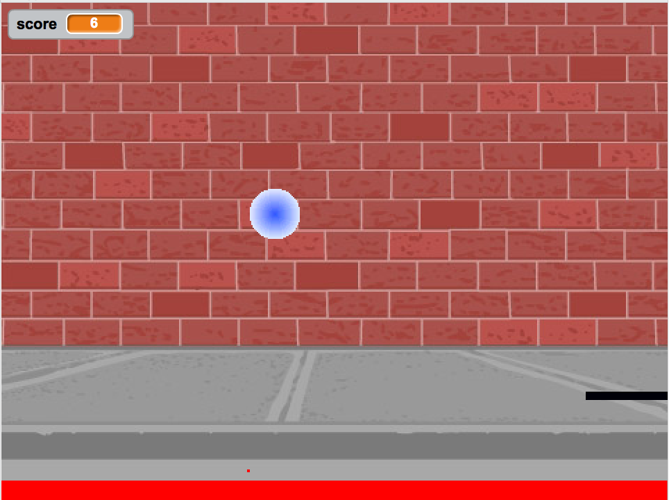

.. qnum::
   :prefix: trl-
   :start: 1
   
..  shortname:: Variables
..  description:: An introduction primitive variables in Java

What is a Variable?
====================

A **variable** is a named space in the computer that can store a value and that value can change or vary.  When you play a game it will often have a score.  Scores often start at 0 and increase.  A score is a variable.  

    
    Figure 1: A pong game in `Scratch <http://scratch.mit.edu>`_ with a score shown in the upper left.

Types of Variables of the Exam
-------------------------------

There are two types of variables in Java: **primitive variables that hold primitive types** and **object variables that hold a reference to an object**.  A reference is a way to find the object (like a UPS tracking number helps you find your package).  The primitive types on the Advanced Placement Computer Science A exam are: 

    -  integers (whole numbers like 3, -76, 20393) 

    -  floating point numbers (decimal numbers like 6.3 -0.9, and 60293.93032)
    
    -  Boolean values (either true or false). 
    
Declaring Variables in Java
---------------------------

To create a variable you must tell Java its type and name.  Creating a variable is also called **declaring a variable**.  When you create a **primitive variable** Java will set aside space for that primitive type and associate that space with the name that you used.  You have to tell Java the type of the variable because Java needs to know how much space to use and how to represent the value.  The 3 different primitive types
are all represented using **binary numbers** (numbers that use base 2 with digits 0 and 1), but are represented in different ways.  For practice converting between decimal and binary see http://forums.cisco.com/CertCom/game/binary_game_page.htm.  

When you declare a variable space is set aside for a variable of that type and the name is associated with that space.  An integer gets 32 bits of space, a double gets 64 bits of space and a boolean could be represented by just one bit, but the amount of space isn't specified by the Java standard. 

.. figure:: Figures/typesAndSpace.png
    :width: 500px
    :figclass: align-center
    
    Figure 2: Examples of variables with names and values.  Notice that the different types get a different amount of space.

To **declare** (create) a variable you will specify the type, then leave at least one space, then the name for the variable, and end the line with a semicolon (``;``). Java uses the keyword **int** for integer, **double** for a floating point number (a double precision number), and **boolean** for a Boolean value (true or false).
 
:: 

  int score;
  double price;
  boolean won;

Think of the semicolon in Java like a period (``.``) in English.  It is how you show the end of a sentence in English.  You use a semicolon (``;``) to show the end of a Java statement.  You will not be penalized on the exam if you forget the semicolon.  

You can also optionally specify an initial value for the variable by adding an equals sign ``=`` followed by the value. 

:: 

  int score = 4;
  double price = 23.25;
  boolean won = false;

The equal sign here ``=`` doesn't mean the same as it does in a mathematical equation where it implies that the two sides are equal.  Here it means set the value in the space (box) associated with the name on the left to the value on the right. The first line above sets the value in the box called score to 4. See Figure 2 for what value each variable holds after this code executes.

Note that the variable has to be on the left side of the ``=`` and the value on the right.  Switching the two is called **assignment dyslexia**.   

:: 

  4 = int score; 
  
What error does this give you if you try it in DrJava?

**Check your understanding**
   
.. mchoicemf:: q2_1
   :answer_a: x = 0, y = 1, z = 2
   :answer_b: x = 1, y = 2, z = 3
   :answer_c: x = 2, y = 2, z = 3
   :answer_d: x = 0, y = 0, z = 3
   :correct: b
   :feedback_a: These are the initial values in the variable, but the values are changed.
   :feedback_b: x changes to y's initial value, y's value is doubled, and z is set to 3
   :feedback_c: Remember that the equal sign doesn't mean that the two sides are equal.  It sets the value for the variable on the left to the value from evaluating the right side.
   :feedback_d: Remember that the equal sign doesn't mean that the two sides are equal.  It sets the value for the variable on the left to the value from evaluating the right side.

   What are the values of x, y, and z after the following code executes?
   
   :: 

     int x = 0;
     int y = 1;
     int z = 2;
     x = y;
     y = y * 2;
     z = 3;
   
   
**Mixed up programs**

.. parsonsprob:: 2_swap

   The following has the correct code to 'swap' the values in x and y (so that x ends up with y's initial value and y ends up with x's initial value), but the code is mixed up and contains one or more extra statements.  Drag the needed blocks from the left into the correct order on the right. Check your solution by clicking on the <i>Check Me</i> button.  You will be told if any of the blocks are in the wrong order or if you need to remove one or more blocks.
   -----
   int x = 3;
   int y = 5;
   int temp = 0;
   =====
   temp = x;
   =====
   x = y;
   =====
   y = temp;
   =====
   y = x; #distractor
   
Operators
=========

Java uses the standard mathematical operators for addition (``+``), subtraction (``-``), multiplication (``*``), and division (``/``).  Java uses (``==``) to test if the value on the left is equal to the value on the right and (``!=``) to test if two items are not equal.  But, the percent sign operator (``%``) is the **modulus** or remainder operator.

Try the following in DrJava's interaction pane.  You can download DrJava for free from http://www.drjava.org.  The interaction pane let's you try out Java code without having to declare a class.  It also automatically prints the result of a statement when you press enter.  What does it print when you type each of the following lines and hit enter?

:: 

  11 % 10
  3 % 4 
  8 % 2
  9 % 2

The **modulus** operator (``%``) returns the remainder after you divide the first number by the second number.  The **modulus** operator has been used quite a bit on the AP CS A exam, so you should be familiar with it.
    
    -  Use it to check for odd or even numbers (``num % 2 == 1 is odd and num % 2 == 0 is even``).  Actually, you can use it to check if any number is evenly divisible by another (``num1 % num2 == 0``)

    -  Use it to get the last digit from an integer number (``num % 10 = last digit on right``).  This approach could be used on the free response question Self Divisor (Question 1 from 2007).  See http://coweb.cc.gatech.edu/ice-gt/1277 for starter code and testing code.
    
    -  Use it to get the number of minutes left when you convert to hours (``num % 60``).  Also whenever you have limited storage and you need to wrap around to the front if the value goes over the limit. See question 3 at http://coweb.cc.gatech.edu/ice-gt/1278.  
    
.. mchoicemf:: q2_7
   :answer_a: 15
   :answer_b: 16
   :answer_c: 8
   :correct: c
   :feedback_a: This would be the result of 158 divided by 10.  Modulus gives you the remainder.
   :feedback_b: Modulus gives you the remainder after the division.
   :feedback_c: When you divide 158 by 10 you get a remainder of 8.  

   What is the result of 158 % 10?
   
.. mchoicemf:: q2_8
   :answer_a: 3
   :answer_b: 2
   :answer_c: 8
   :correct: a
   :feedback_a: 8 goes into 3 no times so the remainder is 3.  The remainder of a smaller number divided by a larger number is always the smaller number!
   :feedback_b: This would be the remainder if the question was 8 % 3 but here we are asking for the reminder after we divide 3 by 8.
   :feedback_c: What is the remainder after you divide 3 by 8?  

   What is the result of 3 % 8?
   
You are also expected to know the double plus operator (``++``) and the double minus operator (``--``).  The ``++`` operator is used to add one to the current value: ``x++`` is the same as ``x = x + 1``.  The ``--`` operator is used to subtract one from the current value: ``y--`` is the same as ``y = y - 1``.  
You should know that ``x += y`` is the same as ``x = x + y``, ``x -= y`` is the same as ``x = x - y``, ``x *= y`` is the same as ``x = x * y``, and ``x /= y`` is the same as ``x = x / y``.  

.. mchoicemf:: q2_9
   :answer_a: x = -1, y = 1, z = 4
   :answer_b: x = -1, y = 2, z = 3
   :answer_c: x = -1, y = 2, z = 2
   :answer_d: x = -1, y = 2, z = 2
   :answer_e: x = -1, y = 2, z = 4
   :correct: e
   :feedback_a: This code subtracts one from x, adds one to y, and then sets z to to the value in z plus the current value of y.
   :feedback_b: This code subtracts one from x, adds one to y, and then sets z to to the value in z plus the current value of y.
   :feedback_c: This code subtracts one from x, adds one to y, and then sets z to to the value in z plus the current value of y.
   :feedback_d: This code subtracts one from x, adds one to y, and then sets z to to the value in z plus the current value of y.
   :feedback_e: This code subtracts one from x, adds one to y, and then sets z to to the value in z plus the current value of y.

   What are the values of x, y, and z after the following code executes?
   
   :: 

     int x = 0;
     int y = 1;
     int z = 2;
     x--; // x followed bythe double minus sign
     y++;
     z+=y;
     
Variable Names
--------------

While you can name your variable almost anything, there are some rules.  A variable name should start with an alphabetic character (like a, b, c, etc).  You can't use any of the keywords or reserved words as variable names in Java (for, if, class, static, int, double, etc).  For a complete list of keywords and reserved words see http://docs.oracle.com/javase/tutorial/java/nutsandbolts/_keywords.html.  

The name of the variable should match both the function of the variable and the type of the variable.  A name like ``score`` helps make your code easier to read.  Do not try to be cute on the exam and name
your variables crazy things like ``thisIsAReallyLongName``.  This makes the code very hard to understand.  The free response questions are graded by readers (high school AP CS A teachers and college faculty).  You want to make the readers' job easier, not harder!  Remember that a reader is reading thousands of exams, you don't want to make this person work harder than necessary. 

The convention in Java is to always start a variable name with a lower case letter and then uppercase the first letter of each additional word. Variable names can not include spaces so uppercasing the first letter of each additional word makes it easier to read the name.  Uppercasing the first letter of each additional word is called **camel case**.  Java is case sensitive so ``playerScore`` and ``playerscore`` are not the same.  

:: 

  int computerPlayerScore = 0; // variables names using camel case
  int playerScore = 0;
    
Casting Variables
=================

In DrJava try typing the following in the interactions pane and hit return or enter after each line.  DrJava will automatically print the result of an expression when you hit enter in the interactions pane. 

:: 

  1 / 3
  1.0 / 3
  1 / 3.0
  (double) 1 / 3

Do you get the same answer for each of these?  If not, why not?  

.. fillintheblank:: 1div3
   :correct: 0$
   :feedback1: ('.*','Did you actually try this in DrJava?')
   :blankid: div13blank

   What is printed in DrJava when you type 1 / 3 and hit enter? :textfield:`div13blank::mini`
   
.. fillintheblank:: 1Ddiv3
   :correct: 0.33+
   :feedback1: ('.*','Did you actually try this in DrJava?')
   :blankid: div1D3blank

   What is printed in DrJava when you type 1.0 / 3 and hit enter? :textfield:`div1D3blank::large`

Java assumes that if you are doing division with integers that you want an integer result and it will throw away any fractional part (part after the decimal point).  But, if you use a mixture of integers (int) and floating point (double) numbers Java will assume that you want a floating point result.  If you have integers and you want a floating point result from some mathematical operation **cast** one of the integers to a double using (double) as shown above.  By **casting** we don't mean something to do with fishing, but it is a similar idea to casting a pot in clay.  In Java when you cast you are changing the "shape" (or type) of the variable to the right of the cast to the specified type. 

    
    Figure 3: Casting a pot in clay.
 

Is the result of 1.0 divided by 3 correct?  Actually, Java limits the number of digits you can save for any ``double`` number to about 14-15 digits. You should be aware that the accuracy of any calculation on a computer is limited by the fact that computers can only hold a limited number of digits.    

**Check your understanding**

.. mchoicemf:: q2_5
   :answer_a: true
   :answer_b: false
   :correct: b
   :feedback_a: Did you try this out in Dr Java?  Does it work that way?
   :feedback_b: Java throws away any values after the decimal point if you do integer division.  It does not round up automatically.  

   True or false: Java rounds up automatically when you do integer division.  
   
.. mchoicemf:: q2_6
   :answer_a: true
   :answer_b: false
   :correct: b
   :feedback_a: Try casting to int instead of double.  What does that do?  
   :feedback_b: Casting results in the type that you cast to. However, if you can't really cast the value to the specified type then you will get an error.  

   True or false: casting always results in a double type.  
   
.. mchoicemf:: q2_7
   :answer_a: (double) (total / 3);
   :answer_b: total / 3;
   :answer_c: (double) total /  3;
   :correct: c
   :feedback_a: This does integer division before casting the result to double so it loses the fractional part.  
   :feedback_b: When you divide an integer by an integer you get an integer result and lose the fractional part.
   :feedback_c: This will convert total to a double value and then divide by 3 to return a double result.

   Which of the following returns the correct average when 3 values had been added to an integer total?

Variable Limits
=================

The int type in Java can be used to represent any whole number from -2147483648 to 2147483647.  Why those numbers?  Integers in Java are represented in 2's complement binary and each integer gets 32 bits of space.  In 32 bits of space with one bit used to represent the sign you can represent that many values.  Why is there one more negative number than positive number?  It is becuase 0 is considered a positive number.  

Try this in Dr Java's interaction pane.

:: 

  Integer.MIN_VALUE
  Integer.MAX_VALUE
  Integer.MIN_VALUE - 1
  Integer.MAX_VALUE + 1

What do the last two lines print out?  Did this surprise you?  Java will actually return the maximum integer value if you try to subtract one from the minimum value. This is called **underflow**. And, Java will return the minimum integer value if you try to add one to the maximum.  This is called **overflow**.  It is similar to how odometers work. 
When would you ever use Integer.MIN_VALUE or Integer.MAX_VALUE?  They are handy if you want to initialize a variable to the smallest possible value and then search a sequence of values for a larger value.  People sometimes set the initial value to 0 when looking for the smallest item in a sequence, but if all of the values in your sequence are negative then this won't work correctly (since all negative numbers are smaller than zero).    
  
Random Numbers
=================

Games would be boring if the same thing happened each time you played the game.  Games often use random numbers
to generate different possibilities.  You need to know how to use the ``Math.random()`` method to generate a random number. There are lots of mathematical methods
that you might want to use in your programs like Math.abs (absolute value).  These methods are in the Math class and are **static** (**class**) methods so that you can call them by just using ``ClassName.methodName``.  **Class** or **static**
methods live in the object that defines the class (an object of a class named ``Class``) and can be accessed directly from the class.  You do not need to create an object of the class to use them. 

**Check your understanding**

.. mchoicemf:: q2_8
   :answer_a: if (Math.random() < 0.4)
   :answer_b: if (Math.random()
   :answer_c: if (Math.random() == 0.4)
   :correct: a
   :feedback_a: This is about 40% of the range from 0 to not quite 1 (which is what the Math.random method returns).   
   :feedback_b: 
   :feedback_c: Do not use == with double values!  Remember that Math.random can return any number between 0 and not quite 1 (about .99999999).  

   Which of the following is a correct test for a 40% possibility?
   
Common Mistakes
===============

  -  forgetting that Java is case sensitive - ``myScore`` is not the same as ``myscore``.
  
  -  forgetting to specify the type when declaring a variable (using ``name = value;`` instead of ``type name = value;``)
  
  -  using a variable name, but never declaring the variable.  
  
  -  using the wrong name for the variable.  For example calling it ``studentTotal`` when you declare it, but later calling it ``total``.

  -  using the wrong type for a variable.  Don't forget that using integer types in calculations will give an integer result.  So either cast one integer value to double or use a double variable if you want the fractional part (the part after the decimal point).
  
  -  using ``==`` to compare double values. Remember that double values are often an approximation. You might want to test if the absolute value of the difference between the two values is less than some amount instead.
  
  -  assuming that some value like 0 will be smaller than other ``int`` values.  Remember than ``int`` values can be negative as well.  If you want to set a value to the smallest possible ``int`` values use ``Integer.MIN_VALUE``