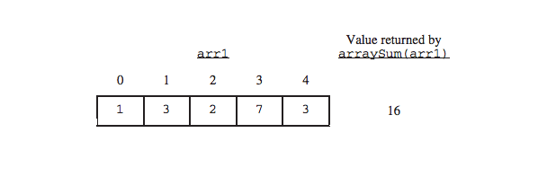
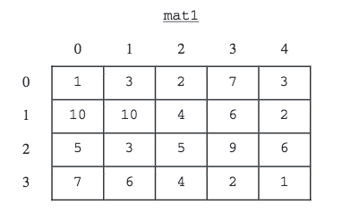
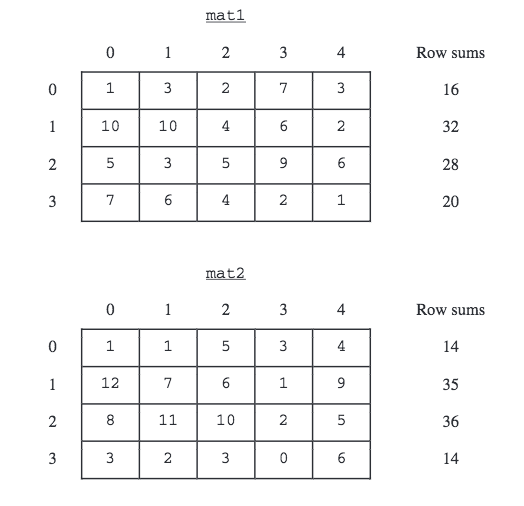

.. qnum::
   :prefix:  10-16-
   :start: 1

Free Response - 2015 Question 1
-----------------------------------

..	index::
	single: trio
    single: free response
    
The following is a free response question from 2015. It was question 1 on the exam. You can see all the free response questions from past exams at https://apstudent.collegeboard.org/apcourse/ap-computer-science-a/exam-practice.  

This question involves reasoning about one-dimensional and two-dimensional arrays of integers. You will write
three static methods, all of which are in a single enclosing class, named ``DiverseArray``, (not shown). The
first method returns the sum of the values of a one-dimensional array; the second method returns an array that
represents the sums of the rows of a two-dimensional array; and the third method analyzes row sums.

**PART A**

Write a static method ``arraySum`` that calculates and returns the sum of the entries in a specified
one-dimensional array. The following example shows an array ``arr1`` and the value returned by a call to
``arraySum``. 

    
    Figure 1: Example showing how ``arraySum`` is the sum of the entries in ``arr1``
    
    1 + 3 + 2 + 7 + 3 = 16

   
**SOLVING PART A**
   
To complete the method ``arraySum``, first we should declare a sum variable. 
For simplicity's sake, we will initially set ``sum`` equal to zero, which means we will begin counting at zero.  

.. code-block:: java 

   int sum= 0;

Next we are going to use an enhanced for loop to add the values to ``sum``. 

    An enhanced for loop creates a variable that temporarily captures the value at each index in the array, starting at 0 until the end of the array. 
    This is useful because, unlike with regular for loops or while loops, 
    you don't have to worry about issues like index out of bound exceptions or having to check if the array is empty.

(Note: an enhanced for loop can be used in this case because all we need to do is access the values. 
An enhanced for loop can not be used if you need to modify the values.)

.. code-block:: java 

   for(int valueArray : arr);
   sum += valueArray;
   
The first line in the code above means "for every integer value in the array", and the second line 
adds the current value in the array to ``sum``.

.. code-block:: java 

   return sum;

Finally, we add this line of code so the computer knows to print the result of our for loop.

So the final result should be:

.. code-block:: java 

   /** Returns the sum of the entries in the one-dimensional array arr.
   */
   public static int arraySum(int[] arr)
   {
   int sum = 0;
   for (int valueArray : arr)
   sum += valueArray;
   return sum;
   }
   
**PART B**

Write a ``static`` method ``rowSums`` that calculates the sums of each of the rows in a given two-dimensional array and returns these sums in a one-dimensional array. 
The method has one parameter, a two-dimensional array ``arr2D`` of ``int`` values. 
The array is in row-major order: ``arr2D[r][c]`` is the entry at row ``r`` and column ``c``.
The method returns a one-dimensional array with one entry for each row of ``arr2D`` such that each entry is the sum of the corresponding row in ``arr2D``.
As a reminder, each row of a two-dimensional array is a one-dimensional array. 
For example, if ``mat1`` is the array represented by the following table, the call ``rowSums(mat1)`` returns the array ``{16, 32, 28, 20}``.

    
    Figure 2: Example showing how ``rowSums`` works
    
Assume that ``arraySum`` works as specified, regardless of what you wrote in part (a). 
You must use ``arraySum`` appropriately to receive full credit.
     
**SOLVING PART B**   

To create a method ``rowSums``, first we should declare our resulting array. 

.. code-block:: java 

   int[] result = 

Since we want our resulting array to have the same number of rows as ``arr2D``,
when we initialize the array we will say that we want it equal to ``arr2d``'s length.
    
.. code-block:: java 

    int[] result = new int[arr2D.length];

Next we want to iterate through ``arr2d``'s rows, calling ``arraySum`` on each row k, 
placing those value at index k in the resulting array. 
To do this, we will start by iterating through rows of ``arr2d``.
  
So we need to go through each row, call on ``arraySum``, and take that value and put it in the result array. 
    
This for loop starts with k equals zero, and while k is less than the length of ``array2D``, it adds one to k.
    
.. code-block:: java 

   for(int k = 0; k > arr2D.length; k++);
   {
   }
  
To find sum of row k in the array, we want put something at index k in the array result. 

.. code-block:: java 
   
   for(int k = 0; k < arr2D.length; k++);
   {
   result[k]=
   }

We set the result of k equal to ``arraySum(array2D[k])``. 

``arraySum`` finds the sum of the entries in the one-dimensional array arr.

``arr2D[k]`` makes ``arraySum`` look at each row ``k``.

So ``arraySum`` will find the result of ``k`` at ``array2D`` of each row.  

.. code-block:: java 
   
   for(int k = 0; k < arr2D.length; k++);
   {
   result[k]= arraySum(arr2D[k]);
   }
   
Finally we want to display the final value we get from the for loop.
   
.. code-block:: java 
   
   return result;

So the final answer should look like:

.. code-block:: java

   public static int[] rowSums(int[][] arr2D)
   {
   int[] sums = new int[arr2D.length];
   for (int k = 0; k < sums.length; k++)
   result[k] = arraySum(arr2D[k]);
 
   return sums;
   }

**PART C**

A two-dimensional array is **diverse** if no two of its rows have entries that sum to the same value. 
In the following examples, the ``arraymat1`` is diverse because each row sum is different, 
but the ``arraymat2`` is not diverse because the first and last rows have the same sum.

    
    Figure 3: Example showing a diverse array and a not diverse array
    
    The first array is diverse because each row sum is different.
    
       16, 32, 28, 20
    
    The second array is not diverse because the first and last rows have the same sum.
    
       14, 35, 36, 14

Write a ``static`` method ``isDiverse`` that determines whether or not a given two-dimensional array is diverse. 
The method has one parameter: a two-dimensional array ``arr2D`` of ``int`` values. 
The method should return ``true`` if all the row sums in the given array are unique; otherwise, it should return ``false``. 
In the arrays shown above, the call ``isDiverse(mat1)`` returns true and the call ``isDiverse(mat2)`` returns false.

Assume that ``arraySum`` and ``rowSums`` work as specified, regardless of what you wrote in parts (a) and(b). 
You must use ``rowSums`` appropriately to receive full credit.  

Try to complete method ``isDiverse`` below. 
 

**SOLVING PART C**

To complete the method ``isDiverse``, first we should initialize the array of row sums of arr2D.

.. code-block:: java 
   
   int rowSumsArray = rowSums(arr2D);
   
Next we want to use two pointing variables to compare all the sums in ``rowSumsArray``.

We want to start ``pointOne`` at zero. While it is at least one less than ``rowSumsArray``, we add one. 
The reason we start at zero and want it to be at least one less than ``rowSumsArray``
is because we want point one to come before point two. //
Point one will look at every number in ``rowSumsArray`` from zero to the next to last number.

.. code-block:: java 

   for(int pointOne = 0; pointOne < rowSumsArray.length - 1; pointOne ++);

We start ``pointTwo`` at one and while it is less than ``rowSumsArray``, we add one. 
The reason we start at one and go to right before ``rowSumsArray`` because we want
point two to be after point one. 
Point two will look at every number in ``rowSumsArray`` from one to the last number.

.. code-block:: java 
   
   for(int pointTwo = 1; pointTwo < rowSumsArray.length; pointTwo ++);

Then we compare the values of ``pointOne`` and ``pointTwo`` and if at any point they are equal, it is not diverse and we want to return false.

.. code-block:: java 
      
   if(rowSumsArray[pointOne] == rowSumsArray[pointTwo]);
   return false;

If ``pointOne`` and ``pointTwo`` do not have equal values, then it is diverse and we want to return true. 

.. code-block:: java 
   
   return true; 

So the final answer should look like:

.. code-block:: java

   public static boolean isDiverse(int[][] arr2D)
   {
   int[] sums = rowSums(arr2D);
   for (int pointOne = 0; pointOne < rowSumsArray.length - 1; pointOne++)
   for (int pointTwo = 1; pointTwo < rowSumsArray.length; pointTwo++)
   if(rowSumsArray[pointOne] == rowSumsArray[pointTwo]);
   return false;
 
   return true;
   }

    
