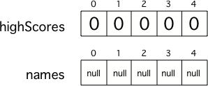

.. qnum::
   :prefix: 7-1-
   :start: 1

Arrays in Java
-------------------

..	index::
	single: array
	single: index
	pair: array; index

.. the video is Arrays.mov 

The following video is also on YouTube at https://youtu.be/G7aF-OuLfl4.  It introduces the concept of an array and gives an example.

.. youtube:: G7aF-OuLfl4
    :width: 640
    :align: center

An **array** is consecutive storage for multiple items of the same type.  You can store a value in an array using an **index** (location in the array).  You can get a value from an array using an index.  An array is like a row of lockers, except that you can't cram lots of stuff into it.  You can only store one value at each array index.  An array index is like a locker number.  It helps you find a particular place to store your stuff and retrieve stuff.  

.. figure:: Figures/rowLockers.jpg
    :width: 400px
    :align: center
    :figclass: align-center

    Figure 1: A row of lockers
    
.. shortanswer:: arrayAnalogy

   Can you think of another example of something that is like an array (like a row of lockers)?
   
Arrays are useful whenever you have several elements of data of the same type that you want to keep track of, but you don't need to name each one.  If you want to keep track of the top 5 highest scores in a game and the names of the people with those scores, you could use two arrays.  One array could keep track of the scores and the other the names.

Declaring an Array
=====================

To declare an array specify the type of elements that will be stored in the array, then (``[ ]``) to show that it is an array of that type, then at least one space, and then a name for the array.  Note that the declarations below just name the variable and say what type of array it will reference.  **The declarations do not create the array**.  Arrays are objects in Java, so any variable that declares an array holds a reference to an object.  If the array hasn't been created yet and you try to print the value of the variable, it will print **null** (meaning it doesn't reference any object yet).  Try the the following.

.. activecode:: lcab1
   :language: java
   
   public class Test1
   {
      public static void main(String[] args)
      {
        // declare the arrays
        int[ ] highScores = null;
        String[ ] names = null;
        
        System.out.println(highScores);
        System.out.println(names);
      }
   }
   
Creating an Array
==================

To create an array use the **new** keyword, followed by a space, then the type, and then in square brackets the size of the array (the number of elements it can hold).  

.. code-block:: java 

  highScores = new int[5]; 
  names = new String[5];
  
  
..	index::
	pair: array; initialization
	
.. note::
  
   Array elements are initialized to 0 if they are a numeric type (``int`` or ``double``), ``false`` if they are of type ``boolean``, or ``null`` if they are an object type like ``String``.  

    Figure 2: Two 5 element arrays with their values set to the default values for integer and object arrays.

.. note::

    The first value in an array is stored at index 0 and the index of the last value is the length of the array minus one (since the first index is 0).
    
Putting Values in an Array 
=============================

To put a value in an array you give the name of the array and the index number in brackets and then an ``=`` and finally the value and a semicolon (``highScores[0] = 99;``).  The first item in an array is at index 0.  

.. activecode:: array-set
   :language: java
   
   public class Test1
   {
      public static void main(String[] args)
      {
        // declare arrays
        int[ ] highScores = null;
        String[ ] names = null;
        
        // create the arrays
        highScores = new int[5];
        names = new String[5];
        
        // print the initial values at index 0
        System.out.println(highScores[0]);
        System.out.println(names[0]);
        
        // set the values in the highScores array
        highScores[0] =  99;
        highScores[1] =  98;
        highScores[2] =  98;
        highScores[3] =  88;
        highScores[4] =  68;
        System.out.println(highScores[0]);
        
        // set the values in the names array
        names[0] = "Jamal";
        names[1] = "Emily";
        names[2] = "Destiny"; 
        names[3] = "Mateo";
        names[4] = "Sofia"; 
        System.out.println(names[0]);
      }
   }
   
Initializing Array Values
============================

You can also initialize (set) the values in the array when you create it.  In this case you don't specify the size of the array, it will be determined from the number of values that you specify.  

.. code-block:: java 

  int[ ] highScores = {99,98,98,88,68};
  String[ ] names = {"Jamal", "Emily", "Destiny", "Mateo", "Sofia"};
  
When you create an array of a **primitive type** (like ``int``) with initial values specified, space is allocated for the specified number of items of that type and the values in the array are set to the specified values.  When you create an array of an **object type** (like ``String``) with initial values, space is set aside for that number of object references.  The objects are created and the object references set so that the objects can be found. 

.. figure:: Figures/intAndStringArrays.png
    :width: 500
    :align: center
    :figclass: align-center

    Figure 3: A primitive array and an object array
    
..	index::
    single: dot-notation
	pair: array; length
	
Array Length
===============

Arrays know their length (how many elements they can store).  It is a public read-only field so you can use **dot-notation** to access the field (``arrayName.length``).  **Dot-notation** is using variable name followed by a ``.`` and then the field (property) name or a method name.

.. note::

   Note that length is a field and not a method, unlike the String ``length()`` method, so you don't add parentheses after length.  However, if you use parentheses after length during the exam, you won't lose any points.

.. activecode:: lcab2
   :language: java
   
   public class Test2
   {
      public static void main(String[] args)
      {
        int[ ] highScores = {99,98,98,88,68};
        System.out.println(highScores.length);
      }
   }
   
.. shortanswer:: arrayQuestions

   What questions do you have about arrays?

**Check your understanding**

.. clickablearea:: arrayClick1
        :question: Click on the values at index 1 and 3 in the following array.
        :feedback: Remember that the first value is at index 0.  Click on an area again to unselect it and try again.
        :table:
        :correct: 1,2;1,4
        :incorrect: 1,1;1,3;
        
        +----+----+----+----+
        | 3  | 2  | 1  | -3 |
        +----+----+----+----+

.. mchoice:: qab_1
   :answer_a: 0
   :answer_b: 1
   :correct: a
   :feedback_a: The index is really telling the computer how far the item is from the front of the array.  So the first element in an array is at index 0. 
   :feedback_b: While this matches with how we number some things, the first item in an array is at index 0.

   What index is the first element in an array at?
   
.. clickablearea:: arrayClick2
        :question: Click on the values at index 0 and 2 in the following array.
        :feedback: Remember that the first value is at index 0.  Click on an area again to unselect it and try again.
        :table:
        :correct: 1,1;1,3
        :incorrect: 1,2;1,4;
        
        +----+----+----+----+
        | 4  | -2 |  8 | 7  |
        +----+----+----+----+
   
.. mchoice:: qab_2
   :answer_a: <code>highScores.length</code>
   :answer_b: <code>highScores.length - 1</code>
   :correct: b
   :feedback_a: Look at the example above when we were setting the values for the <i>highScore</i> array.  
   :feedback_b: Since the first element in an array is at index 0 the last element is the length minus 1.

   Which index is the last element in an array called ``highScores`` at?
   
 
  
      

