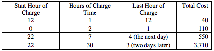

.. qnum::
   :prefix:  7-15-
   :start: 1

Free Response - Battery Charger A
=================================

..	index::
	single: batterychargera
    single: free response

The following is a free response question from 2009.  It was question 3 on the exam.  You can see all the free response questions from past exams at https://apstudent.collegeboard.org/apcourse/ap-computer-science-a/exam-practice.

**Question 3.**  An electric car that runs on batteries must be periodically recharged for a certain number of hours. The battery technology in the car requires that the charge time not be interrupted.

The cost for charging is based on the hour(s) during which the charging occurs. A rate table lists the 24 one-hour
periods, numbered from 0 to 23, and the corresponding hourly cost for each period. The same rate table is used
for each day. Each hourly cost is a positive integer. A sample rate table is given below.

.. figure:: Figures/bcTable.png
   :width: 404px
   :align: center
   :figclass: align-center

The class *BatteryCharger* below uses a rate table to determine the most economic time to charge the battery. You will write two of the methods for the *BatteryCharger* class.

.. code-block:: java

   public class BatteryCharger
   {
    /** rateTable has 24 entries representing the charging costs for hours 0 through 23. */
    private int[] rateTable;

    /** Determines the total cost to charge the battery starting at the beginning of startHour.
     *  @param startHour the hour at which the charging period begins
     *         Precondition: 0 <= startHour <= 23
     *  @param chargeTime the number ofhours the battery needs to be charged
     *         Precondition: chargeTime > 0
     *  @return the total cost to charge the battery
     */
    private int getChargingCost(int startHour, int chargeTime)
    { /* to be implemented in part (a) */ }

    /** Determines start time to charge the battery at the lowest cost for the given charge time.
     *  @param chargeTime the number of hours the battery needs to be charged
     *         Precondition: chargeTime > 0
     *  @return an optimal start time, with 0 <= returned value <= 23
     */
    public int getChargeStartTime(int chargeTime)
    { /* to be implemented in part (b) */ }

    // There may be instance variables, constructors, and methods that are not shown.
   }

Solve Part A
------------

(a) Write the *BatteryCharger* method *getChargingCost* that returns the total cost to charge a battery given the hour at which the charging process will start and the number of hours the battery needs to be charged.

For example, using the rate table given at the beginning of the question, the following table shows the resulting costs of several possible charges.

Note that a charging method consists of consecutive hours that may extend over more than one day.

Complete method *getChargingCost* below.

.. activecode:: FRQBatteryChargerA
   :language: java

   /** Determines the total cost to charge the battery starting at the beginning of startHour.
    *  @param startHour the hour at which the charge period begins
    *         Precondition: 0 <= startHour <= 23
    *  @param chargeTime the number of hours the battery needs to be charged
    *         Precondition: chargeTime > 0
    *  @return the total cost to charge the battery
    */
   public int getChargingCost(int startHour, int chargeTime)
