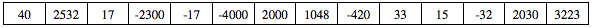

.. qnum::
   :prefix:  7-13-
   :start: 1

Free Response - Sound
=====================

..	index::
	single: sound
    single: free response

The following is a free response question from 2011.  It was question 1 on the exam.  You can see all the free response questions from past exams at https://apstudent.collegeboard.org/apcourse/ap-computer-science-a/exam-practice.

**Question 1.**  Digital sounds can be represented as an array of integer values. For this question, you will write two unrelated methods of the *Sound* class.

A partial declaration of the *Sound* class is shown below.

.. code-block:: java

   public class Sound
   {
    /** the array of values in this sound; guaranteed not to be null */
    private int[] samples;

    /** Changes those values in this sound that have an amplitude greater than limit */
     *  Values greater than limit are changed to limit.
     *  @param limit the amplitude limit
     *         Precondition: limit >= 0
     *  @return the number of values in this sound that this method changed
     */
    public int limitAmplitude(int limit)
    { /* to be implemented in part (a) */ }

    /** Removes all silence from the beginning of this sound.
     *  Silence is represented by a value of 0.
     *  Precondition: samples contains at least one nonzero value
     *  Postcondition: the length of samples reflects the removal of starting silence
     */
    public void trimSilenceFromBeginning()
    { /* to be implemented in part (b) */ }

    // There may be instance variables, constructors, and methods that are not shown.
   }

Solve Part A
------------

(a) The volume of a sound depends on the amplitude of each value in the sound. The amplitude of a value is its absolute value. For example, the amplitude of -2300 is 2300 and the amplitude of 4000 is 4000.

Write the method *limitAmplitude* that will change any value that has an amplitude greater than the
given limit. Values that are greater than *limit* are replaced with *limit*, and values that are less than
*-limit* are replaced with *–limit*. The method returns the total number of values that were changed in
the array. For example, assume that the array samples has been initialized with the following values.

When the statement

.. code-block:: java

   int numChanges = limitAmplitude(2000);

is executed, the value of *numChanges* will be 5, and the array *samples* will contain the following values.

.. figure:: Figures/soundTable2.png
   :width: 593px
   :align: center
   :figclass: align-center

Complete method *limitAmplitude* below.

.. activecode:: FRQSoundA
   :language: java

   /** Changes those values in this sound that have an amplitude greater than limit.
    *  Values greater than limit are changed to limit.
    *  Values less than -limit are changed to -limit.
    *  @param limit the amplitude limit
    *         Precondition: limit >= 0
    *  @return the number of values in this sound that this method changed
    */
   public int limitAmplitude(int limit)

Solve Part B
------------

(b) Recorded sound often begins with silence. Silence in a sound is represented by a value of 0.

Write the method *trimSilenceFromBeginning* that removes the silence from the beginning of a
sound. To remove starting silence, a new array of values is created that contains the same values as the
original *samples* array in the same order but without the leading zeros. The instance variable *samples*
is updated to refer to the new array. For example, suppose the instance variable *samples* refers to the
following array.

.. figure:: Figures/soundTable3.png
   :width: 617px
   :align: center
   :figclass: align-center

After *trimSilenceFromBeginning* has been called, the instance variable *samples* will refer to the following array.

.. figure:: Figures/soundTable4.png
   :width: 470px
   :align: center
   :figclass: align-center

Complete method *trimSilenceFromBeginning* below.

.. activecode:: FRQSoundB
   :language: java

   /** Removes all silence from the beginning of this sound.
    *  Silence is represented by a value of 0
    *  Precondition: samples contains at least one nonzero value
    *  Postcondition: the length of samples reflects the removal of starting silence
    */
   public void trimSilenceFromBeginning()
