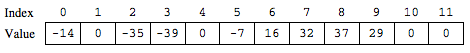

.. qnum::
   :prefix:  7-14-
   :start: 1

Free Response - Sound B
=======================

..	index::
	single: soundb
    single: free response

The following is a free response question from 2011.  It was question 1 on the exam.  You can see all the free response questions from past exams at https://apstudent.collegeboard.org/apcourse/ap-computer-science-a/exam-practice.

**Question 1.**  Digital sounds can be represented as an array of integer values. For this question, you will write two unrelated methods of the *Sound* class.

A partial declaration of the ``Sound`` class is shown below.

.. code-block:: java

   public class Sound
   {
    /** the array of values in this sound; guaranteed not to be null */
    private int[] samples;

    /** Changes those values in this sound that have an amplitude greater than limit */
     *  Values greater than limit are changed to limit.
     *  @param limit the amplitude limit
     *         Precondition: limit >= 0
     *  @return the number of values in this sound that this method changed
     */
    public int limitAmplitude(int limit)
    { /* to be implemented in part (a) */ }

    /** Removes all silence from the beginning of this sound.
     *  Silence is represented by a value of 0.
     *  Precondition: samples contains at least one nonzero value
     *  Postcondition: the length of samples reflects the removal of starting silence
     */
    public void trimSilenceFromBeginning()
    { /* to be implemented in part (b) */ }

    // There may be instance variables, constructors, and methods that are not shown.
   }

**Part b.** Recorded sound often begins with silence. Silence in a sound is represented by a value of 0.

Write the method ``trimSilenceFromBeginning`` that removes the silence from the beginning of a
sound. To remove starting silence, a new array of values is created that contains the same values as the
original ``samples`` array in the same order but without the leading zeros. The instance variable ``samples``
is updated to refer to the new array. For example, suppose the instance variable ``samples`` refers to the
following array.

.. figure:: Figures/soundTable3.png
  :width: 617px
  :align: center
  :figclass: align-center

After ``trimSilenceFromBeginning`` has been called, the instance variable ``samples`` will refer to the following array.

How to Solve This
--------------------
1. You will need to loop through each element in the array until you reach a non-zero element. What type of loop will you use?
2. Remember that you must edit the ``samples`` array.

The Algorithm
-------------------
.. parsonsprob:: SoundB

 The method trimSilenceFromBeginning below contains the correct code for one solution to this problem, but it is mixed up and contains extra blocks that are not needed.  Drag the needed code from the left to the right and put them in order with the correct indention so that the code would work correctly.
 -----
 public void trimSilenceFromBeginning() {
   int i = 0;
 =====
   while (this.samples[i] == 0) {
    i++;
 =====
   } // end while
 =====
   int[] newSamples = new int[this.samples.length - i];
 =====
   for (int j = 0; j < newSamples.length; j++) {
 =====
    newSamples[j] = this.samples[j+i];
 =====
   } // end for
 =====
   this.samples = newSamples;
 =====
 } // end method

Try and Solve Part B
--------------------
Complete method ``trimSilenceFromBeginning`` below.

.. activecode:: FRQSoundB
   :language: java

   public class Sound
   {
    /** the array of values in this sound; guaranteed not to be null */
    static private int[] samples = {0, 0, 0, 0, -1, 23, 4, -345, 346, 2, 5, 9, 3, 6};

    /** Changes those values in this sound that have an amplitude greater than limit
     *  Values greater than limit are changed to limit.
     *  @param limit the amplitude limit
     *         Precondition: limit >= 0
     *  @return the number of values in this sound that this method changed
     */
    public int limitAmplitude(int limit)
    { return 0; }

    /** Removes all silence from the beginning of this sound.
     *  Silence is represented by a value of 0.
     *  Precondition: samples contains at least one nonzero value
     *  Postcondition: the length of samples reflects the removal of starting silence
     */
    public static void trimSilenceFromBeginning(){
      // Complete this method
      // In the case of this exercise, please reference the samples variable without using "this"
    }

    public static void main(String[] args){

      trimSilenceFromBeginning();

      if(samples[0] != 0)
        System.out.println("Looks like your code works well!");
      else
        System.out.println("Oops! Looks like your code doesn't properly remove leading zeroes.");
    }
   }
