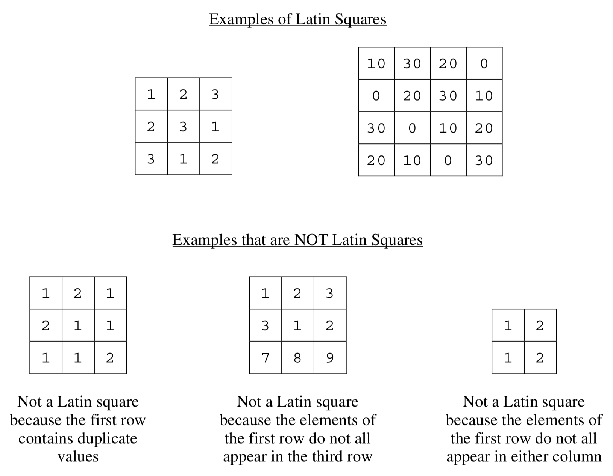

.. qnum::
   :prefix:  16-10-
   :start: 1

ArrayTester - Part B
===============================

.. index::
   single: ArrayTester
   single: free response

**Part b.**   Write the static method ``isLatin``, which returns ``true`` if a given two-dimensional square array is a ``Latin square``, and otherwise, returns false.

A two-dimensional square array of integers is a Latin square if the following conditions are true.
1) The first row has no duplicate values.
2) All values in the first row of the square appear in each row of the square.
3) All values in the first row of the square appear in each column of the square.

The ``ArrayTester`` class provides two helper methods: ``containsDuplicates`` and ``hasAllValues``. The method ``containsDuplicates`` returns ``true`` if the given one-dimensional array ``arr`` contains any duplicate values and ``false`` otherwise. The method ``hasAllValues`` returns ``true`` if and only if every value in ``arr1`` appears in ``arr2``. You do not need to write the code for these methods.

.. figure:: Figures/LatinSquareEx2.png
    :align: center
    :figclass: align-center

Complete method ``isLatin`` below. Assume that ``getColumn`` works as specified, regardless of what
you wrote in part (a). You must use ``getColumn``, ``hasAllValues``, and ``containsDuplicates``
appropriately to receive full credit.

Try and Solve It
----------------

.. activecode:: isLatinTwo
   :language: java
   :autograde: unittest

   Complete the method ``isLatin`` below.
   ~~~~
   public class ArrayTester
   {

       public static boolean isLatin(int[][] square)
       {
           // put your solution here

       }

       /** Copy in your solution of getColumn from the previous section */
       public static int[] getColumn(int[][] arr2D, int c)
       {
           // put your solution here

       }

       // Main method to test getColumn method
       public static void main(String[] args)
       {
           int[][] arr2D = { {1, 2, 3}, {2, 3, 1}, {3, 1, 2}};
           boolean test = isLatin(arr2D);
           System.out.println(
                   "If isLatin is implemented correctly, then test should be true:"
                           + test);
           if (!test)
           {
               System.out.print(
                       "Uh oh! isLatin(test) was false, but it should be true.");
           }
           else
           {
               System.out.println("Correct!");
           }
       } // end of main

       /** Returns true if and only if every value in arr1 appears in arr2. */
       public static boolean hasAllValues(int[] arr1, int[] arr2)
       {

           boolean[] flags = new boolean[arr1.length]; // default values false

           for (int i = 0; i < arr1.length; i++)
           {
               for (int j = 0; j < arr2.length; j++)
               {
                   if (arr1[i] == arr2[j])
                   {
                       flags[i] = true;
                   }
               }
           }
           for (boolean b : flags)
           {
               if (b == false)
               {
                   return false;
               }
           }
           return true;
       }

       /** Returns true if arr contains any duplicate values; false otherwise. */
       public static boolean containsDuplicates(int[] arr)
       {
           for (int i = 0; i < arr.length - 1; i++)
           {
               for (int j = i + 1; j < arr.length; j++)
               {
                   if (arr[i] == arr[j])
                   {
                       return true;
                   }
               }
           }
           return false;
       }
   } // end of the class

     ====
     import static org.junit.Assert.*;

     import org.junit.*;

     import java.io.*;

     // import java.util.ArrayList;

     public class RunestoneTests extends CodeTestHelper
     {
         public RunestoneTests()
         {
             super("ArrayTester");
             // CodeTestHelper.sort = true;
         }

         @Test
         public void testMain1()
         {
             boolean passed = false;

             String expect =
                     "If isLatin is implemented correctly, then test should be true:true\nCorrect!";

             String output = getMethodOutput("main");

             passed = getResults(expect, output, "Checking for expected output from main");
             assertTrue(passed);
         }

         @Test
         public void testMain2()
         {
             boolean passed = false;

             int[][] arr2D = { {1, 2, 3}, {2, 3, 1}, {3, 1, 2}};

             String arrayStr = "[[1, 2, 3],\n [2, 3, 1],\n [3, 1, 2]]";

             String expect = "true";
             String output = "" + ArrayTester.isLatin(arr2D);

             passed =
                     getResults(
                             expect,
                             output,
                             "Checking for expected output for isLatin(arr2D)\n" + arrayStr);
             assertTrue(passed);
         }

         @Test
         public void testMain3()
         {
             boolean passed = false;

             int[][] arr2D = { {1, 2, 3}, {2, 3, 1}, {7, 8, 9}};

             String arrayStr = "[[1, 2, 3],\n [2, 3, 1],\n [7, 8, 9]]";

             String expect = "false";
             String output = "" + ArrayTester.isLatin(arr2D);

             passed =
                     getResults(
                             expect,
                             output,
                             "Checking for expected output for isLatin(arr2D)\n" + arrayStr);
             assertTrue(passed);
         }
     }

