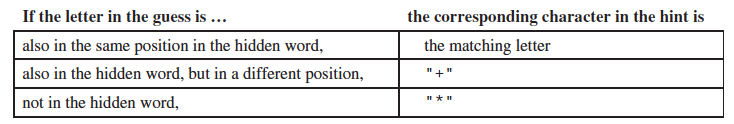
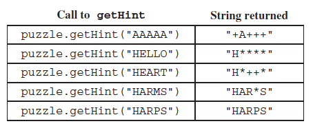

.. qnum::
   :prefix:  16-9-
   :start: 1

Hidden Word - Write Class
===============================

.. index::
    single: Hidden Word
    single: free response

The following is a free response question from 2015.  It was question 2 on the exam.  You can see all the free response questions from past exams at https://apstudents.collegeboard.org/courses/ap-computer-science-a/free-response-questions-by-year.

**Question 2.** Consider a guessing game in which a player tries to guess a hidden word. The hidden word contains only capital
letters and has a length known to the player. A guess contains only capital letters and has the same length as the
hidden word.

After a guess is made, the player is given a hint that is based on a comparison between the hidden word and the guess. Each position in the hint contains a character that corresponds to the letter in the same position in the guess. The following rules determine the characters that appear in the hint.

    Figure 1: The hints

The ``HiddenWord`` class will be used to represent the hidden word in the game.  The hidden word is passed to the constructor.  The class contains a method, ``getHint`` that takes a guess and produces a hint.

For example, suppose the variable ``puzzle`` is declared as follows.

.. code-block:: java

    HiddenWord puzzle = new HiddenWord("HARPS");

The following table shows several guesses and the hints that would be produced.

    Figure 2: Example guesses and hints

Try and Solve It
----------------

Write the complete ``HiddenWord`` class, including any necessary instance variables, its constructor, and the method,
``getHint``, described above. You may assume that the length of the guess is the same as the length of
the hidden word.

The code below has comments to help you get started.  It also has a main method for testing.  Finish writing the class and use the main method to test it.

.. activecode:: HiddenWordClass
   :language: java
   :autograde: unittest

   // Declare the public HiddenWord class below

   {

       /** Declare any fields (instance variables) **/

       /** Declare a constructor */

       /** Write the getHint method */

       /** This is a main method for testing the class */
       public static void main(String[] args)
       {
           HiddenWord puzzle = new HiddenWord("HARPS");
           System.out.println(puzzle.getHint("AAAAA") + " it should print +A+++");
           System.out.println(puzzle.getHint("HELLO") + " it should print H****");
           System.out.println(puzzle.getHint("HEART") + " it should print H*++*");
           System.out.println(puzzle.getHint("HARMS") + " it should print HAR*S");
           System.out.println(puzzle.getHint("HARPS") + " it should print HARPS");

       } // end of main

   } // end of class
   ====
   import static org.junit.Assert.*;

   import org.junit.*;

   import java.io.*;

   // import java.util.Arrays;
   // import java.util.ArrayList;

   public class RunestoneTests extends CodeTestHelper
   {
       public RunestoneTests()
       {
           super("HiddenWord");
           // CodeTestHelper.sort = true;
       }

       @Test
       public void testMain1()
       {
           boolean passed = false;

           String expect =
                   "+A+++ it should print +A+++\n"
                       + "H**** it should print H****\n"
                       + "H*++* it should print H*++*\n"
                       + "HAR*S it should print HAR*S\n"
                       + "HARPS it should print HARPS";

           String output = getMethodOutput("main");

           passed = getResults(expect, output, "Checking for expected output from main");
           assertTrue(passed);
       }

       @Test
       public void testMain2()
       {
           boolean passed = false;

           String word = "CSAWESOME";
           String hint = "CSCSCSZZZ";

           HiddenWord puzzle = new HiddenWord(word);

           String output = puzzle.getHint(hint);
           String expect = "CS+++S***";

           passed =
                   getResults(
                           expect,
                           output,
                           "Checking for expected output \"" + word + "\" with hint \"" + hint + "\"");
           assertTrue(passed);
       }

       @Test
       public void testMain3()
       {
           boolean passed = false;

           String word = "CSAWESOME";
           String hint = "EZZZZSOME";

           HiddenWord puzzle = new HiddenWord(word);

           String output = puzzle.getHint(hint);
           String expect = "+****SOME";

           passed =
                   getResults(
                           expect,
                           output,
                           "Checking for expected output \"" + word + "\" with hint \"" + hint + "\"");
           assertTrue(passed);
       }
   }

