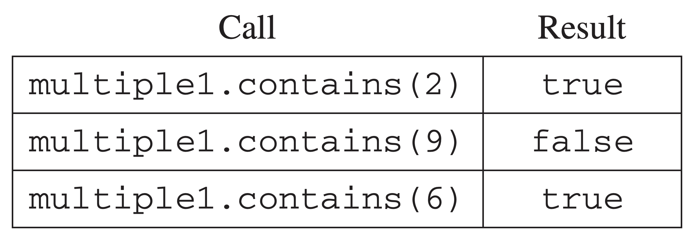

.. qnum::
   :prefix:  16-13-
   :start: 1

NumberGroup - Part C
===============================

.. index::
    single: NumberGroup
    single: free response

**Part c.**  The ``MultipleGroups`` class represents a collection of ``NumberGroup`` objects and is
a ``NumberGroup``. The ``MultipleGroups`` class stores the number groups in the instance variable
``groupList`` (shown below), which is initialized in the constructor.

- private ArrayList<NumberGroup> groupList;

Write the ``MultipleGroups`` method ``contains``. The method takes an integer and returns ``true``
if and only if the integer is contained in one or more of the number groups in ``groupList``.

For example, suppose ``multiple1`` has been declared as an instance of ``MultipleGroups`` and consists of the three ranges created by the calls:

- new Range(5, 8)
- new Range(10, 12)
- new Range(1, 6)

The following table shows the results of several calls to ``contains``.

Try and Solve It
----------------

Write the method ``contains`` below in the class MultiGroups. (Note that the original AP Question involved a NumberGroup interface which has been replaced with inheritance here).

.. activecode:: NumberGroupC
   :language: java
   :autograde: unittest

   Write the method ``contains`` below in the class MultiGroups.
   ~~~~
   import java.util.ArrayList;

   class NumberGroup
   {
       public boolean contains(int num)
       {
           /* Implementation not shown */
           return true;
       }
   }

   class Range extends NumberGroup
   {
       // copy in your Range class from the previous lesson here
   }

   public class MultiGroups extends NumberGroup
   {

       private ArrayList<NumberGroup> groupList;

       public MultiGroups(Range r1, Range r2, Range r3)
       {
           groupList = new ArrayList<NumberGroup>();
           groupList.add(r1);
           groupList.add(r2);
           groupList.add(r3);
       }

       /**
        * Returns true if at least one of the number groups in this multiple group
        * contains num; false otherwise
        */
       public boolean contains(int num)
       {
           // Write the MultiGroup contains method here

       }

       // Main method to test the class
       public static void main(String[] args)
       {
           MultiGroups multiple1 =
                   new MultiGroups(
                           new Range(5, 8), new Range(10, 12), new Range(1, 6));
           System.out.println(
                   "Multiple1 contains 2 (should be true)? " + multiple1.contains(2));
           System.out.println(
                   "Multiple1 contains 9 (should be false)? "
                           + multiple1.contains(9));
           System.out.println(
                   "Multiple1 contains 6 (should be true)? " + multiple1.contains(6));
       } // end of main
   }

    ====
    import static org.junit.Assert.*;

    import org.junit.*;

    import java.io.*;

    // import java.util.ArrayList;

    public class RunestoneTests extends CodeTestHelper
    {
        public RunestoneTests()
        {
            super("MultiGroups");
            // CodeTestHelper.sort = true;
        }

        @Test
        public void testMain1()
        {
            boolean passed = false;

            String expect =
                    "Multiple1 contains 2 (should be true)? true\n"
                        + "Multiple1 contains 9 (should be false)? false\n"
                        + "Multiple1 contains 6 (should be true)? true";

            String output = getMethodOutput("main");

            passed = getResults(expect, output, "Checking for expected output from main");
            assertTrue(passed);
        }

        @Test
        public void testMain2()
        {
            boolean passed = false;

            MultiGroups multiple1 =
                    new MultiGroups(new Range(5, 8), new Range(10, 12), new Range(15, 20));

            String expect = "false";
            String output = "" + multiple1.contains(0);

            passed =
                    getResults(
                            expect,
                            output,
                            "Checking that MultiGroups with Range(5, 8), Range(10, 12), Range(15, 20)"
                                + " contains(0) should be false");
            assertTrue(passed);
        }

        @Test
        public void testMain3()
        {
            boolean passed = false;

            MultiGroups multiple1 =
                    new MultiGroups(new Range(5, 8), new Range(10, 12), new Range(15, 20));

            String expect = "true";
            String output = "" + multiple1.contains(11);

            passed =
                    getResults(
                            expect,
                            output,
                            "Checking that MultiGroups with Range(5, 8), Range(10, 12), Range(15, 20)"
                                + " contains(11) should be true");
            assertTrue(passed);
        }
    }

