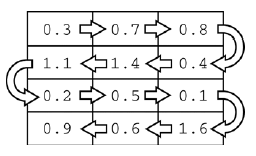
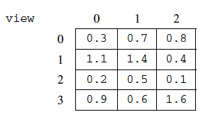

.. qnum::
   :prefix:  16-7-
   :start: 1

SkyView - Part A
===============================

.. index::
    single: RandomStringChooser
    single: free response

The following is a free response question from 2013.  It was question 4 on the exam.  You can see all the free response questions from past exams at https://apstudents.collegeboard.org/courses/ap-computer-science-a/free-response-questions-by-year.

**Question 4.** A telescope scans a rectangular area of the night sky and collects the data into a 1-dimensional array. Each data
value scanned is a number representing the amount of light detected by the telescope. The telescope scans back
and forth across the sky (alternating between left to right and right to left) in the pattern indicated below by the
arrows. The back-and-forth ordering of the values received from the scan is called telescope order.

    Figure 1: The first row is left to right and the second is right to left and so on.

The telescope records the data in telescope order into a 1-dimensional array of ``double`` values. This
1-dimensional array of information received from a single scan will be transferred into a 2-dimensional array,
which reconstructs the original view of the rectangular area of the sky. This 2-dimensional array is part of the
SkyView class, shown below. In this question you will write a constructor and a method for this class.

.. code-block:: java

   public class SkyView
   {
       /**
        * A rectangular array that holds the data representing a rectangular area of
        * the sky.
        */
       private double[][] view;

       /**
        * Constructs a SkyView object from a 1-dimensional array of scan data.
        *
        * @param numRows the number of rows represented in the view Precondition:
        *     numRows > 0
        * @param numCols the number of columns represented in the view Precondition:
        *     numCols > 0
        * @param scanned the scan data received from the telescope, stored in
        *     telescope order Precondition: scanned.length == numRows * numCols
        *     Postcondition: view has been created as a rectangular 2-dimensional
        *     array with numRows rows and numCols columns and the values in scanned
        *     have been copied to view and are ordered as in the original rectangular
        *     area of sky.
        */
       public SkyView(int numRows, int numCols, double[] scanned)
       {
           /* to be implemented in part (a) */
       }

       /**
        * Returns the average of the values in a rectangular section of view.
        *
        * @param startRow the first row index of the section
        * @param endRow the last row index of the section
        * @param startCol the first column index of the section
        * @param endCol the last column index of the section Precondition: 0 <=
        *     startRow <= endRow < view.length Precondition: 0 <= startCol <= endCol <
        *     view[0].length
        * @return the average of the values in the specified section of view
        */
       public double getAverage(int startRow, int endRow, int startCol, int endCol)
       {
           /* to be implemented in part (b) */
       }

       // There may be other instance variables, constructors, and methods
   }

**Part a.**   Write the constructor for the ``SkyView`` class. The constructor initializes the ``view`` instance variable to a
2-dimensional array with ``numRows`` rows and ``numCols`` columns. The information from ``scanned``,
which is stored in the telescope order, is copied into ``view`` to reconstruct the sky view as originally seen
by the telescope. The information in ``scanned`` must be rearranged as it is stored into ``view`` so that the
sky view is oriented properly.

For example, suppose ``scanned`` contains values, as shown in the following array.

.. figure:: Figures/SkyViewExArray.png
    :align: center
    :figclass: align-center

    Figure 2: First example scanned array values

Using the scanned array above, a ``SkyView`` object created with
``new SkyView(4, 3, values)``, would have ``view`` initialized with the following values.

    Figure 3: The resulting view from the first example scanned array

For another example, suppose ``scanned`` contains the following values.

.. figure:: Figures/SkyViewEx2Array.png
    :align: center
    :figclass: align-center

    Figure 4: Second example scanned array values

A ``SkyView`` object created with ``new SkyView(3, 2, values)``, would have ``view`` initialized
with the following values.

.. figure:: Figures/SkyViewRes2.png
    :align: center
    :figclass: align-center

    Figure 4: The resulting view from the second example scanned array

Try and Solve It
----------------

Complete the ``SkyView`` constructor in the class below.

The code below declares the class, the view, and a constructor for you to finish writing.  It also has a main method for testing the constructor.

.. activecode:: SkyViewA
   :language: java
   :autograde: unittest

   Complete the ``SkyView`` constructor in the class below.
   ~~~~
   public class SkyView
   {
       private double[][] view;

       /**
        * Constructs a SkyView object from a 1-dimensional array of scan data.
        *
        * @param numRows the number of rows represented in the view Precondition:
        *     numRows > 0
        * @param numCols the number of columns represented in the view Precondition:
        *     numCols > 0
        * @param scanned the scan data received from the telescope, stored in
        *     telescope order Precondition: scanned.length == numRows * numCols
        *     Postcondition: view has been created as a rectangular 2-dimensional
        *     array with numRows rows and numCols columns and the values in scanned
        *     have been copied to view and are ordered as in the original rectangular
        *     area of sky.
        */
       public SkyView(int numRows, int numCols, double[] scanned)
       {
           // *** Write the constructor! ***
       }

       /** This is a main method for testing the class */
       public static void main(String[] args)
       {
           double[] values =
           {
               0.3, 0.7, 0.8, 0.4, 1.4, 1.1, 0.2, 0.5, 0.1, 1.6, 0.6, 0.9
           };
           SkyView sView = new SkyView(4, 3, values);
           System.out.println("It should print the following:");
           System.out.println("0.3, 0.7, 0.8,");
           System.out.println("1.1, 1.4, 0.4,");
           System.out.println("0.2, 0.5, 0.1,");
           System.out.println("0.9, 0.6, 1.6,");
           System.out.println();
           System.out.println("Your results");
           for (int row = 0; row < sView.view.length; row++)
           {
               for (int col = 0; col < sView.view[0].length; col++)
               {
                   System.out.print(sView.view[row][col] + ", ");
               }
               System.out.println();
           }

           System.out.println();

           double[] val2 = {0.3, 0.7, 0.8, 0.4, 1.4, 1.1};
           sView = new SkyView(3, 2, val2);
           System.out.println("It should print the following:");
           System.out.println("0.3, 0.7,");
           System.out.println("0.4, 0.8,");
           System.out.println("1.4, 1.1,");
           System.out.println();
           System.out.println("Your results");
           for (int row = 0; row < sView.view.length; row++)
           {
               for (int col = 0; col < sView.view[0].length; col++)
               {
                   System.out.print(sView.view[row][col] + ", ");
               }
               System.out.println();
           }
       } // end of main

       public String toString()
       {
           String output = "";
           for (int row = 0; row < view.length; row++)
           {
               for (int col = 0; col < view[row].length; col++)
               {
                   output += view[row][col] + ", ";
               }
               output += "\n";
           }
           return output;
       }
   } // end of class

   ====
   import static org.junit.Assert.*;

   import org.junit.*;

   import java.io.*;

   // import java.util.Arrays;
   // import java.util.ArrayList;

   public class RunestoneTests extends CodeTestHelper
   {
       public RunestoneTests()
       {
           super("SkyView");
           // CodeTestHelper.sort = true;
       }

       @Test
       public void testMain1()
       {
           boolean passed = false;

           double[] val2 = {0.3, 0.7, 0.4, 0.8, 1.4, 1.1};
           SkyView sView = new SkyView(3, 2, val2);
           String expect = "0.3, 0.7,\n0.8, 0.4,\n1.4, 1.1,";

           String output = sView.toString().trim();

           passed = getResults(expect, output, "Checking for expected output");
           assertTrue(passed);
       }

       @Test
       public void testMain2()
       {
           boolean passed = false;

           double[] val2 = {0.3, 0.7, 0.4, 0.8, 1.4, 1.1};
           SkyView sView = new SkyView(2, 3, val2);
           String expect = "0.3, 0.7, 0.4, \n1.1, 1.4, 0.8,";

           String output = sView.toString().trim();

           passed = getResults(expect, output, "Checking for expected output");
           assertTrue(passed);
       }
   }

