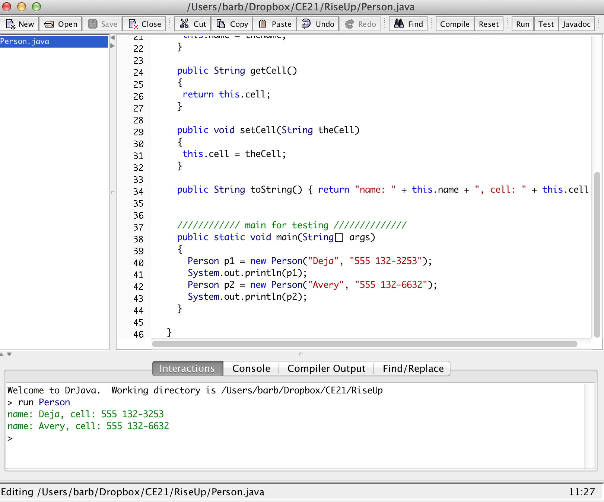

.. qnum::
   :prefix: 2-2-
   :start: 1

First Example Class
==============================

..	index::
	single: class
	pair: class; field
	pair: class; constructor
	pair: class; method
	pair: class; main method
	
The following is an example class in Java.  A class in Java can have fields (data or properties), constructors (ways to initialize the fields), methods (behaviors), and a main method for testing the class. It does 
not have to have any of these items.    

..	index::
	single: public
	pair: class; public
	
All classes on the Advanced Placement Computer Science A exam will be **public** as shown in the first line.  Think of **public** as like a social networking site that anyone can read.  Notice that some of the
words in the code below are in green. 

 ..	index::
	single: keyword
	pair: Java; keyword
	pair: Java; naming convention

These are Java keywords which means that they are part of the Java language, notice that they are start with a lowercase letter.  All keywords in Java start with a lowercase letter.
Only the class name ``Person`` starts with an uppercase letter.  In Java the convention is that only class names start with a capital letter.  

.. code-block:: java

   public class Person
   {
     /// fields ////////////////
     private String name;
     private String cell;
  
     /////// constructors ////////////////////
     public Person(String theName, String theCell)
     {
       this.name = theName;
       this.cell = theCell;
     }
  
     //////////// methods ///////////////////////
     public String getName() 
     { 	
     	return this.name; 
     }
     public void setName(String theName) 
     { 
     	this.name = theName; 
     }
  
     public String getCell() 
     {  
     	return this.cell; 
     }
     
     public void setCell(String theCell) 
     { 
     	this.cell = theCell; 
     }
  
     public String toString() { return "name: " + this.name + 
                                ", cell: " + this.cell; }
  
  
     //////////// main for testing //////////////
     public static void main(String[] args)
     {
       Person p1 = new Person("Deja", "555 132-3253");
       System.out.println(p1);
       Person p2 = new Person("Avery", "555 132-6632"); 
       System.out.println(p2);
     }
  
   }
   
Running a Java Program
==============================

..  index::
	pair: Java; run program
	pair: Java; main method
   
When you execute a Java program, you give it the name of the class that has the ``main`` method to execute and execution will start there.  If DrJava if you click the run button it will
try to run the ``main`` method in the currently selected class.  A ``main`` method should create objects
that do the work in an object-oriented program and then have the objects do the work. Some books show having a main method in another class which is often called a runner class, but this is not required.  
I like to have a ``main`` method in each of my classes that tests the methods in that class.  The ``main`` method in the ``Person`` class creates two ``Person`` objects and prints their values out using the ``toString`` method.  The ``toString`` method is what is called on an object when you execute ``System.out.println(object)``. 

    Figure 1: The result of running the Person class in DrJava

All classes in Java can have fields, constructors, methods, and a main method.

Fields - Instance Variables
==============================

..	index::
	pair: class; field

**Fields** hold the data for an object.  Fields record what an object needs to know to do work in the program.  Fields are also called **instance variables** or **object variables** or **properties**. 

All fields on the AP CS A exam should be declared ``private``.  Think of ``private`` as like your diary.  Only you should have direct access to it.  In this case ``private`` means that only the code in this class can directly access the field values.

The ``Person`` class declares two fields: name and cell.  Name is the person's name and cell is their cell phone number.  These are both things that you might need to know about
a person.  

.. code-block:: java

     /// fields ////////////////
     private String name;
     private String cell;

Constructors
==============================

..	index::
	pair: class; constructor
	
**Constructors** don't actually construct the object.  The class makes the object and then executes a constructor to initialize the values of the fields (instance variables).  You will only work with ``public`` constructors on the exam.  

The ``Person`` class has one constructor that takes two values: a string that is the name and a string that is the cell phone number.  To find a constructor in a class look for something with the same name as the class and no return type.  

.. code-block:: java

     /////// constructors ////////////////////
     public Person(String theName, String theCell)
     {
       this.name = theName;
       this.cell = theCell;
     }
  

Methods
==============================

..	index::
	pair: class; method
	
**Methods** define what an object can do or the behavior of the object.  

Most methods you work with on the exam will be ``public``.  

The ``Person`` class has methods for getting the name and cell phone and for setting the cell phone.  Methods that get information from an object are called **getters** or **accessors**.  Methods that set field values are called **setters** or **mutators**.  

.. code-block:: java

     //////////// methods ///////////////////////
     public String getName() 
     { 	
     	return this.name; 
     }
     public void setName(String theName) 
     { 
     	this.name = theName; 
     }
  
     public String getCell() 
     {  
     	return this.cell; 
     }
     
     public void setCell(String theCell) 
     { 
     	this.cell = theCell; 
     }
  
     public String toString() { return "name: " + this.name + ", 
                                cell: " + this.cell; }
  

Main Method
==================

..	index::
	pair: class; main method
	
The only thing that can be changed on the first line of the main method (``public static void main(String[] args)``) is ``args``.  The ``args`` is just the name that can be used in the ``main`` method to refer to an array of strings that is passed to the ``main`` method.  The rest of the words have to be there and
should be in that order.  The ``main`` method is what the Java run-time looks for to start execution when you execute ``java Person``.  

.. code-block:: java

     //////////// main for testing //////////////
     public static void main(String[] args)
     {
       Person p1 = new Person("Deja", "555 132-3253");
       System.out.println(p1);
       Person p2 = new Person("Avery", "555 132-6632"); 
       System.out.println(p2);
     }
     
Click on the following `link <http://cscircles.cemc.uwaterloo.ca/java_visualize/#code=public+class+Person%0A+++%7B%0A+++++///+fields+////////////////%0A+++++private+String+name%3B%0A+++++private+String+cell%3B%0A++%0A+++++///////+constructors+////////////////////%0A+++++public+Person(String+theName,+String+theCell)%0A+++++%7B%0A+++++++this.name+%3D+theName%3B%0A+++++++this.cell+%3D+theCell%3B%0A+++++%7D%0A++%0A+++++////////////+methods+///////////////////////%0A+++++public+String+getName()+%0A+++++%7B+%09%0A+++++%09return+this.name%3B+%0A+++++%7D%0A+++++public+void+setName(String+theName)+%0A+++++%7B+%0A+++++%09this.name+%3D+theName%3B+%0A+++++%7D%0A++%0A+++++public+String+getCell()+%0A+++++%7B++%0A+++++%09return+this.cell%3B+%0A+++++%7D%0A+++++%0A+++++public+void+setCell(String+theCell)+%0A+++++%7B+%0A+++++%09this.cell+%3D+theCell%3B+%0A+++++%7D%0A++%0A+++++public+String+toString()+%7B+return+%22name%3A+%22+%2B+this.name+%2B+%0A++++++++++++++++++++++++++++++++%22,+cell%3A+%22+%2B+this.cell%3B+%7D%0A++%0A++%0A+++++////////////+main+for+testing+//////////////%0A+++++public+static+void+main(String%5B%5D+args)%0A+++++%7B%0A+++++++Person+p1+%3D+new+Person(%22Deja%22,+%22555+132-3253%22)%3B%0A+++++++System.out.println(p1)%3B%0A+++++++Person+p2+%3D+new+Person(%22Avery%22,+%22555+132-6632%22)%3B+%0A+++++++System.out.println(p2)%3B%0A+++++%7D%0A++%0A+++%7D&mode=display&curInstr=4>`_ to go to the Java visualizer and then you can step through the code using the Forward button and see the objects get created and the fields initialized.  You can even change the code and create an object that represents you.
