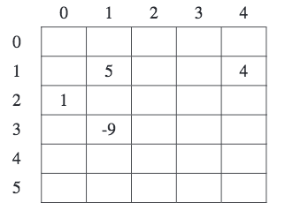
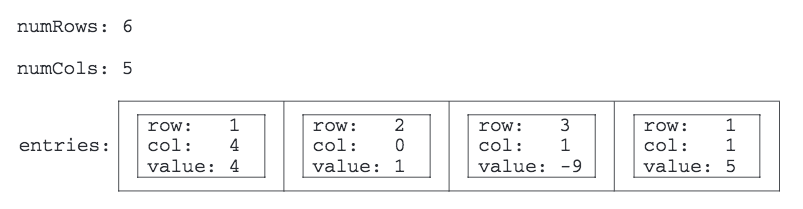
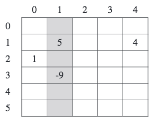
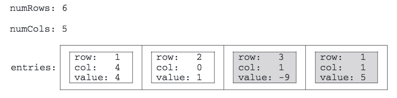
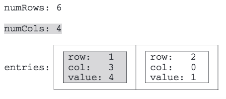

.. qnum::
   :prefix:  10-16-
   :start: 1

Free Response - 2015 Question 3
-----------------------------------

..	index::
	single: trio
    single: free response
    
The following is a free response question from 2015.  It was question 3 on the exam.  You can see all the free response questions from past exams at https://apstudent.collegeboard.org/apcourse/ap-computer-science-a/exam-practice.  
    
A two-dimensional array of integers in which most elements are zero is called a **sparse array**.
Because most elements have a value of zero, memory can be saved by storing only the non-zero values along with their row and column indexes. 
The following complete ``SparseArrayEntry`` class is used to represent non-zero elements in a sparse array. 
A ``SparseArrayEntry`` object cannot be modified after it has been constructed.
 
.. code-block:: java 
   
   public class SparseArrayEntry
   {   
   /** The row index and column index for this entry in the sparse array  */   
        private int row; 
        private int col;  
        
   /** The value of this entry in the sparse array */ 
        private int value;   
        
   /** Constructs a SparseArrayEntry object that represents a sparse array element 
   * with row index r and column index c,containing value v.   
   */   
   public SparseArrayEntry(int r, int c, int v)  
   {     
   row = r;     
   col = c;     
   value = v;  
   } 
   
   /** Returns the row index of this sparse array element. */   
   public int getRow()   
   {  
   return row;  
   }   
   
   /** Returns the column index of this sparse array element.
   */   public int getCol()   
   {  
   return col;  
   }   
   
   /** Returns the value of this sparse array element. 
   */   public int getValue()  
   {  
   return value;  } 
   }

The ``SparseArray`` class represents a sparse array. 
It contains a list of ``SparseArrayEntry`` objects, each of which represents one of the non-zero elements in the array. 
The entries representing the non-zero elements are stored in the list in no particular order. 
Each non-zero element is represented by exactly one entry in the list.  

.. code-block:: java 

   public class SparseArray 
   {   
   /** The number of rows and columns in the sparse array.  */   
   private int numRows;   
   private int numCols;  
  
   /** The list of entries representing the non-zero elements of the sparse array. Entries are stored in the
   *list in no particular order. Each non-zero element is represented by exactly one entry in the list.   
   */   
   private List<SparseArrayEntry> entries;   

   /** Constructs an empty SparseArray. */   
   public SparseArray()   
   {  
   entries = new ArrayList<SparseArrayEntry>();  
   }   

   /** Returns the number of rows in the sparse array. */   
   public int getNumRows()   
   {  
   return numRows;  
   }   

   /** Returns the number of columns in the sparse array.  */   
   public int getNumCols()   
   {  
   return numCols;  
   }   

   /** Returns the value of the element at row index row and column index col in the sparse array.
   *Precondition:  0  row < getNumRows()   
   *               0  col < getNumCols()   
   */   
   public int getValueAt(int row, int col)   
   {  
   /* to be implemented in part (a) */  }   

   /** Removes the column col from the sparse array. 
   *Precondition:  0  col < getNumCols()   
   */   
   public void removeColumn(int col)   
   {  
   /* to be implemented in part (b) */  }   

   // There may be instance variables, constructors, and methods that are not shown.
   }

The following table shows an example of a two-dimensional sparse array. Empty cells in the table indicate zero values.

    
    Figure 1: Example showing a two-dimensional sparse array.

The sample array can be represented by a ``SparseArray`` object, ``sparse``,with the following instance variable values. 
The items in ``entries`` are in no particular order; one possible ordering is shown below.

    
    Figure 2: Example showing possible ordering in ``entries``.
    
**PART A**  
  
(a) Write the ``SparseArray`` method ``getValueAt``.The method returns the value of the sparse array element at a given row and column 
in the sparse array. 
If the list ``entries`` contains an entry with the specified row and column, the value associated with the entry is returned. 
If there is no entry in ``entries`` corresponding to the specified row and column, 0 is returned. 

In the example above, the call ``sparse.getValueAt(3, 1)`` would return -9, and ``sparse.getValueAt(3, 3)`` would return 0.
    
Complete method ``getValueAt`` below. 

.. code-block:: java 

   /** Returns the value of the element at row index row and column index col in the sparse array.
   *Precondition:  0  row < getNumRows()  
   *0  col < getNumCols()  
   */   
   public int getValueAt(int row, int col)     

**SOLVING PART A** 

The problem gives us this code to start with. 

.. code-block:: java  

   public int getValueAt(int row, int col)
   {

To complete the method ``getValueAt``, we're going to use an enhanced for loop to go through our entries list. 

    An enhanced for loop creates a variable that temporarily captures the value at each index in the array, starting at 0 until the end of the array. 
    This is useful because, unlike with regular for loops or while loops, 
    you don't have to worry about issues like index out of bound exceptions or having to check if the array is empty.

(Note: an enhanced for loop can be used in this case because all we need to do is access the values. 
An enhanced for loop can not be used if you need to modify the values.)

.. code-block:: java 

   for (SparseArrayEntry e : entries)
    
Then we will use an if statement to return the value at the given index if it exists. IF ``e.getRow()`` and ``e.getCol()`` are equal, 
we want to return the value at ``e.getValue()``.

   We're using an if statement instead of a while loop or for loop because if statements execute once every time the statement IS true. 
   While loops and for loops execute until the statement IS NOT true.

.. code-block:: java 

   if (e.getRow() == row && e.getCol() == col)
   return e.getValue();
        
If there is no value at the given index, we will return zero.     
    
.. code-block:: java 
         
   return 0;
   }  

The final answer should look like:

.. code-block:: java 

   public int getValueAt(int row, int col)
   {
   for (SparseArrayEntry e : entries)
      if (e.getRow() == row && e.getCol() == col)
        return e.getValue();
    return 0;
   }

**PART B**
    
(b) Write the ``SparseArray`` method ``removeColumn``. After removing a specified column from a sparse array:

• All entries in the list ``entries`` with column indexes matching ``col`` are removed from the list.
  
• All entries in the list ``entries`` with column indexes greater than ``col`` are replaced by entries
  with column indexes that are decremented by one (moved one column to the left).  
  
• The number of columns in the sparse array is adjusted to reflect the column removed.

The sample object ``sparse`` from the beginning of the question is repeated for your convenience. 
    

    
    Figure 3: Example showing a two-dimensional sparse array.

    
    Figure 4: Example showing possible ordering in ``entries``.
    
When ``sparse`` has the state shown above, 
the call ``sparse.removeColumn(1)`` could result in ``sparse`` having the following values in its instance variables 
(since ``entries`` is in no particular order, it would be equally valid to reverse the order of its two items). 
The shaded areas below show the changes.    
    

    
    Figure 5: Example shading the changes that the call ``sparse.removeColumn(1)`` can make.

Complete method ``removeColumn`` below.

.. code-block:: java 

   /** Removes the column col from the sparse array. 
   *Precondition:  0  col < getNumCols()  
   */  
   public void removeColumn(int col)

**SOLVING PART B** 

The problem gives us this code to start with. 

.. code-block:: java 

   public void removeColumn(int col)
   {
  
The third bullet point of the problem asks for the code to adjust the number of columns in the sparse array to reflect the column removed. 
To do this we will update ``numCols`` and decrement it by one.
  
.. code-block:: java  
 
   this.numCols--;
   
Now we want to make a temporary ``ArrayList`` of entries in the sparse array that we want to remove. 
This will make it easy to keep track of what we want to delete. 
The instructions call for us to remove all entries in the list ``entries`` with column indexes matching ``col``.
   
.. code-block:: java 

   ArrayList<SparseArrayEntry> toRemove = new ArrayList<>();

Next we want to make a temporary ``ArrayList`` of entries in the sparse array that we want to replace. The directions call for
all entries in the list ``entries`` with column indexes greater than ``col`` to be replaced 
with column indexes that are decremented by one (moved one column to the left).  

.. code-block:: java 

   ArrayList<SparseArrayEntry> toReplace = new ArrayList<>();   

To find the actual entries to remove, we will use a for loop to go through the ``entries`` array.

.. code-block:: java 

   for(SparseArrayEntry x : entries)

As the for loops goes through the array, we want it to put all entries in the list ``entries`` 
with column indexes matching ``col`` into the ``toRemove`` array. This if statement adds columns equal to ``col`` to the ``toRemove`` array.

.. code-block:: java

   if(x.getCol() == col)
     toRemove.add(x);

As the for loop goes through the ``entries`` array, we want to find all entries in the list ``entries`` with column indexes 
greater than ``col``, remove them, and replace them with updated values. 

We add an else if statement which will put all columns greater than ``col`` in the ``toRemove`` array, and then we replace it with an updated value. 

For the ``toReplace`` array, we add updated values where we previously removed entries. ``x.getRow()`` puts the new value in the same row, ``x.getCol()-1`` puts it in the same column, decremented by one, 
and ``x.getValue()`` makes sure we use the same value entries. 
 
.. code-block:: java   
     
   else if(x.getCol() > col)
   {
      toRemove.add(x);
      toReplace.add(new SparseArrayEntry(x.getRow(), x.getCol()-1, x.getValue()));
   }

Now that our temporary array list, ``toRemove``, is filled with the values we want to remove, we need to update the ``entries`` array by 
removing the data from it. 
This for loop will go through ``toRemove`` and remove data it has in common with ``entries``. 
Keep in mind we are removing data that we want to remove as well 
as old data we want to replace. 

.. code-block:: java 

   for(SparseArrayEntry x : toRemove)
   entries.remove(x);
   
Next we want to readd values to the ``entries`` array. Now that ``toReplace`` is full with updated values, 
this for loop will go through ``toReplace`` and add the updated values to ``entries``.
   
.. code-block:: java 
   
   for(SparseArrayEntry x : toReplace)
   entries.add(x);
   
        
The final code should look like:       
        
.. code-block:: java    
  
   this.numCols--;

   ArrayList<SparseArrayEntry> toRemove = new ArrayList<>();
   ArrayList<SparseArrayEntry> toReplace = new ArrayList<>();   
   
   for(SparseArrayEntry x : entries)
   
   if(x.getCol() == col)
     toRemove.add(x);
     
   else if(x.getCol() > col)
   {
      toRemove.add(x);
      toReplace.add(new SparseArrayEntry(x.getRow(), x.getCol()-1, x.getValue()));
   }
   
   for(SparseArrayEntry x : toRemove)
   entries.remove(x);
   
   for(SparseArrayEntry x : toReplace)
   entries.add(x);

