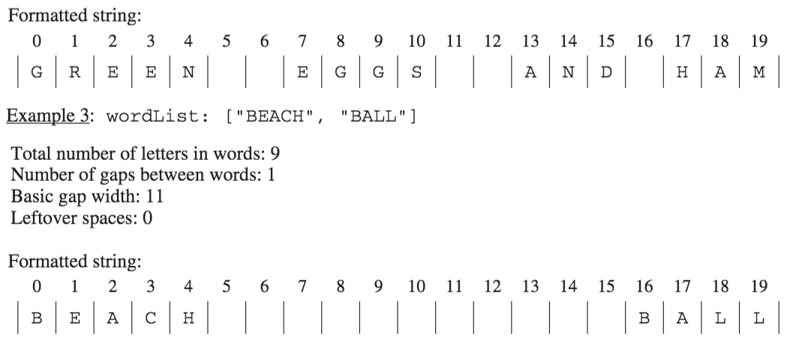

.. qnum::
   :prefix:  10-16-
   :start: 1

Free Response - StringFormatter A
-----------------------------------

..	index::
	single: trio
    single: free response
    
The following is a free response question from 2016. It was question 4 part A on the exam. You can see all the free response questions from past exams at https://apstudent.collegeboard.org/apcourse/ap-computer-science-a/exam-practice. 

4.  This question involves the process of taking a list of words, called ``wordList``, and producing a formatted string of a specified length. 
The list ``wordList`` contains at least two words, consisting of letters only.  
When the formatted string is constructed, spaces are placed in the gaps between words so that as many spaces as possible are evenly distributed to each gap. 
The equal number of spaces inserted into each gap is referred to as the basic gap width. 
Any leftover spaces are inserted one at a time into the gaps from left to right until there are no more leftover spaces. 

The following three examples illustrate these concepts. In each example, the list of words is to be placed into a formatted string of length 20. 
 
.. figure:: Figures/2016FRQ4A1.png
    :width: 700px
    :align: center
    :figclass: align-center
    
The leftover spaces are inserted one at a time between the words from left to right until there are no more leftover spaces. 
In this example, the first two gaps get an extra space.

    
You will implement three static methods in a class named ``StringFormatter`` that is not shown.

Part A
========

(a) Write the ``StringFormatter`` method ``totalLetters``, which returns the total number of letters in the words in its parameter ``wordList``.
For example, if the ``variableList<String> words`` is ["A", "frog", "is"],then the call ``StringFormatter.totalLetters(words)`` returns 7. 
You may assume that all words in ``wordList`` consist of one or more letters.

Complete method ``totalLetters`` below. 

.. code-block:: java 

   /** Returns the total number of letters in wordList. 
   *  Precondition: wordList contains at least two words, consisting of letters only. 
   */ 
   public static int totalLetters(List<String> wordList)
   
How to Solve Part A
=====================

We need to return the total number of letters for all of the strings in ``wordList``.  We will need to create an
integer variable to keep track of the number of letters and initialize it to 0.  Then we will loop through all of the strings in ``wordList`` and 
add the length of the current string to the number of letters.  When the loop is finished we will return the number of letters.

Put the Code in Order 
======================

.. parsonsprob:: 2016Q4A

   The following has the correct code to solve this problem, but also contains extra code that isn't needed in a correct solution.  Drag the needed blocks from the left into the correct order on the right and indent them as well. Check your solution by clicking on the <i>Check Me</i> button.  You will be told if any of the blocks are in the wrong or are in the wrong order.  You will also be told if the indention is wrong.
   -----
   public static int totalLetters(List<String> wordList)
   {
   =====
       int numLetters = 0; 
   =====
       for (String s : wordList)
   =====
       for (String s in wordList) #paired
   =====
           numLetters = numLetters + s.length();
   =====
           numLetters = numLetters + wordList.length(); #paired
   =====
       return numLetters;
   =====
       return numletters; #paired
   =====
   }

Write the Code
==================

Finish writing the ``totalLetters`` method below so that it returns the number of letters for all the strings in ``wordList``.  The ``main`` method below will test your code to check that you solved it correctly.
   
.. activecode:: lcfrsda5
   :language: java 
   
   import java.util.*;
   public class StringFormatter
   {
       /** Returns the total number of letters in wordList. 
        *  Precondition: wordList contains at least two words, consisting of letters only. 
        */
       public static int totalLetters(List<String> wordList)
       {
       }
       
       public static void main(String[] args)
       {
            List<String> myWords = new ArrayList<String>();
            myWords.add("A");
            myWords.add("frog");
            myWords.add("is");
            System.out.println("Should print 7 and prints: " + totalLetters(myWords));
            
            List<String>words2 = new ArrayList<String>();
            words2.add("Hi");
            words2.add("Bye");
            System.out.println("Should print 5 and prints: " + totalLetters(words2));
       }
   }
   
   

  