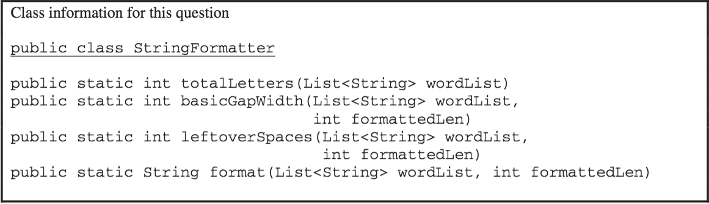

.. qnum::
   :prefix:  10-16-
   :start: 1

Free Response - 2016 Question 4B
-----------------------------------

..	index::
	single: trio
    single: free response
    
The following is a free response question from 2016. It was question 4 part B on the exam. You can see all the free response questions from past exams at https://apstudent.collegeboard.org/apcourse/ap-computer-science-a/exam-practice. 

**PART B**

b) Write the ``StringFormatter`` method ``basicGapWidth``, which returns the basic gap width as defined earlier.

Assume that ``totalLetters`` works as specified regardless of what you wrote in part (a). 
You must use ``totalLetters`` appropriately to receive full credit.
  
Complete method ``basicGapWidth`` below.

.. code-block:: java 

   /** Returns the basic gap width when wordList is used to produce  
   *  a formatted string of formattedLen characters. 
   *  Precondition: wordList contains at least two words, consisting of letters only. 
   *            formattedLen is large enough for all the words and gaps. 
   */ 
   public static int basicGapWidth(List<String> wordList,                                  
   int formattedLen)

**SOLVING PART B**

We begin with this code:

.. code-block:: java

   public static int basicGapWidth(List<String> wordList,                                  
   int formattedLen)
   
In order to do calculate ``basicGapWidth``, we will do some simple division. 

We want to subtract the number of characters used in words from the total number of characters. The numerator of our fraction will be: 

.. code-block:: java

   (formattedLen - wordList(wordList)
   
To return the gap width, the numerator will be divided by the number of gaps. The number of gaps is the number of words minus one. 
This makes the denominator of our fraction:

.. code-block:: java

   (wordList.size()-1)

Then we want to return the product of this division.   

.. code-block:: java
   
   {return(formattedLen - wordList(wordList))/(wordList.size()-1)

.. parsonsprob:: 2016Q4B

   The following has the correct code to 'swap' the values but the code is mixed up and contains one or more extra statements.  Drag the needed blocks from the left into the correct order on the right. Check your solution by clicking on the <i>Check Me</i> button.  You will be told if any of the blocks are in the wrong order or if you need to remove one or more blocks.
   -----
   public static int basicGapWidth(List<String> wordList,                                  
   int formattedLen)
   =====
   return(formattedLen - wordList(wordList))
   =====
   /(wordList.size()-1)
   =====
   return(formattedLen + wordList(wordList)) #distractor
   =====
   /(wordList.size()) #distractor
   
   
   	