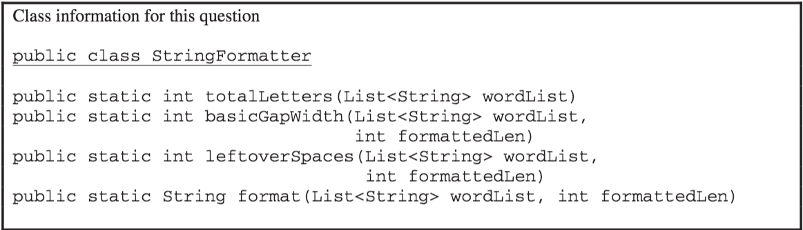

.. qnum::
   :prefix:  10-16-
   :start: 1

Free Response - 2016 Question 4C
-----------------------------------

..	index::
	single: trio
    single: free response
    
The following is a free response question from 2016. It was question 4 part C on the exam. You can see all the free response questions from past exams at https://apstudent.collegeboard.org/apcourse/ap-computer-science-a/exam-practice. 

**PART C**

(c) Write the ``StringFormatter`` method ``format``, which returns the formatted string as defined earlier. 
The ``StringFormatter`` class also contains a method called ``leftoverSpaces``, which has already been implemented. 
This method returns the number of leftover spaces as defined earlier and is shown below. 

.. code-block:: java 

   /** Returns the number of leftover spaces when wordList is used to produce  
   *  a formatted string of formattedLen characters. 
   *  Precondition: wordList contains at least two words, consisting of letters only. 
   *            formattedLen is large enough for all the words and gaps. 
   */ 
   public static int leftoverSpaces(List<String> wordList, int formattedLen) {  
   /* implementation not shown */  }
   

    
Figure 1: Class information to help write ``StringFormatter``.

Assume that ``basicGapWidth`` works as specified, regardless of what you wrote in part (b). 
You must use ``basicGapWidth`` and ``leftoverSpaces`` appropriately to receive full credit. 

Complete method ``format`` below. 

.. code-block:: java

   /** Returns a formatted string consisting of the words in wordList separated by spaces. 
   *  Precondition:The wordList contains at least two words, consisting of letters only. 
   *             formattedLen is large enough for all the words and gaps. 
   *  Postcondition: All words in wordList appear in the formatted string. 
   *   - The words appear in the same order as in wordList.  
   *   - The number of spaces between words is determined by basicGapWidth and the  
   *     distribution of leftoverSpaces from left to right, as described in the question. 
   */ 
   public static String format(List<String> wordList, int formattedLen)
   
**SOLVING PART C**

We begin with this code so we need to return a ``String``.

.. code-block:: java

   public static String format(List<String> wordList, int formattedLen)

We will start by creating a ``String`` called ``output``, that we will make an empty string.

.. code-block:: java
   
   String output = " ";
 
To figure out how long the basic gap will be we make an ``int`` called ``basic``. ``basic`` is given by ``basicGapLength``, ``wordList``, and ``formattedLen``.
  
.. code-block:: java

   int basic = basicGapLength(wordList, formattedLen);

Next we want to build a gap. We will create a ``gap`` variable and make it an empty string as well. 
   
.. code-block:: java
   
   string gap= " ";
   
We are going to use a for loop to go through ``basic`` and build ``gap``. The variable ``gap`` will keep track of space between words. 
   
.. code-block:: java
   
   for(int i = 0, i < basic; i++)
   { 
   gap = gap + " ";
   }

Next we are going to create a variable left that is given by ``leftoverSpaces``, ``wordList``, and ``formattedLen``.

.. code-block:: java   
   
   int left = leftoverSpaces(wordList, formattedLen);
   
To track the amount of words we will make the variable ``wcount``. We set it equal to zero because we start counting from zero.   
      
.. code-block:: java
   
   int wcount = 0;
 
Next we use a while loop to start building variable output.

There are three cases that can be encountered running ``basicGapWidth``.
One case is when running ``basicGapWidth`` you get a fraction.
If this happens, leftover spaces are inserted one at a time between the words from left to right until there are no more leftover spaces.
So while the word count is less than the number of spaces we have, 
we want to add the ``wcount`` to output with gap and a space. Then we increment ``wcount`` by one.

.. code-block:: java

   while(wcount < left)
   {
   output = output + wordList.get(wcount) + gap + " ";
   wcount ++;
   }

The second case you could encounter is getting a whole number through ``basicGapWidth``.
If ``basicGapWidth`` returns a whole number, the spaces are distributed evenly so you don't need to add any extra blank spaces (AKA the " ").
We want ``wcount`` to be ``wordList`` minus one because there is one less gap than there are words.
   
.. code-block:: java   
   
   while(wcount < wordList.size()-1)
   {
   output= output + wordList.get(wcount) + gap;
   wcount++;
   }

The third situation we could have is running the last word in ``wordList``, it does not need a gap OR " " next to it 
because the sequence ends at 20 characters regardless. 

.. code-block:: java   
   
   output = output + wordList.get(wordList.size()-1);
   return output;

   
Try it yourself!
   
.. activecode:: lcfrsda5
   :language: java 
   
   public static String format(List<String> wordList, int formattedLen) 
   

.. parsonsprob:: 2016Q4C

   The following has the correct code to 'swap' the values but the code is mixed up and contains one or more extra statements.  Drag the needed blocks from the left into the correct order on the right. Check your solution by clicking on the <i>Check Me</i> button.  You will be told if any of the blocks are in the wrong order or if you need to remove one or more blocks.
   -----
   {
   String output = " ";
   =====
   int basic = basicGapLength(wordList, formattedLen);
   =====
   string gap= " ";
   =====
   for(int i = 0, i < basic; i++)
   { 
   gap = gap + " "; 
   }
   =====
   int left = leftoverSpaces(wordList, formattedLen);
   int wcount = 0;
   =====
   while(wcount < left)
   {
   output = output + wordList.get(wcount) + gap + " ";
   wcount ++;
   }
   =====
   while(wcount < wordList.size()-1)
   { output= output + wordList.get(wcount) + gap;
   wcount++;
   }
   =====
   output = output +wordList.get(wordList.size()-1);
   =====
   for(wcount < left)
   {
   output = output + wordList.get(wcount) + gap + " ";
   wcount ++;
   } #distractor
   =====
   for(int i = 0, i < basic; i++)
   { 
   gap = gap + 1; 
   } #distractor
   =====
   return output;
   
   
   
   
   
   
   
   

   
   
   
   
   
   