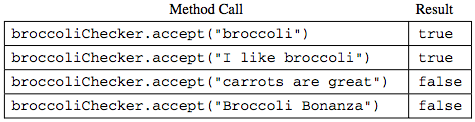
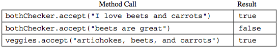

.. qnum::
   :prefix:  8-21-
   :start: 1

Free Response - Checker
=======================

..	index::
	single: checker
    single: free response

The following is a free response question from 2008.  It was question 4 on the exam.  You can see all the free response questions from past exams at https://apstudent.collegeboard.org/apcourse/ap-computer-science-a/exam-practice.

**Question 4.**  A *checker* is an object that examines strings and *accepts* those strings that meet a particular criterion.

.. code-block:: java

   public interface Checker
   {
    /** @param text a string to consider for acceptance
     *  @return true if this Checker accepts text; false otherwise
     */
    boolean accept(String text);
   }

In this question, you will write two classes that implement the *Checker* interface. You will then create a *Checker* object that checks for a particular acceptance criterion.

Solve Part A
------------

(a) A *SubstringChecker* accepts any string that contains a particular substring. For example, the
    following *SubstringChecker* object *broccoliChecker* accepts all strings containing the
    substring "broccoli".

.. code-block:: java

   Checker broccoliChecker = new SubstringChecker("broccoli");

The following table illustrates the results of several calls to the *broccoliChecker* *accept* method.

.. activecode:: FRQCheckerA
   :language: java

   // Declare the class
   {
    // Declare constructor
    ()
    {}

    // Override accept method
    ()
    {}

   }

Solve Part B
------------

(b) Checkers can be created to check for multiple acceptance criteria by combining other checker objects. For
    example, an *AndChecker* is a *Checker* that is constructed with two objects of classes that implement
    the *Checker* interface (such as *SubstringChecker* or *AndChecker* objects). The
    *AndChecker* *accept* method returns *true* if and only if the string is accepted by both of the
    *Checker* objects with which it was constructed.

In the code segment below, the *bothChecker* object accepts all strings containing both "beets" and
"carrots". The code segment also shows how the *veggies* object can be constructed to accept all
strings containing the three substrings "beets", "carrots", and "artichokes".

.. code-block:: java

   Checker bChecker = new SubstringChecker("beets");
   Checker cChecker = new SubstringChecker("carrots");
   Checker bothChecker = new AndChecker(bChecker, cChecker);

   Checker aChecker = new SubstringChecker("artichokes");
   Checker veggies = new AndChecker(bothChecker, aChecker);

The following table illustrates the results of several calls to the *bothChecker* *accept* method and the
*veggies* *accept* method.

Write the *AndChecker* class that implements the *Checker* interface. The constructor should take two
*Checker* parameters.

.. activecode:: FRQCheckerB
   :language: java

   // Declare class
   {
    // Declare constructor
    ()
    {}

    // Override accept method
    ()
    {}
   }

Solve Part C
------------

(c) Another implementation of the *Checker* interface is the *NotChecker*, which contains the following:

- A one-parameter constructor that takes one *Checker* object

- An *accept* method that returns *true* if and only if *Checker* object does NOT accept the string

Using any of the classes *SubstringChecker*, *AndChecker*, and *NotChecker*, construct a
*Checker* that accepts a string if and only if it contains neither the substring "artichokes" nor the
substring "kale". Assign the constructed *Checker* to *yummyChecker*. Consider the following
incomplete code segment.

.. code-block:: java

   Checker aChecker = new SubstringChecker("artichokes");
   Checker kChecker = new SubstringChecker("kale");
   Checker yummyChecker;
   /* code to construct and assign to yummyChecker */

The following table illustrates the results of several calls to the *yummyChecker* *accept* method.

.. figure:: Figures/checkerTable3.png
    :width: 509px
    :align: center
    :figclass: align-center

In writing your solution, you may use any of the classes specified for this problem. Assume that these
classes work as specified, regardless of what you wrote in parts (a) and (b). You may assume that the
declarations for *aChecker*, *kChecker*, and *yummyChecker* in the code segment above have
already been executed.

Write your /* code to construct and assign to yummyChecker */ below.

.. activecode:: FRQCheckerC
   :language: java

   Checker aChecker = new SubstringChecker("artichokes");
   Checker kChecker = new SubstringChecker("kale");
   Checker yummyChecker;
   /* code to construct and assign to yummyChecker */
