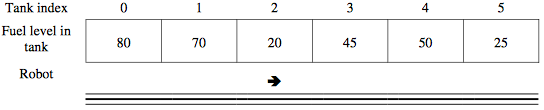

.. qnum::
   :prefix:  8-16-
   :start: 1

Free Response - Fuel Depot
==========================

..	index::
	single: fueldepot
    single: free response

The following is a free response question from 2011.  It was question 3 on the exam.  You can see all the free response questions from past exams at https://apstudent.collegeboard.org/apcourse/ap-computer-science-a/exam-practice.

**Question 3.**  A fuel depot has a number of fuel tanks arranged in a line and a robot that moves a filling mechanism back and forth along the line so that the tanks can be filled. A fuel tank is specified by the FuelTank interface below.
.. code-block:: java

   public interface FuelTank
   {
    /** @return an integer value that ranges from 0(empty) to 100(full) */
    int getFuelLevel();
   }

A fuel depot keeps track of the fuel tanks and the robot. The following figure represents the tanks and the robot in a fuel depot. The robot, indicated by the arrow, is currently at index 2 and is facing to the right.

The state of the robot includes the index of its location and the direction in which it is facing (to the right or to the left). This information is specified in the FuelRobot interface as shown in the following declaration.

.. code-block:: java

   public interface FuelRobot
   {
    /** @return the index of the current location of the robot */
    int getCurrentIndex();

    /** Determine whether the robot is currently facing to the right
    * @return true  if the robot is facing to the right (toward tanks with larger indexes)
    *         false if the robot is facing to the left (toward tanks with smaller indexes)
    */
    boolean isFacingRight();

    /** Changes the current direction of the robot */
    void changeDirection();

    /** Moves the robot in its current direction by the number of locations specified.
    * @param numLocs the number of locations to move. A value of 1 moves the robot to
    *                the next location in the current direction.
    *        Precondition: numLocs > 0
    */
    void moveForward(int numLocs);
   }

A fuel depot is represented by the FuelDepot class as shown in the following class declaration.

.. code-block:: java

   public class FuelDepot
   {
     /** The robot used to move the filling mechanism */
     private FuelRobot filler;

     /** The list of fuel tanks */
     private List<FuelTank> tanks;

     /** Determines and returns the index of the next tank to be filled.
     *   @param  threshold fuel tanks with a fuel level <= threshold may be filled
     *   @return index of the location of the next tank to be filled
     *   Postcondition: the state of the robot has not changed
     */
     public int nextTankToFill(int threshold)
     { /* to be implemented in part (a) */ }

     /** Moves the robot to location locIndex.
     *   @param locIndex the index of the location of the tank to move to
     *          Precondition: 0 <= locIndex < tanks.size()
     *   Postcondition: the current location of the robot is locIndex
     */
     public void moveToLocation(int locIndex)
     { /* to be implemented in part (b) */ }

     // There may be instance variables, constructors, and methods that are not shown
   }

Solve Part A
------------

(a) Write the `FuelDepot` method `nextTankToFill` that returns the index of the next tank to be filled.

The index for the next tank to be filled is determined according to the following rules:

   -  Return the index of a tank with the lowest fuel level that is less than or equal to a given threshold.
      If there is more than one fuel tank with the same lowest fuel level, any of their indexes can be returned.

   -  If there are no tanks with a fuel level less than or equal to the threshold, return the robot's current index.

For example, suppose the tanks contain the fuel levels shown in the following figure.

.. figure:: Figures/fuelDepotTable2.png
   :width: 562px
   :align: center
   :figclass: align-center

The following table shows the results of several independent calls to `nextTankToFill`.

.. figure:: Figures/fuelDepotTable2.png
   :width: 562px
   :align: center
   :figclass: align-center

.. figure:: Figures/fuelDepotTable3.png
   :width:  562px
   :align:  center
   :figclass: align-center

Complete method `nextTankToFill` below.

.. activecode:: FRQFuelDepotA
   :language: java

   /** Determines and returns the index of the next tank to be filled.
   *   @param  threshold the fuel tanks with a fuel level of <= threshold may be filled
   *   @return index of the location of the next tank to be filled
   *   Postcondition: the state of the robot has not changed
   */
   public int nextTankToFill(int threshold)

Solve Part B
------------

(b) Write the `FuelDepot` method `moveToLocation` that will move the robot to the given tank location. Because the robot can only move forward, it may be necessary to change the direction of the robot before having it move. Do **not** move the robot past the end of the line of fuel tanks.

Complete the method `moveToLocation` below.

.. activecode:: FRQFuelDepotB
   :language: java

   /** Moves the robot to location locIndex.
   *   @param locIndex the index of the location of the tank to move to
   *          Precondition: 0 <= locIndex < tanks.size()
   *   Postcondition: the current location of the robot is locIndex
   */
   public void moveToLocation(int locIndex)
