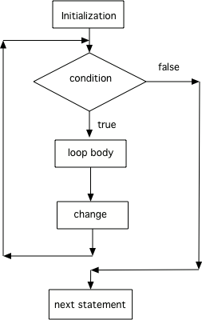
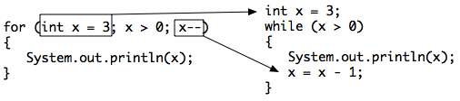

.. qnum::
   :prefix: 6-3-
   :start: 1

For Loops
-----------

..	index::
	single: for loop
	pair: loop; for

A **for** loop is usually used when you know how many times you want the loop to execute. A for loop has 3 parts: initialization, condition, and change.  The parts are separated by semicolons (``;``).  

.. note::

   Each of the three parts of a ``for`` loop declaration is optional (initialization, condition, and change), but the semicolons are not optional.  

.. code-block:: java

  for (initialization; condition; change)
  
One of the strange things about a ``for`` loop is that the code doesn't actually execute where you see it in the declaration.  The code in the initialization area is executed only one time before the loop begins, the condition is checked each time through the loop and the loop continues as long as the condition is true, at the end of each execution of the body of the loop the changes are done.  When the loop condition is false execution will continue at the next statement after the body of the loop.

    Figure 1: Flow in a for loop
    
    
You can compare a ``while`` loop to a ``for`` loop to understand that a ``for`` loop actually executes like a ``while`` loop does if you use the ``while`` loop to repeat the body of the loop a specific number of times. 

    Figure 1: Showing how a for loop maps to a while loop
    
.. shortanswer:: songTestPred

   What do you think will happen when you run the code below?  How would it change if you changed line 11 to <code>i = 3</code>?

.. activecode:: lcfc1
   :language: java
   
   public class SongTest
   {

      public static void printPopSong()
      {
         String line1 = " bottles of pop on the wall";
         String line2 = " bottles of pop";  
         String line3 = "Take one down and pass it around";  
  
         // loop 5 times (5, 4, 3, 2, 1)
         for (int i = 5; i > 0; i--)
         {
            System.out.println(i + line1);
            System.out.println(i + line2); 
            System.out.println(line3); 
            System.out.println((i - 1) + line1);
            System.out.println();
         }
      }
      
      public static void main(String[] args)
      {
         SongTest.printPopSong();
      }
   }
  
The method **printPopSong** prints the words to a song.  It initializes the value of the variable i equal to 5 and then checks if i is greater than 0.  Since 5 is greater than 0, the body of the loop executes.  Before the condition is checked again, i is decreased by 1.  When the value in i is equal to 0 the loop stops executing.  

.. note::
   
   The number of times a loop executes can be calculated by (largestValue - smallestValue + 1).  By the largest value I mean the largest value that allows the loop to execute and by the smallest value I mean the smallest value that allows the loop to execute.  So in the code above the largest value is 5 and the smallest value that allows the loop to execute is 1 so this loop executes (5 - 1 + 1 = 5 times).  
   
.. activecode:: lcfc2
   :language: java
   
   public class SongTest2
   {

      public static void printPopSong()
      {
         String line1 = " bottles of pop on the wall";
         String line2 = " bottles of pop";  
         String line3 = "Take one down and pass it around";  
  
         for (int i = 0; i < 3; i++)
         {
            System.out.println(i + line1);
            System.out.println(i + line2); 
            System.out.println(line3); 
            System.out.println((i - 1) + line1);
            System.out.println();
         }
      }
      
      public static void main(String[] args)
      {
         SongTest.printPopSong();
      }
   }
   
How many times does the code above print the lines to the song?
   
.. note::
   
   You can also calculate the number of times a loop executes as the value that ends the loop minus the starting value.  In this case the loop ends when i is 3 so (3 - 0 = 3).  

**Check your understanding**

.. mchoice:: qlb_3_1
   :answer_a: 3 4 5 6 7 8
   :answer_b: 0 1 2 3 4 5 6 7 8 
   :answer_c: 8 8 8 8 8 
   :answer_d: 3 4 5 6 7 
   :correct: d
   :feedback_a: This loop starts with i equal to 3 but ends when i is equal to 8.  
   :feedback_b: What is i set to in the initialization area?
   :feedback_c: This would be true if the for loop was missing the change part <code>(int i = 3; i < 8; )</code> but it does increment i in the change part <code>(int i = 3; i < 8; i++)</code>.
   :feedback_d: The value of i is set to 3 before the loop executes and the loop stops when i is equal to 8.  So the last time through the loop i is equal to 7.  

   What does the following code print?
   
   .. code-block:: java 

     for (int i = 3; i < 8; i++) 
     {  
        System.out.print(i + " ");
     }
     
.. mchoice:: qlb_3_2
   :answer_a: 3 4 5 6 7 8
   :answer_b: 0 1 2 3 4 5 6 7 8 9 
   :answer_c: 1 2 3 4 5 6 7 8 9 10
   :answer_d: 1 3 5 7 9
   :correct: c
   :feedback_a: What is i set to in the initialization area? 
   :feedback_b: What is i set to in the initialization area? 
   :feedback_c: The value of i starts at 1 and this loop will execute until i equals 11.  The last time through the loop the value of i is 10.  
   :feedback_d: This loop changes i by 1 each time in the change area.  

   What does the following code print?
   
   .. code-block:: java 

     for (int i = 1; i <= 10; i++) 
     {  
        System.out.print(i + " ");
     }
     
.. mchoice:: qlb_3_3
   :answer_a: 10
   :answer_b: 6
   :answer_c: 7
   :answer_d: 9
   :correct: c
   :feedback_a: This would be true if i started at 0 and ended at 9.  Does it?
   :feedback_b: Since i starts at 3 and the last time through the loop it is 9 the loop executes 7 times (9 - 3 + 1 = 7)
   :feedback_c: How many numbers are between 3 and 9 (including 3 and 9)?   
   :feedback_d: This would be true if i started at 0 and the value of i the last time through the loop it was 8.   

   How many times does the following method print a ``*``?  
   
   .. code-block:: java 

     for (int i = 3; i <= 9; i++) 
     {  
        System.out.print("*"); 
     }
     
**Mixed up programs**

.. parsonsprob:: print_evens
   :adaptive:

   The following method has the correct code to print out all the even values from 0 to the value of 10, but the code is mixed up.  Drag the blocks from the left into the correct order on the right and indent them correctly.  Even though Java doesn't require indention it is a good habit to get into. You will be told if any of the blocks are in the wrong order or not indented correctly when you click the "Check Me" button.
   -----
   public static void printEvens()
   {
   =====
      for (int i = 0; 
           i <= 10; 
           i+=2) 
      {
   =====
         System.out.println(i);
   =====
      } // end for
   =====
   } // end method