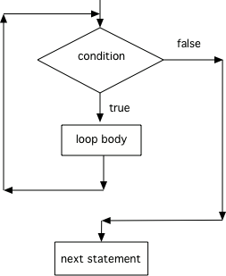

.. qnum::
   :prefix: 6-2-
   :start: 1
        
While Loops
============

..	index::
	single: while
	pair: loop; while
	
A ``while`` loop executes the body of the loop as long as (or while) a Boolean condition is true.  When the condition is false execution continues after the body of the ``while`` loop.  

.. note:: 

   If the condition is false the first time you check it, the body of the loop will not execute.  

    Figure 1: Flow in a while loop
    
You can use a ``while`` loop to repeat the body of the loop a certain number of times as shown above.  However, a ``while`` loop is typically used when you don't know how many times the loop will execute.  You might use it while processing a string.  Google has been scanning old books and then using software to read the scanned text.  But, the software can get things mixed up like using 1 for l.  The following code loops through a string replacing all 1's with l's.  

.. activecode:: lclw1
   :language: java
   
   public class Test
   {
      public static void main(String[] args)
      {
        String message = "Have a 1ong and happy 1ife"; 
        int index = 0;
        
        // while more 1's in the message
        while (message.indexOf("1") >= 0)
        {
          index = message.indexOf("1");
          message = message.substring(0,index) + "l" + message.substring(index+1);
        }
        
        System.out.println(message);
      }
   }
  
The while loop starts on line 9 in the code above.  Statements 10 through 13 are the body of the loop (from the opening parenthesis on line 10 to the closing one on line 13).  

.. note:: 

   Java doesn't require your code to be correctly indented (code moved to the right a few spaces) to make it clear what statements are part of the body of the loop, but it is good practice.  On the free response part of the exam, the reader will use the indention when determining the meaning of your code, even if you forget the open or close curly brace.  

..	index::
	single: infinite loop
	pair: loop; infinite

One thing to be careful about with while loops is making sure that you don't end up with an **infinite loop**.  An infinite loop is one that never stops (the condition is always true). 

.. code-block:: java 
  
   // an infinite loop
   while (true)
   {
      System.out.println("This is a loop that never ends");
   }
   
The infinite loop above is pretty obvious.  But, most infinite loops are accidental.  They usually occur because you forget to change the thing you are checking in the condition.  

Tracing Variables in Loops
----------------------------

A really important skill to develop is the ability to trace the values of variables and how they change during each time through a loop.  

Here is a complex loop.  See if you can trace the code on paper to predict what it will do when you run it.

.. activecode:: example_trace_loop
   :language: java
   
   public class Test
   {
       public static void main(String[] args)
       {
           int var1 = 3;
           int var2 = 2;
    
           while ((var2 != 0) && ((var1 / var2) >= 0))
           {
               var1 = var1 + 1;
               var2 = var2 - 1;
           }
       }
   }

Click on the following link to step through the code above with the Java Visualizer - `Click here <https://goo.gl/qEHnpg>`_.

You can create a table that keeps track of the variable values each time through the loop as shown below.  This is very helpful on the exam. Studies have shown that students who create tables like this do much better on code tracing problems on multiple choice exams.

    Figure 1: A table showing the values of all of the variables each time through the loop.  The 0 means before the first loop.
    
You can also add ``System.out.println(variable)`` to print the value of a variable.  In the code below I am printing the values of all of the variables before the loop and at the end of the loop body.

.. activecode:: while_ex2vars
   :language: java
   
   public class Test
   {
      public static void main(String[] args)
      {
      
         int var1 = 3;
         int var2 = 2;
   
         System.out.println("var1: " + var1 + " var2: " + var2);
         
         while ((var2 != 0) && ((var1 / var2) >= 0))
         {
            var1 = var1 + 1;
            var2 = var2 - 1;
            System.out.println("var1: " + var1 + " var2: " + var2);
         }
      }
   }
  

**Check your understanding**

.. mchoice:: qlb_2_1
   :answer_a: 5 4 3 2 1
   :answer_b: -5 -4 -3 -2 -1
   :answer_c: -4 -3 -2 -1 0
   :correct: c
   :feedback_a: x is initialized (set) to -5 to start. 
   :feedback_b: x is incremented (x++) before the print statement executes.
   :feedback_c: x is set to -5 to start but then incremented by 1 so it first prints -4.

   What does the following code print?
   
   .. code-block:: java 

     int x = -5;
     while (x < 0) 
     { 
        x++; 
        System.out.print(x + " ");
     }
   
.. mchoice:: qlb_2_2
   :answer_a: var1 = 1, var2 = 1
   :answer_b: var1 = 2, var2 = 0
   :answer_c: var1 = 3, var2 = -1
   :answer_d: var1 = 0, var2 = 2
   :answer_e: The loop will cause a run-time error with a division by zero
   :correct: b
   :feedback_a: The loop stops one of two ways, when var2 = 0 or when var1 / var2 = 0 - neither is true in this case
   :feedback_b: The loop stopped because var2 = 0.  After the first execution of the loop var1 = 1 and var2 = 1.  After the second execution of the loop var1 = 2 and var2 = 0.  This stops the loop and doesn't execute the second part of the complex conditional.
   :feedback_c: The loop stops one of two ways, when var2 = 0 or when var1 / var2 = 0 - neither is true in this case
   :feedback_d: The loop stops one of two ways, when var2 = 0 or when var1 / var2 = 0 - neither is true in this case
   :feedback_e: Even though var1 = 2 and var2 = 0 when the conditional is executed the first condition is true so the rest of the complex conditional won't execute.  

   What are the values of var1 and var2 when the code finishes executing?
   
   .. code-block:: java 

     int var1 = 0;
     int var2 = 2;
   
     while ((var2 != 0) && ((var1 / var2) >= 0))
     {
        var1 = var1 + 1;
        var2 = var2 -1;
     }
     
.. mchoice:: qlb_2_3
   :answer_a: x = 5, y = 2
   :answer_b: x = 2, y = 5
   :answer_c: x = 5, y = 2
   :answer_d: x = 3, y = 4
   :answer_e: x = 4, y = 3
   :correct: e
   :feedback_a: This would be true if the and (&&) was an or (||) instead.  But in a complex conditional joined with and (&&) both conditions must be true for the condition to be true.
   :feedback_b: This would be true if the loop never executed, but both conditions are true so the loop will execute.
   :feedback_c: This would be true if the values were swapped, but they are not.
   :feedback_d: This would be true the loop only executed one time, but it will execute twice.
   :feedback_e: The first time the loop changes to x = 3, y = 4, the second time x = 4, y = 3 then the loop will stop since x is not less than y anymore.  

   What are the values of x and y when the code finishes executing?
   
   .. code-block:: java 

     int x = 2;
     int y = 5;
   
     while (y > 2 && x < y)
     {
        x = x + 1;
        y = y - 1;
     }
  
**Mixed up programs**

.. parsonsprob:: removeA
   :adaptive:
   :noindent:

   The following method has the correct code to return a string with all a's removed, but the code is mixed up.  Drag the blocks from the left area into the correct order in the right area.  Click on the "Check Me" button to check your solution.
   -----
   public static String remA(String s)
   {
   =====
      int index = 0;
   =====
      // while still an a in str
      while (s.indexOf("a") >= 0)
      {
         index = s.indexOf("a");
         s = s.substring(0,index) + 
             s.substring(index+1);
      } 
   =====
      return s;
   =====
   } // end method

