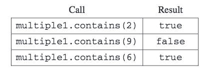

.. qnum::
   :prefix:  10-16-
   :start: 1

Free Response - 2015 Question 4
-----------------------------------

..	index::
	single: trio
    single: free response

The following is a free response question from 2015. It was question 4 on the exam. You can see all the free response questions from past exams at https://apstudent.collegeboard.org/apcourse/ap-computer-science-a/exam-practice.  

This question involves the design of an interface, writing a class that implements the interface, 
and writing a method that uses the interface.

**PART A**

(a) A ``number group`` represents a group of integers defined in some way. 
It could be empty, or it could contain one or more integers. 
Write an interface named ``NumberGroup`` that represents a group of integers. 

The interface should have  a single ``contains`` method that determines if a given integer is in the group. 
For example, if ``group1`` is of type ``NumberGroup``, and it contains only the two numbers ``-5`` and ``3``, 
then ``group1.contains(-5)`` would return true, and ``group1.contains(2)`` would return ``false``. 

Write the complete ``NumberGroup`` interface. It must have exactly one method.

**SOLVING PART A**

To write the interface ``NumberGroup``, we begin with this code. We define the interface by adding it here.

.. code-block:: java 
   
   public interface NumberGroup (
   
We want to make ``NumberGroup`` public, so it can be accessed, and boolean, because the numbers are either in the group or not in the group. 
``contains`` is the method used to tell if a specific integer is in the group, ``int x`` takes the integer in question.
   
.. code-block:: java
  
   public boolean contains(int x);

The final code should look like:

.. code-block:: java
   
   public interface NumberGroup (
   public boolean contains(int x);

**PART B**

b) A ``range`` represents a number group that contains all (and only) the integers between a minimum value and a maximum value, inclusive.  
Write the ``Range`` class, which is a ``NumberGroup``.
The ``Range`` class represents the group of ``int`` values that range from a given minimum value up through a given maximum value, inclusive. 
For example, the declaration  

.. code-block:: java 

   NumberGroup range1 = new Range(-3, 2); 

represents the group of integer values -3, -2,-1, 0, 1, 2. 

Write the complete ``Range`` class. Include all necessary instance variables and methods as well as a constructor that takes two ``int`` parameters. 
The first parameter represents the minimum value, and the second parameter represents the maximum value of the range. 
You may assume that the minimum is less than or equal to the maximum.

**SOLVING PART B**

To write the ``Range`` class, we begin with code that implements the class ``NumberGroup`` that we made in Part A.

.. code-block:: java 

   public class Range implements NumberGroup(
   
Then we want to implement a constructor to store the min and max values. This is private 
because we don't want the min and max to be accessed by anything other than ``Range``.
   
.. code-block:: java 

   private int min, max;

Next we will make a constructor for the private method created in the previous step. We will set min equal to ``m1`` and max equal to ``m2``.

.. code-block:: java 

   public Range(int m1, int m2)
   {
   min = m1;
   max = m2;
   }
 
Now we add the same code from ``NumberGroup`` because we want to implement the contains method. 
 
.. code-block:: java 

   public boolean contains(int x)
   {

We add this line because we want to return ``x`` if ``x`` is greater than the min AND less than the max. ``x`` will be returned only if it is in the range.. 

.. code-block:: java 
  
   return min <= x && x<= max; 
 
So the final code should look like:

.. code-block:: java 

   public class Range implements NumberGroup(
   private int min, max;
   public Range(int m1, int m2)
   {
      min = m1;
      max = m2;
   }
   public boolean contains(int x)
   {
     return min <= x && x<= max; 
   }
 

**PART C**

c) The ``MultipleGroups`` class (not shown) represents a collection of ``NumberGroup`` objects and is a ``NumberGroup``.
The ``MultipleGroups`` class stores the number groups in the instance variable ``groupList`` (shown below), 
which is initialized in the constructor. 

.. code-block:: java 

   private List<NumberGroup> groupList; 

Write the ``MultipleGroups`` method ``contains``.
The method takes an integer and returns ``true`` if and only if the integer is contained in one or more of the number groups in ``groupList``.
For example, suppose ``multiple1`` has been declared as an instance of ``MultipleGroups`` and 
consists of the three ranges created by the calls ``new Range(5, 8)``, ``new Range(10, 12)``, and ``new Range(1, 6)``.

The following table shows the results of several calls to ``contains``.

    
    Figure 1: Example showing the results of several calls to ``contains``.

**SOLVING PART C**

The starter code is boolean because there are only two outcomes, the integer either is or isn't in the number group.

.. code-block:: java 
    
   public boolean contains(int num)
   {
   
Now we add a for loop which will go through every element in ``groupList``.   
   
.. code-block:: java 

   for (NumberGroup g : groupList)
      
Inside of the for loop, we add an if statement. If an element in ``g`` group in ``groupList`` contains the number ``num``, 
then we want to return ``true``. This will return ``true`` if ``num`` is present anywhere in ``groupList``.
    
.. code-block:: java 

   if (g.contains(num))
   return true;
   
If ``num`` is not found in any element in ``groupList``, then we will return ``false``.
        
.. code-block:: java 
      
   return false;
   }  

So the final code should look like:

.. code-block:: java 
    
   public boolean contains(int num)
   {
    for (NumberGroup g : groupList)
      if (g.contains(num))
        return true;
        
   return false;
   }  
    
    
    
    
    
    
    
    
    
    
    
    
    