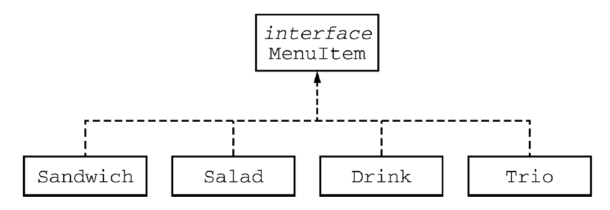
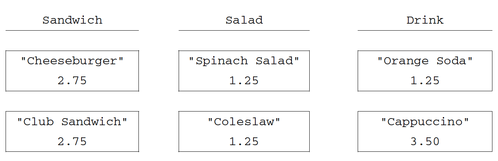
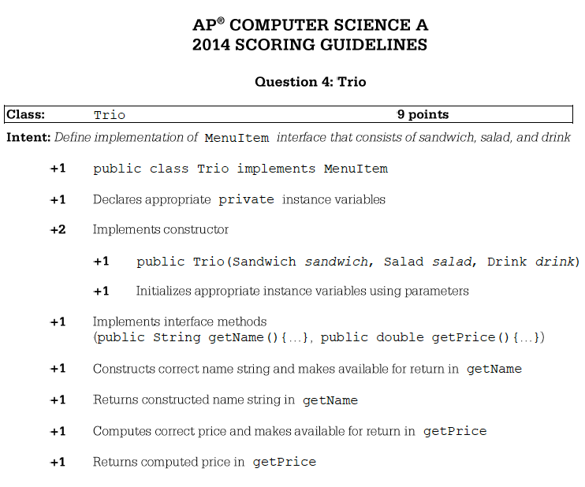

.. qnum::
   :prefix:  10-16-
   :start: 1

Free Response - Trio Scoring
-----------------------------------

..	index::
	single: trio
    single: free response
    
The following is a free response question from 2014.  It was question 4 on the exam.  You can see all the free response questions from past exams at https://apstudent.collegeboard.org/apcourse/ap-computer-science-a/exam-practice.  

**Question 4.**  The menu at a lunch counter includes a variety of sandwiches, salads, and drinks. The menu also allows a
customer to create a "trio," which consists of three menu items: a sandwich, a salad, and a drink. The price
of the trio is the sum of the two highest-priced menu items in the trio; one item with the lowest price is free.
Each menu item has a name and a price. The four types of menu items are represented by the four classes
``Sandwich``, ``Salad``, ``Drink``, and ``Trio``. All four classes implement the following ``MenuItem`` interface.

.. code-block:: java 

   public interface MenuItem
   {
     /** @return the name of the menu item */
     String getName();

     /** @return the price of the menu item */
     double getPrice();
   }
   
The following diagram shows the relationship between the ``MenuItem`` interface and the ``Sandwich``, ``Salad``, ``Drink``, and ``Trio`` classes.

    Figure 1: UML class diagram showing MenuItem is implemented by Sandwich, Salad, Drink, and Trio.
    
For example, assume that the menu includes the following items. The objects listed under each heading are instances of the class indicated by the heading.

    Figure 2: Example objects 

The menu allows customers to create Trio menu items, each of which includes a sandwich, a salad, and a
drink. The name of the Trio consists of the names of the sandwich, salad, and drink, in that order, each
separated by "/" and followed by a space and then "Trio". The price of the Trio is the sum of the two
highest-priced items in the Trio; one item with the lowest price is free.
A trio consisting of a cheeseburger, spinach salad, and an orange soda would have the name
``"Cheeseburger/Spinach Salad/Orange Soda Trio"``
and a price of $4.00 (the two highest prices
are $2.75 and $1.25). Similarly, a trio consisting of a club sandwich, coleslaw, and a cappuccino would have the
name ``"Club Sandwich/Coleslaw/Cappuccino Trio"`` 
and a price of $6.25 (the two highest prices
are $2.75 and $3.50).
    
Grading Rubric
===================

Below is the grading rubric for the Trio class problem.

    Figure 3: The grading rubric for the Trio class problem.
    
Practice Grading
===================

The following are some sample student responses.  Please try to apply the grading rubric to see if you can correctly score each of the answers.

.. figure:: Figures/TrioSol1.png
    :width: 600px
    :align: center
    :figclass: align-center

    Figure 4: The first sample student response to the Trio class problem.
    
.. mchoice:: qtrio_1
   :answer_a: Yes
   :answer_b: No
   :correct: a
   :feedback_a: This declares the class correctly as <code>public class Trio implements MenuItem</code>
   :feedback_b: What do you think is wrong with the declaration?

   Should the student earn the 1 point for the correct declaration of a public Trio class that implements the MenuItem interface?
   
.. mchoice:: qtrio_2
   :answer_a: Yes
   :answer_b: No
   :correct: a
   :feedback_a: All instance variables are declared private and are of the appropriate type.
   :feedback_b: What do you think is wrong with the declaration?

   Should the student earn the 1 point for declaring the private instance variables?
   
.. mchoice:: qtrio_3
   :answer_a: Yes
   :answer_b: No
   :correct: a
   :feedback_a: This solution declares the constructor as <code>public Trio(Sandwich s, Salad sal, Drink d)</code>
   :feedback_b: What do you think is wrong with the declaration?

   Should the student earn the 1 point for declaring the the constructor correctly?
   
.. mchoice:: qtrio_4
   :answer_a: Yes
   :answer_b: No
   :correct: a
   :feedback_a: This solution initializes the private instance variables correctly with the values from the parameters.
   :feedback_b: What do you think is wrong with the initialization?

   Should the student earn the 1 point for correctly initializing the appropriate instance variables in the constructor?
   
.. mchoice:: qtrio_5
   :answer_a: Yes
   :answer_b: No
   :correct: a
   :feedback_a: This solution contains correct declarations for <code>getName()</code> and <code>getPrice</code>.
   :feedback_b: To implement an interface the solution must have a getName and getPrice method as defined by the MenuItem interface.  

   Should the student earn the 1 point for correctly implementing the methods in the MenuItem interface (getName and getPrice)?
   
.. mchoice:: qtrio_6
   :answer_a: Yes
   :answer_b: No
   :correct: a
   :feedback_a: This solution contains correct declarations for <code>getName()</code> and <code>getPrice</code>.
   :feedback_b: To implement an interface the solution must have a getName and getPrice method as defined by the MenuItem interface.  

   Should the student earn the 1 point for correctly implementing the methods in the MenuItem interface (getName and getPrice)?
   
.. mchoice:: qtrio_7
   :answer_a: Yes
   :answer_b: No
   :correct: b
   :feedback_a: This solution doesn't include the "Trio" at the end of the name so it loses this point.
   :feedback_b: While the name is mostly correct, it is missing the word "Trio" at the end.  

   Should the student earn the 1 point for correctly constructing the string to return from getName?
   
.. mchoice:: qtrio_8
   :answer_a: Yes
   :answer_b: No
   :correct: a
   :feedback_a: This solution does return the constructed string.
   :feedback_b: Even though the string is not correct it was constructed and returned.  

   Should the student earn the 1 point for returning a constructed string from getName?
   
.. mchoice:: qtrio_9
   :answer_a: Yes
   :answer_b: No
   :correct: a
   :feedback_a: This solution does compute the price correctly and returns it.
   :feedback_b: There are only 3 possibilities for which is the cheapest item and this correctly deals with the 3 cases and returns the price. 

   Should the student earn the 1 point for correctly calculating and returning the price?
        

