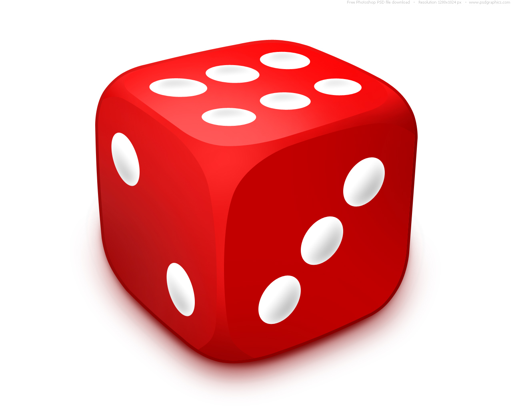

.. qnum::
   :prefix: OO-Intro-
   :start: 1

Objects and Classes
=====================================

..	index::
    single: objects
    single: classes
  
   
In object-oriented programming the programmer writes a class which defines what all objects of the class know and can do.  You can think of the class as like a cookie cutter or factory that produces objects.  All objects created by the same class have the same **fields** and **methods**.   A **field** is something the object knows about itself and a **method** is a thing the object can do.  

A class also has **constructors** which initialize the fields when the object is created.  A class can also have a **main method** which can be used to test the class.  

Person Class
-------------

What should we want to know about a person?  What we want to know depends on what problem we are trying to solve.  In one situation we might want to know the person's name and phone number and email.  We need ways to get and set the data (fields) so we create **getters** and **setters**.  

.. activecode:: PersonObjExample
  :language: java

  public class Person 
  {
     // fields 
     private String name;
     private String email;
     private String phoneNumber;
     
     // constructor
     public Person(String theName)
     {
        this.name = theName;
     }
     
     // methods - getters 
     public String getName() { return this.name;}
     public String getEmail() { return this.email;}
     public String getPhoneNumber() { return this.phoneNumber;}
     
     // methods - setters
     public void setName(String theName) { this.name = theName;}
     public void setEmail(String theEmail) {this.email = theEmail;}
     public void setPhoneNumber(String thePhoneNumber) { this.phoneNumber = thePhoneNumber;}
     public String toString()
     {
        return this.name + " " + this.email + " " + this.phoneNumber;
     }
     
     // main method for testing
     public static void main(String[] args)
     {
        Person p1 = new Person("Sana");
        System.out.println(p1);
        Person p2 = new Person("Jean");
        p2.setEmail("jean@gmail.com");
        p2.setPhoneNumber("404 899-9955");
        System.out.println(p2);
     }
  }
  
Modify the code above to add more constructors.  Also modify the main method to test the new constructors.  

Die Class
------------

What if you wanted to represent a die which has 6 sides and you can roll it?  You might also want to keep track of the last value rolled. Does the following class have everything it needs?

    Figure 1: One six sided die from a pair of dice

.. activecode:: DieExample
  :language: java

  public class Die 
  {
     private int lastValue;
     
     public int roll()
     {
        lastValue = (int) (Math.random() * 6) + 1;
        return lastValue;
     }
     
     public static void main(String[] args)
     {
        Die d = new Die();
        for (int i = 0; i < 10; i++)
        {
           System.out.println(d.roll());
        }
     }
   }
   
Can you modify the ``Die`` class to keep a record of all the values this dice has rolled?  How would you do that?
   

