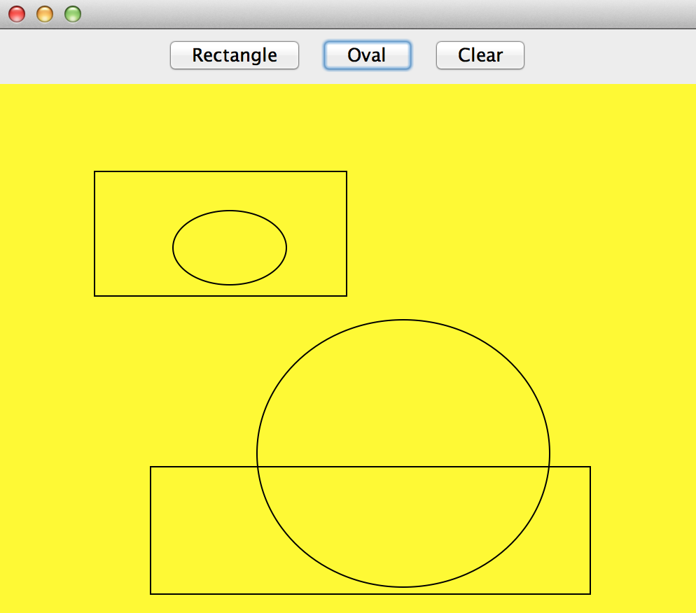

.. qnum::
   :prefix: 10-7-
   :start: 1
   
Abstract Classes
=================

..	index::
    pair: class; abstract

If you were creating software that allowed the user to draw rectangles and ovals by clicking the mouse at a location and then dragging and releasing to define the width, what classes would you need?

    Figure 1: Software that lets the user click and drag to create ovals and rectangles.
    
One way to identify the classes you need is to underline the nouns in the description. This would give you ``Rectangle`` and ``Oval`` as two possible classes.  Both of these are kinds of simple shapes that can be defined by two points. So you could create a ``SimpleShape`` class that keeps track of two points and perhaps the color to draw the shape in.  
  
Could you actually create a ``SimpleShape`` object?  What would it look like?  How would you draw it?  Since we don't know what a SimpleShape looks like we can make the class **abstract** which means that you can not create any objects of that type.  

.. note ::
   
   To declare a class to be abstract use the ``abstract`` keyword before the ``class`` keyword as shown below.

.. code-block:: java 

  public abstract class SimpleShape
  

Abstract Classes Can't be Instantiated
----------------------------------------

You can't create a new object of an abstract class.  If you try you will get an error.  Run the example below to see the error.
   
.. activecode:: InitInherited
  :language: java

  public abstract class SimpleShape 
  { 
     public static void main(String[] args)
     {
        SimpleShape s = new SimpleShape();
     }
  }
  
Abstract Classes Exist to be Subclassed
-----------------------------------------

What is an abstract class good for if you can't create any objects from it?  You can use it as a parent class for subclasses.  

.. note::

   Abstract classes often have at least one abstract method (a method that has the keyword ``abstract`` in the declaration and no method body), but they don't have to. Abstract classes can have fields and methods with bodies.  
   
An abstract ``SimpleShape`` class could have fields to track the points and methods that calculate the width and height of the shape.  

Abstract classes are typically used when you want to put some data and/or behavior in a parent class, but at least one method needs to be abstract and overridden by the child class(es).  The ``SimpleShape`` class can have an abstract ``draw`` method and then the children classes can specify what ``draw`` does.

.. figure:: Figures/Shape.png
    :width: 400px
    :align: center
    :figclass: align-center

    Figure 3: An abstract SimpleShape class with an abstract draw method
    
You can download a zip file with all the code for the shapes example by clicking on the following `link <https://www.dropbox.com/s/2lmkd1m2sfh3xqc/ShapeExample.zip?dl=0>`_  Look at ``Shape`` class fields and methods.  Look at the Rectangle and Oval classes as well.  Can you create a new Line class?  Also add "Line" to ButtonPanel.java's array of shapeNames.