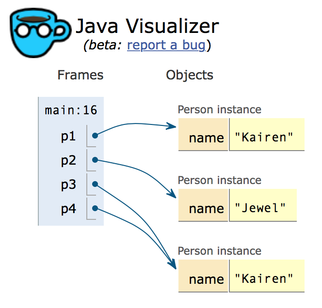
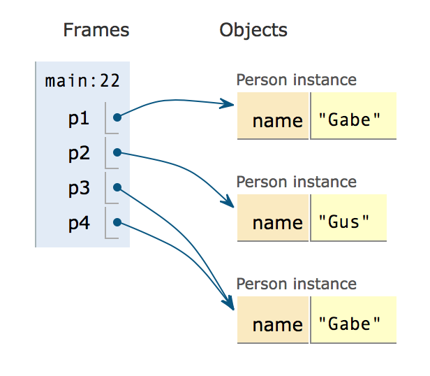

.. qnum::
   :prefix: 10-5-
   :start: 1

The Equals Method
====================

If a parent class isn't specified using the **extends** keyword, the class will inherit from the ``Object`` class.  What does a class inherit from the ``Object`` class?  One of the important things that gets inherited is the ``equals(Object obj)`` method.  This method is used to test if the current object and the passed object called ``obj`` are equal. But what does that mean?

..	index::
    single: override
    single: equals
    
The Inherited Equals Method from Object
-----------------------------------------
  
The ``equals`` method that is inherited from the ``Object`` class only returns true if the two objects references refer to the same object.  

.. activecode:: ObjEquals
   :language: java

   public class Person
   {
      private String name;
      
      public Person(String theName)
      {
         this.name = theName;
      }
      
      public static void main(String[] args)
      {
         Person p1 = new Person("Kairen");
         Person p2 = new Person("Jewel");
         Person p3 = new Person("Kairen");
         Person p4 = p3;
         System.out.println(p1.equals(p2));
         System.out.println(p2.equals(p3));
         System.out.println(p1.equals(p3));
         System.out.println(p3.equals(p4));
         
      }
   }
   
The ``equals`` method inherited from the ``Object`` class only returns true when the two references point to the same object as shown in the code above and figure 1 below.

    Figure 1: A picture from the Java Visualizer showing that only p3 and p4 refer to the same object.
    
String Overrides Equals
--------------------------
   
If you want to change how the inherited ``equals`` method works you can **override** it so that the new method is called instead of the inherited one.  The ``String`` class **overrides** the inherited equals method to return true when the two objects have the same characters in the same order as shown in the code below.  

.. activecode:: StringEquals
   :language: java

   public class StringTest
   {
      public static void main(String[] args)
      {
         String s1 = "hi";
         String s2 = "Hi";
         String s3 = new String("hi");
         System.out.println(s1.equals(s2));
         System.out.println(s2.equals(s3));
         System.out.println(s1.equals(s3));
      }
   }
   
Overriding the Inherited Equals Method
----------------------------------------

A class can override the inherited ``equals`` method by providing a method with the same method signature (method name and parameter list) and return type.  The provided method will be called instead of the inherited one, which is why we say that the new method **overrides** the inherited method.  The ``Person`` class below **overrides** the inherited ``equals`` method.

.. activecode:: OverrideEquals
   :language: java

   public class Person
   {
      private String name;
      
      public Person(String theName)
      {
         this.name = theName;
      }
      
      public boolean equals(Object other)
      {
         Person otherPerson = (Person) other;
         return this.name.equals(otherPerson.name);
      }
      
      public static void main(String[] args)
      {
         Person p1 = new Person("Gabe");
         Person p2 = new Person("Gus");
         Person p3 = new Person("Gabe");
         Person p4 = p3;
         System.out.println(p1.equals(p2));
         System.out.println(p2.equals(p3));
         System.out.println(p1.equals(p3));
         System.out.println(p3.equals(p4));
         
      }
   }
   

    Figure 2: A picture from the Java Visualizer showing the object references and objects.
   
You can step through this code in the Java Visualizer by clicking on the following link: `OverrideEquals Ex <http://cscircles.cemc.uwaterloo.ca/java_visualize/#code=public+class+Person%0A%7B%0A++++++private+String+name%3B%0A++++++%0A++++++public+Person(String+theName)%0A++++++%7B%0A+++++++++this.name+%3D+theName%3B%0A++++++%7D%0A++++++%0A++++++public+boolean+equals(Object+other)%0A++++++%7B%0A+++++++++Person+otherPerson+%3D+(Person)+other%3B%0A+++++++++return+this.name.equals(otherPerson.name)%3B%0A++++++%7D%0A++++++%0A++++++public+static+void+main(String%5B%5D+args)%0A++++++%7B%0A+++++++++Person+p1+%3D+new+Person(%22Gabe%22)%3B%0A+++++++++Person+p2+%3D+new+Person(%22Gus%22)%3B%0A+++++++++Person+p3+%3D+new+Person(%22Gabe%22)%3B%0A+++++++++Person+p4+%3D+p3%3B%0A+++++++++System.out.println(p1.equals(p2))%3B%0A+++++++++System.out.println(p2.equals(p3))%3B%0A+++++++++System.out.println(p1.equals(p3))%3B%0A+++++++++System.out.println(p3.equals(p4))%3B%0A+++++++++%0A++++++%7D%0A%7D&mode=display&curInstr=23>`_.

   
     
