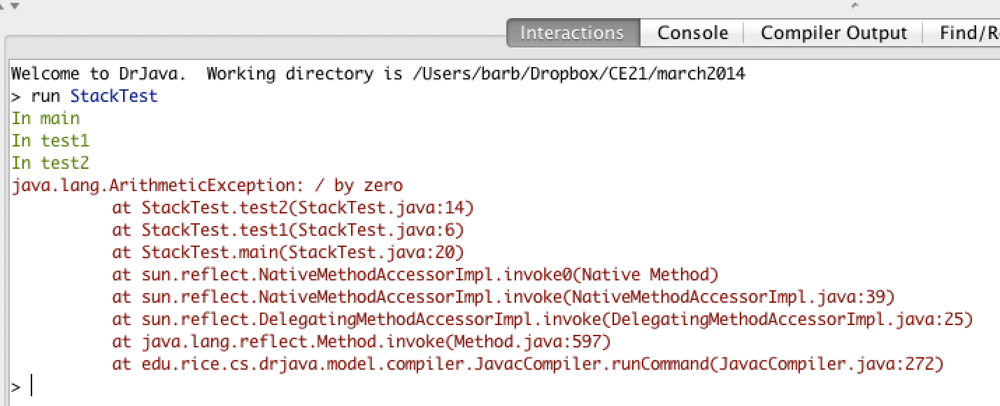

.. qnum::
   :prefix: 11-3-
   :start: 1

Tracing Recursive Methods
=========================

..	index::
    single: call stack
    single: stack
    
In Java the **call stack** keeps track of the methods that you have called since the main method executes.   A **stack** is a way of organizing data that adds and removes items only from the top of the stack.  An example is a stack of cups.  You can grap a cup from the top of the stack or add more cups at the top of the stack.  

.. figure:: Figures/cupStack.jpg
    :width: 300px
    :align: center
    :figclass: align-center

    Figure 2: Stacks of cups

When you are executing one method (method a) and it calls another method (method b) the method call is placed on the call stack along with information about where it was called from, which tells the run-time where to return to when the current method finishes executing.  When method b finishes executing the run-time pops the method b off of the call stack and returns execution to the next line to be executed in method a. 

Consider the following class definition.  

.. figure:: Figures/codeForCallStack.png
    :width: 400px
    :align: center
    :figclass: align-center

    Figure 3: Code with a divide by zero in a method.
    
The code above will cause a run-time error of division by zero when it runs.  The ``main`` method calls the method ``test1`` (at line 20) which calls the method ``test2`` (at line 6) which has the divide by zero error (line 14).  This can be seen in the call stack shown below which shows the call stack from the top (most recent method) to the bottom (first method call).  
    

    Figure 4: A call stack in DrJava with a run-time error

When a method calls itself the new method call gets added to the top of the call stack. Execution of the current method pauses while the recursive call is being processed.  

Let's trace the execution of the factorial method defined below.  

.. code-block:: java 

  public static int factorial(int n)
  {
    if (n == 0)
      return 1;
    else 
      return n * factorial(n-1);
  }

What happens when we call ``factorial(0)``?  It will return 1 (line 4) since n is equal to 0.  How about ``factorial(1)``?  It will return ``1 * factorial(0)``.  We already know that ``factorial(0)`` returns 1, but the computer won't *remember* that.  It will execute ``factorial(0)`` and return the result (1).   So  ``factorial(1)`` returns ``1 * 1 which is 1``.

How can you show what is happening in a recursive call?  Here is one way to do it.  The lines below show the call stack (from the bottom of the stack, or the beginning, to the top of the stack, or the most recent call) for a call to ``factorial(5)``.

.. code-block:: java 

  factorial(5) returns 5 * factorial(4)
  factorial(4) returns 4 * factorial(3) 
  factorial(3) returns 3 * factorial(2)
  factorial(2) returns 2 * factorial(1)
  factorial(1) returns 1 * factorial(0)
  factorial(0) returns 1

Once factorial(0) executes and returns 1 that value can be substituted back into the previous method call, starting at the top of the stack and working our way back to the bottom of the stack (beginning).

.. code-block:: java 

  factorial(5) returns 5 * factorial(4) = 5 * 24 = 120
  factorial(4) returns 4 * factorial(3) = 4 * 6 = 24 
  factorial(3) returns 3 * factorial(2) = 2 so 3 * 2 = 6
  factorial(2) returns 2 * factorial(1) = 1 so 2 * 1 = 2
  factorial(1) returns 1 * factorial(0) = 1 so 1 * 1 = 1
  factorial(0) returns 1
  
So ``factorial(5)`` returns 120. 

A great way to see the call stack in action is to use Jeloit (see http://cs.joensuu.fi/jeliot/ for the software and http://ice-web.cc.gatech.edu/dl/?q=node/729 for a step by step tutorial about how to use Jeliot).

.. figure:: Figures/callTree.png
    :width: 300px
    :align: center
    :figclass: align-center

    Figure 5: A call tree in Jeliot

**Check your understanding**

.. mchoicemf:: qrb_5
   :answer_a: 1 
   :answer_b: 120
   :answer_c: 720
   :answer_d: 30
   :correct: c
   :feedback_a: This would be correct if it was factorial(0), but don't forget the recursive calls.
   :feedback_b: This would be correct if it was factorial(5), but this is factorial(6).  
   :feedback_c: If you remember that factorial(5) was 120 then this is just 6 * 120 = 720. 
   :feedback_d: It doesn't return 6 * 5 it returns 6 * factorial(5).    
    
	Given the method defined below what does the following return: factorial(6)?
    
    .. code-block:: java 
   
     public static int factorial(int n)
     {
        if (n == 0)
           return 1;
        else 
           return n * factorial(n-1);
     } 
     
.. mchoicemf:: qrb_6
   :answer_a: 10 
   :answer_b: 32
   :answer_c: 16
   :answer_d: 64
   :correct: b
   :feedback_a: This would be correct if it addition instead of multiplication.
   :feedback_b: This method calculates 2 raised to the nth power.    
   :feedback_c: Check that you didn't miss one of the recursive calls.  
   :feedback_d: This would be true if the call was mystery(6).  
    
	Given the method defined below what does the following return: mystery(5)?
    
    .. code-block:: java 
   
     public static int mystery(int n) 
     { 
        if (n == 0) 
           return 1;
        else 
           return 2 * mystery (n - 1); 
     } 
     
.. mchoicemf:: qrb_7
   :answer_a: 12 
   :answer_b: 81
   :answer_c: 64
   :answer_d: 27
   :answer_e: 243
   :correct: b
   :feedback_a: This would be correct if it added instead of multiplied.
   :feedback_b: This calculates a to nth power.  
   :feedback_c: This would be correct if it was 4 to the 3rd instead of 3 to the 4th power.  
   :feedback_d: This would be correct if returned 1 instead of a in the base case.  
   :feedback_e: This would be correct if it was 3 to the 5th.  
    
	Given the method defined below what does the following print: mystery(4,3)?
    
    .. code-block:: java 
   
     public static int mystery(int n, int a)
     {
       if (n == 1) return a;
       return a * mystery(n-1,a);
     }
     

Let's trace the execution of the bunny ears method defined below.  

.. code-block:: java 

  public static int bunnyEars(int bunnies) 
  {
     if (bunnies == 0) return 0;
     else if (bunnies == 1) return 2;
     else return 2 + bunnyEars(bunnies - 1); 
  }

What happens when we call ``bunnyEars(0)``?  It will return 0 since n is equal to 0 (line 3).  How about ``bunnyEars(1)``?  It will return 2 since n is equal to 1 (line 4). What about ``bunnyEars(5)``?

.. code-block:: java 

  bunnyEars(5) returns 2 + bunnyEars(4)
  bunnyEars(4) returns 2 + bunnyEars(3) 
  bunnyEars(3) returns 2 + bunnyEars(2)
  bunnyEars(2) returns 2 + bunnyEars(1)
  bunnyEars(1) returns 2

This approach shows the call stack from bottom to top.  Once bunnyEars(1) executes and returns 2 that value can be substituted back into the previous method call, starting at the top and working our way back toward the bottom (or beginning) of the call stack.

.. code-block:: java 

  bunnyEars(5) returns 2 + bunnyEars(4) = 2 + 8 = 10
  bunnyEars(4) returns 2 + bunnyEars(3) = 2 + 6 = 8
  bunnyEars(3) returns 2 + bunnyEars(2) = 2 + 4 = 6
  bunnyEars(2) returns 2 + bunnyEars(1) = 2 + 2 = 4
  bunnyEars(1) returns 2
  
So ``bunnyEars(5)`` returns 10.  
  
**Check your understanding**
    
.. mchoicemf:: qrb_8
   :answer_a: 12344321 
   :answer_b: 1234
   :answer_c: 4321
   :answer_d: 43211234
   :answer_e: 32144123
   :correct: d
   :feedback_a: Remember that 1234 % 10 returns the rightmost digit.
   :feedback_b: There are two calls that print something in this method.  
   :feedback_c: There are two calls that print something in this method. 
   :feedback_d: This method prints the right most digit and then removes the rightmost digit for the recursive call.  It prints both before and after the recursive call.
   :feedback_e: Since 1234 % 10 returns the rightmost digit, the first thing printed is 4.  
    
	Given the method defined below what does the following print: mystery(1234)?
    
    .. code-block:: java 
   
     public static void mystery (int x) {
        System.out.print(x % 10); 

        if ((x / 10) != 0) {
           mystery(x / 10); 
        } 
        System.out.print(x % 10); 
     } 
     
.. mchoicemf:: qrb_9
   :answer_a: 7 
   :answer_b: 2
   :answer_c: 1
   :answer_d: 3
   :answer_e: 0
   :correct: b
   :feedback_a: This would be correct if was counting the number of characters in the string, but that isn't what it is doing.
   :feedback_b: This method seems to be counting the number of y's in the string, but fails to check if a single character is a y.   
   :feedback_c: Don't forget that there are recursive calls too.  
   :feedback_d: This would be correct if the base case returned 1 if the single character was a y. 
   :feedback_e: Don't forget about the recursive calls. 
    
	Given the method defined below what does the following return: mystery("xyzxyxy")?
    
    .. code-block:: java 
   
     public static int mystery(String str) 
     {
        if (str.length() == 1) return 0;
        else
        {
           if (str.substring(0,1).equals("y")) return 1 + 
                                mystery(str.substring(1));
           else return mystery(str.substring(1));
        }
     }
     
.. mchoicemf:: qrb_10
   :answer_a: 7 
   :answer_b: 2
   :answer_c: 1
   :answer_d: 3
   :answer_e: 0
   :correct: b
   :feedback_a: This would be correct if was counting the number of characters in the string, but that isn't what it is doing.
   :feedback_b: This method seems to be counting the number of y's in the string, but fails to check if a single character is a y.   
   :feedback_c: Don't forget that there are recursive calls too.  
   :feedback_d: This would be correct if the base case returned 1 if the single character was a y. 
   :feedback_e: Don't forget about the recursive calls. 
    
	Given the method defined below what does the following return: mystery("xyzxyxy")?
    
    .. code-block:: java 
   
     public static int mystery(String str) 
     {
        if (str.length() == 1) return 0;
        else
        {
           if (str.substring(0,1).equals("y")) return 1 + 
                                mystery(str.substring(1));
           else return mystery(str.substring(1));
        }
     }
     
 