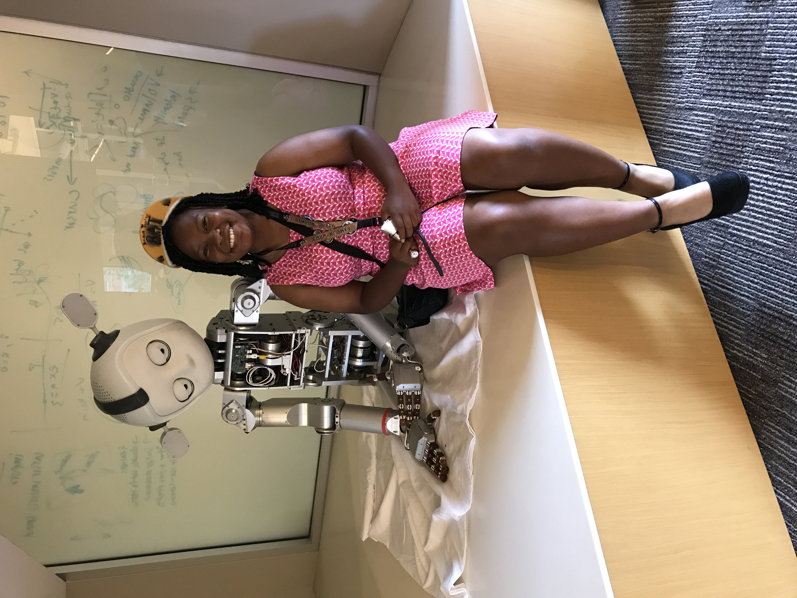

.. _anaya-taylor:

Anaya Taylor
:::::::::::::::::::::::::::::::::::::

.. role:: raw-html(raw)
   :format: html

:raw-html:`<em>"I'm about average at most things... [but] when I get stuck... I'm kind of stubborn. That perseverance has really helped me."</em>`

**How did she get into computing?**

*"My first exposure was that club in high school. We didn't do much coding, but there were a lot of fun projects with like messing with Arduinos and LEDs, and stuff like that. And then it progressed to the Rise Up camp, where we were coding in this animation program called Alice. That was really fun to work with, but it was also kind of difficult because if you didn't do something quite right, the animation wouldn't turn out too good. It was fun, I really enjoyed it."*

**What subfield is she interested in?**

*"I'm currently an IT software engineer. The first few weeks, I didn't really know what was going on, but as we've progressed, it's become enjoyable, and I understand more."*

Anaya is a software engineer, which means she develops software for the company she works at. She works with colleagues to seek and create solutions for the firm's problems.

**What does she dislike in computing?**

*"There can be people that are a bit stuck-up and look down on you when you seek help. Not for any reason in particular, but just because that's how they perceive themselves. So that can be annoying, but it's also kind of easy to ignore since it's such a big environment."*

**What does she do in her free time?**

*"One of the best experiences for me was seeing a student that I had worked with come into Georgia Tech, and see her join our department."*

Anaya mentors for Rise Up 4 CS, a group that provides guidance and role models to underrepresented students in Computer Science. In high school, they supported and enabled her journey in CS, which led her to want to pay it forward.

.. youtube:: fwHw0rGbfZQ
    :divid: Anaya_Taylor
    :height: 315
    :width: 560