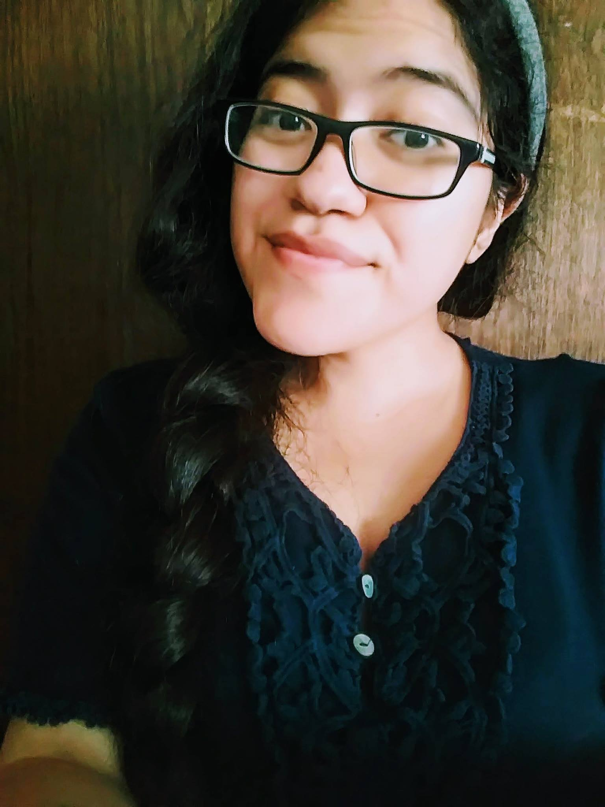

.. _carla-de-lira:

Carla De Lira
:::::::::::::::::::::::::::::::::::::

.. role:: raw-html(raw)
   :format: html

:raw-html:`<em>"[Computing] is a pretty big part [of my identity], but not everything. I have pet guinea pigs I'm obsessed with. I like to craft. I like to read different kinds of literature."</em>`

**How did she get into computer science?**

*"My dad was a self-learner and instilled that on me. He bought computer architecture books. I did not understand, but I appreciated that he tried even though his background is not at all technical. Even my mom didn't really know what was happening, but she was always like, 'Yeah, you can do it.'"*

**What challenges has she faced in computing?**

*"My first time ever TA'ing for a lab, there was a student who was very frustrated that they didn't get to them, and they were like, 'Oh, well, she's supposed to know everything, but she's female, so maybe not.' I cried for the whole day. Those really small punches put a strain in my progress. They don't happen often now. But if the same types of comments were to happen now, I would brush them off"*

*"I went to kind of a workshop, and I was the only female Latina in a group of kind of white, old males, and they decided to kind of make an example of me as a token, and that reduced my feeling of being a part of a community."*

Carla, being a female Latina, is at the intersection of two underrepresented groups in computing. That has led to isolation and disrespect throughout her career.

**What subfield does she work in?**

Carla researches the intersection between human-computer interaction (HCI) and computer science education.

**How did she get into research?**

*"Most of my undergrad summers were doing research. The research programs I did pushed me to do grad school. I went to Tapia, a diversity conference for people in computing. They were very welcoming and always gave me feedback. I was starting to develop my own mini self-image as a researcher. I started to see academia as a noble pursuit. I felt like there was a grander purpose rather than working for a company."*

.. youtube:: 1X9iuUv6UPs
    :divid: Carla_De_Lira
    :height: 315
    :width: 560