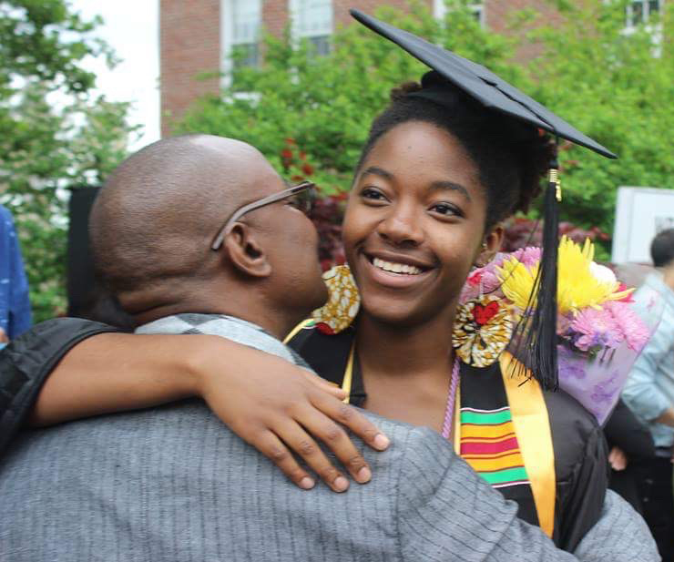

.. _camille-mbayo:

Camille Mbayo
:::::::::::::::::::::::::::::::::::::

.. role:: raw-html(raw)
   :format: html

:raw-html:`<em>"My parents work for UNICEF, so we've always traveled. So, time and time again, seeing people on the African continent being screwed over. And that's like, 'Okay guys, it's time.' It's time we figure out what our tools are and that we share them. Since I was able to get elite education, I should... bring it back." </em>`

**Why did she choose computing?**

*"I really like how it works with my brain. Everything just made sense in the way that things are processed and learned. There's also something about being able to just create almost anything."*

**What challenges has she faced in computing?**

*"There are just so many entitled men, particularly white men, who make the experience frustrating."*

*"People try to sound more knowledgeable than they are, and to someone who doesn’t know, that sounds like they know what they’re talking about. That definitely made me feel like I was behind. I never fully believed that I was a computer scientist until I had an internship."*

Camille has dealt with sexism and impostor syndrome in computing. The sexism has led to her ideas being underappreciated, while her impostor syndrome has led to her underestimating her own ability.

**What subfield does she work in?**

Camille is currently a developer, but she wants to pursue postgraduate studies analyzing the intersection between computer science and development (either global or policy development).

**How did she tackle impostor syndrome?**

*"The internships gave me the confidence boost that I needed. I was just dropped into this internship. It seemed like they needed someone of more experience than I had, so I just felt overwhelmed. My manager saw that I was shutting down  and then he said something like it's okay, we're all learning here. And it was just such a short type phrase and that just resonated with me. It's not talked about. It's told that either you have the skills or you don't."*

.. youtube:: pgGEyY6uY_A
    :divid: Camille_Mbayo
    :height: 315
    :width: 560