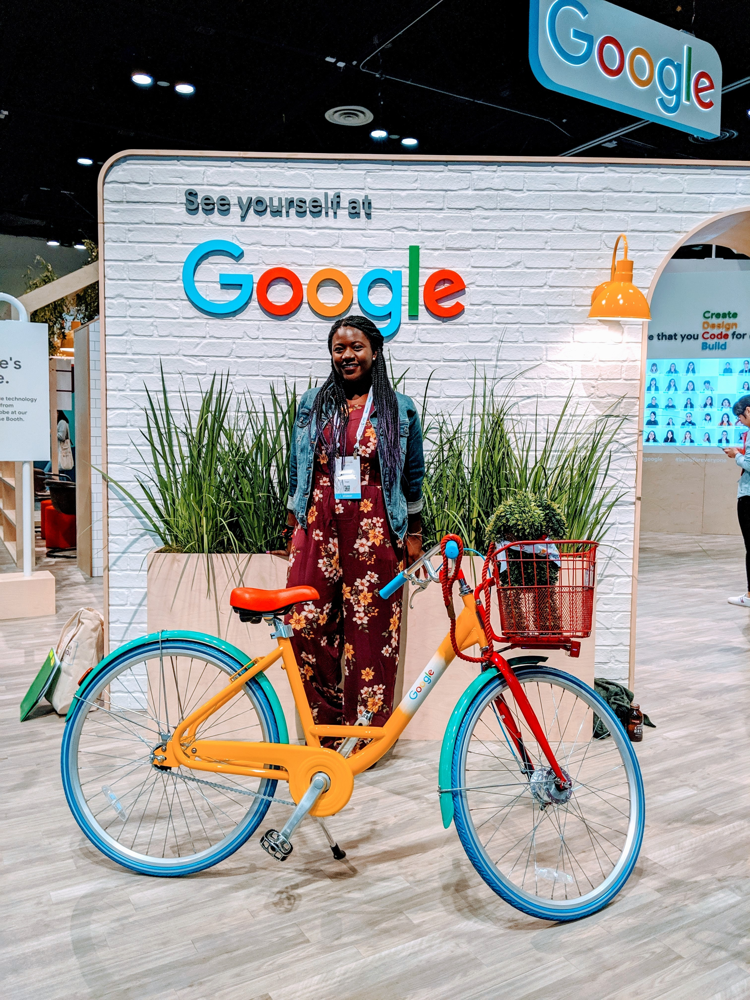

.. _destini-deinde-smith:

Destini Deinde-Smith
:::::::::::::::::::::::::::::::::::::

.. role:: raw-html(raw)
   :format: html

:raw-html:`<em>"I have always identified as someone who really loves being creative but also enjoys things that are sometimes technical.  I feel as though being a software engineer and studying CS —  it's this way to join those two things that I've identified with."</em>`

**Why did she choose computing?**

*"Originally I was considering studying English in college. [My parents] went to a seminar about careers in CS. The more that I did it and the more I learned how to be creative with computer science, the more it became something that I wanted to keep doing. For me who wanted to study English, who always did arts and crafts, I didn't really connect to CS as something I wanted to continue until I saw how I could still be creative.
[In] my first internship, I was an intern that worked on an AR team and we developed a drawing app to draw in 3D.
I realized all the debugging and hard math felt worth it when I got to see something — it connected [that] I was doing this thing that was very creative."*

**What challenges has she faced in computing?**

*"In the beginning, I was discouraged by the fact that sometimes you meet people who start really, really young. When you get to college, there's people who have been programming since they were 10 or 12. They tend to be guys, and they tend to be really cavalier about it. That was really discouraging — someone was asking a question and they were making fun of it. They were like, "Oh, that's such a stupid question. Didn't we do this yesterday." Even though there are so many beginners, the voices of people who have more experience are the loudest."*

Destini has faced a challenge that many in CS face: impostor syndrome. Since the loudest voices tend to also be the most experienced, average students perceive themselves as behind the curve.

**What subfield is she pursuing?**

Destini is studying computer science, a branch of computing that deals with mathematical models, analysis, and algorithms.

**Why did she choose computer science?**

*"There's things that have to do with tech that aren't strict coding or sometimes seen as what female engineers are drawn to — typically being UI or UX. It's the stereotype of women being drawn to soft skills that made me want to get a degree in something that people couldn't dispute was CS. It made me want, at the minimum, to have a piece of paper that said computer science. I could point at it and say, 'No, no I learned computer science.'"*

.. youtube:: FW1fRJ4Ak3U
    :divid: Destini_Deinde_Smith
    :height: 315
    :width: 560