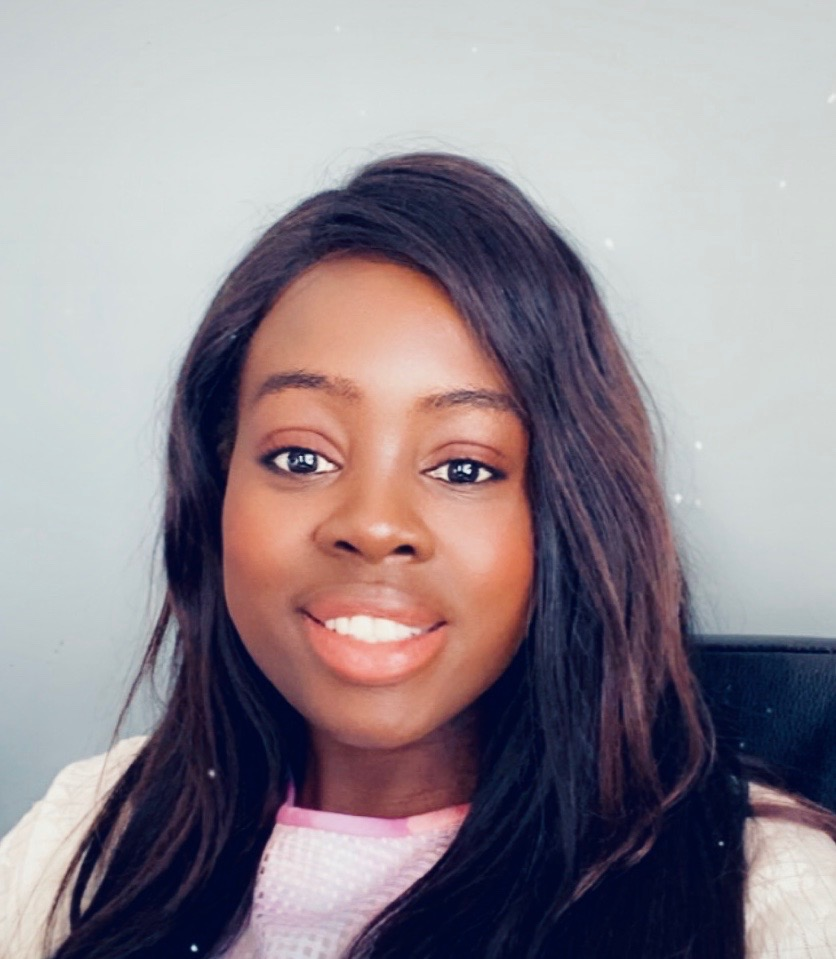

.. _gloria-opoku-boateng:

Dr. Gloria Opoku-Boateng
:::::::::::::::::::::::::::::::::::::

.. role:: raw-html(raw)
   :format: html

:raw-html:`<em>"[Studying computer science in Ghana] made me stay in tech, because if I had gone up in the United States and seen all these disparity and different options, I probably wouldn't have stayed in tech."</em>`

**Why did she choose computing?**

*"At the time [when] I was done with high school, I wanted to be a doctor. I found that the school that I wanted to get my medical degree from had computer science. I weighed my options and realized that I could always come after college and become a physician, but I cannot go back and learn computing. And so, with my really naive understanding, I decided to get my head steady in computer science and learn more about it. But when I started first year computer science... I found that I was interested in computing. So I never went back into medicine."*

**How did she pursue computing?**

*"[Computing education in Ghana] was non-existent. On a scale of one to 100, United States computing education was like 95. Ghanaian computing education when I was an undergrad was like two. We coded on the blackboard, like in the chalkboard. We would code on that. And you can imagine, you don't even know when there's an error. And in the classes we had only two females per like a class of 67... It just taught me how to be resilient."*

Dr. Opoku-Boateng started in computing in Ghana, as an undergrad (although she planned to eventually switch to medicine). Ghana's lack of resources was a double-edged sword — it made learning harder, but it made the students more resilient. After finishing her undergrad, she went to the United States for her postgraduate studies, eventually earning her PhD.

**What subfield is she working in?**

Dr. Opoku-Boateng works in UX — the subfield that manages user experience. In other words, she helps design interactions between the user and the back-end code that does the actual computations.

**What discourages her in computing?**

*"Society not realizing that tech and societal disparities work hand in hand. We talk about tech jobs, and even with a COVID situation, a tech job being good because you work from home. But it's not like you have a buffet of different jobs that you can pick and choose. Getting access to a computer earlier in life. Getting access to somebody who can teach you or help you code. Getting access to a community or a family that supports your journey. We fail to realize that a lot of people who are working in hospitality, in service, in other industries might not have the privilege to be working in tech."*

**What advice does she have?**

*"The advice that I would add to anybody pursuing computing is to not limit themselves to where their computing career can go and what else they can mix and match with a computing career. A lot of people are bogged down by, 'I want to be excellent in coding,'' Or, 'I want to be excellent with computer architecture or networking or cyber security.' To be really successful is to know how to apply the computing that you have learned to different environments and different teams and different kind of areas where people want to build more on. And so just keep an open mind."*

.. youtube:: k6ZQjoFzXRg
    :divid: Gloria_Opoku_Boateng
    :height: 315
    :width: 560