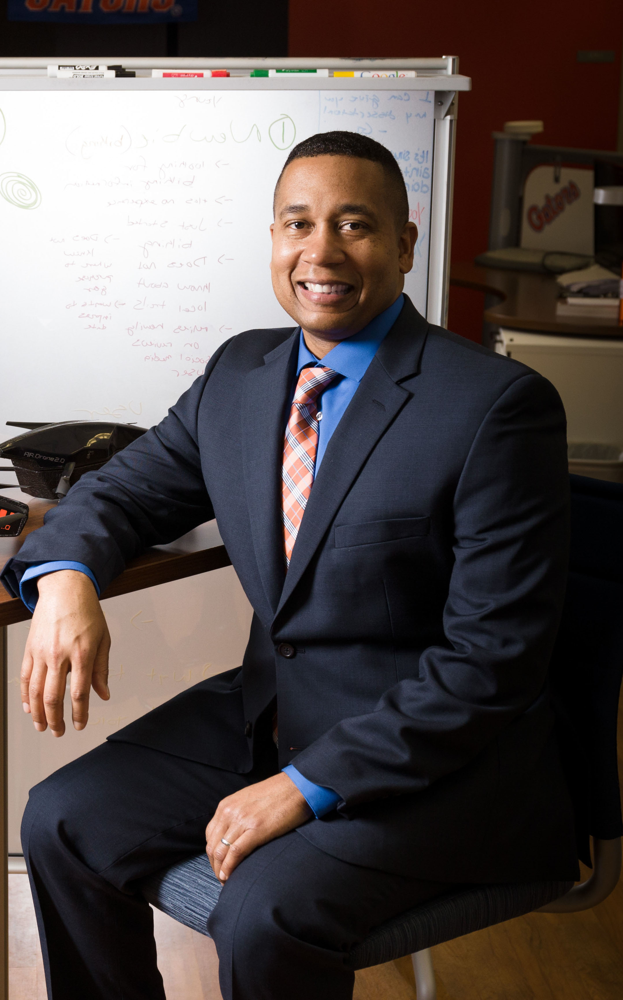

.. _juan-gilbert:

Dr. Juan Gilbert
:::::::::::::::::::::::::::::::::::::

.. role:: raw-html(raw)
   :format: html

:raw-html:`<em>"My strength [is] be design and implementation. Being able to look at a problem, design something and build prototypes and things. That's what I enjoy and that's what I would say I'm pretty good at."</em>`

**How did he originally get into computing?**

*"Well, when I was an undergrad, I went to college as a chemistry major and did very well. And a senior told me, 'Wow, you're going to do well in chemistry. You'll graduate. You're going to go to grad school.' And I said, "Wait a minute, go where?" He said, "Grad school. That's what we do in chemistry." And I said, "I'm the first in my family to go to college. I thought you went to college to get a job." So I changed my major to computer, because I knew I could get a job and I had had a course in programming that I liked. That's how it all started for me."*

**Why does he enjoy computing?**

*"What encourages me is the pervasiveness of computing and its ability to solve societal problems. There are plenty of problems in society and I think using computing and technology to address them, that encourages me."*

**What barriers has he faced?**

Dr. Gilbert's biggest problem was a lack of diversity. For a long time, he was the only African American he knew that was pursuing a PhD. Once he ran into another, though, he found a community of peers that helped him through his journey.

**Where does he find support?**

*"Other colleagues, again, some of my mentors. That's where I would seek it. And to be honest with, sometimes my students. My students come in and they talk to me, so they help me and they don't even know it... Most recently the issues around the killing of Mr. Floyd. My students wanted to talk about it. Being able to have the conversation with them was helpful."*

**What does he work as?**

Dr. Gilbert is a professor and department chair at a university. He teaches, collaborates with other faculty, and researches.

**What made him pursue academia instead of industry-related jobs?**

When Dr. Gilbert was still studying, the dean pulled him aside one day and told him that he'd make a good professor. That's what initiated his journey of becoming a professor.

**What does he research?**

*"I have a couple of exciting things. One, we work on election technology voting systems. I built an open-source voting technology called Prime Three. It's the only open-source voting system to be used in state, federal, and local elections in the United States of America ever. And so we have some new innovations that are going to help people vote. We have some new innovations and dealing with lines when people go to vote. And we have a project on bias and AI that I'm excited about, where it looks like we're going to be able to help de bias software, make it less biased. So those will be things that make me excited."*

.. youtube:: 1ItDEthB9gc
    :divid: Juan_Gilbert
    :height: 315
    :width: 560