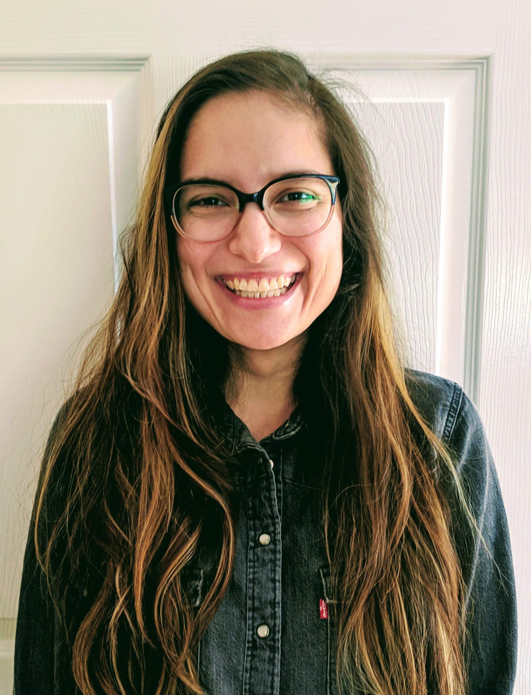

.. _luisa-morales:

Luisa Morales
:::::::::::::::::::::::::::::::::::::

.. role:: raw-html(raw)
   :format: html

:raw-html:`<em>"I feel that I have more empathy than some other software engineers. I am perfectly okay explaining things, where other people might not be."</em>`

**How did she get into computing?**

*"My friends. We all had to build our own little websites for class. We would have our own mini competitions to see whose would be the nicest, so that was very friend-driven. Nowadays, it's more about my own passion for the field."*

**What did she study as an undergrad?**

Luisa started college as an English major and eventually transitioned to an economics major. Once she graduated, she started a media consulting company, which included a bit of web development with WordPress and other tools. That kept her engaged in computing, which is why she decided to go further into technology.

**How does her interdisciplinary experience affect her career now?**

*"Having a background in economics helps me understand the impact of the software that I write, how I can impact the business, and how I can add to more revenue, customers, or whatever it might be. Having done marketing, I understand the importance of having a clear message, so all of that is part of just being better at communication."*

**How did she pursue computing?**

*"I decided to teach myself how to program. I did some online, worked on some side projects, and ran through some online courses. I worked for three-and-a-half or four years, and then I decided to do the master's."*

**What obstacles has she faced?**

Like many other developers, Luisa dealt with imposter syndrome. This syndrome was compounded by the fact that she is self-taught, Hispanic (a racial minority), and female (a gender minority).

She has dealt with impostor syndrome in two ways. First, she's begun to accept that she won't know everything. No matter how much she studies, no matter how much experience she has, there will always be problems she can't solve, and that's okay. Secondly, she's started reading about other people's experiences with impostor syndrome. Realizing that it's a common issue makes her feel less alone.

**What does she work as?**

*"My initial interest was in back end development, which just means that we work closer on the data side. I couldn't find really good resources for picking it up. It was hard for me to figure out what the code that I was writing was doing, which is why I ended up in front end development (where you develop the interface that users interact with). That was one switch, and now I did front end development for about three-and-a-half to four years. [Now,] my focus is back on being on back end development, purely because I want to be more familiar with that side of software engineering."*

.. youtube:: 7hDnhKAdBbI
    :divid: Luisa_Morales
    :height: 315
    :width: 560