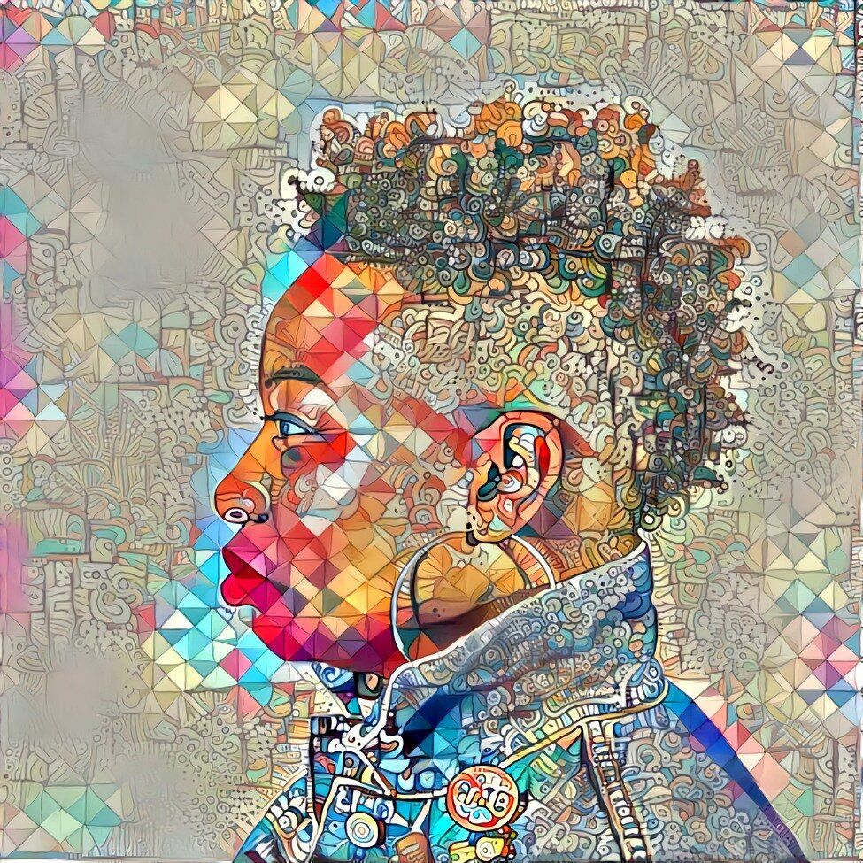

.. _Nettrice-Gaskins:

Dr. Nettrice Gaskins
:::::::::::::::::::::::::::::::::::::

.. role:: raw-html(raw)
   :format: html

:raw-html:`<em>"We don't have conversations where software engineers talk to artists, and artists get together just to have conversations about this new field that's emerging. And yet, it is emerging and it is something that I think would really interest a lot of people who would not even enter into computers or computation."</em>`

**How did she get into computing?**

*"I did not want to do computer programming. I wanted to be an artist. Until my [art] teacher approached me about her [computer graphics] course, I was not interested in computers at all. I told her no one or two times because I had no interest, because I'm looking at my mother. And I'm seeing what my mother does, and that's not what an artist does. But she convinced me to do it. That showed me you could use the computer as a tool to make art."*

**What does she work as?**

Dr. Gaskins is an assistant director at Lesley University and an artist.

**What was her graduate work focused on?**

Dr. Gaskins originally focused on using technology to create art. Eventually, she switched to community work. When teaching, she saw a massive divide in the computing resources and facilities available to different socioeconomic classes and racial groups. She pitched the idea of creating a computer lab for underserved students, and she eventually got funding and started it up, helping hundreds of kids in the process.

**How does she tailor her teaching to her students?**

*"How do I teach how to program from a culturally relevant, creative point of view for students that it would resonate with?  At the time, I was using Sojourner Truth's speech, Ain't I A Woman?, to have them understand it as a if then or else statement. When they saw this code, they realized that stuff in their world or stuff they may have heard of could actually be creative. Next thing you know, you learn about algorithms as step-by-step instructions and they learn about arrays. So they learn it through things that are familiar to them, and so I've continued to do that work as a professional today."*

**What difficulties has she faced?**

Like many black women, Dr. Gaskins struggled to find people she could relate to. Sometimes, she was excluded for being a woman. Other times, she was excluded for being black.

Additionally, taking an unconventional career path (artistic computing but not computer graphics) meant that she had to forge her own path. That meant that institutions often had to create special roles for her, and she couldn't really find a mentor.

**Where does she find support?**

*"I had an exhibition recently.  I used my collaboration on artificial intelligence to generate an image that was put up in the exhibition. I saw an older group of people come by and they argued amongst each other about which medium was used to paint the work. So was it watercolor, or was it an oil painting or acrylics? And then, they would read the placard and the placard would say artificial intelligence, and they had no clue.*

*And then, I saw a young man and he was so happy. He was excited and I couldn't understand why he was looking that way when he read the placard. So his mother sat next to me and said he was a software engineer. She said, 'My son writes AI, writes for AI.'' So I said, 'Oh.' We had a brief conversation, and he was shocked that you could make something look like a painting with AI. That is something that I've been working on for a while, and it brings two different camps of people together for different interests. Just the image itself, some people think it's beautiful. Other people think it's beautiful, but then they know the technology behind it or the computation behind it."*

.. youtube:: K5oKi8Mzpro
    :divid: Nettrice_Gaskins
    :height: 315
    :width: 560