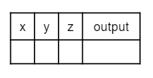
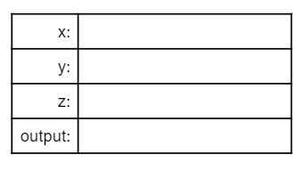

.. include:: ../common.rst

.. qnum::
   :prefix: 1-5-
   :start: 1

.. raw:: html

    

.. index::
    single: operators
    pair: math; operators
    pair: operators; addition
    pair: operators; subtraction
    pair: operators; multiplication
    pair: operators; division
    pair: operators; equality
    pair: operators; inequality

|Time45|

Compound Assignment Operators
=============================

Compound assignment operators are shortcuts that do a math operation and
assignment in one step. For example, ``x += 1`` adds 1 to the current value of
``x`` and assigns the result back to ``x``. It is the same as ``x = x + 1``.
This pattern is possible with any operator put in front of the ``=`` sign, as
seen below. If you need a mnemonic to remember whether the compound operators
are written like ``+=`` or ``=+``, just remember that the operation (``+``) is
done first to produce the new value which is then assigned (``=``) back to the
variable. So it's operator then equal sign: ``+=``.

Since changing the value of a variable by one is especially common, there are
two extra concise operators ``++`` and ``--``, also called the plus-plus or
**increment** operator and minus-minus or **decrement** operator that set a
variable to one greater or less than its current value.

Thus ``x++`` is even more concise way to write ``x = x + 1`` than the compound
operator ``x += 1``. You’ll see this shortcut used a lot in loops when we get to
them in Unit 4. Similarly, ``y--`` is a more concise way to write ``y = y - 1``.
These shortcuts only exist for ``+`` and ``-`` as they don’t really make sense
for other operators.

.. note::

   If you've heard of the programming language C++, the name is an inside joke
   that C, an earlier language which C++ is based on, had been incremented or
   improved to create C++.

Here’s a table of all the compound arithmetic operators and the extra concise
incremend and decrement operators and how they relate to fully written out
assignment expressions. You can run the code below the table to see these
shortcut operators in action!

+----------------+--------------+--------------+--------------+--------------+--------------+
+ Operator       | ``+``        | ``-``        | ``*``        | ``/``        | ``%``        |
+================+==============+==============+==============+==============+==============+
+ Written out    |``x = x + 1`` |``x = x - 1`` |``x = x * 2`` |``x = x / 2`` |``x = x % 2`` |
+----------------+--------------+--------------+--------------+--------------+--------------+
+ Compound       |``x += 1``    |``x -= 1``    |``x *= 2``    |``x /= 2``    |``x %= 2``    |
+----------------+--------------+--------------+--------------+--------------+--------------+
+ Extra concise  |``x++``       |``x--``       |              |              |              |
+----------------+--------------+--------------+--------------+--------------+--------------+

.. activecode:: lcpp
   :language: java
   :autograde: unittest

   Run the code below to see what the ++ and shorcut operators do. Click on the Show Code Lens button to trace through the code and the variable values change in the visualizer. Try creating more compound assignment statements with shortcut operators and work with a partner to guess what they would print out before running the code.
   ~~~~
   public class Test2
   {
       public static void main(String[] args)
       {
           int score = 0;
           System.out.println(score);
           score++;
           System.out.println(score);
           score *= 2;
           System.out.println(score);
           int penalty = 5;
           score -= penalty / 2;
           System.out.println(score);
       }
   }

   ====
   import static org.junit.Assert.*;

   import org.junit.*;

   import java.io.*;

   public class RunestoneTests extends CodeTestHelper
   {
       @Test
       public void testMain() throws IOException
       {
           String output = getMethodOutput("main");
           String expect = "0\n1\n2\n0";

           boolean passed =
                   getResults(expect, output, "Expected output from main", true);
           assertTrue(passed);
       }
   }

.. note::

   If you look at real-world Java code, you may occassionally see the ``++`` and
   ``--`` operators used before the name of the variable, like ``++x`` rather
   than ``x++``. That is legal but not something that you will see on the AP
   exam.

   Putting the operator before or after the variable only changes the value of
   the expression itself. If ``x`` is 10 and we write,
   ``System.out.println(x++)`` it will print 10 but aftewards ``x`` will be 11.
   On the other hand if we write, ``System.out.println(++x)``, it will print 11
   and afterwards the value will be 11.

   In other words, with the operator after the variable name, (called the
   **postfix** operator) the value of the variable is changed *after* evaluating
   the variable to get its value. And with the operator before the variable (the
   **prefix** operator) the value of the variable in incremented *before* the
   variable is evaluated to get the value of the expression.

   But the value of ``x`` after the expression is evaluated is the same in
   either case: one greater than what it was before. The ``--`` operator works
   similarly.

   The AP exam will never use the prefix form of these operators nor will it use
   the postfix operators in a context where the value of the expression matters.

|Exercise| **Check Your Understanding**

.. mchoice:: q3_4_3
   :practice: T
   :answer_a: x = -1, y = 1, z = 4
   :answer_b: x = -1, y = 2, z = 3
   :answer_c: x = -1, y = 2, z = 2
   :answer_d: x = 0, y = 1, z = 2
   :answer_e: x = -1, y = 2, z = 4
   :correct: e
   :feedback_a: This code subtracts one from x, adds one to y, and then sets z to to the value in z plus the current value of y.
   :feedback_b: This code subtracts one from x, adds one to y, and then sets z to to the value in z plus the current value of y.
   :feedback_c: This code subtracts one from x, adds one to y, and then sets z to to the value in z plus the current value of y.
   :feedback_d: This code subtracts one from x, adds one to y, and then sets z to to the value in z plus the current value of y.
   :feedback_e: This code subtracts one from x, adds one to y, and then sets z to to the value in z plus the current value of y.

   What are the values of x, y, and z after the following code executes?

   .. code-block:: java

     int x = 0;
     int y = 1;
     int z = 2;
     x--;
     y++;
     z+=y;

.. mchoice:: q3_4_4
   :practice: T
   :answer_a: x = 6, y = 2.5, z = 2
   :answer_b: x = 4, y = 2.5, z = 2
   :answer_c: x = 6, y = 2, z = 3
   :answer_d: x = 4, y = 2.5, z = 3
   :answer_e: x = 4, y = 2, z = 3
   :correct: e
   :feedback_a: This code sets x to z * 2 (4), y to y divided by 2 (5 / 2 = 2) and z = to z + 1 (2 + 1 = 3).
   :feedback_b: This code sets x to z * 2 (4), y to y divided by 2 (5 / 2 = 2) and z = to z + 1 (2 + 1 = 3).
   :feedback_c: This code sets x to z * 2 (4), y to y divided by 2 (5 / 2 = 2) and z = to z + 1 (2 + 1 = 3).
   :feedback_d: This code sets x to z * 2 (4), y to y divided by 2 (5 / 2 = 2) and z = to z + 1 (2 + 1 = 3).
   :feedback_e: This code sets x to z * 2 (4), y to y divided by 2 (5 / 2 = 2) and z = to z + 1 (2 + 1 = 3).

   What are the values of x, y, and z after the following code executes?

   .. code-block:: java

     int x = 3;
     int y = 5;
     int z = 2;
     x = z * 2;
     y = y / 2;
     z++;

|Groupwork| Code Tracing Challenge and Operators Maze
-----------------------------------------------------

Use paper and pencil or the question response area below to trace through the following program to determine the values of the variables at the end.

**Code Tracing** is a technique used to simulate a dry run through the code or pseudocode line by line by hand as if you are the computer executing the code. Tracing can be used for debugging or proving that your program runs correctly or for figuring out what the code actually does.

Trace tables can be used to track the values of variables as they change throughout a program. To trace through code, write down a variable in each column or row in a table and keep track of its value throughout the program. Some trace tables also keep track of the output and the line number you are currently tracing.

or

Trace through the following code:

.. code-block:: java

     int x = 0;
     int y = 5;
     int z = 1;
     x++;
     y -= 3;
     z = x + z;
     x = y * z;
     y %= 2;
     z--;

.. shortanswer:: challenge1-5

   Write your trace table for x, y, and z here showing their results after each line of code.

.. |Operators Maze game| raw:: html

   <a href="https://docs.google.com/document/d/1ZjA8oKeo8FYx2nXX4OOq5lUihopIQQ_HY-eoE5yZkk8/edit?usp=sharing" target="_blank" style="text-decoration:underline">Operators Maze game</a>

After doing this challenge, play the |Operators Maze game|. See if you and your
partner can get the highest score!

Summary
-------------------

- Compound assignment operators (``+=``, ``-=``, ``*=``, ``/=``, ``%=``) can be
  used in place of the assignment operator.

- The increment operator (``++``) and decrement operator (``--``) are used to
  add 1 or subtract 1 from the stored value of a variable. The new value is
  assigned to the variable.

- The use of increment and decrement operators in prefix form (e.g., ``++x``)
  and inside other expressions (i.e., ``arr[x++]``) is outside the scope of this
  course and the AP Exam.
