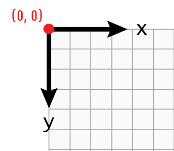
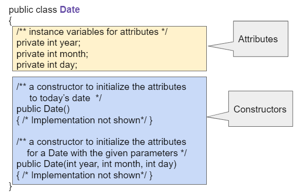
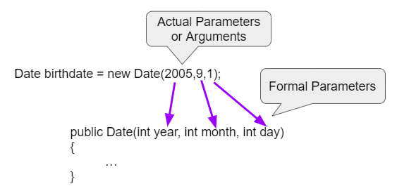
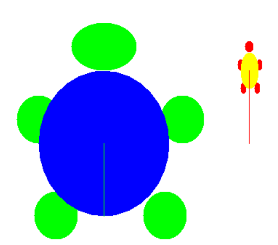

.. include:: ../common.rst

.. qnum::
   :prefix: 2-2-
   :start: 1

.. index::
   pair: class; constructor

.. |repl link| raw:: html

   <a href="https://firewalledreplit.com/@BerylHoffman/Java-Swing-Turtle#Main.java" target="_blank" style="text-decoration:underline">repl.it link</a>

.. |github| raw:: html

   <a href="https://github.com/bhoffman0/APCSA-2019/tree/master/_sources/Unit2-Using-Objects/TurtleJavaSwingCode.zip" target="_blank" style="text-decoration:underline">here</a>

|Time45|

Creating and Initializing Objects: Constructors
================================================

A Java class defines what objects of the class know (attributes) and what they can do (behaviors).  Each class has **constructors** like ``World()`` and ``Turtle(habitat)`` which are used to initialize the attributes in a newly created object.

A new object is created with the ``new`` keyword followed by the class name (``new Class()``).  When this code executes, it creates a new object of the specified class and calls a constructor, which has the same name as the class.  For example, ``new World()`` creates and initializes a new object of the ``World`` class, and ``new Turtle(habitat)`` creates and initializes a new ``Turtle`` object in the World habitat.

.. code-block:: java

    // To create a new object and call a constructor write:
    // ClassName variableName = new ClassName(parameters);
    World habitat = new World();    // create a new World object
    Turtle t = new Turtle(habitat); // create a new Turtle object

Overloading Constructors
---------------------------

There can be more than one constructor defined in a class. This is called **overloading** the constructor. There is usually a constructor that has no parameters (nothing inside the parentheses following the name of the constructor) like the ``World()`` constructor above.  This is also called the **no-argument constructor**.  The **no-argument** constructor usually sets the attributes of the object to default values.

There can also be other constructors that take parameters like the ``Turtle(habitat)`` constructor call above. A **parameter** (also called **actual parameter** or **argument**) is a value that is passed into a constructor.  It can be used to initialize the attribute of an object.

The ``World`` class actually has 2 constructors.  One doesn't take any parameters and one takes the world's width and height.

.. figure:: Figures/worldConstructors.png
    :width: 350px
    :align: center
    :alt: Two overloaded World constructors
    :figclass: align-center

    Figure 1: Two overloaded World constructors

|Exercise| **Check your understanding**

.. mchoice:: overload_const_1
   :practice: T
   :answer_a: When a constructor takes one parameter.
   :answer_b: When a constructor takes more than one parameter.
   :answer_c: When one constructor is defined in a class.
   :answer_d: When more than one constructor is defined in a class.
   :correct: d
   :feedback_a: For a constructor to be overloaded there must be more than one constructor.
   :feedback_b: For a constructor to be overloaded there must be more than one constructor.
   :feedback_c: For a constructor to be overloaded there must be more than one constructor.
   :feedback_d: Overloading means that there is more than one constructor.  The parameter lists must differ in either number, order, or type of parameters.

   Which of these is overloading?

.. mchoice:: const_def_1
   :practice: T
   :answer_a: World w = null;
   :answer_b: World w = new World;
   :answer_c: World w = new World();
   :answer_d: World w = World();
   :correct: c
   :feedback_a: This declares a variable w that refers to a World object, but it doesn't create a World object or initialize it.
   :feedback_b: You must include parentheses () to call a constructor.
   :feedback_c: Use the new keyword followed by the classname and parentheses to create a new object and call the constructor.
   :feedback_d: You must use the new keyword to create a new object.

   Which of these is valid syntax for creating and initializing a World object?

The World Class Constructors
----------------------------------------------------------

The constructor that doesn't take any parameters, ``World()``, creates a graphical window with 640x480 pixels. The ``World(int width, int height)`` constructor takes two integer parameters, and initializes the ``World`` object's width and height to them, for example ``new World(300,400)`` creates a 300x400 pixel world.

.. code-block:: java

    World world1 = new World(); // creates a 640x480 world
    World world2 = new World(300,400); // creates a 300x400 world

.. note::

   The turtle world does not use the Cartesian coordinate system with (0,0) in
   in the middle the screen. Instead, (0,0) is at the top left corner of the
   screen and x increases to the right and y increases towards the bottom of the
   screen.

   Most computer graphics systems use this coordinate system which is a carry
   over from before computers could display graphics. When computer displays
   were text based and mostly made by people using left-to-right, top-to-bottom
   languages like English, it made sense to have the first character appear at
   the top left and then count columns to the right and lines down.

    Figure 2: The coordinate (0,0) is at the top left of the Turtle world.

The Turtle Class Constructors
----------------------------------------------------------

The ``Turtle`` class also has multiple constructors, although it always requires a world as a parameter in order to have a place to draw the turtle. The default location for the turtle is right in the middle of the world.

There is another ``Turtle`` constructor that places the turtle at a certain (x,y) location in the world, for example at the coordinate (50, 100) below.

.. code-block:: java

    Turtle t1 = new Turtle(world1);
    Turtle t2 = new Turtle(50, 100, world1);

.. note::
   Notice that the order of the parameters matter. The ``Turtle`` constructor takes ``(x,y,world)`` as parameters in that order. If you mix up the order of the parameters it will cause an error, because the parameters will not be the data types that it expects. This is one reason why programming languages have data types -- to allow for error-checking.

|Exercise| **Check your understanding**

.. mchoice:: const_turtle
   :practice: T
   :answer_a: Turtle t = Turtle(world1);
   :answer_b: Turtle t = new Turtle();
   :answer_c: Turtle t = new Turtle(world1, 100, 100);
   :answer_d: Turtle t = new Turtle(100, 100, world1);
   :correct: d
   :feedback_a: You must use the new keyword to create a new Turtle.
   :feedback_b: All turtle constructors take a world as a parameter.
   :feedback_c: The order of the parameters matter.
   :feedback_d: This creates a new Turtle object in the passed world at location (100,100)

   Which of these is valid syntax for creating and initializing a Turtle object in world1?

|CodingEx| **Coding Exercise:**

.. activecode:: TurtleConstructorTest
    :language: java
    :autograde: unittest
    :datafile: turtleClasses.jar

    Try changing the code below to create a ``World`` object with 300x400 pixels. Where is the turtle placed by default? What parameters do you need to pass to the ``Turtle`` constructor to put the turtle at the top right corner? Experiment and find out. What happens if you mix up the order of the parameters?

    (If the code below does not work in your browser, you can also use the ``Turtle`` code at this |repl link| (refresh page after forking and if it gets stuck) or download the files |github| to use in your own IDE.)
    ~~~~
    import java.awt.*;
    import java.util.*;

    public class TurtleConstructorTest
    {
        public static void main(String[] args)
        {
            // Change the World constructor to 300x400
            World world1 = new World(300, 300);

            // Change the Turtle constructor to put the turtle in the top right
            // corner
            Turtle t1 = new Turtle(world1);

            t1.turnLeft();
            world1.show(true);
        }
    }

    ====
    import static org.junit.Assert.*;

    import org.junit.*;

    import java.io.*;

    public class RunestoneTests extends CodeTestHelper
    {
        public RunestoneTests()
        {
            super("TurtleConstructorTest");
        }

        @Test
        public void test1()
        {
            String orig =
                    "import java.awt.*;\n"
                        + "import java.util.*;\n\n"
                        + "public class TurtleConstructorTest\n"
                        + "{\n"
                        + "  public static void main(String[] args)\n"
                        + "  {\n"
                        + "      // Change the World constructor to 300x400\n"
                        + "      World world1 = new World(300,300);\n\n"
                        + "      // Change the Turtle constructor to put the turtle in the top right"
                        + " corner\n"
                        + "      Turtle t1 = new Turtle(world1);\n\n"
                        + "      t1.turnLeft();\n"
                        + "      world1.show(true);\n"
                        + "  }\n"
                        + "}\n";
            boolean passed = codeChanged(orig);
            assertTrue(passed);
        }
    }

Object Variables and References
---------------------------------

You can also declare an **object variable** and initialize it to **null** (``Turtle t1 = null;``). An object variable holds a **reference** to an object.  A **reference** is a way to find the object in memory. It is like a tracking number that you can use to track the location of a package.

.. |video1| raw:: html

   <a href="https://www.youtube.com/watch?v=5fpjgXAV2BU&list=PLHqz-wcqDQIEP6p1_0wOb9l9aQ0qFijrP&ab_channel=colleenlewis" target="_blank">video</a>

Watch the |video1| below about null.

.. youtube:: 5fpjgXAV2BU
    :width: 650
    :height: 415
    :align: center

The code ``Turtle t1 = null;`` creates a variable ``t1`` that refers to a ``Turtle`` object, but the ``null`` means that it doesn't refer to an object yet. You could later create the object and set the object variable to refer to that new object (``t1 = new Turtle(world1)``).  Or more commonly, you can declare an object variable and initialize it in the same line of code (``Turtle t2 = new Turtle(world1);``).

.. code-block:: java

    World world1 = new World();
    Turtle t1 = null;
    t1 = new Turtle(world1);
    // declare and initialize t2
    Turtle t2 = new Turtle(world1);

Constructor Signatures
-----------------------------------

.. |turtle documentation| raw:: html

   <a href="https://www2.cs.uic.edu/~i101/doc/Turtle.html" target="_blank" style="text-decoration:underline">documentation</a>

When you use a class that someone has already written for you in a **library** that you can import like the ``Turtle`` class above, you can look up how to use the constructors and methods in the |turtle documentation| for that class.  The documentation will list the **signatures** (or headers) of the constructors or methods which will tell you their name and parameter list. The **parameter list**, in the **header** of a constructor, lists the **formal parameters**, declaring the variables that will be passed in as values and their data types.

Constructors are **overloaded** when there are multiple constructors, but the constructors have different signatures. They can differ in the number, type, and/or order of parameters.  For example, here are two constructors for the ``Turtle`` class that take different parameters:

.. figure:: Figures/TurtleClassDefn.png
    :width: 600px
    :align: center
    :alt: Turtle Class Constructor Signatures and Parameters
    :figclass: align-center

    Figure 3: Turtle Class Constructor Signatures and Parameters

|Exercise| **Check your understanding**

.. mchoice:: TurtleClass1
   :practice: T
   :answer_a: Turtle t = new Turtle();
   :answer_b: Turtle t = new Turtle(50,150);
   :answer_c: Turtle t = new Turtle(world1);
   :answer_d: Turtle t = new Turtle(world1,50,150);
   :answer_e: Turtle t = new Turtle(50,150,world1);
   :correct: e
   :feedback_a: There is no Turtle constructor that takes no parameters according to the figure above.
   :feedback_b: There is no Turtle constructor that takes 2 parameters according to the figure above.
   :feedback_c: This would initialize the Turtle to the middle of the world, not necessarily coordinates (50,150).
   :feedback_d: Make sure the order of the parameters match the constructor signature above.
   :feedback_e: This matches the second constructor above with the parameters of x, y, and world.

   Given the Turtle class in the figure above and a World object world1, which of the following code segments will correctly create an instance of a Turtle object at (x,y) coordinates (50,150)?

.. mchoice:: no_arg_constructor
   :practice: T
   :answer_a: public World(int width, int height)
   :answer_b: public World()
   :answer_c: public World
   :answer_d: public World(int width)
   :correct: b
   :feedback_a: This constructor signature defines two arguments: width and height.
   :feedback_b: This constructor signature is correct for a no-argument constructor.
   :feedback_c: The constructor signature must include parentheses.
   :feedback_d: This constructor signature defines one argument: width.

   Which of these is the correct signature for a no-argument constructor?

In Unit 5, you will learn to write your own classes. However, if you see a class definition on the AP exam, like the one below for a class called ``Date``, you should be able to pick out the attributes (instance variables) and the constructors and know how to use them.

    Figure 4: A Date class showing attributes and constructors

|Exercise| **Check your understanding**

.. clickablearea:: date_constructor
    :practice: T
    :question: Click on the constructor headers (signatures)
    :iscode:
    :feedback: Constructors are public and have the same name as the class. Click on the constructor headers which are the first line of the constructors showing their name and parameters.

    :click-incorrect:public class Date {:endclick:

        :click-incorrect:private int year;:endclick:
        :click-incorrect:private int month;:endclick:
        :click-incorrect:private int day;:endclick:

        :click-correct:public Date() :endclick:
            :click-incorrect:{ /** Implementation not shown */ }:endclick:

        :click-correct:public Date(int year, int month, int day) :endclick:
            :click-incorrect:{ /** Implementation not shown */ }:endclick:

         :click-incorrect:public void print() :endclick:
            :click-incorrect:{ /** Implementation not shown */ }:endclick:

    :click-incorrect:}:endclick:

.. mchoice:: DateClass1
   :practice: T
   :answer_a: Date d = new Date();
   :answer_b: Date d = new Date(9,20);
   :answer_c: Date d = new Date(9,20,2020);
   :answer_d: Date d = new Date(2020,9,20);
   :answer_e: Date d = new Date(2020,20,9);
   :correct: d
   :feedback_a: This would initialize the date attributes to today's date according to the constructor comment above, which might not be Sept. 20, 2020.
   :feedback_b: There is no Date constructor that takes 2 parameters according to the figure above.
   :feedback_c: The comment for the second constructor in the Date class above says that the first parameter must be the year.
   :feedback_d: This matches the second constructor above with the parameters year, month, day.
   :feedback_e: Make sure the order of the parameters match the constructor signature above.

   Given the ``Date`` class in the figure above and assuming that months in the ``Date`` class are numbered starting at 1, which of the following code segments will create a ``Date`` object for the date September 20, 2020 using the correct constructor?

Formal and Actual Parameters
--------------------------------

When a constructor like ``Date(2005,9,1)`` is called, the **formal parameters**, (year, month, day), are set to copies of the  **actual parameters** (or **arguments**), which are (2005,9,1).  This is **call by value** which means that copies of the actual parameter values are passed to the constructor.  These values are used to initialize the object's attributes.

    Figure 5: Parameter Mapping

The type of the values being passed in as arguments have to match the type of the formal parameter variables. We cannot give a constructor a ``String`` object when it is expecting an ``int``. The order of the arguments also matters. If you mix up the month and the day in the ``Date`` constructor, you will get a completely different date, for example January 9th (1/9) instead of Sept. 1st (9/1).

|Exercise| **Check your understanding**

.. mchoice:: 2_2_formal_parms
   :practice: T
   :answer_a: objects
   :answer_b: classes
   :answer_c: formal parameters
   :answer_d: actual parameters
   :correct: c
   :feedback_a: Objects have attributes and behavior.
   :feedback_b: A class defines the data and behavior for all objects of that type.
   :feedback_c: A formal parameter is in the constructor's signature.
   :feedback_d: A actual parameter (argument) is the value that is passed into the constructor.

   In ``public World(int width, int height)`` what are ``width`` and ``height``?

.. mchoice:: 2_2_actual_parms
   :practice: T
   :answer_a: objects
   :answer_b: classes
   :answer_c: formal parameters
   :answer_d: actual parameters
   :correct: d
   :feedback_a: Objects have attributes and behavior.
   :feedback_b: A class defines the data and behavior for all objects of that type.
   :feedback_c: A formal parameter is in the constructor's signature.
   :feedback_d: A actual parameter (argument) is the value that is passed into the constructor.

   In ``new World(150, 200)`` what are ``150`` and ``200``?

This lesson introduces a lot of vocabulary, but don't worry if you don't understand everything about classes and constructors yet. You will learn more about how this all works in Unit 5 when you write your own classes and constructors. And you will see parameters again with methods in the next lessons.

|Groupwork| Programming Challenge: Custom Turtles
---------------------------------------------------

Working in pairs, you will now look at a new class called CustomTurtle and design some colorful turtles with its constructors.

First, as a warm up, do the following debugging exercise.

.. activecode:: challenge2-2-TurtleConstructorDebug
    :language: java
    :autograde: unittest
    :datafile: turtleClasses.jar

    Debug the following code.
    ~~~~
    import java.awt.*;
    import java.util.*;

    public class TurtleConstructorDebug
    {
        public static void main(String[] args)
        {
            World w = new World(300,0);
            turtle t0;
            Turtle t1 = new Turtle();
            Turtle t2 = new Turtle(world, 100, 50)
            t0.forward();
            t1.turnRight();
            t2.turnLeft();
            world.show(true);
        }
    }
    ====
    import static org.junit.Assert.*;

    import org.junit.*;

    import java.io.*;

    public class RunestoneTests extends CodeTestHelper
    {
        public RunestoneTests()
        {
            super("TurtleConstructorDebug");
        }

        @Test
        public void test1()
        {
            String orig =
                    "import java.awt.*;\n"
                            + "import java.util.*;\n\n"
                            + "public class TurtleConstructorDebug\n"
                            + "{\n"
                            + "  public static void main(String[] args)\n"
                            + "  {\n"
                            + "      World w = new World(300,0);\n"
                            + "      turtle t0;\n"
                            + "      Turtle t1 = new Turtle();\n"
                            + "      Turtle t2 = new Turtle(world, 100, 50)\n"
                            + "      t0.forward();\n"
                            + "      t1.turnRight();\n"
                            + "      t2.turnLeft();\n"
                            + "      world.show(true);\n"
                            + "  }\n"
                            + "}\n";
            boolean passed = codeChanged(orig);
            assertTrue(passed);
        }
    }

The CustomTurtle class in the ActiveCode below inherits many of its attributes and methods from the Turtle class (you will learn more about inheritance in Unit 9). However, it has some new constructors with more parameters to customize a turtle with its body color, shell color, width, and height. CustomTurtle has 3 constructors:

.. code-block:: java

  /** Constructs a CustomTurtle in the middle of the world */
  public CustomTurtle(World w)

  /** Constructs a CustomTurtle with a specific body color,
      shell color, and width and height in the middle of the world */
  public CustomTurtle(World w, Color body, Color shell, int w, int h)

  /** Constructs a CustomTurtle with a specific body color,
      shell color, and width and height at position (x,y) in the world */
  public CustomTurtle(int x, int y, World w, Color body, Color shell, int w, int h)

.. |Color| raw:: html

   <a href= "https://docs.oracle.com/javase/7/docs/api/java/awt/Color.html" target="_blank">Color</a>

You will use the constructor(s) to create the CustomTurtles below. You can specify colors like Color.red by using the |Color| class in Java.

1. Create a large 150x200 (width 150 and height 200) CustomTurtle with a green body (Color.green) and a blue shell (Color.blue) at position (150,300)

2. Create a small 25x50 CustomTurtle with a red body and a yellow shell at position (350,200)

3. Create a CustomTurtle of your own design.

.. activecode:: challenge2-2-CustomTurtles
    :language: java
    :autograde: unittest
    :datafile: turtleClasses.jar

    Use the CustomTurtle constructors to create the following turtles.
    ~~~~
    import java.awt.*;
    import java.util.*;

    public class CustomTurtleRunner
    {
        public static void main(String[] args)
        {
            World world1 = new World(400, 400);

            // 1. Change the constructor call below to create a large
            // 150x200 CustomTurtle with a green body (Color.green)
            // and a blue shell (Color.blue) at position (150,300).
            // Move it forward to see it.
            CustomTurtle turtle1 = new CustomTurtle(world1);
            turtle1.forward();

            // 2. Create a small 25x50 CustomTurtle with a red body
            // and a yellow shell at position (350,200)
            // Move it forward to see it.

            // 3. Create a CustomTurtle of your own design

            world1.show(true);
        }
    }

    class CustomTurtle extends Turtle
    {
        private int x;
        private int y;
        private World w;
        private Color bodycolor;
        private Color shellcolor;
        private int width;
        private int height;

        /**
         * Constructor that takes the model display
         *
         * @param modelDisplay the thing that displays the model or world
         */
        public CustomTurtle(ModelDisplay modelDisplay)
        {
            // let the parent constructor handle it
            super(modelDisplay);
        }

        /**
         * Constructor that takes the model display to draw it on and custom
         * colors and size
         *
         * @param m the world
         * @param body : the body color
         * @param shell : the shell color
         * @param w: width
         * @param h: height
         */
        public CustomTurtle(
                ModelDisplay m, Color body, Color shell, int w, int h)
                {
            // let the parent constructor handle it
            super(m);
            bodycolor = body;
            setBodyColor(body);
            shellcolor = shell;
            setShellColor(shell);
            height = h;
            width = w;
            setHeight(h);
            setWidth(w);
        }

        /**
         * Constructor that takes the x and y and a model display to draw it on
         * and custom colors and size
         *
         * @param x the starting x position
         * @param y the starting y position
         * @param m the world
         * @param body : the body color
         * @param shell : the shell color
         * @param w: width
         * @param h: height
         */
        public CustomTurtle(
                int x,
                int y,
                ModelDisplay m,
                Color body,
                Color shell,
                int w,
                int h)
                {
            // let the parent constructor handle it
            super(x, y, m);
            bodycolor = body;
            setBodyColor(body);
            shellcolor = shell;
            setShellColor(shell);
            height = h;
            width = w;
            setHeight(h);
            setWidth(w);
        }
    }

    ====
    import static org.junit.Assert.*;

    import org.junit.*;

    import java.io.*;

    public class RunestoneTests extends CodeTestHelper
    {
        public RunestoneTests()
        {
            super("CustomTurtleRunner");
        }

        @Test
        public void test1()
        {
            String target = "new CustomTurtle(150,300,world1, Color.green, Color.blue, 150, 200)";
            boolean passed =
                    checkCodeContains(
                            "constructor for a large 150x200 CustomTurtle with a green body and a blue"
                                    + " shell at position (150,300) in world1",
                            target);
            assertTrue(passed);
        }

        @Test
        public void test2()
        {
            String target = "new CustomTurtle(350,200,world1, Color.red, Color.yellow, 25, 50)";
            boolean passed =
                    checkCodeContains(
                            "constructor for a small 25x50 CustomTurtle with a red body and a yellow"
                                    + " shell at position (350,200) in world1",
                            target);
            assertTrue(passed);
        }
    }

Summary
-------------------

- **Constructors** initialize the attributes in newly created objects.  They have the same name as the class.

- A **constructor signature** is the constructor name followed by the parameter list which is a list of the types of the parameters and the variable names used to refer to them in the constructor.

- **Overloading** is when there is more than one constructor.  They must differ in the number, type, or order of parameters.

- **New** is a keyword that is used to create a new object of a class.  The syntax is ``new ClassName()``.  It creates a new object of the specified class and calls a constructor.

- A **no-argument constructor** is a constructor that doesn't take any passed in values (arguments).

- **Parameters** allow values to be passed to the constructor to initialize the newly created object's attributes.

- The **parameter list**, in the header of a constructor, is a list of the type of the value being passed and a variable name. These variables are called the **formal parameters**.

- **Actual parameters** are the values being passed to a constructor.  The formal parameters are set to a copy of the value of the actual parameters.

- **Formal parameters** are the specification of the parameters in the constructor header.  In Java this is a list of the type and name for each parameter (``World(int width, int height``).

- **Call by value** means that when you pass a value to a constructor or method it passes a copy of the value.

AP Practice
------------

.. mchoice:: AP2-2-1
   :practice: T
   :answer_a: I only
   :answer_b: I and II
   :answer_c: I and III
   :answer_d: I, II, and III
   :answer_e: II and III
   :correct: c
   :feedback_a: I is one of the correct constructors but the second constructor can also be used.
   :feedback_b: II is not correct because there is no Cat constructor that takes 2 parameters.
   :feedback_c: I and III call the correct constructors.
   :feedback_d: II is not correct because there is no Cat constructor that takes 2 parameters.
   :feedback_e: II is not correct because there is no Cat constructor that takes 2 parameters.

    Consider the following class. Which of the following successfully creates a new Cat object?

    .. code-block:: java

        public class Cat
        {
            private String color;
            private String breed;
            private boolean isHungry;

            public Cat()
            {
                color = "unknown";
                breed = "unknown";
                isHungry = false;
            }

            public Cat(String c, String b, boolean h)
            {
                color = c;
                breed = b;
                isHungry = h;
            }
        }

        I.   Cat a = new Cat();
        II.  Cat b = new Cat("Shorthair", true);
        III. String color = "orange";
             boolean hungry = false;
             Cat c = new Cat(color, "Tabby", hungry);

.. mchoice:: AP2-2-2
   :practice: T
   :answer_a: Movie m = new Movie(8.0, "Lion King");
   :answer_b: Movie m = Movie("Lion King", 8.0);
   :answer_c: Movie m = new Movie();
   :answer_d: Movie m = new Movie("Lion King", "Disney", 8.0);
   :answer_e: Movie m = new Movie("Lion King");
   :correct: d
   :feedback_a: There is no Movie constructor with 2 parameters.
   :feedback_b: There is no Movie constructor with 2 parameters.
   :feedback_c: This creates a Movie object but it does not have the correct title and rating.
   :feedback_d: This creates a Movie object with the correct title and rating.
   :feedback_e: This creates a Movie object but it does not have a rating of 8.0.

   Consider the following class.  Which of the following code segments will construct a Movie object m with a title of "Lion King" and rating of 8.0?

   .. code-block:: java

        public class Movie
        {
            private String title;
            private String director;
            private double rating;
            private boolean inTheaters;

            public Movie(String t, String d, double r)
            {
                title = t;
                director = d;
                rating = r;
                inTheaters = false;
            }

            public Movie(String t)
            {
                title = t;
                director = "unknown";
                rating = 0.0;
                inTheaters = false;
            }
        }
