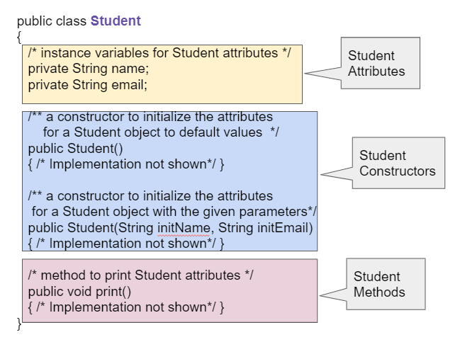
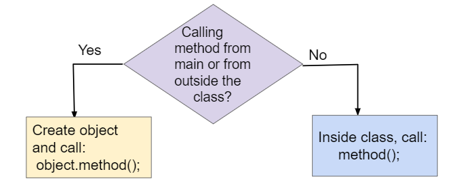

.. include:: ../common.rst

.. qnum::
   :prefix: 2-3-
   :start: 1

.. index::
    single: method
    single: parameter
    single: argument

.. |runbutton| image:: Figures/run-button.png
    :height: 30px
    :align: top
    :alt: run button

.. |github| raw:: html

   <a href="https://github.com/bhoffman0/APCSA-2019/tree/master/_sources/Unit2-Using-Objects/TurtleJavaSwingCode.zip" target="_blank" style="text-decoration:underline">here</a>

|Time45|

Calling Methods Without Parameters
===========================================

**Methods** are a set of instructions that define behaviors for all objects of a class. For example, in the ``Turtle`` class, methods like ``forward()`` and ``turnRight()`` give ``Turtle`` objects the ability to move forward and turn 90 degrees right.

To use an object's method, you must use the object name and the dot (.) operator followed by the method name, for example, ``yertle.forward();`` calls ``yertle``'s ``forward`` method to move a turtle object forward 100 pixels. These are called **object methods** or **non-static methods**. An object method *must* be called on an object of the class that the method is defined in.  Object methods work with the **attributes** of the object, such as the direction the turtle is heading or its position.

Every method call is followed by parentheses. The parentheses ``()`` after method names are there in case you need to give the method parameters (data) to do its job, which we will see in the next lesson. You must always include the parentheses after the method name.

.. note::

   object.method(); is used to call an object's method.

|Exercise| **Check Your Understanding: Mixed-up Code**

.. parsonsprob:: 2_3_Draw7
   :practice: T
   :numbered: left
   :adaptive:
   :noindent:

   The following code uses a turtle to draw the digital number 7, but the lines are mixed up.  Drag the code blocks to the right and put them in the correct order to first draw the line going up (towards the top of the page) and then turn and draw a line to the left to make a 7. Remember that the turtle is facing the top of the page when it is first created. Click on the "Check Me" button to check your solution.
   -----
   public class DrawL
   {
   =====
       public static void main(String[] args)
       {
   =====
           World habitat = new World(300,300);
   =====
           Turtle yertle = new Turtle(habitat);
   =====
           yertle.forward();
   =====
           yertle.turnLeft();
           yertle.forward();
   =====
           habitat.show(true);
   =====
       } // end main
   =====
   } // end class

|CodingEx| **Coding Exercise:**

After you put the mixed up code in order above, type in the same code below to make the turtle draw a 7.
(If the code below does not work for you, you can also use the ``Turtle`` code at this |repl link| (refresh page after forking and if it gets stuck) or download the files |github| to use in your own IDE.)

.. activecode:: TurtleDraw7
    :language: java
    :autograde: unittest
    :datafile: turtleClasses.jar

    import java.awt.*;
    import java.util.*;

    public class TurtleDraw7
    {
        public static void main(String[] args)
        {
            World habitat = new World(300, 300);
            Turtle yertle = new Turtle(habitat);
            // Make yertle draw a 7 using the code above

            habitat.show(true);
        }
    }

    ====
    import static org.junit.Assert.*;

    import org.junit.*;

    import java.io.*;

    public class RunestoneTests extends CodeTestHelper
    {
        public RunestoneTests()
        {
            super("TurtleDraw7");
        }

        @Test
        public void test1()
        {
            String orig = "yertle.forward();\nyertle.turnLeft();\nyertle.forward();";
            boolean passed = checkCodeContains(orig);
            assertTrue(passed);
        }
    }

|CodingEx| **Coding Exercise:**

.. activecode:: TurtleDraw8
    :language: java
    :autograde: unittest
    :datafile: turtleClasses.jar

    Can you make yertle draw the digital number 8, as 2 squares on top of each other?
    ~~~~
    import java.awt.*;
    import java.util.*;

    public class TurtleDraw8
    {
        public static void main(String[] args)
        {
            World habitat = new World(500, 500);
            Turtle yertle = new Turtle(habitat);
            // Make yertle draw an 8 with 2 squares
            yertle.forward();

            habitat.show(true);
        }
    }

    ====
    import static org.junit.Assert.*;

    import org.junit.*;

    import java.io.*;

    public class RunestoneTests extends CodeTestHelper
    {
        public RunestoneTests()
        {
            super("TurtleDraw8");
        }

        @Test
        public void test1()
        {
            String orig =
                    "import java.awt.*;\n"
                            + "import java.util.*;\n\n"
                            + "public class TurtleDraw8\n"
                            + "{\n"
                            + "  public static void main(String[] args)\n"
                            + "  {\n"
                            + "      World habitat = new World(300,300);\n"
                            + "      Turtle yertle = new Turtle(habitat);\n"
                            + "      // Make yertle draw an 8 with 2 squares\n"
                            + "      yertle.forward();\n\n\n"
                            + "      habitat.show(true);\n"
                            + "  }\n"
                            + "}\n";
            boolean passed = codeChanged(orig);
            assertTrue(passed);
        }

        @Test
        public void test2()
        {
            String code = getCode();
            int numForward = countOccurences(code, "forward(");

            boolean passed = numForward >= 7;

            passed = getResults("7 or more", "" + numForward, "Calls to forward()", passed);
            assertTrue(passed);
        }

        @Test
        public void test3()
        {
            String code = getCode();
            int numTurn = countOccurences(code, ".turn");

            boolean passed = numTurn >= 5;

            passed =
                    getResults("5 or more", "" + numTurn, "Calls to turnRight() or turnLeft()", passed);
            assertTrue(passed);
        }
    }

Procedural Abstraction
-----------------------

**Procedural abstraction** allows a programmer to use a method and not worry about the details of how it exactly works. For example, we know that if we hit the brakes, the car will stop, and we can still use the brakes even if we don't really know how they work.

You will learn to write your own methods in Unit 5. In this unit, you should be able to use methods already written for you and figure out what they do. When we use methods for a class in a library, we can look up the **method signature** (or **method header**), which is the method name followed by a parameter list, in its documentation. For example, here is a ``Student`` class with a method signature ``public void print()`` which has an empty parameter list with no parameters. Methods are defined after the instance variables (attributes) and constructors in a class.

    Figure 1: A Student class showing instance variables, constructors, and methods

|Exercise| Check Your Understanding

.. clickablearea:: student_methods
    :question: Click on the method headers (signatures) in the following class. Do not click on the constructors.
    :iscode:
    :feedback: Methods follow the constructors. The method header is the first line of a method.

    :click-incorrect:public class Student {:endclick:

        :click-incorrect:private String name;:endclick:
        :click-incorrect:private String email;:endclick:

        :click-incorrect:public Student(String initName, String intEmail) :endclick:
        :click-incorrect:{:endclick:
            :click-incorrect:name = initName;:endclick:
            :click-incorrect:email = initEmail;:endclick:
         :click-incorrect:}:endclick:

         :click-correct:public String getName() :endclick:
         :click-incorrect:{:endclick:
            :click-incorrect:return name;:endclick:
         :click-incorrect:}:endclick:

         :click-correct:public void print() :endclick:
         :click-incorrect:{:endclick:
            :click-incorrect:System.out.println(name + ":" + email);:endclick:
         :click-incorrect:}:endclick:
    :click-incorrect:}:endclick:

.. |visualization| raw:: html

   <a href="http://www.pythontutor.com/java.html#code=public%20class%20Song%20%7B%0A%20%20%0A%20%20%20%20public%20void%20print%28%29%20%7B%0A%20%20%20%20%20%20%20%20System.out.println%28%22Old%20MacDonald%20had%20a%20farm%22%29%3B%0A%20%20%20%20%20%20%20%20chorus%28%29%3B%0A%20%20%20%20%20%20%20%20System.out.print%28%22And%20on%20that%20farm%20he%20had%20a%20%22%29%3B%0A%20%20%20%20%20%20%20%20animal%28%29%3B%0A%20%20%20%20%20%20%20%20chorus%28%29%3B%0A%20%20%20%20%7D%0A%20%20%20%20public%20void%20chorus%28%29%0A%20%20%20%20%7B%0A%20%20%20%20%20%20%20%20System.out.println%28%22E-I-E-I-O%22%29%3B%0A%20%20%20%20%7D%0A%20%20%20%20%0A%20%20%20%20public%20void%20animal%28%29%20%7B%0A%20%20%20%20%20%20%20System.out.println%28%22duck%22%29%3B%0A%20%20%20%20%7D%0A%20%20%20%20public%20static%20void%20main%28String%5B%5D%20args%29%20%7B%0A%20%20%20%20%20%20%20Song%20s%20%3D%20new%20Song%28%29%3B%0A%20%20%20%20%20%20%20s.print%28%29%3B%0A%20%20%20%20%7D%0A%7D&cumulative=false&curInstr=1&heapPrimitives=nevernest&mode=display&origin=opt-frontend.js&py=java&rawInputLstJSON=%5B%5D&textReferences=false" target="_blank" style="text-decoration:underline">visualization</a>

The Java |visualization| below shows how a song can be divided up into methods. Click on the next button below the code to step through the code. Execution in Java always begins in the ``main`` method in the current class. Then, the flow of control skips from method to method as they are called.  The Song's print method calls the chorus() and animal() methods to help it print out the whole song.

When you call the chorus() method, it skips to the chorus code, executes and prints out the chorus, and then returns back to the method that called it.

.. codelens:: songviz1
    :language: java
    :optional:

    public class Song
    {
      public void print()
      {
        System.out.println("Old MacDonald had a farm");
        chorus();
        System.out.print("And on that farm he had a ");
        animal();
        chorus();
      }

      public void chorus()
      {
        System.out.println("E-I-E-I-O");
      }

      public void animal()
      {
        System.out.println("duck");
      }

      public static void main(String[] args)
      {
        Song s = new Song();
        s.print();
      }
    }

Methods inside the same class can call each other using just ``methodName()``, but to call non-static methods in another class or from a main method, you must first create an object of that class and then call its methods using ``object.methodName()``.

    Figure 2: Calling non-static methods from main() or from other methods inside the same class.

|Exercise| **Check your understanding**

.. mchoice:: songMethods
   :practice: T
   :answer_a: I like to eat eat eat.
   :answer_b: I like to eat eat eat fruit.
   :answer_c: I like to apples and bananas eat.
   :answer_d: I like to eat eat eat apples and bananas!
   :answer_e: Nothing, it does not compile.
   :correct: d
   :feedback_a: Try tracing through the print method and see what happens when it calls the other methods.
   :feedback_b: There is a fruit() method but it does not print out the word fruit.
   :feedback_c: The order things are printed out depends on the order in which they are called from the print method.
   :feedback_d: Yes, the print method calls the eat method 3 times and then the fruit method to print this.
   :feedback_e: Try the code in an active code window to see that it does work.

   What does the following code print out?

   .. code-block:: java

    public class Song
    {
        public void print()
        {
            System.out.print("I like to ");
            eat();
            eat();
            eat();
            fruit();
        }

        public void fruit()
        {
            System.out.println("apples and bananas!");
        }

        public void eat()
        {
            System.out.print("eat ");
        }

        public static void main(String[] args)
        {
            Song s = new Song();
            s.print();
        }
    }

.. |visualization2| raw:: html

   <a href="http://www.pythontutor.com/visualize.html#code=public%20class%20Song%20%7B%0A%20%20%0A%20%20%20%20%20%20%20%20public%20void%20print%28%29%20%7B%0A%20%20%20%20%20%20%20%20%20%20%20%20System.out.print%28%22I%20like%20to%20%22%29%3B%0A%20%20%20%20%20%20%20%20%20%20%20%20eat%28%29%3B%0A%20%20%20%20%20%20%20%20%20%20%20%20eat%28%29%3B%0A%20%20%20%20%20%20%20%20%20%20%20%20eat%28%29%3B%0A%20%20%20%20%20%20%20%20%20%20%20%20fruit%28%29%3B%0A%20%20%20%20%20%20%20%20%7D%0A%20%20%20%20%20%20%20%20public%20void%20fruit%28%29%0A%20%20%20%20%20%20%20%20%7B%0A%20%20%20%20%20%20%20%20%20%20%20%20System.out.println%28%22apples%20and%20bananas!%22%29%3B%0A%20%20%20%20%20%20%20%20%7D%0A%20%20%20%20%20%20%20%20%0A%20%20%20%20%20%20%20%20public%20void%20eat%28%29%20%7B%0A%20%20%20%20%20%20%20%20%20%20%20System.out.print%28%22eat%20%22%29%3B%0A%20%20%20%20%20%20%20%20%7D%0A%20%20%20%20%20%20%20%20public%20static%20void%20main%28String%5B%5D%20args%29%20%7B%0A%20%20%20%20%20%20%20%20%20%20%20Song%20s%20%3D%20new%20Song%28%29%3B%0A%20%20%20%20%20%20%20%20%20%20%20s.print%28%29%3B%0A%20%20%20%20%20%20%20%20%7D%0A%20%20%20%20%7D&cumulative=false&curInstr=1&heapPrimitives=nevernest&mode=display&origin=opt-frontend.js&py=java&rawInputLstJSON=%5B%5D&textReferences=false" target="_blank" style="text-decoration:underline">visualization</a>

Try this |visualization2| to see this code in action.

.. note::

    method(); is used to call a method within the same class, but object.method(); is necessary if you are calling the method from the main method or from a different class.

Before you call a method from ``main`` or from outside of the current class, you must make sure that you have created and initialized an object. Remember that if you just declare an object reference without setting it to refer to a new object the value will be ``null`` meaning that it doesn't reference an object. If you call a method on a variable whose value is ``null``, you will get a **NullPointerException** error, where a **pointer** is another name for a reference.

|Groupwork| Programming Challenge : Draw a Letter
-------------------------------------------------

Working in pairs, use the area below (or the |repl link|) to use a turtle to draw a simple block-style letter or number that uses just straight lines (no curves or diagonals). It could be one of your initials or a number from today's date.

It may help to act out the code pretending you are the turtle. Remember that which way you turn depends on which direction you are facing, and the turtle begins facing north (towards the top of the page).

Here are some simple turtle methods that you can use:

- ``forward()``
- ``turnLeft()``
- ``turnRight()``
- ``backward()``
- ``penUp()``
- ``penDown()``

.. |repl link| raw:: html

   <a href="https://firewalledreplit.com/@BerylHoffman/Java-Swing-Turtle#Main.java" target="_blank">repl.it link</a>

You may notice that it is challenging to have your turtle draw with these simple methods. In the next lesson, we will use more complex ``Turtle`` methods where you can indicate how many steps to take or what angle to turn that will make drawing a lot easier!

.. activecode:: challenge2-3-Turtle_Letter
    :language: java
    :autograde: unittest
    :datafile: turtleClasses.jar

    Create a drawing of a simple letter or number that uses just straight lines (no curves or diagonals). It could be an initial in your name or a number from today's date.
    ~~~~
    import java.awt.*;
    import java.util.*;

    public class TurtleLetter
    {
        public static void main(String[] args)
        {
            World habitat = new World(300, 300);

            habitat.show(true);
        }
    }

    ====
    import static org.junit.Assert.*;

    import org.junit.*;

    import java.io.*;

    public class RunestoneTests extends CodeTestHelper
    {
        public RunestoneTests()
        {
            super("TurtleLetter");
        }

        @Test
        public void test1()
        {
            String orig =
                    "import java.awt.*;\n"
                            + "import java.util.*;\n\n"
                            + "public class TurtleLetter\n"
                            + "{\n"
                            + "  public static void main(String[] args)\n"
                            + "  {\n"
                            + "      World habitat = new World(300,300);\n\n\n\n"
                            + "      habitat.show(true);\n"
                            + "  }\n"
                            + "}\n";
            boolean passed = codeChanged(orig);
            assertTrue(passed);
        }

        @Test
        public void test2()
        {
            String code = getCode();
            String[] lines = code.split("\n");

            boolean passed = lines.length >= 20;
            passed =
                    getResults(
                            "20 or more lines",
                            lines.length + " lines",
                            "Adding a reasonable amount of lines to code",
                            passed);
            assertTrue(passed);
        }
    }

Summary
-------------------

- **Methods** are a set of instructions that define the behaviors for all objects of the class.

- Use **dot notation** to execute an object's method.  This is the object's name followed by the dot (.) operator followed by the method name and parentheses: **object.method();**

- A **method signature** is the method name followed by the parameter list which gives the type and name for each parameter. Note that methods do not have to take any parameters, but you still need the parentheses after the method name.

- **Procedural abstraction** allows a programmer to use a method by knowing in general what it does without knowing what lines of code execute. This is how we can drive a car without knowing how the brakes work.

- A **method** or **constructor** call interrupts the sequential execution of statements, causing the program to first execute the statements in the method or constructor before continuing. Once the last statement in the method or constructor has executed or a ``return`` statement is executed, the flow of control is returned to the point immediately following the method or constructor call.

- A **NullPointerException** will happen if you try to call an object method on an object variable whose value is ``null``.  This usually means that you forgot to create the object using the ``new`` operator followed by the class name and parentheses.

- An **object method** or **non-static method** is one that must be called on an object of a class.  It usually works with the object's attributes.

- A **static method** or **class method** method is one that doesn't need to be called on an object of a class.

AP Practice
------------

.. mchoice:: AP2-3-1
    :practice: T

    Consider the following class definition.

    .. code-block:: java

        public class Party
        {
            private int numInvited;
            private boolean partyCancelled;

            public Party()
            {
                numInvited = 1;
                partyCancelled = false;
            }

            public void inviteFriend()
            {
                numInvited++;
            }

            public void cancelParty()
            {
                partyCancelled = true;
            }
        }

    Assume that a Party object called myParty has been properly declared and initialized in a class other than Party.  Which of the following statements are valid?

    - myParty.cancelParty();

      + Correct!

    - myParty.inviteFriend(2);

      - The method inviteFriend() does not have any parameters.

    - myParty.endParty();

      - There is no endParty() method in the class Party.

    - myParty.numInvited();

      - There is no numInvited() method in the class Party. It is an instance variable.

    - System.out.println( myParty.cancelParty() );

      - This would cause an error because the void method cancelParty() does not return a String that could be printed.

.. mchoice:: AP2-3-2
    :practice: T

    Consider the following class definition.

    .. code-block:: java

        public class Cat
        {
            public void meow()
            {
                System.out.print("Meow ");
            }

            public void purr()
            {
                System.out.print("purr");
            }

            public void welcomeHome()
            {
                purr();
                meow();
            }
            /* Constructors not shown */
        }

    Which of the following code segments, if located in a method in a class other than Cat, will cause the message "Meow purr" to be printed?

    - .. code-block:: java

        Cat a = new Cat();
        Cat.meow();
        Cat.purr();

      - You must use the object a, not the class name Cat, to call these methods.

    - .. code-block:: java

        Cat a = new Cat();
        a.welcomeHome();

      - This would print "purrMeow "

    - .. code-block:: java

        Cat a = new Cat();
        a.meow();
        a.purr();

      + Correct!

    - .. code-block:: java

         Cat a = new Cat().welcomeHome();

      - This would cause a syntax error.

    - .. code-block:: java

         Cat a = new Cat();
         a.meow();

      - This would just print "Meow ".
