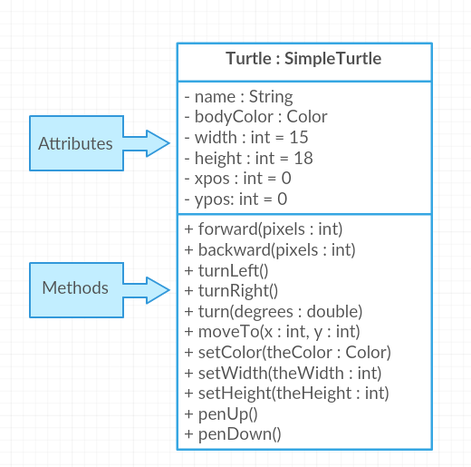
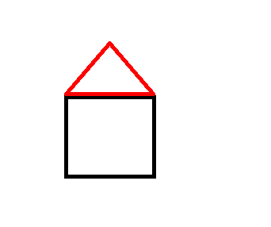
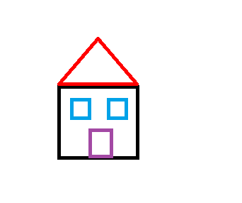

.. include:: ../common.rst

.. qnum::
   :prefix: 2-4-
   :start: 1

.. index::
    single: method
    single: parameter
    single: argument

.. |github| raw:: html

   <a href="https://github.com/bhoffman0/APCSA-2019/tree/master/_sources/Unit2-Using-Objects/TurtleJavaSwingCode.zip" target="_blank" style="text-decoration:underline">here</a>

.. |runbutton| image:: Figures/run-button.png
    :height: 30px
    :align: top
    :alt: run button

|Time90|

Calling Methods With Parameters
===========================================

In the last lessons, we used simple **methods** like ``forward`` and ``turnRight`` to make the turtle draw lines. You may have noticed that ``forward()`` and ``backward()`` always move the same number of pixels (100 pixels), and ``turnRight()`` and ``turnLeft()`` always turn at right angles (90 degrees). This is a little limiting. What if we wanted to draw a triangle or the letter A? These require smaller angles to draw diagonal lines and different length lines. Luckily, there are more complex methods in the ``Turtle`` class that let you specify the number of pixels to move forward or the number of degrees to turn. These values that you can give to methods to help them do their job are called **arguments** or **parameters**.

The parentheses ``()`` after method names when we call a method are there in case you need to give the method **actual parameters** or **arguments** (some data) to do its job. For example, we can give the argument 100 in ``forward(100)`` to make the turtle go forward 100 pixels or the argument 30 in ``turn(30)`` to make the turtle turn 30 degrees instead of 90 degrees.

.. note::

    object.method(arguments); is used to call an object's method and give it some arguments (actual parameters) to do its job.

Although some people use the words parameters and arguments interchangeably, there is a subtle difference. When you create your own method, the variables you define for it are called **formal parameters**. When you call the method to do its job, you give or pass in **arguments** or **actual parameters** to it that are then saved in the parameter variables. So, in the definition of the ``forward`` method, it has a parameter variable called ``pixels``, and in the call to ``forward(100)``, the argument is the value 100 which will get saved in the parameter variable pixels. You will learn to write your own methods in Unit 5. In this unit, you will learn to call methods that are already written for you.

.. code-block:: java

    // Method call
    yertle.forward(100); // argument is 100

    // Method definition written for you
    public void forward(int pixels) // parameter pixels
    ...

|Exercise| **Check your understanding**

.. dragndrop:: Params
    :feedback: Review the vocabulary above.
    :match_1: an object's behaviors or functions that can be used or called to do its job|||methods
    :match_2: the values or data passed to an object's method|||arguments or actual parameters
    :match_3: the variables in a method's definition that hold the arguments|||formal parameters
    :match_4: asking to run the method|||method call

    Drag the definition from the left and drop it on the correct word on the right.  Click the "Check Me" button to see if you are correct.

.. raw:: html

   

.. parsonsprob:: 2_1_Turtle_Turn
       :numbered: left
       :adaptive:
       :noindent:

       The following program uses a turtle to draw the picture shown to the left, but the lines are mixed up.  The program should do all necessary set-up: import items, start the class definition, start the main method, and create a world and turtle. Then it should ask the turtle to turn 45 degrees, go forward 100 pixels, turn right, and then go forward 50 pixels. Next, it should ask the world to show itself. Finally, it should close the main method and class definition. We have added a compass to the picture to indicate the directions north, south, west, and east. Drag the needed blocks of statements from the left column to the right column and put them in the right order.  There are three extra blocks that are not needed in a correct solution.  Then click on Check Me to see if you are right. You will be told if any of the lines are in the wrong order or are the wrong blocks.
       -----
       import java.util.*;
       import java.awt.*;
       =====
       public class TurtleTest {
       =====
           public static void main(String[] args) {
       =====
               World world = new World(300,300);
               Turtle yertle = new Turtle(world);
       =====
               yertle.turn(45);
       =====
               yertle.turnRight(45); #paired
       =====
               yertle.forward(100);
       =====
               yertle.turnRight();
       =====
               yertle.forward(50);
       =====
               yertle.forward(50; #paired
       =====
               world.show(true);
       =====
               world.show(true) #paired
       =====
           } // end main
       } // end class

Here is the Turtle class diagram again that shows some of the variables and methods inherited from the SimpleTurtle class in the class Turtle that are written for you.

    Figure 1: Turtle Class Diagram

.. |Color| raw:: html

   <a href= "https://docs.oracle.com/javase/7/docs/api/java/awt/Color.html" target="_blank">Color</a>

.. |javadoc (documentation) file| raw:: html

   <a href="https://www2.cs.uic.edu/~i101/doc/SimpleTurtle.html" target="_blank">javadoc (documentation) file</a>

Try some of the methods above in the turtle code below. You can see all the methods that are inherited in Turtle in this |javadoc (documentation) file|.

Methods are said to be **overloaded** when there
are multiple methods with the same name but a
different **method signature**, where it requires a different number or type of parameters. For example, we have two different forward methods, forward() with no parameters and forward(100) which has a parameter that tells it how much to move forward. If there is more than one parameter, then the values given to the method need to correspond to the order and types in the method signature.

|CodingEx| **Coding Exercise**

(If the code below does not work in your browser, you can also use the Turtle code at this |repl link| (refresh page after forking and if it gets stuck) or download the files |github| to use in your own IDE.)

.. activecode:: TurtleTestMethods1
    :language: java
    :autograde: unittest
    :datafile: turtleClasses.jar

    1. Can you make yertle draw a square and change the pen color for each side of the square? Try something like: yertle.setColor(Color.red); This uses the |Color| class in Java which has some colors predefined like red, yellow, blue, magenta, cyan. You can also use more specific methods like setPenColor, setBodyColor, and setShellColor.
    2. Can you draw a triangle? The turnRight() method always does 90 degree turns, but you'll need external angles of 120 degree for an equilateral triangle. Use the turn method which has a parameter for the angle of the turn in degrees. For example, turn(90) is the same as turnRight(). Try drawing a triangle with different colors.
    ~~~~
    import java.awt.*;
    import java.util.*;

    public class TurtleTestMethods1
    {
        public static void main(String[] args)
        {
            World world = new World(300, 300);
            Turtle yertle = new Turtle(world);

            yertle.forward(100);
            yertle.turnLeft();
            yertle.forward(75);

            world.show(true);
        }
    }

    ====
    import static org.junit.Assert.*;

    import org.junit.*;

    import java.io.*;

    public class RunestoneTests extends CodeTestHelper
    {
        public RunestoneTests()
        {
            super("TurtleTestMethods1");
        }

        @Test
        public void test1()
        {
            boolean passed = codeChanged(
                "import java.awt.*;\n" +
                "import java.util.*;\n" +
                "\n" +
                "public class TurtleTestMethods1\n" +
                "{\n" +
                "    public static void main(String[] args)\n" +
                "    {\n" +
                "        World world = new World(300, 300);\n" +
                "        Turtle yertle = new Turtle(world);\n" +
                "\n" +
                "        yertle.forward(100);\n" +
                "        yertle.turnLeft();\n" +
                "        yertle.forward(75);\n" +
                "\n" +
                "        world.show(true);\n" +
                "    }\n" +
                "}\n"
            );
            assertTrue(passed);
        }

        @Test
        public void test2()
        {
            String code = getCode();
            int numColors = countOccurences(code, "Color(");

            boolean passed = numColors >= 3;
            passed = getResults("3 or more", "" + numColors, "Changes color at least 3 times", passed);
            assertTrue(passed);
        }

        @Test
        public void test3()
        {
            String code = getCode();
            int numTurns = countOccurences(code, ".turn");

            boolean passed = numTurns >= 3;
            passed = getResults("3 or more", "" + numTurns, "Turns at least 3 times", passed);
            assertTrue(passed);
        }

        @Test
        public void test4()
        {
            String code = getCode();
            int numTurns = countOccurences(code, ".turn(");

            boolean passed = numTurns >= 1;
            passed = getResults("1 or more", "" + numTurns, "Calls to turn(...)", passed);
            assertTrue(passed);
        }

        @Test
        public void test5()
        {
            String code = getCode();
            int numForward = countOccurences(code, ".forward(");

            boolean passed = numForward >= 4;
            passed = getResults("4 or more", "" + numForward, "Calls to forward()", passed);
            assertTrue(passed);
        }
    }

|CodingEx| **Coding Exercise**

Try the following mixed up code to draw a simple house made of a square and a triangle roof.

.. parsonsprob:: DrawAHouse
   :numbered: left
   :practice: T
   :adaptive:
   :noindent:

   The following code uses a turtle to draw a simple house, but the lines are mixed up.  Drag the code blocks to the right and put them in the correct order to first draw a square for the house and then a red triangle for the roof.  Click on the "Check Me" button to check your solution.  You can type this code in the Active Code window above to see it in action.
   -----
   public class TurtleDrawHouse
   {
   =====
      public static void main(String[] args)
      {
      =====
         World world = new World(300,300);
         =====
         Turtle builder = new Turtle(world);
         =====
         // Draw a square
         builder.turnRight();
         builder.forward(100);
         builder.turnRight();
         builder.forward(100);
         builder.turnRight();
         builder.forward(100);
         builder.turnRight();
         builder.forward(100);
         =====
         builder.setColor(Color.red);
         =====
         // Draw a triangle
         builder.turn(30);
         builder.forward(100);
         builder.turn(120);
         builder.forward(100);
         builder.turn(120);
         builder.forward(100);
         =====
         world.show(true);
         =====
      }
      =====
   }

Tracing Methods
-----------------

You will not write your own methods until Unit 5, but you should be able to trace and interpret method calls like below.

Here is another version of the Old MacDonald Song with a more powerful abstraction. The method verse has 2 parameters for the animal and the noise it makes, so that it can be used for any animal.
Use the Code Lens button or this |Java Visualizer| to step through the code.

.. |Java visualizer| raw:: html

   <a href="http://www.pythontutor.com/java.html#code=public%20class%20Song%20%0A%7B%0A%20%20%0A%20%20%20%20public%20void%20verse%28String%20animal,%20String%20noise%29%20%0A%20%20%20%20%7B%0A%20%20%20%20%20%20%20%20System.out.println%28%22Old%20MacDonald%20had%20a%20farm%22%29%3B%0A%20%20%20%20%20%20%20%20chorus%28%29%3B%0A%20%20%20%20%20%20%20%20System.out.println%28%22And%20on%20that%20farm%20he%20had%20a%20%22%20%2B%20animal%29%3B%0A%20%20%20%20%20%20%20%20chorus%28%29%3B%0A%20%20%20%20%20%20%20%20System.out.println%28%22With%20a%20%22%20%2B%20noise%20%2B%20%22%20%22%20%2B%20noise%20%2B%20%22%20here,%22%29%3B%0A%20%20%20%20%20%20%20%20System.out.println%28%22And%20a%20%22%20%2B%20noise%20%2B%20%22%20%22%20%2B%20noise%20%2B%20%22%20there,%22%29%3B%0A%20%20%20%20%20%20%20%20System.out.println%28%22Old%20MacDonald%20had%20a%20farm%22%29%3B%0A%20%20%20%20%20%20%20%20chorus%28%29%3B%0A%20%20%20%20%7D%0A%20%20%20%20public%20void%20chorus%28%29%0A%20%20%20%20%7B%0A%20%20%20%20%20%20%20%20System.out.println%28%22E-I-E-I-O%22%29%3B%0A%20%20%20%20%7D%0A%20%20%20%20%0A%20%20%20%20public%20static%20void%20main%28String%5B%5D%20args%29%20%0A%20%20%20%20%7B%0A%20%20%20%20%20%20%20Song%20s%20%3D%20new%20Song%28%29%3B%0A%20%20%20%20%20%20%20s.verse%28%22cow%22,%20%22moo%22%29%3B%0A%20%20%20%20%20%20%20s.verse%28%22duck%22,%22quack%22%29%3B%0A%20%20%20%20%7D%0A%7D&cumulative=false&curInstr=1&heapPrimitives=nevernest&mode=display&origin=opt-frontend.js&py=java&rawInputLstJSON=%5B%5D&textReferences=false" target="_blank" style="text-decoration:underline">Java visualizer</a>

.. activecode:: SongFarm
    :language: java
    :autograde: unittest
    :practice: T

    Add another verse in main that calls the method verse with a different animal and noise.
    ~~~~
    public class Song
    {

        public void verse(String animal, String noise)
        {
            System.out.println("Old MacDonald had a farm");
            chorus();
            System.out.println("And on that farm he had a " + animal);
            chorus();
            System.out.println("With a " + noise + " " + noise + " here,");
            System.out.println("And a " + noise + " " + noise + " there,");
            System.out.println("Old MacDonald had a farm");
            chorus();
        }

        public void chorus()
        {
            System.out.println("E-I-E-I-O");
        }

        public static void main(String[] args)
        {
            Song s = new Song();
            s.verse("cow", "moo");
            s.verse("duck", "quack");
        }
    }

    ====
    // Test for 2.4.4 Song
      import static org.junit.Assert.*;
      import org.junit.*;;
      import java.io.*;
      
      public class RunestoneTests extends CodeTestHelper
      {
          public String verse1 = "Old MacDonald had a farm\nE-I-E-I-O\nAnd on that farm he had a cow\nE-I-E-I-O\nWith a moo moo here,\nAnd a moo moo there,\nOld MacDonald had a farm\nE-I-E-I-O";
          public String verse2 = "Old MacDonald had a farm\nE-I-E-I-O\nAnd on that farm he had a duck\nE-I-E-I-O\nWith a quack quack here,\nAnd a quack quack there,\nOld MacDonald had a farm\nE-I-E-I-O";
      
          public String verse3 = "Old MacDonald had a farm\nE-I-E-I-O\nAnd on that farm he had a ...\nE-I-E-I-O\nWith a ... ... here,\nAnd a ... ... there,\nOld MacDonald had a farm\nE-I-E-I-O";
      
          public RunestoneTests() {
              super("Song");
          }
      
          @Test
          public void test1()
          {
              String output = getMethodOutput("main");
              output = output.replace(verse1, "").trim();
              output = output.replace(verse2, "").trim();
              
              boolean passed = output.length() > 0;
              
              passed = getResults(verse3, output, "Contains new verse", passed);
              assertTrue(passed);
          }
      
          @Test
          public void test2()
          {
              String output = getMethodOutput("main");
      
              boolean passed1 = output.contains(verse1);
              boolean passed2 = output.contains(verse2);
              boolean passed = passed1 && passed2;
      
              String exp = "Verse 1: true\nVerse 2: true";
              String act = "Verse 1: " + passed1 + "\nVerse 2: " + passed2;
      
              passed = getResults(exp, act, "Contains original verses", passed);
              assertTrue(passed);
          }
      
          @Test
          public void testCode1() {
              String[] lines = getCode().split("\n");
              String expect = "s.verse(";
              String output = "";
              int count = 0;
      
              for (int i = 0; i < lines.length; i++) {
                  if (lines[i].contains(expect)) {
                      output += lines[i].trim() + "\n";
                      count++;               
                  }
              }
      
              String expected = "s.verse(\"cow\", \"moo\");\ns.verse(\"duck\",\"quack\");\ns.verse(\"...\", \"...\");";
      
              boolean passed = count >= 3;
              passed = getResults(expected, output, "Added third call to verse", passed);
              assertTrue(passed);
          }
      }

|Exercise| **Check your understanding**

.. mchoice:: traceMethods
   :practice: T
   :answer_a: 25 and 2
   :answer_b: 25 and .5
   :answer_c: 2 25
   :answer_d: 25 2
   :answer_e: Nothing, it does not compile.
   :correct: a
   :feedback_a: Correct.
   :feedback_b: The order of the arguments to the divide(x,y) method will divide x by y and return an int result.
   :feedback_c: The square(x) method is called before the divide(x,y) method.
   :feedback_d: The main method prints out " and " in between the method calls.
   :feedback_e: Try the code in the visualizer link below.

   What does the following code print out?

   .. code-block:: java

      public class MethodTrace
      {
          public void square(int x)
          {
              System.out.print(x * x);
          }

          public void divide(int x, int y)
          {
              System.out.println(x / y);
          }

          public static void main(String[] args)
          {
              MethodTrace traceObj = new MethodTrace();
              traceObj.square(5);
              System.out.print(" and ");
              traceObj.divide(4, 2);
          }
      }

.. |visualization| raw:: html

   <a href="http://www.pythontutor.com/visualize.html#code=%20%20public%20class%20MethodTrace%20%0A%20%20%20%20%20%20%7B%0A%20%20%20%20%20%20%20%20public%20void%20square%28int%20x%29%0A%20%20%20%20%20%20%20%20%7B%0A%20%20%20%20%20%20%20%20%20%20%20%20System.out.print%28x*x%29%3B%0A%20%20%20%20%20%20%20%20%7D%0A%20%20%20%20%20%20%20%20public%20void%20divide%28int%20x,%20int%20y%29%0A%20%20%20%20%20%20%20%20%7B%0A%20%20%20%20%20%20%20%20%20%20%20%20System.out.println%28x/y%29%3B%0A%20%20%20%20%20%20%20%20%7D%0A%20%20%20%20%20%20%20%20public%20static%20void%20main%28String%5B%5D%20args%29%20%7B%0A%20%20%20%20%20%20%20%20%20%20%20%20MethodTrace%20traceObj%20%3D%20new%20MethodTrace%28%29%3B%0A%20%20%20%20%20%20%20%20%20%20%20%20traceObj.square%285%29%3B%0A%20%20%20%20%20%20%20%20%20%20%20%20System.out.print%28%22%20and%20%22%29%3B%0A%20%20%20%20%20%20%20%20%20%20%20%20traceObj.divide%284,2%29%3B%0A%20%20%20%20%20%20%20%20%7D%0A%20%20%20%20%20%20%20%7D&cumulative=false&curInstr=18&heapPrimitives=nevernest&mode=display&origin=opt-frontend.js&py=java&rawInputLstJSON=%5B%5D&textReferences=false" target="_blank" style="text-decoration:underline">visualization</a>

Try this |visualization| to see this code in action.

|Groupwork| Programming Challenge : Turtle House
------------------------------------------------

This creative challenge is fun to do collaboratively in pairs. Design a house and have the turtle draw it with different colors below (or with this |repl link|). Can you add windows and a door? Come up with your own house design as a team.

To draw a window, you will need to call ``penUp`` to walk the turtle into position, for example:

.. code-block:: java

   builder.penUp();
   builder.moveTo(120,200);
   builder.penDown();

It may help to act out the code pretending you are the turtle. Remember that the angles you turn depend on which direction you are facing, and the turtle begins facing up.

.. |repl link| raw:: html

   <a href="https://firewalledreplit.com/@BerylHoffman/Java-Swing-Turtle#Main.java" target="_blank">repl.it link</a>

.. activecode:: challenge2-4-TurtleHouse
    :language: java
    :autograde: unittest
    :datafile: turtleClasses.jar

    Draw a Turtle House! Make sure you use forward, turn, penUp, penDown, moveTo methods as well as different colors. Have fun!
    ~~~~
    import java.awt.*;
    import java.util.*;

    public class TurtleHouse
    {
        public static void main(String[] args)
        {
            World world = new World(300, 300);

            world.show(true);
        }
    }

    ====
    import static org.junit.Assert.*;

    import org.junit.*;

    import java.io.*;

    public class RunestoneTests extends CodeTestHelper
    {
        public RunestoneTests()
        {
            super("TurtleHouse");
        }

        @Test
        public void test1()
        {
            String orig =
                    "import java.awt.*;\n"
                            + "import java.util.*;\n"
                            + "public class TurtleHouse\n"
                            + "{\n"
                            + "  public static void main(String[] args)\n"
                            + "  {\n"
                            + "      World world = new World(300,300);\n\n\n\n"
                            + "      world.show(true);\n"
                            + "  }\n"
                            + "}\n";
            boolean passed = codeChanged(orig);
            assertTrue(passed);
        }

        @Test
        public void test2()
        {
            String code = getCode();
            int num = countOccurences(code, "moveTo(");

            boolean passed = num >= 1;
            passed = getResults("1 or more", "" + num, "Calls moveTo(...)", passed);
            assertTrue(passed);
        }

        @Test
        public void test3()
        {
            String code = getCode();
            int num = countOccurences(code, ".penUp()");

            boolean passed = num >= 1;
            passed = getResults("1 or more", "" + num, "Calls penUp()", passed);
            assertTrue(passed);
        }

        @Test
        public void test4()
        {
            String code = getCode();
            int num = countOccurences(code, ".penDown(");

            boolean passed = num >= 1;
            passed = getResults("1 or more", "" + num, "Calls penDown()", passed);
            assertTrue(passed);
        }

        @Test
        public void test5()
        {
            String code = getCode();
            int numTurns = countOccurences(code, ".turn");

            boolean passed = numTurns >= 6;
            passed = getResults("6 or more", "" + numTurns, "turns", passed);
            assertTrue(passed);
        }

        @Test
        public void test6()
        {
            String code = getCode();
            int numForward = countOccurences(code, ".forward(");

            boolean passed = numForward >= 6;
            passed = getResults("6 or more", "" + numForward, "Calls to forward()", passed);
            assertTrue(passed);
        }
    }

Summary
-------------------

- **Methods** define the behaviors or functions for objects.

- To use an object's method, you must use the object name and the dot (.) operator followed by the method name, for example **object.method();**

- Some methods take parameters/arguments that are placed inside the parentheses **object.method(arguments)**.

- Values provided in the parameter list need to correspond to the order and type in the method signature.

AP Practice
-------------

.. mchoice:: AP2-4-1
    :practice: T

    Consider the following methods:

    .. code-block:: java

        public void inchesToCentimeters(double i)
        {
            double c = i * 2.54;
            printInCentimeters(i, c);
        }

        public void printInCentimeters(double inches, double centimeters)
        {
            System.out.print(inches + "-->" + centimeters);
        }

    Assume that the method call ``inchesToCentimeters(10)`` appears in a method in the same class. What is printed as a result of the method call?

    - inches --> centimeters

      - The values of the variables inches and centimeters should be printed out, not the words.

    - 10 -->  25

      - Two doubles should be printed, not two ints, and the centimeters should be 25.4

    - 25.4 --> 10

      - Inches should be printed before centimeters.

    - 10 --> 12.54

      - c = 10 * 2.54 = 25.4, not 12.54.

    - 10.0 --> 25.4

      + Correct! centimeters = 10 * 2.54 = 25.4.

.. mchoice:: AP2-4-2
    :practice: T

    Consider the following methods, which appear in the same class.

    .. code-block:: java

        public void splitPizza(int numOfPeople)
        {
            int slicesPerPerson = 8/numOfPeople;
            /* INSERT CODE HERE */
        }

        public void printSlices(int slices)
        {
            System.out.println("Each person gets " + slices + " slices each");
        }

    Which of the following lines would go into ``/* INSERT CODE HERE */`` in the method splitPizza in order to call the ``printSlices`` method to print the number of slices per person correctly?

    - printSlices(slicesPerPerson);

      + Correct! If you had 4 people, slicesPerPerson would be 8/4=2 and printSlices would print out "Each person gets 2 slices each".

    - printSlices(numOfPeople);

      - If you had 4 people, this would print out that they get 4 slices each of an 8 slice pizza.

    - printSlices(8);

      - This would always print out 8 slices each.

    - splitPizza(8);

      - This would not call the printSlices method.

    - splitPizza(slicesPerPerson);

      - This would not call the printSlices method.
