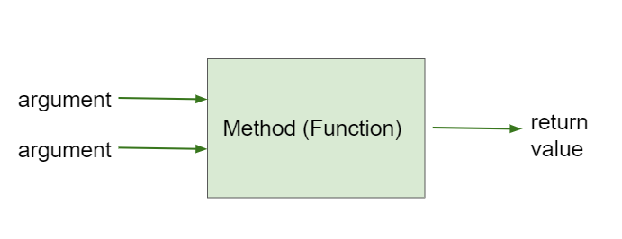

.. include:: ../common.rst

.. qnum::
   :prefix: 2-5-
   :start: 1

.. index::
    single: method
    single: parameter
    single: argument
    single: return

.. |runbutton| image:: Figures/run-button.png
    :height: 30px
    :align: top
    :alt: run button

.. |repl link| raw:: html

   <a href="https://firewalledreplit.com/@BerylHoffman/Java-Swing-Turtle#Main.java" target="_blank" style="text-decoration:underline">repl.it link</a>

.. |github| raw:: html

   <a href="https://github.com/bhoffman0/APCSA-2019/tree/master/_sources/Unit2-Using-Objects/TurtleJavaSwingCode.zip" target="_blank" style="text-decoration:underline">here</a>

|Time45|

Methods that Return Values
==========================

All the methods on ``Turtle`` that we’ve discussed so far have had a ``void``
return type. Such methods are sometimes called **void methods**. Because a
``void`` method doesn’t return any value, the only point of calling one is
because it does something that can be observed by the user or by other code—it
changes the state of the object or maybe causes something to happen like drawing
a line on the screen. Or both. These things they do are sometimes called
“effects”.

In contrast, methods with a return type of anything `other` than ``void`` are
called **non-void** methods. These methods **return** a value that the code
calling the method can use. And because methods are called on an object, these
methods can be used to return values that tell us things about an object’s
internal state.

In well-designed programs, non-void methods typically don’t have effects; they
just compute and return a value. And void methods obviously can’t return values.
So most methods are of one kind or the other: either a void method which is
called for some effect or a non-void method that is called to compute a value
but otherwise has no effect. To put it another way, void methods `do things`
while non-void methods `produce values`.

Accessors / Getters
-------------------------

A simple kind of method that returns a value is what is formally called an
**accessor** because it accesses a value in an object. In the real world
everyone calls them **getters**. A getter is a method that takes no arguments
and has a non-\ ``void`` return type. In Java they are almost always named
something that starts with ``get``, and they usually just return the value of one
of the object’s instance variables. For example, the ``Turtle`` class has
several getters, ``getWidth`` and ``getHeight`` which return the width and the
height of a ``Turtle`` object and ``getXPos`` and ``getYPos`` which return the x
and y values of the ``Turtle``\ ’s position.

That means that after you construct a ``Turtle``, either at the default position
in the middle of the ``World`` or by specifying a starting point as arguments to
the constructor, you don’t need to keep track of where you put it; you can
always get its current position with the ``getXPos`` and ``getYPos`` getters.
Better yet, after creating a ``Turtle`` and moving it all around with the
``forward`` and ``turn`` methods we discussed in the previous section, you don’t
have to figure out where it ended up; you can just ask it for its new position,
again with the ``getXPos`` and ``getYPos`` getters.

Note that when you use a getter, you need to do something with the value it
returns. You might assign it to a variable, use it in an expression, or print it
out. If you don’t, you’re just getting a value and doing nothing with it—you
might as well not have bothered to call the getter in the first place.

Here are some examples of using getters on the ``Turtle`` object ``yertle``.

.. code-block:: java

    Turtle yertle = new Turtle(world);
    int width = yertle.getWidth();
    int height = yertle.getHeight();
    System.out.println("Yertle's width is: " + width);
    System.out.println("Yertle's height is: " + height);
    System.out.println("Yertle's x position is: " + yertle.getXPos() );
    System.out.println("Yertle's y position is: " + yertle.getYPos() );

.. note::

    A common error is forgetting to do something with the value returned from a method. When you call a method that returns a value, you should do something with that value like assigning it to a variable or printing it out.

|CodingEx| **Coding Exercise:**

.. activecode:: TurtleTestGetSet
    :language: java
    :autograde: unittest
    :datafile: turtleClasses.jar

    Try the code below that creates a turtle and moves it around a bit. Can you
    confirm that its new position matches what you’d expect given the movements
    it made? Try changing where it moves to make sure.

    (If the code below does not work in your browser, you can also copy in the
    code below into the Turtle code at this |repl link| (refresh page after
    forking and if it gets stuck) or download the files |github| to use in your
    own IDE.)

    ~~~~
    import java.awt.*;
    import java.util.*;

    public class TurtleTestGetSet
    {
        public static void main(String[] args)
        {
            World world = new World(300, 300);
            Turtle yertle = new Turtle(world);
            System.out.println(
                    "Yertle is starting at: "
                            + yertle.getXPos()
                            + ", "
                            + yertle.getYPos());
            yertle.forward(100);
            yertle.turn(90);
            yertle.forward(50);
            System.out.println(
                    "Yertle has ended up at: "
                            + yertle.getXPos()
                            + ", "
                            + yertle.getYPos());
            world.show(true);
        }
    }

    ====
    import static org.junit.Assert.*;

    import org.junit.*;

    import java.io.*;

    public class RunestoneTests extends CodeTestHelper
    {
        public RunestoneTests()
        {
            super("TurtleTestGetSet");
        }

        @Test
        public void test1()
        {
            String orig =
                    "import java.awt.*;\n"
                        + "import java.util.*;\n\n"
                        + "public class TurtleTestGetSet\n"
                        + "{\n"
                        + "public static void main(String[] args)\n"
                        + "{\n"
                        + "World world = new World(300,300);\n"
                        + "Turtle yertle = new Turtle(world);\n"
                        + "System.out.println(\"Yertle is starting at: \" + yertle.getXPos() + \", \" +"
                        + " yertle.getYPos());\n"
                        + "yertle.forward(100);\n"
                        + "yertle.turn(90);\n"
                        + "yertle.forward(50);\n"
                        + "System.out.println(\"Yertle has ended up at: \" + yertle.getXPos() + \", \" +"
                        + " yertle.getYPos());\n"
                        + "world.show(true);\n"
                        + "}\n"
                        + "}\n";
            boolean passed = codeChanged(orig);
            assertTrue(passed);
        }
    }

|CodingEx| **Coding Exercise:**

.. activecode:: TurtleArea
    :language: java
    :autograde: unittest
    :datafile: turtleClasses.jar

    Fix the errors in the code below so that it prints out the area of the space
    that the turtle occupies by multiplying its width and height. Remember that
    you have to do something with the values that the get methods return.

    ~~~~
    import java.awt.*;
    import java.lang.Math;
    import java.util.*;

    public class TurtleArea
    {
        public static void main(String[] args)
        {
            World world = new World(300,300);
            Turtle yertle = new Turtle(world);

            int area;
            yertle.getWidth() * getHeight;
            System.out.println("Yertle's area is: ");
        }
    }
    ====
    import static org.junit.Assert.*;

    import org.junit.*;

    import java.io.*;

    public class RunestoneTests extends CodeTestHelper
    {
        public RunestoneTests()
        {
            super("TurtleArea");
        }

        @Test
        public void test1()
        {
            String actual = getMethodOutput("main");
            String expected = "Yertle's area is: 270";
            boolean passed = getResults(expected, actual, "Prints correct answer");
            assertTrue(passed);
        }

        @Test
        public void test2()
        {
            String code = getCode();
            String target = ".getHeight()";

            int num = countOccurences(code, target);

            boolean passed = num >= 1;

            getResults("1+", "" + num, "Calls to " + target, passed);
            assertTrue(passed);
        }

        @Test
        public void test3()
        {
            String code = getCode();
            String target = ".getWidth()";

            int num = countOccurences(code, target);

            boolean passed = num >= 1;

            getResults("1+", "" + num, "Calls to " + target, passed);
            assertTrue(passed);
        }
    }

|CodingEx| **Coding Exercise:**

.. activecode:: TurtleTestMethodsReturn2
    :language: java
    :autograde: unittest
    :datafile: turtleClasses.jar

    Try some of the ``Turtle`` getters in the program below. Remember that you
    have to print out the values the getters return in order to see them!
    Calling a getter just gets a value; it’s up to you to do something with it.

    ~~~~
    import java.awt.*;
    import java.util.*;

    public class TurtleTestMethods2
    {
        public static void main(String[] args)
        {
            World world = new World(300, 300);
            Turtle yertle = new Turtle(world);

            // Try some get methods here!

            world.show(true);
        }
    }

    ====
    import static org.junit.Assert.*;

    import org.junit.*;

    import java.io.*;

    public class RunestoneTests extends CodeTestHelper
    {
        public RunestoneTests()
        {
            super("TurtleTestMethods2");
        }

        @Test
        public void test1()
        {
            String code = getCode();
            int num = countOccurences(code, "getWidth()");

            boolean passed = num > 0;
            getResults(">=1", "" + num, "Calls to getWidth()", passed);
            assertTrue(passed);
        }

        @Test
        public void test2()
        {
            String code = getCode();
            int num = countOccurences(code, "getHeight()");

            boolean passed = num > 0;
            getResults(">=1", "" + num, "Calls to getHeight()", passed);
            assertTrue(passed);
        }

        @Test
        public void test3()
        {
            String code = getCode();
            int num =
                    countOccurences(code, "toString()")
                            + countOccurences(code, "System.out.println(yertle)");

            boolean passed = num > 0;
            getResults(">=1", "" + num, "Calls to toString()", passed);
            assertTrue(passed);
        }
    }

Methods with Arguments and a Return Value
-----------------------------------------

Since getters take no arguments, all they can do is return a value based on the
current state of the object. But often it’s useful to have methods that compute
values based on both the current state of the object and some arguments.

For example, while we could use a ``Turtle``\ ’s ``getXPos`` and ``getYPos``
getters and some math (remember your Pythagorean Theorem?) to figure out how far
away a ``Turtle`` is from any given point, if that’s a thing we need to do in
a lot of programs using ``Turtle``, it might be nice to be able to ask a
``Turtle`` directly for its distance from a given point. After all, it knows
where it is, so why not do the math for us?

And indeed, the ``Turtle`` class has a method called ``getDistance`` that takes
two ``int`` arguments representing an `x` value and a `y` value and returns the
distance between the ``Turtle``\ ’s current position and that `x,y` point. This
is not a getter because it doesn’t just get an existing value; it computes a new
value based on the arguments it is passed as well as the state of the ``Turtle``.

Methods that take arguments and return values are somewhat like mathematical
functions. Given some input, they return a value. (Mathematicians expect that a
function always returns the same value, given the same arguments. So they would
not consider something like ``getDistance(x, y)`` a true function since its
return value also depends on the current position of the ``Turtle``. But we’re
doing programming, not math.)

    Figure 1: Method that takes arguments and returns a value

We will save a deeper discussion of actually writing getters and other methods
until Unit 5, but for the AP progress checks for this unit, you should be able to
trace through method calls like the ones below. Notice that the **return
statement** in a method returns the value, and it must match declared return type
of the method. The calling method must then do something useful with that value.

|Exercise| **Check your understanding**

.. |visualization1| raw:: html

   <a href="https://pythontutor.com/visualize.html#code=public%20class%20Circle%0A%7B%0A%20%20%20%20private%20double%20radius%3B%0A%0A%20%20%20%20public%20Circle%28double%20r%29%0A%20%20%20%20%7B%0A%20%20%20%20%20%20%20%20radius%20%3D%20r%3B%0A%20%20%20%20%7D%0A%0A%20%20%20%20public%20double%20getArea%28%29%0A%20%20%20%20%7B%0A%20%20%20%20%20%20%20%20return%203.14159%20*%20radius%20*%20radius%3B%0A%20%20%20%20%7D%0A%0A%20%20%20%20public%20static%20void%20main%28String%5B%5D%20args%29%20%7B%0A%20%20%20%20%20%20%20%20Circle%20c%20%3D%20new%20Circle%2810%29%3B%0A%20%20%20%20%20%20%20%20System.out.println%28c.getArea%28%29%29%3B%0A%20%20%20%20%7D%0A%7D&cumulative=false&heapPrimitives=nevernest&mode=edit&origin=opt-frontend.js&py=java&rawInputLstJSON=%5B%5D&textReferences=false" target="_blank" style="text-decoration:underline">visualization</a>

.. |visualization2| raw:: html

   <a href="https://pythontutor.com/render.html#code=public%20class%20Rectangle%0A%7B%0A%20%20%20%20private%20int%20width%3B%0A%20%20%20%20private%20int%20height%3B%0A%0A%20%20%20%20public%20Rectangle%28int%20w,%20int%20h%29%0A%20%20%20%20%7B%0A%20%20%20%20%20%20%20%20width%20%3D%20w%3B%0A%20%20%20%20%20%20%20%20height%20%3D%20h%3B%0A%20%20%20%20%7D%0A%0A%20%20%20%20public%20void%20resize%28%29%0A%20%20%20%20%7B%0A%20%20%20%20%20%20%20%20width%20%2B%3D%205%3B%0A%20%20%20%20%7D%0A%0A%20%20%20%20public%20int%20getArea%28%29%0A%20%20%20%20%7B%0A%20%20%20%20%20%20%20%20return%20width%20*%20height%3B%0A%20%20%20%20%7D%0A%0A%20%20%20%20public%20static%20void%20main%28String%5B%5D%20args%29%0A%20%20%20%20%7B%0A%20%20%20%20%20%20%20%20Rectangle%20r%20%3D%20new%20Rectangle%2810,%2015%29%3B%0A%20%20%20%20%20%20%20%20r.resize%28%29%3B%0A%20%20%20%20%20%20%20%20System.out.println%28r.getArea%28%29%29%3B%0A%20%20%20%20%7D%0A%7D&cumulative=false&curInstr=20&heapPrimitives=nevernest&mode=display&origin=opt-frontend.js&py=java&rawInputLstJSON=%5B%5D&textReferences=false" target="_blank" style="text-decoration:underline">visualization</a>

.. |visualization3| raw:: html

   <a href="http://www.pythontutor.com/visualize.html#code=public%20class%20MethodTrace%20%0A%20%20%20%20%20%20%7B%0A%20%20%20%20%20%20%20%20public%20int%20square%28int%20x%29%0A%20%20%20%20%20%20%20%20%7B%0A%20%20%20%20%20%20%20%20%20%20%20%20return%20x*x%3B%0A%20%20%20%20%20%20%20%20%7D%0A%20%20%20%20%20%20%20%20public%20int%20divide%28int%20x,%20int%20y%29%0A%20%20%20%20%20%20%20%20%7B%0A%20%20%20%20%20%20%20%20%20%20%20%20%20%20return%20x/y%3B%0A%20%20%20%20%20%20%20%20%7D%0A%20%20%20%20%20%20%20%20public%20static%20void%20main%28String%5B%5D%20args%29%20%7B%0A%20%20%20%20%20%20%20%20%20%20%20%20MethodTrace%20traceObj%20%3D%20new%20MethodTrace%28%29%3B%0A%20%20%20%20%20%20%20%20%20%20%20%20System.out.println%28%20traceObj.square%282%29%20%2B%20traceObj.divide%286,2%29%20%29%3B%0A%20%20%20%20%20%20%20%20%7D%0A%20%20%20%20%20%20%20%7D&cumulative=false&curInstr=16&heapPrimitives=nevernest&mode=display&origin=opt-frontend.js&py=java&rawInputLstJSON=%5B%5D&textReferences=false" target="_blank" style="text-decoration:underline">visualization</a>

.. mchoice:: traceCircleArea
   :practice: T
   :answer_a: 0
   :answer_b: 314.159
   :answer_c: c.getArea()
   :answer_d: The code will not compile.
   :answer_e: 100.0
   :correct: b
   :feedback_a: First, call the constructor, then call getArea().
   :feedback_b: Correct! getArea() returns 3.14159 * radius * radius, where radius is set to 10 by the constructor.
   :feedback_c: c.getArea() is a method call, not a value.
   :feedback_d: The code does compile.
   :feedback_e: Don't forget to multiply by 3.14159.

   Consider the following class definition.

   .. code-block:: java

        public class Circle
        {
            private double radius;

            public Circle(double r)
            {
                radius = r;
            }

            public double getArea()
            {
                return 3.14159 * radius * radius;
            }
        }

   Assume that the following code segment appears in a main method.

   .. code-block:: java

        Circle c = new Circle(10);
        System.out.println(c.getArea());

   What is printed as a result of executing the code segment? (If you get stuck, try this |visualization1| to see this code in action.)

.. mchoice:: traceRectangleArea
   :practice: T
   :answer_a: 150
   :answer_b: 150.0
   :answer_c: 225
   :answer_d: 255.0
   :answer_e: 0
   :correct: c
   :feedback_a: Note that the method resize() is called before getArea().
   :feedback_b: Note that the method resize() is called before getArea().
   :feedback_c: Correct! resize() increases the width by 5, so the area is 15 * 15 = 225.
   :feedback_d: Note that getArea() returns an int
   :feedback_e: Note that the constructor initializes width and height.

   Consider the following class definition.

   .. code-block:: java

        public class Rectangle
        {
            private int width;
            private int height;

            public Rectangle(int w, int h)
            {
                width = w;
                height = h;
            }

            public void resize(int amt)
            {
                width += amt;
            }

            public int getArea()
            {
                return width * height;
            }
        }

   Assume that the following code segment appears in a main method.

   .. code-block:: java

        Rectangle r = new Rectangle(10, 15);
        r.resize(5);
        System.out.println(r.getArea());

   What is printed as a result of executing the code segment? (If you get stuck, try this |visualization2| to see this code in action.)

.. mchoice:: traceReturnMethods
   :practice: T
   :answer_a: 5
   :answer_b: 7
   :answer_c: 4 3
   :answer_d: 2 3
   :answer_e: Does not compile.
   :correct: b
   :feedback_a: Make sure you call both methods and compute the square of 2 and then add the results.
   :feedback_b: Yes, square(2) returns 4 which is added to divide(6,2) which returns 3. The total of 4 + 3 is 7.
   :feedback_c: Make sure you add the results before printing it out.
   :feedback_d: Make sure you square(2) and add the results before printing it out.
   :feedback_e: Try the code in an active code window.

   What does the following code print out? (If you get stuck, try this |visualization3| to see this code in action.)

   .. code-block:: java

      public class MethodTrace
      {
          public int square(int x)
          {
              return x * x;
          }

          public int divide(int x, int y)
          {
              return x / y;
          }

          public static void main(String[] args)
          {
              MethodTrace traceObj = new MethodTrace();
              System.out.println(traceObj.square(2) + traceObj.divide(6, 2));
          }
      }

|Groupwork| Programming Challenge : Turtle Distances
----------------------------------------------------

1. As we mentioned above, ``Turtle`` class has a method called
   ``getDistance(x,y)`` which will return the turtle's distance from a point
   (x,y). Can you find yertle's distance from the point (0,0)?

2. Add another turtle and make both turtles move. Then find the distance between
   them. You must use the ``getXPos`` and ``getYPos`` methods as well as the
   ``getDistance`` method.

.. activecode:: challenge2-5-TurtleDistance
    :language: java
    :autograde: unittest
    :datafile: turtleClasses.jar

    Use the ``getXPos``, ``getYPos``, and ``getDistance(x,y)`` methods to find yertle's distance from the point (0,0). Add another turtle, move both turtles to different positions, and find the distance between the two turtles.
    ~~~~
    import java.awt.*;
    import java.util.*;

    public class TurtleTestDistance
    {
        public static void main(String[] args)
        {
            World world = new World(300, 300);
            Turtle yertle = new Turtle(world);

            // Can you find yertle's distance from the point (0,0)?

            // Can you find the distance between 2 turtles?

            world.show(true);
        }
    }

    ====
    import static org.junit.Assert.*;

    import org.junit.*;

    import java.io.*;

    public class RunestoneTests extends CodeTestHelper
    {
        public RunestoneTests()
        {
            super("TurtleTestDistance");
        }

        @Test
        public void test2()
        {
            String code = getCode();
            int num = countOccurences(code, ".getXPos()");

            boolean passed = num > 0;
            getResults(">=1", "" + num, "Calls to getXPos()", passed);
            assertTrue(passed);
        }

        @Test
        public void test3()
        {
            String code = getCode();
            int num = countOccurences(code, ".getYPos()");

            boolean passed = num > 0;
            getResults(">=1", "" + num, "Calls to getYPos()", passed);
            assertTrue(passed);
        }

        @Test
        public void test4()
        {
            String code = getCode();
            int num = countOccurences(code, ".getDistance(");

            boolean passed = num >= 2;
            getResults(">=2", "" + num, "Calls to getDistance(...)", passed);
            assertTrue(passed);
        }

        @Test
        public void test1()
        {
            String code = getCode();
            int num = countOccurences(code, ".getDistance(0,0)");

            boolean passed = num >= 1;
            getResults(">=1", "" + num, "Calls getDistance(0,0)", passed);
            assertTrue(passed);
        }
    }

Summary
-------------------

- Non-void methods are methods that return values.

- Non-void methods typically do not have effects, and are called purely for the
  value they return.

- It is up to the caller of a non-void method to do something with the return
  value, such as assigning it to a variable or using it as part of an
  expression.

- The value returned by a method has to match the declared return type of the
  method. Thus it can only be used where a value of that type is allowed, such
  as being assigned to a variable of that type. data type must match the return
  type of the method.

AP Practice
-------------

.. mchoice:: AP2-5-1
    :practice: T

    Consider the following method.

    .. code-block:: java

        public double calculatePizzaBoxes(int numOfPeople, double slicesPerBox)
        { /*implementation not shown */}

    Which of the following lines of code, if located in a method in the same class as calculatePizzaBoxes, will compile without an error?

    - int result = calculatePizzaBoxes(45, 9.0);

      - The method calculatePizzaBoxes returns a double value that cannot be saved into an int variable.

    - double result = calculatePizzaBoxes(45.0, 9.0);

      - The method calculatePizzaBoxes has an int parameter that cannot hold a double value 45.0.

    - int result = calculatePizzaBoxes(45.0, 9);

      - The method calculatePizzaBoxes has an int parameter that cannot hold a double value 45.0. Note that the int 9 can be passed into a double parameter.

    - double result = calculatePizzaBoxes(45, 9.0);

      + The method calculatePizzaBoxes has an int and a double parameter and returns a double result.

    - result = calculatePizzaBoxes(45, 9);

      - The variable result has not been declared (with an appropriate data type).

.. mchoice:: AP2-5-2
    :practice: T

    Consider the following class definition.

    .. code-block:: java

        public class Liquid
        {
            private double boilingPoint;
            private double freezingPoint;
            private double currentTemp;

            public Liquid()
            {
                currentTemp = 50;
            }

            public void lowerTemp()
            {
                currentTemp -= 10;
            }

            public double getTemp()
            {
                return currentTemp;
            }
        }

    Assume that the following code segment appears in a class other than Liquid.

    .. code-block:: java

        Liquid water = new Liquid();
        water.lowerTemp();
        System.out.println(water.getTemp());

    What is printed as a result of executing the code segment? (If you get stuck, try this |visualizationLiquid| to see this code in action.)

    - \-10

      - The Liquid() constructor sets the currentTemp instance variable to 50 and the lowerTemp() method subtracts 10 from it.

    - 50

      - The Liquid() constructor sets the currentTemp instance variable to 50 and the lowerTemp() method subtracts 10 from it.

    - water.getTemp()

      - The System.out.println will print the value returned from water.getTemp().

    - The code will not compile.

      - This code should compile.

    - 40.0

      + Correct, the Liquid() constructor sets the currentTemp instance variable to 50, and the lowerTemp() method subtracts 10 from it, and getTemp() returns the currentTemp value as a double.

.. |visualizationLiquid| raw:: html

   <a href="https://pythontutor.com/render.html#code=public%20class%20Liquid%20%7B%0A%20%20%0A%20%20%20%20private%20double%20boilingPoint%3B%0A%20%20%20%20private%20double%20freezingPoint%3B%0A%20%20%20%20private%20double%20currentTemp%3B%0A%0A%20%20%20%20public%20Liquid%28%29%0A%20%20%20%20%7B%0A%20%20%20%20%20%20%20%20currentTemp%20%3D%2050%3B%0A%20%20%20%20%7D%0A%0A%20%20%20%20public%20void%20lowerTemp%28%29%0A%20%20%20%20%7B%0A%20%20%20%20%20%20%20%20currentTemp%20-%3D%2010%3B%0A%20%20%20%20%7D%0A%0A%20%20%20%20public%20double%20getTemp%28%29%0A%20%20%20%20%7B%0A%20%20%20%20%20%20%20%20return%20currentTemp%3B%0A%20%20%20%20%7D%0A%20%20%20%20%0A%20%20%20%20public%20static%20void%20main%28String%5B%5D%20args%29%20%7B%0A%20%20%20%20%20%20%20%20%20%20Liquid%20water%20%3D%20new%20Liquid%28%29%3B%0A%20%20%20%20%20%20%20%20%20%20water.lowerTemp%28%29%3B%0A%20%20%20%20%20%20%20%20%20%20System.out.println%28water.getTemp%28%29%29%3B%0A%20%20%20%20%7D%0A%7D&cumulative=false&curInstr=18&heapPrimitives=nevernest&mode=display&origin=opt-frontend.js&py=java&rawInputLstJSON=%5B%5D&textReferences=false" target="_blank">visualization</a>
