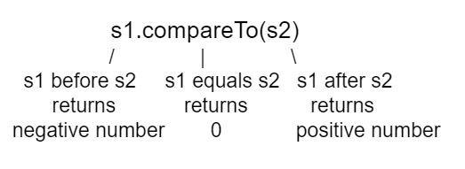

.. include:: ../common.rst

.. qnum::
   :prefix: 2-7-
   :start: 1

.. |AP CSA Reference Sheet| raw:: html

   <a href="https://apstudents.collegeboard.org/ap/pdf/ap-computer-science-a-java-quick-reference_0.pdf" target="_blank">AP CSA Java Quick Reference Sheet</a>

|Time90|

String Methods
=================

.. index::
    pair: String; length
    pair: String; substring
    pair: String; indexOf
    pair: String; compareTo
    pair: String; equals
    pair: String; methods

A string holds characters in a sequence.  Each character is at a position or **index** which starts with 0 as shown below.  An **index** is a number associated with a position in a string.  The length of a string is the number of characters in it including any spaces or special characters.  The string below has a length of 14.

.. figure:: Figures/stringIndicies.png
    :width: 500px
    :align: center
    :alt: a string with the position (index) shown above each character
    :figclass: align-center

    Figure 1: A string with the position (index) shown above each character

.. note::

   The first character in a string is at index 0 and the last characters is at **length** -1.

For the AP CSA exam, you only need to know how to use the following String methods.  All of the String method descriptions are included in the |AP CSA Reference Sheet| that you get during the exam so you don't have to memorize these.

    -  **int length()** method returns the number of characters in the string, including spaces and special characters like punctuation.

    -  **String substring(int from, int to)** method returns a new string with the characters in the current string starting with the character at the ``from`` index and ending at the character *before* the ``to`` index (if the ``to`` index is specified, and if not specified it will contain the rest of the string).

    -  **int indexOf(String str)** method searches for the string ``str`` in the current string and returns the index of the beginning of ``str`` in the current string or -1 if it isn't found.

    -  **int compareTo(String other)** returns a negative value if the current string is less than the ``other`` string alphabetically, 0 if they have the same characters in the same order, and a positive value if the current string is greater than the ``other`` string alphabetically.

    -  **boolean equals(String other)** returns true when the characters in the current string are the same as the ones in the ``other`` string.  This method is inherited from the Object class, but is **overridden** which means that the String class has its own version of that method.

String Methods: length, substring, indexOf
------------------------------------------

Run the code below to see the output from the String methods ``length``, ``substring``, and ``indexOf``. The length method returns the number of characters in the string, not the last index which is length -1. The ``str.substring(from,to)`` method returns the substring from the ``from`` index up to (but not including) the ``to`` index. The method ``str.indexOf(substring)`` searches for the substring in str and returns the index of where it finds substring in str or -1 if it is not there.

.. activecode:: lcsm1
   :language: java
   :autograde: unittest

   This code shows the output from String methods length, substring, and indexOf. How many letters does substring(0,3) return? What does indexOf return when its argument is not found?
   ~~~~
   public class Test1
   {
       public static void main(String[] args)
       {
           String message1 = "This is a test";
           String message2 = "Hello Class";

           System.out.println(message1.length());
           System.out.println(message2.length());

           System.out.println(message1.substring(0, 3));
           System.out.println(message1.substring(2, 3));
           System.out.println(message1.substring(5));

           System.out.println(
                   message1.indexOf("is")); // This will match the is in "This"!
           System.out.println(message1.indexOf("Hello"));
           System.out.println(message2.indexOf("Hello"));

           // lowercase and uppercase are not on the AP exam, but still useful
           System.out.println(message2.toLowerCase());
           System.out.println(message2.toUpperCase());
       }
   }

   ====
   import static org.junit.Assert.*;

   import org.junit.*;

   import java.io.*;

   public class RunestoneTests extends CodeTestHelper
   {
       @Test
       public void testMain() throws IOException
       {
           String output = getMethodOutput("main").trim();
           String expect = "14\n11\nThi\ni\nis a test\n2\n-1\n0\nhello class\nHELLO CLASS";
           boolean passed = output.contains(expect);

           getResults(expect, output, "Expected output from main", passed);
           assertTrue(passed);
       }
   }

.. note::

   Remember that substring(from,to) does not include the character at the ``to`` index! To return a single character at index i, use ``str.substring(index, index + 1)``.

|Exercise| **Check your understanding**

.. mchoice:: qsb_3
   :practice: T
   :answer_a: 2
   :answer_b: 1
   :answer_c: 4
   :answer_d: -1
   :correct: b
   :feedback_a: The first character is at index 0 in a string.
   :feedback_b: The method indexOf returns the first position of the passed str in the current string starting from the left (from 0).
   :feedback_c: Does indexOf start from the left or right?
   :feedback_d: Does the string contain a b?

   What is the value of pos after the following code executes?

   .. code-block:: java

     String s1 = "abccba";
     int pos = s1.indexOf("b");

.. mchoice:: qsb_3b
   :practice: T
   :answer_a: 2
   :answer_b: 3
   :answer_c: 4
   :answer_d: -1
   :correct: c
   :feedback_a: Length returns the number of characters in the string, not the number of characters in the name of the string.
   :feedback_b: The position of the last character is 3, but the length is 4.
   :feedback_c: Length returns the number of characters in the string.
   :feedback_d: Length is never negative.

   What is the value of len after the following code executes?

   .. code-block:: java

     String s1 = "baby";
     int len = s1.length();

.. mchoice:: qsb_3c
   :practice: T
   :answer_a: baby
   :answer_b: b
   :answer_c: ba
   :answer_d: bab
   :correct: d
   :feedback_a: This would be true if substring returned all the characters from the first index to the last inclusive, but it does not include the character at the last index.
   :feedback_b: This would be true if it was s1.substring(0,1)
   :feedback_c: This would be true if it was s1.substring(0,2)
   :feedback_d: Substring returns all the characters from the starting index to the last index -1.

   What is the value of s2 after the following code executes?

   .. code-block:: java

     String s1 = "baby";
     String s2 = s1.substring(0,3);

.. mchoice:: qsb_4b
   :practice: T
   :answer_a: by
   :answer_b: aby
   :answer_c: a
   :answer_d: b
   :answer_e: ba
   :correct: a
   :feedback_a: The method substring(index) will return all characters starting the index to the end of the string.
   :feedback_b: This would be true if it was substring(1);
   :feedback_c: This would be true if it was substring(1,2);
   :feedback_d: This would be true if it was substring(2,3);
   :feedback_e: This would be ture if it was substring(0,2);

   What is the value of s2 after the following code executes?

   .. code-block:: java

     String s1 = "baby";
     String s2 = s1.substring(2);

CompareTo and Equals
-----------------------

We can compare primitive types like int and double using operators like ``==`` and ``<`` or ``>``, which you will learn about in the next unit. However, with reference types like String, you must use the methods ``equals`` and ``compareTo``, not ``==`` or ``<`` or ``>``.

The method ``compareTo`` compares two strings character by character. If they are equal, it returns 0. If the first string is alphabetically ordered before the second string (which is the argument of ``compareTo``), it returns a negative number. And if the first string is alphabetically ordered after the second string, it returns a positive number. (The actual number that it returns does not matter, but it is the distance in the first letter that is different, e.g. A is 7 letters away from H.)

    Figure 2: compareTo returns a negative or positive value or 0 based on alphabetical order

The ``equals`` method compares the two strings character by character and returns ``true`` or ``false``. Both ``compareTo`` and ``equals`` are case-sensitive. There are case-insensitive versions of these methods, ``compareToIgnoreCase`` and ``equalsIgnoreCase``, which are not on the AP exam.

Run the example below to see the output from ``compareTo`` and ``equals``. Since ``"Hello!"`` would be alphabetically ordered after ``"And"``, ``compareTo`` returns a positive number. Since ``"Hello!"`` would be alphabetically ordered before ``"Zoo"``, ``compareTo`` returns a negative number.  Notice that ``equals`` is case-sensitive.

.. activecode:: lcsm2
   :language: java
   :autograde: unittest

   Run the code to see how the String methods equals and compareTo work. Is equals case-sensitive? When does compareTo return a negative number?
   ~~~~
   public class Test2
   {
       public static void main(String[] args)
       {
           String message = "Hello!";

           System.out.println(message.compareTo("Hello!"));
           System.out.println(message.compareTo("And"));
           System.out.println(message.compareTo("Zoo"));

           System.out.println(message.equals("Hello!"));
           System.out.println(message.equals("hello!"));
       }
   }

   ====
   import static org.junit.Assert.*;

   import org.junit.*;

   import java.io.*;

   public class RunestoneTests extends CodeTestHelper
   {
       @Test
       public void testMain() throws IOException
       {
           String output = getMethodOutput("main");
           String expect = "0\n7\n-18\ntrue\nfalse";
           boolean passed = getResults(expect, output, "Expected output from main", true);
           assertTrue(passed);
       }
   }

.. |String class| raw:: html

   <a href="http://docs.oracle.com/javase/7/docs/api/java/lang/String.html" target="_blank">String class</a>

There are lots of other methods in the String class.  You can look through the Java documentation for the |String class| online.   You don't have to know all of these for the exam, but you can use them if you want to on the exam.

An **Application Programming Interface (API)** is a library of prewritten classes that simplify complex programming tasks for us. These classes are grouped together in a **package** like java.lang and we can import these packages (or individual classes) into our programs to make use of them. For instance, we have just discussed the String library built into the default java.lang package - it takes care of the detailed work of manipulating strings for us.  There are many other useful library packages as well, both in the java.lang package and in other packages. Documentation for APIs and libraries are essential to understanding how to use these classes.

.. note::

   Strings are **immutable** which means that they can't change. Anything that you do to modify a string (like creating a substring or appending strings) returns a new string.

|Exercise| **Check your understanding**

.. dragndrop:: ch4_str1
    :feedback: Review the vocabulary.
    :match_1: the position of a character in a string|||index
    :match_2: a new string that is a part of another string with 0 to all characters copied from the original string|||substring
    :match_3: doesn't change|||immutable
    :match_4: the number of characters in a string|||length

    Drag the definition from the left and drop it on the correct concept on the right.  Click the "Check Me" button to see if you are correct

.. dragndrop:: ch4_str2
    :feedback: Review the vocabulary.
    :match_1: Returns true if the characters in two strings are the same|||equals
    :match_2: Returns the position of one string in another or -1|||indexOf
    :match_3: Returns a number to indicate if one string is less than, equal to, or greater than another|||compareTo
    :match_4: Returns a string representing the object that is passed to this method|||toString

    Drag the definition from the left and drop it on the correct method on the right.  Click the "Check Me" button to see if you are correct.

.. mchoice:: qsb_5
   :practice: T
   :answer_a: hi th
   :answer_b: hi the
   :answer_c: hi ther
   :answer_d: hi there
   :correct: a
   :feedback_a: The substring method returns the string starting at the first index and not including the last index.  The method indexOf returns the index of the first place the string occurs.
   :feedback_b: This would be correct if substring returned all characters between the first index and last index, but does it?
   :feedback_c: This would be correct if indexOf returned the last position the string str was found in the current string, does it?
   :feedback_d: This would be correct if indexOf returned the last position the string str was found in the current string and if substring included all characters between the start and end index.  Check both of these.

   What is the value of s2 after the following code executes?

   .. code-block:: java

     String s1 = new String("hi there");
     int pos = s1.indexOf("e");
     String s2 = s1.substring(0,pos);

.. mchoice:: qsb_6-old1
   :practice: T
   :answer_a: Hi
   :answer_b: hi
   :answer_c: H
   :answer_d: h
   :correct: a
   :feedback_a: Strings are immutable, meaning they don't change.  Any method that changes a string returns a new string.  So s1 never changes.
   :feedback_b: This would be true if the question was what is the value of s2 and it was substring(0,2) not (0,1)
   :feedback_c: This would be true if the question was what is the value of s2, not s1.
   :feedback_d: This would be true if the question was what is the value of s3, not s1.

   What is the value of s1 after the following code executes?

   .. code-block:: java

     String s1 = "Hi";
     String s2 = s1.substring(0,1);
     String s3 = s2.toLowerCase();

.. mchoice:: qsb_7-old24
   :practice: T
   :answer_a: Hi
   :answer_b: hi
   :answer_c: H
   :answer_d: h
   :correct: d
   :feedback_a: Is this the value of s3?  What does toLowerCase do?
   :feedback_b: How does substring work?  Does it include the character at the end index?
   :feedback_c: What does toLowerCase do?
   :feedback_d: s2 is set to just "H" and s3 is set to changing all characters in s2 to lower case.

   What is the value of s3 after the following code executes?

   .. code-block:: java

     String s1 = "Hi";
     String s2 = s1.substring(0,1);
     String s3 = s2.toLowerCase();

.. mchoice:: qsb_8-new
   :practice: T
   :answer_a: positive (> 0)
   :answer_b: 0
   :answer_c: negative (< 0)
   :correct: a
   :feedback_a: H is after B in the alphabet so s1 is greater than s2.
   :feedback_b: The method compareTo will only return 0 if the strings have the same characters in the same order.
   :feedback_c: This would be true if it was s2.compareTo(s1)

   What is the value of answer after the following code executes?

   .. code-block:: java

     String s1 = "Hi";
     String s2 = "Bye";
     int answer = s1.compareTo(s2);

Common Mistakes with Strings
-------------------------------

The following code shows some common mistakes with strings.

.. activecode:: stringMistakes
   :language: java
   :practice: T
   :autograde: unittest

   This code contains some common mistakes with strings. Fix the code to use the string methods correctly.
   ~~~~
   public class StringMistakes
   {
       public static void main(String[] args)
       {
           String str1 = "Hello!";

           // Print out the first letter?
           System.out.println(
                   "The first letter in " + str1 + ":" + str1.substring(1, 1));

           // Print out the last character?
           System.out.println(
                   "The last char. in " + str1 + ":" + str1.substring(8));

           // Print str1 in lower case? Will str1 change?
           str1.toLowerCase();
           System.out.println("In lowercase: " + str1);
       }
   }

   ====
   import static org.junit.Assert.*;

   import org.junit.*;

   import java.io.*;

   public class RunestoneTests extends CodeTestHelper
   {
       @Test
       public void testMain() throws IOException
       {
           String output = getMethodOutput("main").trim();
           String expect =
                   "The first letter in Hello!:H\nThe last char. in Hello!:!\nIn lowercase: hello!";
           boolean passed = output.contains(expect);

           getResults(expect, output, "Expected output from main", passed);
           assertTrue(passed);
       }
   }

Here is a list of common mistakes made with Strings.

  -  Thinking that substrings include the character at the last index when they don't.

  -  Thinking that strings can change when they can't.  They are immutable.

  - Trying to access part of a string that is not between index 0 and length -1. This will throw an IndexOutOfBoundsException.

  -  Trying to call a method like ``indexOf`` on a string reference that is null.  You will get a null pointer exception.

  -  Using ``==`` to test if two strings are equal.  This is actually a test to see if they refer to the same object.  Usually you only want to know if they have the same characters in the same order.  In that case you should use ``equals`` or ``compareTo`` instead.
  -  Treating upper and lower case characters the same in Java.  If ``s1 = "Hi"`` and ``s2 = "hi"`` then ``s1.equals(s2)`` is false.

|Groupwork| Programming Challenge : Pig Latin
----------------------------------------------

|pig| Can you speak Pig Latin? In Pig Latin, you take the first letter and put it at the end of the word and add the letters "ay" to the end. For example, "pig" becomes "igpay".

Create a program that takes a word and transforms it to Pig Latin using String methods. You may need the word's length, a substring that does not include the first letter, and a substring that is just the first letter (you can get the ith letter of a string using substring(i,i+1) so for example the letter at index 3 would be substring(3,4)).

.. |repl| raw:: html

   <a href="https://repl.it" target="_blank">repl.it</a>

.. |Scanner| raw:: html

   <a href="https://www.w3schools.com/java/java_user_input.asp" target="_blank">Scanner class</a>

Your teacher may ask you to create this program in a Java IDE like |repl| so that you can use input to read in the word (see input examples using the |Scanner|).

.. activecode:: challenge2-7-PigLatin
   :language: java
   :practice: T
   :autograde: unittest

   Use the substring method to transform a word into Pig Latin where the first letter is put at the end and "ay" is added. The word pig is igpay in Pig Latin.
   ~~~~
   public class PigLatin
   {
      public static void main(String[] args)
      {

          String word = "pig";

          // Change this to use word.substring to construct the pig latin
          // version of word. It should work even if you change the value of
          // word above.
          String pigLatin = "";

          System.out.println(word + " in Pig Latin is " + pigLatin);
      }
   }
   ====
   import static org.junit.Assert.*;

   import org.junit.*;

   import java.io.*;

   public class RunestoneTests extends CodeTestHelper
   {
       @Test
       public void testMain() throws IOException
       {
           String output = getMethodOutput("main");
           String expect = "* in Pig Latin is *ay";
           boolean passed = getResultsRegEx(expect, output, "Expected output from main");
           assertTrue(passed);
       }

       @Test
       public void testContainsSubstring()
       {
           String target = "word.substring(";
           int count = countOccurences(getCode(), target);
           boolean passed = count >= 2;
           passed =
                   getResults(
                           "2 substring calls",
                           count + " substring call(s)",
                           "Code contains calls to substring method",
                           passed);
           assertTrue(passed);
       }
   }

Summary
-------------------

- **index** - A number that represents the position of a character in a string.  The first character in a string is at index 0.
- **length** - The number of characters in a string.
- **substring** - A new string that contains a copy of part of the original string.

- A String object has index values from 0 to length – 1. Attempting to access indices outside this range will result in an IndexOutOfBoundsException.

- String objects are **immutable**, meaning that String methods do not change the String object. Any method that seems to change a string actually creates a new string.

- The following String methods and constructors, including what they do and when they are used, are part of the |AP CSA Reference Sheet| that you can use during the exam:

  - **String(String str)** : Constructs a new String object that represents the same sequence of characters as str.

  - **int length()** : returns the number of characters in a String object.

  - **String substring(int from, int to)** : returns the substring beginning at index from  and ending at index (to -1).

  - **String substring(int from)** : returns substring(from, length()).

  - **int indexOf(String str)** : searches for str in the current string and returns the index of the first occurrence of str; returns -1 if not found.

  - **boolean equals(String other)** : returns true if this (the calling object) is equal to other; returns false otherwise.

  - **int compareTo(String other)** : returns a value < 0 if this is less than other; returns zero if this is equal to other; returns a value > 0 if this is greater than other.

- ``str.substring(index, index + 1)`` returns a single character at index in string str.

String Methods Game
---------------------------

.. |game| raw:: html

   <a href="https://csa-games.netlify.app/" target="_blank">game</a>

Try the game below written by AP CSA teacher Chandan Sarkar. Click on **Strings** and then on the letters that would be the result of the string method calls. We encourage you to work in pairs and see how high a score you can get.

.. raw:: html

    <iframe height="700px" width="100%" style="margin-left:10%;max-width:80%" src="https://csa-games.netlify.app/"></iframe>
    

.. index::
    single: append
    single:concatenate
    single: immutable
    single: index
    single: length
    single: reference
    single: substring
    single: string
    single: reference
    single: object reference
