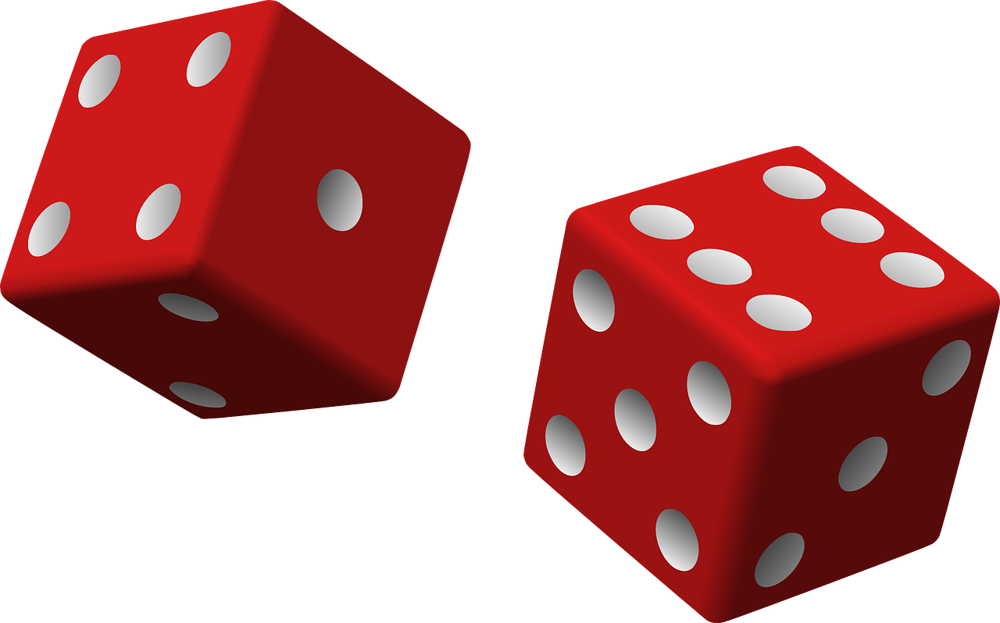

.. include:: ../common.rst

.. qnum::
   :prefix: 2-9-
   :start: 1

|Time90|

Using the Math Class
====================

.. index::
    single: Math methods
    single: random method
    pair: Math; random method

Games would be boring if the same thing happened each time you played the game.  Random numbers can be used in games to generate different outcomes each time the game is played. In Java, the ``Math.random()`` method to is used to generate a random number.

There are lots of mathematical methods in the ``Math`` class
that you might want to use in your programs, like ``Math.pow(2,3)`` which calculates the 2 to the power of 3 which is 8.

These methods are in the **Math** class defined in the java.lang package. These are **static methods** which means you can call them by just using ``ClassName.methodName()`` without creating an object.
This is why we can just say Math.random() instead of having to define an object of the class Math.

.. note::

   **Static methods** (also called class methods) are called using the class name and the dot operator (.) followed by the method name. You do not need to create an object of the class to use them. You can use ClassName.methodName() or just methodName() if they are called from within the same class.

Mathematical Functions
-----------------------

.. |AP CSA Reference Sheet| raw:: html

   <a href="https://apstudents.collegeboard.org/ap/pdf/ap-computer-science-a-java-quick-reference_0.pdf" target="_blank">AP CSA Java Quick Reference Sheet</a>

.. |Math class Javadocs| raw:: html

   <a href="https://docs.oracle.com/javase/8/docs/api/java/lang/Math.html" target="_blank">Math class Javadocs</a>

The ``Math`` class contains the following methods that are in the AP CSA subset. There are more ``Math`` methods, outside of what you need on the AP exam, that you can find in the |Math class Javadocs|.

- ``int abs(int)`` : Returns the absolute value of an int value (which is the value of a number without its sign, for example ``Math.abs(-4)`` = 4).

- ``double abs(double)`` : Returns the absolute value of a double value.

- ``double pow(double, double)`` : Returns the value of the first parameter raised to the power of the second parameter.

- ``double sqrt(double)`` :  Returns the positive square root of a double value.

- ``double random()`` :  Returns a double value greater than or equal to 0.0 and less than 1.0 (not including 1.0!).

.. note::

   All the ``Math`` methods that you may need to use or understand on the AP
   exam are listed in the |AP CSA Reference Sheet| that you can use during the
   exam.

These Math methods are mathematical functions that compute new values from their arguments. You may be able to guess what ``abs``, ``pow``, and ``sqrt`` do, from their abbreviations. 

``Math.abs`` takes a single argument, either a ``double`` or an
``int`` and returns a value of the same type which is the absolute value of the
argument. The absolute value is the positive value of the number without its sign or its distance from 0. So:

.. code-block:: java

   Math.abs(45);    // returns 45
   Math.abs(-45);   // returns 45
   Math.abs(33.3);  // returns 33.3
   Math.abs(-33.3); // returns 33.3

``Math.pow`` takes two argument, both ``double``\ s and returns
a ``double`` which is the first argument raised to the power of the second
argument.

.. code-block:: java

   Math.pow(2 , 3); // returns 8.0
   Math.pow(10, 6); // returns 1000000.0
   Math.pow(2, -3); // returns 0.125

``Math.sqrt`` takes an ``double`` argument and returns a positive ``double`` value which is the square root of the argument. For example, the square root of 9 is 3 because 3 squared is 9.

.. code-block:: java

   Math.sqrt(9); // returns 3.0

Since these methods calculate and return a value, you need to use that value, for example in an assignment statement or in a print statement to see the result.  For example:

.. code-block:: java

   System.out.println("The square root of 9 is " + Math.sqrt(9));

|CodingEx| **Coding Exercise**

.. activecode:: trymath
   :language: java
   :autograde: unittest

   Try the Math methods below. Change the code so that it computes the absolute value of -4, the square root of 9, and 3 raised to the power of 2.
   ~~~~
   public class TryMath
   {
       public static void main(String[] args)
       {
           // TODO: Change the code below to compute 
           //       the absolute value of -4, 
           //       the square root of 9, 
           //       and 3 raised to the power of 2.
           System.out.println( Math.abs(-2) );
           System.out.println( Math.sqrt(4) );
           System.out.println( Math.pow(2, 3) );
       }
   }
   ====
   import static org.junit.Assert.*;

   import org.junit.*;

   import java.io.*;

   public class RunestoneTests extends CodeTestHelper
   {
       @Test
       public void testMain() throws IOException
       {
           String output = getMethodOutput("main");
           String expect = "4\n3.0\n9.0\n";
           boolean passed = getResults(expect, output, "Expected output from main after changing code");
           assertTrue(passed);
       }
   }

|Exercise| **Check Your Understanding**

.. mchoice:: call-sqrt-mc

   Knowing that ``Math.sqrt`` takes a single argument, Which of these are
   syntactically correct method calls to ``sqrt``?

   - ``Math.sqrt(2)``

     + ✅ This is a simple call to ``Math.sqrt`` with the argument 2.

   - ``Math.sqrt()``

     - ❌ ``Math.sqrt`` takes one argument. This would be a correct call if it took no arguments.

   - ``Math.sqrt(2, 4)``

     - ❌ ``Math.sqrt`` takes one argument. This would be a correct call if it took two arguments.

   - ``Math.sqrt(2 + 3)``

     + ✅ The argument passed to ``Math.sqrt`` is the value of the expression 2 + 3, namely 5.

   - ``Math.sqrt 2``

     - ❌ You must have parentheses around the arguments.

   - ``Math.sqrt(Math.sqrt(2))``

     + ✅ The argument passed to ``Math.sqrt`` is the value of *another* call to
       ``Math.sqrt`` which is perfectly fine.

.. mchoice:: distance-mc
   :multiple_answers:  
   :random:  
   
   The distance between two numbers on the number line is defined as the absolute value of their
   difference. Their difference is just what you get when you subtract one from
   the other. For example, the distance from 0 to 3 is 3, the distance from -3 to 0 is 3, and the distance from -3 to 1 is 4. 

   .. image:: Figures/number-line.svg
      :width: 450px
      :align: center
      :alt: number line
   
   Which of the following are correct expressions to compute the
   distance between the numbers ``a`` and ``b``. 

   - ``Math.abs(a - b)``

     + ✅ ``a - b`` gives us the difference and ``Math.abs`` gives us the
       absolute value of that difference.

   - ``Math.abs(a) - Math.abs(b)``

     - ❌ Consider the distance between -2 and 3. It should be five. What value
       would this expression produce in that case?

   - ``Math.abs(a + b)``

     - ❌ We need to start with the difference between ``a`` and ``b``, not their sum.

|CodingEx| **Coding Exercise**

.. activecode:: distance-abs
   :language: java
   :autograde: unittest

   The distance between two numbers on a number line, as we discussed in the problem 
   above, is defined as the absolute value of their difference.
   Their difference is just what you get when you subtract one from the other.
   For example, the distance from 0 to 3 is 3, the distance from -3 to 0 is 3, and the distance from -3 to 1 is 4.

   Fill in the method ``distance`` below so it correctly computes the distance between two numbers ``a`` and ``b``  using subtraction and Math.abs.
   ~~~~
   public class DistanceCalculator
   {

       public static double distance(double a, double b)
       {
           // TODO: calculate the distance from a to b using subtraction and Math.abs.
           double distance = 0.0; 

           return distance;
       }

       public static void main(String[] argv)
       {
           System.out.println("distance(13.5, 26.2) = " + distance(13.5, 26.2));
           System.out.println("distance(26.2, 13.5) = " + distance(26.2, 13.5));
           System.out.println(distance(13.5, 26.2) == distance(13.5, 26.2));
       }
   }
   ====
   import static org.junit.Assert.*;

   import org.junit.*;

   import java.io.*;

   public class RunestoneTests extends CodeTestHelper
   {
       @Test
       public void test1() 
       {
            Object[] args = {10.5, 20.6};
            String output = getMethodOutput("distance", args);
            String expect = "10.1";
            boolean passed = getResults(expect, output, "distance(10.5, 20.6)");
            assertTrue(passed);
       }
       @Test
       public void test2() 
       {
            Object[] args = { -5.0, 2.4 };
            String output = getMethodOutput("distance", args);
            String expect = "7.4";
            boolean passed = getResults(expect, output, "distance(-5.0, 2.4)");
            assertTrue(passed);
       }
   }

Random Numbers
----------------

The ``Math.random()`` method returns a double number greater than or equal to 0.0, and less than 1.0.
When we talk about ranges of numbers sometimes
we need to be precise about whether the ends of the range are part of the range.
For example, ``Math.random`` returns a number between 0 and 1, but does that
mean it can return exactly 0? Or exactly 1? As it turns out it can return 0 but
never returns 1.

When we need to be precise about this we’d say that it returns a number between
0, *inclusive*, and 1, *exclusive*, meaning *include* 0 but *exclude* 1. Lots of
ranges in Java are expressed this way, as you’ll see later on with an inclusive
bottom and exclusive top.

.. activecode:: random1
   :language: java
   :autograde: unittest

   Try the following code.  Run it several times to see what it prints each time.
   ~~~~
   public class Test3
   {
       public static void main(String[] args)
       {
           System.out.println(Math.random());
           System.out.println(Math.random());
       }
   }

   ====
   import static org.junit.Assert.*;

   import org.junit.*;

   import java.io.*;

   public class RunestoneTests extends CodeTestHelper
   {
       @Test
       public void testMain() throws IOException
       {
           String output = getMethodOutput("main");
           String expect = output;
           boolean passed = getResults(expect, output, "Expected output from main", true);
           assertTrue(passed);
       }
   }

Getting a number between 0, inclusive, and 1, exclusive, may not seem all that
useful. But we can expand the range easily enough. To see how, imagine you had
less than a dollar to your name and you wanted to be richer—you’d want to find a
way to **multiply** your money. If you could invest every penny you had in
something that would multiply your money by 1,000 then instead of having
somewhere between $0 and $1, then you’d have somewhere between $0 (inclusive—if
you started with $0) and $1,000 (exclusive, since if you had even a fraction of
a penny less than $1 multiplying by 1,000 would still leave you just a bit shy
of $1,000.) If the investment multiplied your original money by a million,
you’d have between $0 and $1,000,000! (But never *quite* $1,000,000.)

Same trick applies to random numbers. The value ``Math.random`` returns is like
the initial amount of money in your pocket, always a bit less than $1. If you
multiply that value by any amount, it will stretch it into the range you want:

|CodingEx| **Coding Exercise**

.. activecode:: random-example-stretched
   :language: java
   :autograde: unittest

   Try the following code. Run it several times to see what it prints each
   time. Did you ever see 0.0? How about 1.0?
   ~~~~
   public class StretchedRandom
   {
       public static void main(String[] args)
       {
           System.out.println(Math.random() * 10);
           System.out.println(Math.random() * 10);
       }
   }
   ====
   import static org.junit.Assert.*;

   import org.junit.*;

   import java.io.*;

   public class RunestoneTests extends CodeTestHelper
   {
       @Test
       public void testMain() throws IOException
       {
           String output = getMethodOutput("main");
           String expect = output;
           boolean passed = getResults(expect, output, "Expected output from main", true);
           assertTrue(passed);
       }
   }

You may have noticed that while the numbers generated were always in the range 0
to 10, all the numbers probably had a lot a digits after the decimal point.
Often we want a random integer, with nothing after the decimal point. Easy
enough—casting a ``double`` to an ``int`` will throw away any values
after the decimal point. For example,

.. code-block:: java

    // rnd is an integer in the range 0-9 (from 0 up to 10).
    int rnd = (int)(Math.random()*10);  

Finally, what if we want a number in a range that doesn’t start with 0, say a
number from 1 to 10 (including 10) instead of from 0 to 9 (including 9)? Since
the size of the two ranges is the same, with ten numbers in each, all we need to
do is shift from the range we’ve generated into the range we want. In other
words, add the difference between the two ranges, 1 in this case.    

.. code-block:: java
    
    // rnd is an integer in the range 1-10 (including 10).
    int rnd = (int)(Math.random()*10) + 1; 

|CodingEx| **Coding Exercise**

.. activecode:: randomRange
   :language: java
   :autograde: unittest

   Run the code below several times to see how the value changes each time. How could you change the code to return a random integer from 1 to 10?  Modify the code and see if your answer is correct. Try removing the parentheses from around (Math.random() * 10) and run the code several times. What happens? The parentheses are necessary because (int) will cast the closest expression, and (int)Math.random() will always be 0 since anything after the decimal point is dropped.
   ~~~~
   public class Test4
   {
       public static void main(String[] args)
       {
           System.out.println((int) (Math.random() * 10));
       }
   }

   ====
   import static org.junit.Assert.*;

   import org.junit.*;

   import java.io.*;

   public class RunestoneTests extends CodeTestHelper
   {
       @Test
       public void testContainsRange() throws IOException
       {
           String target = "+ 1";
           boolean passed = checkCodeContains("Math.random in range 1 to 10", target);
           assertTrue(passed);
       }
   }

.. note::

    - Math.random() returns a random number between 0.0-0.99.

    - **(int)(Math.random()*range) + min** moves the random number into a range starting from a minimum number.

    - The range is the **(max number - min number + 1)**.

Here are some examples that move a random number into a specific range.

.. code-block:: java

    // Math.random() returns a random number between 0.0-0.99.
    double rnd = Math.random();

    // rnd1 is an integer in the range 0-9 (including 9).
    int rnd1 = (int)(Math.random()*10);

    // rnd2 is in the range 1-10 (including 10). The parentheses are necessary!
    int rnd2 = (int)(Math.random()*10) + 1;

    // rnd3 is in the range 5-10 (including 10). The range is 10-5+1 = 6.
    int rnd3 = (int)(Math.random()*6) + 5;

    // rnd4 is in the range -10 up to 9 (including 9). The range is doubled (9 - -10 + 1 = 20) and the minimum is -10.
    int rnd4 = (int)(Math.random()*20) - 10;

So the general recipe for generating a random is to first stretch the value from
``Math.random()`` until it’s in the right size range by multiplying by the size
of the range. Then if you want an integer value, cast to ``int`` to discard the
part after the decimal point. Then shift the value up by adding the minimum
value. The table below shows some applications of that general recipe.

.. rst-class:: random-recipes

   .. list-table:: Random recipes
      :widths: 70 10 10 10
      :header-rows: 1

      * - Expression
        - Minimum (inclusive)
        - Maximum (exclusive)
        - Possible values
      * - ``Math.random()``
        - 0.0
        - 1.0
        - Over 9 quadrillion
      * - ``Math.random() * 100``
        - 0.0
        - 100.0
        - Over 9 quadrillion
      * - ``(int)(Math.random() * 100)``
        - 0
        - 100
        - 100
      * - ``(int)(Math.random() * 50) + 25``
        - 25
        - 75
        - 50
      * - ``(int)(Math.random() * max)``
        - 0
        - max
        - max
      * - ``(int)(Math.random() * range) + min``
        - min
        - min + range
        - range
      * - ``(int)(Math.random() * (max - min)) + min``
        - min
        - max
        - max - min

|Exercise| **Check your understanding**

.. mchoice:: qrand_1
   :practice: T
   :answer_a: Math.random() < 0.4
   :answer_b: Math.random() > 0.4
   :answer_c: Math.random() == 0.4
   :correct: a
   :feedback_a: This is true about 40% of the time since Math.random returns a value from 0 to not quite 1.
   :feedback_b: This will be true about 60% of the time.
   :feedback_c: Do not use == with double values!  Remember that Math.random can return any number between 0 and not quite 1 (about .99999999).

   Which of the following would be true about 40% of the time?

.. mchoice:: qrand_2
   :practice: T
   :answer_a: ((int) (Math.random() * 5))
   :answer_b: ((int) (Math.random() * 6))
   :answer_c: ((int) (Math.random() * 5) + 1)
   :correct: c
   :feedback_a: This would be a number between 0 and 4.
   :feedback_b: This would be a number between 0 and 5.
   :feedback_c: The first part would return a number between 0 and 4 and when you add 1 you get a number from 1 to 5 inclusive.

   Which of the following would return a random number from 1 to 5 inclusive?

.. mchoice:: qrand_3
   :practice: T
   :answer_a: ((int) (Math.random() * 10))
   :answer_b: ((int) (Math.random() * 11))
   :answer_c: ((int) (Math.random() * 10) + 1)
   :correct: b
   :feedback_a: This would be a number between 0 and 9.
   :feedback_b: This would be a number between 0 and 10.
   :feedback_c: The first part would return a number between 0 and 9 and when you add 1 you get a number from 1 to 10 inclusive.

   Which of the following would return a random number from 0 to 10 inclusive?

.. mchoice:: qrand_4
   :practice: T
   :answer_a: Math.random() < 0.25
   :answer_b: Math.random() > 0.25
   :answer_c: Math.random() == 0.25
   :correct: b
   :feedback_a: This is true about 25% of the time, since it will be a number from 0 to not quite 1.
   :feedback_b: This is true about 75% of the time, since it will be a number from 0 to not quite 1.
   :feedback_c: Do not use == with double values!  Remember that Math.random can return any number between 0 and not quite 1 (about .99999999).

   Which of the following would be true about 75% of the time?

|Exercise| **AP CSA Sample Problem**

.. mchoice:: apcsa_sample3
   :practice: T
   :answer_a: int rn = (int) (Math.random() * 25) + 36;
   :answer_b: int rn = (int) (Math.random() * 25) + 60;
   :answer_c: int rn = (int) (Math.random() * 26) + 60;
   :answer_d: int rn = (int) (Math.random() * 36) + 25;
   :answer_e: int rn = (int) (Math.random() * 60) + 25;
   :correct: d
   :feedback_a: Remember that (int)(Math.random()*range) + min moves the random number into a range starting from a minimum number. We want the minimum number to be 25, but the minimum number here would be 36.
   :feedback_b: Remember that (int)(Math.random()*range) + min moves the random number into a range starting from a minimum number. We want the minimum number to be 25, but the minimum number here would be 60.
   :feedback_c: Remember that (int)(Math.random()*range) + min moves the random number into a range starting from a minimum number. Here the min is 25. We want the minimum number to be 25, but the minimum number here would be 60.
   :feedback_d: Yes, (int)(Math.random()*36) + 25 moves the random number into a range of 36 numbers starting from a minimum number 25 up to 60. The range is (max number - min number + 1) which is (60-25 +1) = 36.
   :feedback_e: This would give us random numbers from 25 to 85. Remember that you can compute the range you need with (max number - min number + 1).

   Which of the following statements assigns a random integer between 25 and 60, inclusive, to rn?

|Groupwork| Programming Challenge : Random Numbers
--------------------------------------------------

You may have a combination lock on your locker at school where you have to spin the dial to 3 separate numbers from 0 up to 40. What if you forgot your combination? Would you be able to guess it?

1. Write code that will generate 3 random integers from 0 up to 40 (but not including 40) using **Math.random()** in the Active Code window below. Run it a couple times to see it generate different numbers.

2. How many times would you need to run it to guess your combination correctly? Let's have the code compute the number of permutations possible in your combination lock using **Math.pow(number,exponent)**. For example, if you had 2 dials on your combination lock where each dial can be set to a digit from 0-9 (10 digits), there are 10\ :sup:`2` possible permutations. In Java, this would be written as **Math.pow(10,2)** which means 10 to the power of 2. If you start listing all the permutations possible, you can tell that there are 10\ :sup:`2` or 100 possible permutations for a 2 dial lock from 0-9.

.. raw:: html

    <pre>
    00, 01, 02, 03, 04, 05, 06, 07, 08, 09
    10, 11, 12, 13, 14, 15, 16, 17, 18, 19
    ...
    90, 91, 92, 93, 94, 95, 96, 97, 98, 99
    </pre>

Now what about the combination lock for this challenge? You will need to spin the dial 3 times: once to the right, once to the left, and once to the right to 3 different numbers from 0 up to 40 (not including 40). In general, the formula to use is NumbersPerDial\ :sup:`numberOfDials`. Write this using the **Math.pow()** method in your code and save it into a variable and print out.

.. activecode:: challenge2-9-random-math
   :language: java
   :autograde: unittest

   Complete the combination lock challenge below.
   ~~~~
   public class MathChallenge
   {
       public static void main(String[] args)
       {
           // 1. Use Math.random() to generate 3 integers from 0-40 (not
           // including 40) and print them out.

           // 2. Calculate the number of combinations to choose 3 numbers between
           // 0-40 (not including 40) using Math.pow() and print it out.
           // For example, Math.pow(10,2) is 10^2 and the number of permutations
           // to choose 2 numbers between 0-9.

       }
   }

   ====
   import static org.junit.Assert.*;
   import org.junit.*;
   import java.io.*;
   
   public class RunestoneTests extends CodeTestHelper {
       @Test
       public void test1() {
           String output = getMethodOutput("main");
           String[] lines = output.split("\\s+");
   
           boolean passed = lines.length >= 2;
   
           passed = getResults(
                   "2+ lines of output",
                   lines.length + " lines of output",
                   "Expected output",
                   passed);
           assertTrue(passed);
       }
   
       @Test
       public void test2() {
           String output = getMethodOutput("main");
           boolean passed = output.contains("64000");
           passed = getResults("true", "" + passed, "Prints result of 40^3", passed);
           assertTrue(passed);
       }
   
       @Test
       public void test3() {
           String[] code = getCode().split("\n");
           String expected = "Possible answers:\n(int) (Math.random() * 40)\n(int) (40 * Math.random())";
           String actual = "";
           int num = 0;
   
           for (int i = 0; i < code.length; i++) {
               if (code[i].contains("Math.random()") && code[i].contains("40")) {
                   actual += code[i].trim() + "\n";
                   if (code[i].contains("(int)"))
                       num++;
               }
           }
   
           boolean passed = num >= 3;
           passed = getResults(
                   expected,
                   actual,
                   "Creates 3 random numbers from 0 to 40 (not inclusive)",
                   passed);
           assertTrue(passed);
       }
   
       @Test
       public void test4() {
           String code = getCode();
           int num = countOccurences(code, "Math.pow(");
   
           boolean passed = num >= 1;
           passed = getResults("1 or more", "" + num, "Calls to Math.pow(...)", passed);
           assertTrue(passed);
       }
   }

Here's another challenge that is a lot of fun! Can you use random numbers to make dancing turtles? This idea was suggested by CSA teacher Zac Martin.

.. activecode:: challenge-2-9b-dancing-turtles
    :language: java
    :autograde: unittest
    :datafile: turtleClasses.jar

    Complete the random numbers using Math.random() in the correct ranges to choose x, y coordinates and random color in the range of 0-255 for the turtle. Put on some music and watch your turtle dance!
    ~~~~
    import java.util.*;
    import java.awt.*;

    public class DancingTurtles
    {
      public static void main(String[] args)
      {

          World world = new World(500,400);
          Turtle yertle = new Turtle(world);

          // This is a loop that runs 10 times (you will learn to write loops in
          // Unit 4)
          for(int i = 1; i <= 10; i++)
          {
           // Can you choose a randomX between 0-500?
           // Can you adjust for the 20 pixel width of the turtle,
           // so it doesn't get cut off at the edges?
           // Move the range from 20 to 480.
           int randomX = 0;
           // Can you choose a randomY between 0-400?
           // Can you adjust for the 20 pixel height of the turtle,
           // so it doesn't get cut off at the edges?
           int randomY = 0;

           yertle.moveTo(randomX, randomY);
           yertle.turnRight();

           // Can you choose a random red, green, and blue value between 0-255?
           int randomR = 0;
           int randomG = 0;
           int randomB = 0;

           yertle.setColor(new Color(randomR, randomG, randomB));

          } // end of loop
          world.show(true);
      }
    }
    ====
    import static org.junit.Assert.*;

    import org.junit.*;

    import java.io.*;

    public class RunestoneTests extends CodeTestHelper
    {
        public RunestoneTests()
        {
            super("DancingTurtles");
        }

        @Test
        public void test1()
        {
            String code = getCode();
            int numRandom = countOccurences(code, "Math.random()");

            boolean passed = numRandom >= 5;
            passed = getResults("5+", "" + numRandom, "5+ calls to Math.random()", passed);
            assertTrue(passed);
        }

        @Test
        public void test2()
        {
            boolean passed =
                    checkCodeContainsNoRegex(
                            "Random numbers for 0-255 colors (256 values)", "Math.random() * 256");
            assertTrue(passed);
        }
    }

Summary
-------------------

- Static Math methods can be called using **Math**.method(); for each method.

- The following static Math methods are part of the Java Quick Reference:

  - **int abs(int)** : Returns the absolute value of an int value (which means no negatives).
  - **double abs(double)** : Returns the absolute value of a double value.
  - **double pow(double, double)** : Returns the value of the first parameter raised to the power of the second parameter.
  - **double sqrt(double)** :  Returns the positive square root of a double value.
  - **double random()** :  Returns a double value greater than or equal to 0.0 and less than 1.0 (not including 1.0)!

- The values returned from Math.random can be manipulated to produce a random int or double in a defined range.

- **(int)(Math.random()*range) + min** moves the random number into a range starting from a minimum number. The range is the **(max number - min number + 1)**. For example, to get a number in the range of 5 to 10, use the range 10-5+1 = 6 and the min number 5: ``(int)(Math.random()*6) + 5``.
