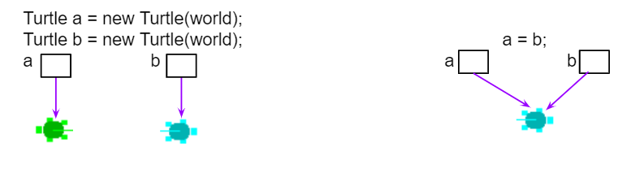

.. include:: ../common.rst

.. qnum::
   :prefix: 3-1-
   :start: 1

.. index::
   single: Boolean
   pair: Variable; boolean
   pair: boolean; variable

|Time45|

Boolean Expressions
===================

**Boolean** variables or expressions can only have **true** or **false** values.

Testing Equality (==)
----------------------

The operators ``==`` and ``!=`` (not equal) can be used to compare values. They return true or false boolean values.

.. note::

    One ``=`` sign changes the value of a variable. Two ``==`` equal signs are used to test if a variable holds a certain value, without changing its value!

.. |Colleen video| raw:: html

   <a href="https://www.youtube.com/watch?v=bO9bejT0jwE&list=PLHqz-wcqDQIEP6p1_0wOb9l9aQ0qFijrP&ab_channel=colleenlewis" target="_blank">video</a>

Watch the following |Colleen video| which shows what happens in memory as primitive types like ``int`` and reference types like ``Dog`` are compared with ``==`` in a physical model of Java memory.

.. youtube:: bO9bejT0jwE
    :width: 650
    :height: 415
    :align: center
    :optional:

The following code shows how ``==`` is used with primitive types like ``int``.

.. activecode:: bool1
   :language: java
   :autograde: unittest

   What will the code below print out? Try to guess before you run it! Note that 1 equal sign (``=``) is used for assigning a value and 2 equal signs (``==``) for testing values.
   ~~~~
   public class BoolTest1
   {
       public static void main(String[] args)
       {
           int age = 15;
           int year = 14;
           // Will this print true or false?
           System.out.println(age == year);
           year = 15;
           // Will this print true or false?
           System.out.println(age == year);
           // Will this print true or false?
           System.out.println(age != year);
       }
   }

   ====
   // should pass if/when they run code
   import static org.junit.Assert.*;

   import org.junit.*;

   import java.io.*;

   public class RunestoneTests extends CodeTestHelper
   {
       @Test
       public void testMain() throws IOException
       {
           String output = getMethodOutput("main");
           String expect = "false\ntrue\nfalse\n";
           boolean passed = getResults(expect, output, "Expected output from main", true);
           assertTrue(passed);
       }
   }

We can also use ``==`` or ``!=`` to test if two reference values, like ``Turtle`` and ``String`` objects,  refer to the same object. In the figure below, we are creating two separate ``Turtle`` objects called ``juan`` and ``mia``. They do not refer to same object or turtle. Then, we create a reference variable called ``friend`` that is set to ``mia``. The turtle ``mia`` will have two ways (**references** or **aliases**) to name her -- she's both ``mia`` and ``friend``, and these variables refer to the same object (same ``Turtle``) in memory. If two reference  variables refer to the same object like the turtle on the right in the image below, the test with ``==`` will return true which you can see in the code below.

    Figure 1: Turtle Reference Equality

|CodingEx| **Coding Exercise**

.. activecode:: boolRef
   :language: java
   :datafile: turtleClasses.jar
   :autograde: unittest

   What will the code below print out? Try to guess before you run it!
   ~~~~
   import java.awt.*;
   import java.util.*;

   public class BoolTestRef
   {
       public static void main(String[] args)
       {
           World world = new World(300, 300);
           Turtle juan = new Turtle(world);
           Turtle mia = new Turtle(world);

           // Will these print true or false?
           System.out.println(juan == mia);
           Turtle friend = mia; // set friend to be an alias for mia
           System.out.println(friend == mia);
       }
   }

    ====
    import static org.junit.Assert.*;

    import org.junit.*;

    import java.io.*;

    public class RunestoneTests extends CodeTestHelper
    {
        public RunestoneTests()
        {
            super("BoolTestRef");
        }

        @Test
        public void test1()
        {
            boolean passed = getResults("true", "true", "main()");
            assertTrue(passed);
        }
    }

Relational Operators (<, >)
----------------------------

The **Relational Operators** below in Java are used to compare numeric values or arithmetic expressions. Although some programming languages allow using relational operators like ``<`` to compare strings, Java only uses these operators for numbers, and uses the methods ``compareTo`` and ``equals`` for comparing ``String`` values.

- ``<`` Less Than
- ``>`` Greater Than
- ``<=`` Less than or equal to
- ``>=`` Greater than or equal to
- ``==`` Equals
- ``!=`` Does not equal

If you have trouble telling ``<`` and ``>`` apart, think of ``<`` and ``>`` as
arrows where the pointy end should point to the smaller value. If ``<`` (less
than) points towards a smaller number on the left, then it evaluates to
``true``. On the other hand a ``>`` (greater than) expression will be ``true``
only if the smaller number is on the right hand side. Or maybe you prefer the
“hungry alligator” mnemonic beloved by elementary school teachers—think of ``<``
and ``>`` as the mouths of hungry alligators which always want to eat the bigger
number; a ``<`` or ``>`` expression is only ``true`` if the alligator is in fact
about to eat the bigger number.

To remember the correct order of the two characters in ``<=`` and ``>=``, just
write them in the same order you would say them in English: “less than or equal
to” not “equal to or less than”.

|CodingEx| **Coding Exercise**

.. activecode:: bool2
   :language: java
   :autograde: unittest

   Try to guess what the code below will print out before you run it.
   ~~~~
   public class BoolTest2
   {
       public static void main(String[] args)
       {
           int age = 15;
           int year = 14;
           // Will these print true or false?
           System.out.println(age < year);
           System.out.println(age > year);
           System.out.println(age <= year + 1);
           System.out.println(age - 1 >= year);
       }
   }

   ====
   import static org.junit.Assert.*;

   import org.junit.*;

   import java.io.*;

   public class RunestoneTests extends CodeTestHelper
   {
       @Test
       public void testMain() throws IOException
       {
           String output = getMethodOutput("main");
           String expect = "false\ntrue\ntrue\ntrue\n";
           boolean passed = getResults(expect, output, "Expected output from main", true);
           assertTrue(passed);
       }
   }

|Exercise| **Check your understanding**

.. dragndrop:: BooleanExps
    :feedback: Review the relational operators above.
    :match_1: x > 0|||x is positive
    :match_2: x == y|||x equals y
    :match_3: x < 0|||x is negative
    :match_4: x != y|||x does not equal y
    :match_5: x < y |||x is less than y
    :match_6: x > y |||x is greater than y
    :match_7: x >= y |||x is greater than or equal to y

    Drag the boolean expression from the left and drop it on what it is testing on the right.  Click the "Check Me" button to see if you are correct.

Testing with remainder (%)
---------------------------

Here are some boolean expressions that are very useful in coding and remainder is used in many of them:

.. code-block:: java

  // Test if a number is positive
  (number > 0)
  //Test if a number is negative
  (number < 0)
  //Test if a number is even by seeing if the remainder is 0 when divided by 2
  (number % 2 == 0)
  //Test if a number is odd by seeing if there is a remainder when divided by 2
  (number % 2 > 0)
  //Test if a number is a multiple of x (or divisible by x with no remainder)
  (number % x == 0)

.. activecode:: boolMod
   :language: java
   :autograde: unittest

   Try the expressions containing the % operator below to see how they can be used to check for even or odd numbers. All even numbers are divisible (with no remainder) by 2.
   ~~~~
   public class BoolMod
   {
       public static void main(String[] args)
       {
           int age1 = 15;
           int age2 = 16;
           int divisor = 2;
           System.out.println(
                   "Remainder of "
                           + age1
                           + "/"
                           + divisor
                           + " is "
                           + (age1 % divisor));
           System.out.println(
                   "Remainder of "
                           + age2
                           + "/"
                           + divisor
                           + " is "
                           + (age2 % divisor));
           System.out.println("Is " + age1 + " even? " + (age1 % 2 == 0));
           System.out.println("Is " + age2 + " even? " + (age2 % 2 == 0));
       }
   }

   ====
   import static org.junit.Assert.*;

   import org.junit.*;

   import java.io.*;

   public class RunestoneTests extends CodeTestHelper
   {
       @Test
       public void testMain() throws IOException
       {
           String output = getMethodOutput("main");
           String expect =
                   "Remainder of 15/2 is 1\n"
                       + "Remainder of 16/2 is 0\n"
                       + "Is 15 even? false \n"
                       + "Is 16 even? true\n";
           boolean passed = getResults(expect, output, "Expected output from main", true);
           assertTrue(passed);
       }
   }

The **remainder** operator has been used quite a bit on the AP CSA exam, so you should be familiar with it.

- Use it to check for odd or even numbers. If ``num % 2 != 0`` is true, ``num``
  is odd and if ``num % 2 == 0`` is true then ``num`` is even.

- You can also use remainder to check if any number is evenly divisible by any
  other: If ``num1 % num2 == 0`` is true then ``num1`` is evenly divisible by
  ``num2``.

- Use it to get the last digit from an integer number: ``num % 10`` gives us the
  rightmost digit of ``num``.

- Use it to get the number of minutes left when you convert a total number of minutes to hours and minutes:

  .. code:: java

     int totalMinutes = 345;
     int hours = totalMinutes / 60;   // Number of whole hours, i.e. 5
     int minutes = totalMinutes % 60; // Number of minutes left over, i.e. 45

- Use it whenever you have limit in the value, and you need to wrap around to
  zero if the value goes over the limit: the value of ``num % limit`` will
  always be in the range from 0 (inclusive) to ``limit`` (exclusive) as long as
  ``num`` and ``limit`` are both positive.

.. note::

  A warning: because Java's ``%`` is a remainder operator and not a true
  mathematical modulo operator (as we discussed briefly in section 1.4) you
  can’t check if a number is odd with the expression ``num % 2 == 1``.

  That expression will be ``true`` if ``num`` is positive and odd and ``false``
  when ``num`` is even, both of which are correct. But if ``num`` is negative
  and odd, its remainder when divided by 2 is -1, not 1 and this expression will
  evaluate to ``false``. Thus you should always use ``num % 2 != 0`` to check if
  ``num`` is odd.

|Groupwork| Programming Challenge : Prime Numbers POGIL
-------------------------------------------------------

.. |pogil| raw:: html

   <a href="https://pogil.org/about-pogil/what-is-pogil" target="_blank">POGIL</a>

.. |pogil role| raw:: html

   <a href="https://docs.google.com/document/d/1_NfNLWJxaG4qZ2Jd2x8UctDS05twn1h6p-o3XaAcRv0/edit?usp=sharing" target="_blank">POGIL role</a>

.. |Numberphile video| raw:: html

   <a href="https://www.youtube.com/watch?v=M7kEpw1tn50" target="_blank">Numberphile video</a>

We encourage you to do this activity as a |POGIL| (Process Oriented Guided Inquiry Learning) group activity or using Think-Pair-Share collaboration. POGIL groups are self-managed teams of 4 students where everyone has a |pogil role| and works together to solve the problems, making sure that everyone in the team participates and learns.

In this activity, you will use boolean expressions to explore prime numbers. A prime number is an integer number that is only divisible by 1 and itself. For example, 3 is a prime number because it's only divisible by 1 and 3 and no other numbers, but 4 is not a prime number because it's divisible by 2 as well as 1 and 4.

Prime numbers are very useful in encryption algorithms because they can be used as keys for encoding and decoding. If you have the key, you can use it to divide a large number that represents something encrypted to decode it, but if you don't have the key, it's very hard to guess the factors of a large number to decode it. If you're curious about this, watch this |Numberphile video|.

The following program checks if 5 is a prime number by seeing if it is divisible by the numbers 1 - 5. Run the code, and then answer the following questions.

    1. Is 5 a prime number?
    2. What boolean tests determine that a number is prime?
    3. Change the number to 6 and add more boolean expressions to determine if 6 is prime. Is 6 prime?
    4. Change the number to 7 and add more boolean expressions to determine if 7 is prime. Is 7 prime?
    5. If you changed the boolean expressions to use <= instead of ==, would the code still help you to find prime numbers? Why or why not? Experiment and find out.
    6. If you changed the boolean expressions to use >= instead of ==, would the code still help you to find prime numbers? Why or why not? Experiment and find out.
    7. Are all odd numbers prime? Can you find one that is not by using boolean expressions in the code below?
    8. Are all even numbers not prime? Can you find an even prime number?

.. activecode:: challenge3-1-primeNumbers
   :language: java
   :autograde: unittest
   :practice: T

   Experiment with the code below changing the value of number and adding more print statements with boolean expressions to determine if the numbers 5, 6, and 7 are prime. Are all odd numbers prime? Are all even numbers not prime?
   ~~~~
   public class PrimeNumbers
   {
       public static void main(String[] args)
       {
           int number = 5;
           System.out.println("A prime number is only divisible by 1 and itself.");
           System.out.println(
                   "Is " + number + " divisible by 1 up to " + number + "?");
           System.out.println("Divisible by 1? " + (number % 1 == 0));
           System.out.println("Divisible by 2? " + (number % 2 == 0));
           System.out.println("Divisible by 3? " + (number % 3 == 0));
           System.out.println("Divisible by 4? " + (number % 4 == 0));
           System.out.println("Divisible by 5? " + (number % 5 == 0));
       }
   }

   ====
   import static org.junit.Assert.*;

   import org.junit.*;

   import java.io.*;

   public class RunestoneTests extends CodeTestHelper
   {
       @Test
       public void testChangedCode()
       {
           String origCode =
                   "public class PrimeNumbers{public static void main(String[] args){int number = 5;"
                       + " System.out.println(\"A prime number is only divisible by 1 and itself.\");"
                       + " System.out.println(\"Is \" + number + \" divisible by 1 up to \" + number +"
                       + " \"?\"); System.out.println(\"Divisible by 1? \" + (number % 1 == 0));"
                       + " System.out.println(\"Divisible by 2? \" + (number % 2 == 0));"
                       + " System.out.println(\"Divisible by 3? \" + (number % 3 == 0));"
                       + " System.out.println(\"Divisible by 4? \" + (number % 4 == 0));"
                       + " System.out.println(\"Divisible by 5? \" + (number % 5 == 0));}}";

           boolean changed = codeChanged(origCode);
           assertTrue(changed);
       }

       @Test
       public void testBool6() throws IOException
       {
           String target = "number % 6 == 0";
           boolean passed = checkCodeContains("boolean check for divisibility by 6", target);
           assertTrue(passed);
       }

       @Test
       public void testBool7() throws IOException
       {
           String target = "number % 7 == 0";
           boolean passed = checkCodeContains("boolean check for divisibility by 7", target);
           assertTrue(passed);
       }
   }

Summary
-------------------

- Primitive values and reference values can be compared using relational operators (i.e., ``==`` and ``!=``) in Java.
- Arithmetic expression values can be compared using relational operators (i.e., ``<``, ``>``, ``<=``, ``>=``) in Java.
- An expression involving relational operators evaluates to a ``boolean`` value of ``true`` or ``false``.

AP Practice
------------

.. mchoice:: AP3-1-1
    :practice: T

    Consider the following statement.

    .. code-block:: java

        boolean x = (5 % 3 == 0) == (3 > 5);

    What is the value of x after the statement has been executed?

    - false

      - Although both sides of the middle == are false, false == false is true! Tricky!

    - true

      + (5 % 3 == 0) is false and (3 > 5) is false, and false == false is true! Tricky!

    - (5 % 3 == 0)

      - The boolean x should hold true or false.

    - (3 > 5)

      - The boolean x should hold true or false.

    - 2

      - The boolean x should hold true or false.

.. mchoice:: AP3-1-2
    :practice: T

    Consider the following Boolean expression in which the int variables x and y have been properly declared and initialized.

    .. code-block:: java

        (x >= 10) == (y < 12)

    Which of the following values for x and y will result in the expression evaluating to true  ?

    - x = 10 and y = 12

      - The left side is true, but y must be less than 12 to make the right side true.

    - x = 9 and y = 9

      - The left side is false (x must be greater than or equal to 10), but the right side is true.

    - x = 10 and y = 11

      + Correct! Both sides are true!

    - x = 10 and y = 13

      - The left side is true, but y must be less than 12 to make the right side true.

    - x = 9 and y = 12

      + Correct! Both sides are false! This is tricky!

Relational Operators Practice Game
-----------------------------------

.. |game| raw:: html

   <a href="https://csa-games.netlify.app/" target="_blank">game</a>

Try the game below to practice. Click on **Relationals**,  evaluate the relational expression and click on None, All, or the numbers that make the expression true. Check on Compound for an added challenge. We encourage you to work in pairs and see how high a score you can get.

.. raw:: html

     <iframe id="page-embed" class="init" height="700px" width="100%" style="margin-left:10%;max-width:80%" src="https://csa-games.netlify.app/"></iframe>
