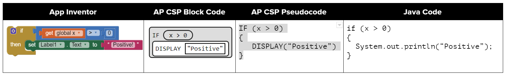
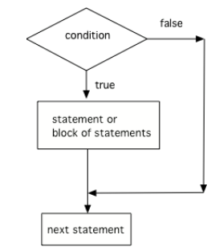
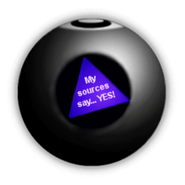

.. qnum::
   :prefix: 3-2-
   :start: 1
   
   
.. |CodingEx| image:: ../../_static/codingExercise.png
    :width: 30px
    :align: middle
    :alt: coding exercise
    
    
.. |Exercise| image:: ../../_static/exercise.png
    :width: 35
    :align: middle
    :alt: exercise
    
    
.. |Groupwork| image:: ../../_static/groupwork.png
    :width: 35
    :align: middle
    :alt: groupwork
    

if Statements and Control Flow
===============================

..	index::
	single: conditional
	single: if
	pair: conditional; if

If you took an AP CSP course or used a block programming language like Scratch, you've probably seen if blocks or statements before. *If statements* are found in all programming languages as a way to make choices. Here's a comparison of ifs in App Inventor blocks, AP CSP block and pseudocode and Java ifs.

    Figure 1: Comparison of App Inventor if block, AP CSP ifs, and Java if statements

The statements in a Java main method normally run or execute one at a time in the order they are found from top to bottom.   **If statements** (also called **conditionals** or **selection**) change the flow of control through the program so that some code is only run when something is true.  In an if statement, if the condition is true then the next statement or a block of statements will execute.  If the condition is false then the next statement or block of statements is skipped.

    Figure 2: The order that statements execute in a conditional
    

A conditional uses the keyword ``if`` followed by Boolean expression inside of  an open parenthesis ``(`` and a close parenthesis ``)`` and then followed by a single statement or block of statements.  The single statement or block of statements are only executed if the condition is true.  The open curly brace ``{`` and a close curly brace ``}`` are used to group a block of statements together.  It is recommended to always put in the curly braces even if you have just one statement under the if statement. The questions you will see on the AP exam will use curly braces.

.. code-block:: java

    // A single if statement
    if (boolean expression)
        Do statement;
    // Or a single if with {}
    if (boolean expression) 
    {
       Do statement;
    }
    // A block if statement: { } required    
    if (boolean expression)
    {
       Do Statement1;
       Do Statement2;
       ...
       Do StatementN;
    }

.. note::

    Note that there is no semicolon (;) at the end of the boolean expression in an if statement even if it is the end of that line. The semicolon goes at the end of the whole if statement, often on the next line. Or { } are used to mark the beginning and end of the block of code under the if condition. 
    
Imagine that your cell phone wanted to remind you to take an umbrella if it was currently raining in your area when it detected that you were leaving the house.  This type of thing is going to become more common in the future and it is an area of research called Human Computer Interaction (HCI) or Ubiquitous Computing (computers are everywhere).  

.. activecode:: lccb1
   :language: java

   The variable ``isRaining`` is a boolean variable that is either true or false. If it is true then the message ``Take an umbrella!`` will be printed and then execution will continue with the next statement which will print ``Drive carefully``. Run the code below to see this.
   ~~~~
   public class Test1
   {
      public static void main(String[] args)
      {
        boolean isRaining = true;
        if (isRaining) 
        {
           System.out.println("Take an umbrella!"); 
        }
        System.out.println("Drive carefully");
      }
   }
  

|Exercise| **Check your understanding**

.. fillintheblank:: 5_1_1_falseOutput

   Try changing the code above to ``boolean isRaining = false;``.  What will it print?

   -    :^Drive carefully$: Correct.  If the boolean is false, it will skip executing the print statement after the if.
        :.*: Try it and see
        

Relational Operators in If Statements
---------------------------------------

Most if statements have a boolean condition that uses relational operators like ==, !=, <, >, <=, >=, as we saw in the last lesson. 

|CodingEx| **Coding Exercise**

.. activecode:: if-relational
   :language: java
   
   Run the following active code a couple times until you see all the possible outputs. It prints out whether a random number is positive or equal to 0. Add another if statement that tests if it is a negative number.
   ~~~~
   public class Test
   {
      public static void main(String[] args)
      {
        // Get a random number from -10 up to 10.
        int number = (int) (Math.random()*21 - 10);
        System.out.println("The number is " + number);
        
        // is it positive?
        if (number > 0)
        {
           System.out.println(number + " is positive!");
        }
        // is it 0?
        if (number == 0)
        {
           System.out.println(number + " is zero!");
        }
      }
   }

.. note::

    A common mistake in if statements is using = instead of == in the condition by mistake. You should always **use ==**, not =, in the condition of an if statement to test a variable. One equal sign (=) assigns a value to a variable, and two equal signs (==) test if a variable has a certain value.
    
|Exercise| **Check your understanding**

.. mchoice:: qcb1_2
   :practice: T
   :answer_a: 3
   :answer_b: 6
   :answer_c: 0
   :answer_d: 4
   :answer_e: The code will not compile
   :correct: c
   :feedback_a: x is changed by the if statements.
   :feedback_b: What happens when x is greater than 2 and then greater than 4? Do both if statements.  
   :feedback_c: If x is greater than 2, it's always doubled, and then that result is always greater than 4, so it's set to 0 in the second if statement.  
   :feedback_d: x is changed by the if statements.
   :feedback_e: This code will compile.

   Consider the following code segment. What is printed as a result of executing the code segment?
   
   .. code-block:: java

     int x = 3;
     if (x > 2) 
     {
         x = x * 2;
     }
     if (x > 4) 
     {
        x = 0;
     }
     System.out.print(x);
     

.. More practice with if == and < > Active code.
    Note always use == not = in an if statement! Test not assign.

        
Common Errors with If Statements
---------------------------------

Here are some rules to follow with if statements to avoid some common errors:

   - Always use curly brackets ``{`` and ``}`` to enclose the block of statements under the if condition. Java doesn't care if you indent the code -- it goes by the { }. 
   
   - Don't put in a semicolon ``;`` after the first line of the if statement, if (test);. The if statement is a multiline block of code that starts with the if condition and then { the body of the if statement }. 
   
   - Always use **==**, not =, in the condition of an if statement to test a variable. One = assigns, two == tests!

|CodingEx| **Coding Exercise**

   
.. activecode:: lccb2-indent
   :language: java

   The code below doesn't work as expected.  Fix it to only print "Wear a coat" and "Wear gloves" when isCold is true.
   ~~~~
   public class Test
   {
      public static void main(String[] args)
      {
        boolean isCold = false;
        if (isCold = true); 
            System.out.println("Wear a coat");
            System.out.println("Wear gloves");
        
      }
   }
   
|Groupwork| Programming Challenge : Magic 8 Ball
------------------------------------------------

 
 
.. |video| raw:: html

   <a href="https://www.youtube.com/watch?v=WSaS17CSS4c" target="_blank">video</a>

.. |lesson 2.9| raw:: html

   <a href="https://runestone.academy/runestone/books/published/csawesome/Unit2-Using-Objects/topic-2-9-Math.html" target="_blank">lesson 2.9</a>
 
Have you ever seen a Magic 8 ball? You ask it a yes-no question and then shake it to get a random response like "Signs point to yes!", "Very doubtful", etc. If you've never seen a Magic 8 ball, check out this |video|.

We encourage you to work in pairs for this challenge. Come up with 8 responses to yes-no questions. Write a program below that chooses a random number from 1 to 8 and then uses if statements to test the number and print out the associated random response from 1-8. If you need help with random numbers, see |lesson 2.9|.

.. activecode:: challenge3-2-if-Magic8ball
   :language: java
   
   public class Magic8Ball
   {
      public static void main(String[] args)
      {
        // Get a random number from 1 to 8
        
        // Use if statements to print out 1 of 8 responses
        
          
      }
   }
   
.. |repl version| raw:: html

    <a href="https://repl.it/@BerylHoffman/Magic8BallTemplate" target="_blank" style="text-decoration:underline">repl version</a>

Here's a |repl version| that uses the Scanner class to first have the user ask a question. You can add your code in from above and try running it. 

.. raw:: html

    <iframe height="650px" width="100%" style="max-width:90%; margin-left:5%" src="https://repl.it/@BerylHoffman/Magic8BallTemplate?lite=true" scrolling="no" frameborder="no" allowtransparency="true" allowfullscreen="true" sandbox="allow-forms allow-pointer-lock allow-popups allow-same-origin allow-scripts allow-modals"></iframe>
    
Summary
-------------------  

- if statements test a boolean expression and if it is true, go on to execute the following statement or block of statements surrounded by curly brackets { } like below.

.. code-block:: java

    // A single if statement
    if (boolean expression)
        Do statement;
    // A block if statement    
    if (boolean expression)
    {
       Do Statement1;
       Do Statement2;
       ...
       Do StatementN;
    }

- Java boolean expressions can compare primitive values and reference values with the relational operators == and != and arithmetic expression values with the relational operators (i.e., <, >, <=, >=).

- Conditional (if) statements affect the flow of control by executing different statements based on the value of a Boolean expression.

