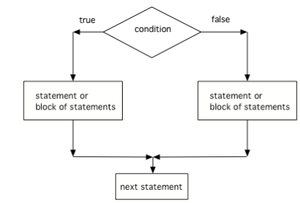
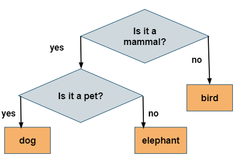

.. include:: ../common.rst

.. qnum::
   :prefix: 3-3-
   :start: 1

|Time90|

Two-way Selection: if-else Statements
======================================

What if you want to pick between two possibilities?  If you are trying to decide between a couple of things to do, you might flip a coin and do one thing if it lands as heads and another if it is tails.  In programming, you can use the **if** keyword followed by a statement or block of statements and then the **else** keyword also followed by a statement or block of statements.

.. code-block:: java

    // A block if/else statement
    if (boolean expression)
    {
       statement1;
       statement2;
    }
    else
    {
       do other statement;
       and another one;
    }

.. code-block:: java

    // A single if/else statement
    if (boolean expression)
        Do statement;
    else
        Do other statement;

The following flowchart demonstrates that if the condition (the boolean expression) is true, one block of statements is executed, but if the condition is false, a different block of statements inside the else clause is executed.

    Figure 1: The order that statements execute in a conditional with 2 options: if and else

.. note::

   The else will only execute if the condition is false.

.. activecode:: lccb2
   :language: java
   :autograde: unittest

   Try the following code. If ``isHeads`` is true it will print ``Let's go to the game`` and then ``after conditional``.
   ~~~~
   public class Test2
   {
       public static void main(String[] args)
       {
           boolean isHeads = true;
           if (isHeads)
           {
               System.out.println("Let's go to the game");
           }
           else
           {
               System.out.println("Let's watch a movie");
           }
           System.out.println("after conditional");
       }
   }

   ====
   import static org.junit.Assert.*;

   import org.junit.*;

   import java.io.*;

   public class RunestoneTests extends CodeTestHelper
   {
       @Test
       public void testMain() throws IOException
       {
           String output = getMethodOutput("main");
           String expect = "Let's go to the game\nafter conditional";

           boolean passed = getResults(expect, output, "Expected output from main", true);
           assertTrue(passed);
       }
   }

|Exercise| **Check your understanding**

.. fillintheblank:: 3_3_1_falseElse

   Try changing the code above to ``boolean isHeads = false;``.  What line will be printed before the ``after conditional``?

   -    :^Let's watch a movie$: Correct.  If the boolean value is false, the statement following the else will execute
        :.*: Try it and see

If/else statements can also be used with relational operators and numbers like below. If your code has an if/else statement, you need to test it with 2 test-cases to make sure that both parts of the code work.

|CodingEx| **Coding Exercise**

.. activecode:: licenseifelse
   :language: java
   :autograde: unittest
   :practice: T

   Run the following code to see what it prints out when the variable age is set to the value 16. Change the variable age's value to 15 and then run it again to see the result of the print statement in the else part.
   Can you change the if-statement to indicate that you can get a license at age 15 instead of 16? Use 2 test cases for the value of age to test your code to see the results of both print statements.
   ~~~~
   public class DriversLicenseTest
   {
       public static void main(String[] args)
       {
           int age = 16;
           if (age >= 16)
           {
               System.out.println("You can get a driver's license in most states!");
           }
           else
           {
               System.out.println(
                       "Sorry, you need to be older to get a driver's license.");
           }
       }
   }

   ====
   import static org.junit.Assert.*;

   import org.junit.*;

   import java.io.*;

   public class RunestoneTests extends CodeTestHelper
   {
       @Test
       public void testCodeContains() throws IOException
       {
           String target = "age >= 15";
           boolean passed = checkCodeContains("check age >= 15", target);
           assertTrue(passed);
       }
   }

.. parsonsprob:: ifelseevenOdd
   :numbered: left
   :practice: T
   :adaptive:
   :noindent:

   The following program should print out "x is even" if the remainder of x divided by 2 is 0 and "x is odd" otherwise, but the code is mixed up.   Drag the blocks from the left and place them in the correct order on the right.  Click on Check Me to see if you are right.
   -----
   public class EvenOrOdd
   {
   =====
       public static void main(String[] args)
       {
       =====
           int x = 92;
           =====
           if (x % 2 == 0)
           =====
           {
               System.out.println("x is even");
           }
           =====
           else
           =====
           {
               System.out.println("x is odd");
           }
           =====
       }
       =====
   }

|CodingEx| **Coding Exercise**

.. activecode:: scoreifelse
   :language: java
   :autograde: unittest
   :practice: T

   Try the following code. Add an else statement to the if statement that prints out "Good job!" if the score is greater than 9. Change the value of score to test it. Can you change the boolean test to only print out "Good job" if the score is greater than 20?
   ~~~~
   public class ScoreTest
   {
       public static void main(String[] args)
       {
           int score = 8;
           if (score <= 9)
           {
               System.out.println("Try for a higher score!");
           }
       }
   }

   ====
   import static org.junit.Assert.*;

   import org.junit.*;

   import java.io.*;

   public class RunestoneTests extends CodeTestHelper
   {
       @Test
       public void testChangedCode()
       {
           String origCode =
                   "public class ScoreTest   {      public static void main(String[] args)      {     "
                       + "   int score = 8;        if (score <= 9)         {           "
                       + " System.out.println(\"Try for a higher score!\");        }      }} ";

           boolean changed = codeChanged(origCode);
           assertTrue(changed);
       }

       @Test
       public void testCodeContainsElse()
       {
           boolean ifCheck2 = checkCodeContains("else", "else");
           assertTrue(ifCheck2);
       }

       @Test
       public void testCodeContains20()
       {
           String target1 = removeSpaces("score <= 20");
           String target2 = removeSpaces("score > 20");

           String code = removeSpaces(getCode());

           boolean passed = code.contains(target1) || code.contains(target2);
           getResults("true", "" + passed, "Checking for score <= 20 or score > 20", passed);
           assertTrue(passed);
       }

       @Test
       public void testCodeChange1() throws Exception
       {
           String className = "Test1";

           String program = getCode();
           program = program.replace("ScoreTest", className).replace("public class", "class");
           program = program.replaceAll("= *[0-9]+;", "= 25;");

           String output = getMethodOutputChangedCode(program, className, "main");

           String expected = "Good job!";
           boolean passed = output.contains(expected);
           getResults(expected, output, "Checking output if score is 25", passed);
           assertTrue(passed);
       }

       @Test
       public void testCodeChange2() throws Exception
       {
           String className2 = "Test2";

           String program2 = getCode();
           program2 = program2.replace("ScoreTest", className2).replace("public class", "class");
           program2 = program2.replaceAll("= *[0-9]+;", "= 5;");

           String output2 = getMethodOutputChangedCode(program2, className2, "main");

           String expected2 = "Try for a higher score!";
           boolean passed2 = output2.contains(expected2);
           getResults(expected2, output2, "Checking output if score is 5", passed2);
           assertTrue(passed2);
       }
   }

Nested Ifs and Dangling Else
----------------------------

If statements can be nested inside other if statements.
Sometimes with nested ifs we find a **dangling else** that could potentially belong to either if statement.
The rule is that the else clause will always be a part of the closest unmatched if statement in the same block of code, regardless of indentation.

.. code-block:: java

    // Nested if with dangling else
    if (boolean expression)
       if (boolean expression)
          Do statement;
       else  // belongs to closest if
          Do other statement;

|CodingEx| **Coding Exercise**

.. activecode:: danglingelse
   :language: java
   :autograde: unittest
   :practice: T

   Try the following code with a dangling else. Notice that the indentation does not matter to the compiler (but you should make it your habit to use good indentation just as a best practice). How could you get the else to belong to the first if statement?
   ~~~~
   public class DanglingElseTest
   {
       public static void main(String[] args)
       {
           boolean sunny = true;
           boolean hot = false;
           if (sunny)
               if (hot) 
                  System.out.println("Head for the beach!");
             else // Which if is else attached to??
               System.out.println("Bring your umbrella!");
       }
   }

   ====
    import static org.junit.Assert.*;

    import org.junit.*;

    import java.io.*;

    public class RunestoneTests extends CodeTestHelper
    {
        /*
        @Test
        public void testCodeChange1() throws Exception
        {
            String className = "Test1";

            String program = getCode();
            program = program.replace("DangleElse", className).replace("public class", "class");
            program = program.replaceAll("sunny = true;", "sunny = false;");

            String output = getMethodOutputChangedCode(program, className, "main");

            String expected = "Bring your umbrella!";
            boolean passed = output.contains(expected);
            getResults(expected, output, "Checking output if sunny is false", passed);
            assertTrue(passed);
        }

        @Test
        public void testCodeChange2() throws Exception
        {
            String className = "Test2";

            String program = getCode();
            program = program.replace("DangleElse", className).replace("public class", "class");
            program = program.replaceAll("hot = false", "hot = true");

            String output = getMethodOutputChangedCode(program, className, "main");

            String expected = "Head for the beach!";
            boolean passed = output.contains(expected);
            getResults(expected, output, "Checking output if hot is true", passed);
            assertTrue(passed);
        }

        @Test
        public void testCodeChange3() throws Exception
        {
            String className = "Test3";

            String program = getCode();
            program = program.replace("DangleElse", className).replace("public class", "class");
            program = program.replaceAll("hot = false", "hot = true");
            program = program.replaceAll("sunny = true;", "sunny = false;");

            String output = getMethodOutputChangedCode(program, className, "main");

            String expected = "Bring your umbrella!";
            boolean passed = output.contains(expected);
            getResults(expected, output, "Checking output if sunny is false and hot is true", passed);
            assertTrue(passed);
        }
        */

        @Test
        public void testMain() throws IOException
        {
            String output = getMethodOutput("main");
            String expect = "";
            boolean passed =
                    getResults(expect, output, "Expected output from main (no output if correct)");
            assertTrue(passed);
        }
    }

You can use curly braces (``{}``) to enclose a nested if and have the else clause belong to the the top level if clause like below:

.. code-block:: java

    // Nested if with dangling else
    if (boolean expression)
    {
       if (boolean expression)
          Do this statement;
    }
    else  // belongs to first if
      Do that statement;

In fact many experienced Java programmers `always` use curly braces, even when
they are not technically required to avoid this kind of confusion.

|Groupwork| Programming Challenge : 20 Questions
------------------------------------------------

.. image:: Figures/questionmark.jpg
    :width: 100
    :align: left

.. |Akinator| raw:: html

   <a href="https://en.akinator.com/" style="text-decoration:underline" target="_blank">Akinator</a>

We encourage you to work in pairs for this challenge which is on repl.it (you will need an account there if you want to save your version).

Have you ever played 20 Questions? 20 Questions is a game where one person thinks of an object and the other players ask up to 20 questions to guess what it is.

There is great online version called |Akinator| that guesses whether you are thinking of a real or fictional character by asking you questions. Akinator is a simple Artificial Intelligence algorithm that uses a decision tree of yes or no questions to pinpoint the answer.
Although Akinator needs a very large decision tree, we can create a  guessing game for animals using a much smaller number of if-statements.

The |Animal Guessing program| below uses the following decision tree:

    Figure 2: Animal Guessing Game Decision Tree

.. |Animal Guessing program| raw:: html

    <a href="https://firewalledreplit.com/@BerylHoffman/GuessAnimal#Main.java" target="_blank" style="text-decoration:underline">Animal Guessing program</a>

1. Try the |Animal Guessing program| below and run it a couple times thinking of an animal and answering the questions with y or n for yes or no. Did it guess your animal? Probably not! It's not very good. It can only guess 3 animals. Let's try to expand it!

2. In the very last else clause, the program knows that it is not a mammal and it guesses a bird. Let's add to that part. (You may want to click on Open in Repl.it on the top right of the window and then click on Sign up or Log in to save your work). Instead of saying "I guess a bird! Click on run to play again.", change it to ask a question that distinguishes between birds and reptiles (for example does it fly?). Then, get their response and use an if statement to guess "bird" or "turtle" (or another reptile). For example, here's how we decided to choose between a dog or an elephant. We asked the question "Is it a pet?", got the response, and then with an if statement on the y/n answer we determined dog or elephant. You would use similar code to distinguish between a bird and a turtle. Run your code and test both possibilities!

.. code-block:: java

   System.out.println("Is it a pet (y/n)?");
   answer = scan.nextLine();
   if (answer.equals("y"))
   {
       System.out.println("I guess a dog! Click on run to play again.");
   }
   else
   {
       System.out.println("I guess an elephant! Click on run to play again.");
   }

3. Did you notice that when it asked "Is it a pet?" and you said "y", it immediately guessed "dog"? What if you were thinking of a cat? Try to come up with a question that distinguishes dogs from cats and put in code in the correct place (in place of the code that prints out "I guess a dog") to ask the question, get the answer, and use an if/else to guess cat or dog. Run your code and test both possibilities!

4. How many animals can your game now guess? How many test-cases are needed to test all branches of your code?

5. If your class has time, your teacher may ask you to expand this game or to create a similar game to guess something else like singers or athletes. Spend some time planning your questions on paper and drawing out the decision tree before coding it.

.. raw:: html

    <iframe height="650px" width="100%" style="max-width:90%; margin-left:5%" src="https://firewalledreplit.com/@BerylHoffman/GuessAnimal?lite=true#Main.java" scrolling="no" frameborder="no" allowtransparency="true" allowfullscreen="true" sandbox="allow-forms allow-pointer-lock allow-popups allow-same-origin allow-scripts allow-modals"></iframe>

After you complete your code on repl.it, paste in your code below to run it through the auto-grader. Also include a link to your code on repl.it in comments.

.. activecode:: challenge3-3-IfElse-20Questions-autograde
  :language: java
  :autograde: unittest

  Copy and paste your code from your repl.it and run to see if it passes the autograder tests. Include the link to your repl.it code in comments. Note that this code will only run with the autograder's input and will not ask the user for input.
  ~~~~
    // Copy in your link to your code on repl.it here:
    // Copy in all of your code from repl.it below (include import and public class
    // Main)

  ====
  import static org.junit.Assert.*;

  import org.junit.*;

  import java.io.*;

  public class RunestoneTests extends CodeTestHelper
  {
      public RunestoneTests()
      {
          super("Main", input1.replaceAll(" ", "\n")); // Use in book
      }

      private static int goal = 5;

      private static String input1 = "y y y y y y y y y y y y y y y y y y y y y y y y y y";
      private static String input2 = "n n n n n n n n n n n n n n n n n n n n n n n n n n";
      private String output1, output2;

      @Test
      public void test1()
      {
          String input = input1.replaceAll(" ", "\n");
          String output = getMethodOutputWithInput("main", input);
          output1 = output;

          String[] lines = output.split("\n");

          boolean passed = lines.length >= goal;

          passed =
                  getResults(
                          goal + "+ lines",
                          "" + lines.length + " lines",
                          "Outputs at least " + goal + " lines",
                          passed);
          assertTrue(passed);
      }

      @Test
      public void test2()
      {
          String input = input2.replaceAll(" ", "\n");
          String output = getMethodOutputWithInput("main", input);
          output2 = output;

          if (output1 == null)
          {
              input = input1.replaceAll(" ", "\n");
              output1 = getMethodOutputWithInput("main", input);
          }

          boolean passed = !output1.equals(output2);

          passed =
                  getResults(
                          "true",
                          "" + passed,
                          "Outputs different results for different inputs",
                          passed);
          assertTrue(passed);
      }

      @Test
      public void test3()
      {
          String code = getCode();
          int num = countOccurences(code, "if");
          boolean passed = num >= 4;

          getResults("4+", "" + num, "Number of if statements", passed);
          assertTrue(passed);
      }

      @Test
      public void test4()
      {
          String code = getCode();
          int numIfs = countOccurences(code, "if");
          int numElse = countOccurences(code, "else");
          boolean passed = numIfs == numElse;

          getResults(numIfs + " & " + numIfs, numIfs + " & " + numElse, "Ifs & Elses Match", passed);
          assertTrue(passed);
      }

      @Test
      public void test5()
      {
          String code = getCode();
          int num = countOccurences(code, "scan.nextLine()");
          boolean passed = num >= 4;

          getResults("4+", "" + num, "Number of scan.nextLine()", passed);
          assertTrue(passed);
      }
  }

Summary
-------

- If statements can be followed by an associated **else** part to form a 2-way branch:

.. code-block:: java

    if (boolean expression)
    {
        Do statement;
    }
    else
    {
        Do other statement;
    }

- A two way selection (if/else) is written when there are two sets of statements: one to be executed when the Boolean condition is true, and another set for when the Boolean condition is false.

- The body of the "if" statement is executed when the Boolean condition is true, and the body of the "else" is executed when the Boolean condition is false.

- Use 2 test-cases to find errors or validate results to try both branches of an if/else statement.

- The else statement attaches to the closest unmatched if statement in the same block of statements.

AP Practice
------------

.. mchoice:: AP3-3-1
    :practice: T

    Consider the following code segment where a range of "High", "Middle", or "Low" is being determined
    where x is an int and a "High" is 80 and above, a "Middle" is between 50 - 79, and "Low" is below 50.

    .. code-block:: java

        if (x >= 80)
        {
           System.out.println("High");
        }

        if (x >= 50)
        {
          System.out.println("Middle");
        }
        else
        {
           System.out.println("Low");
        }

    Which of the following initializations for *x* will demonstrate that the code segment will not work as intended?

    - 80

      + This would print out both "High" and "Middle", showing that there is an error in the code. As you will see in the next lesson, one way to fix the code is to add another else in front of the second if.

    - 60

      - This would correctly print out "Middle".

    - 50

      - This would correctly print out "Middle".

    - 30

      - This would print out "Low" which is correct according to this problem description.

    - -10

      - This would print out "Low" which is correct according to this problem description.
